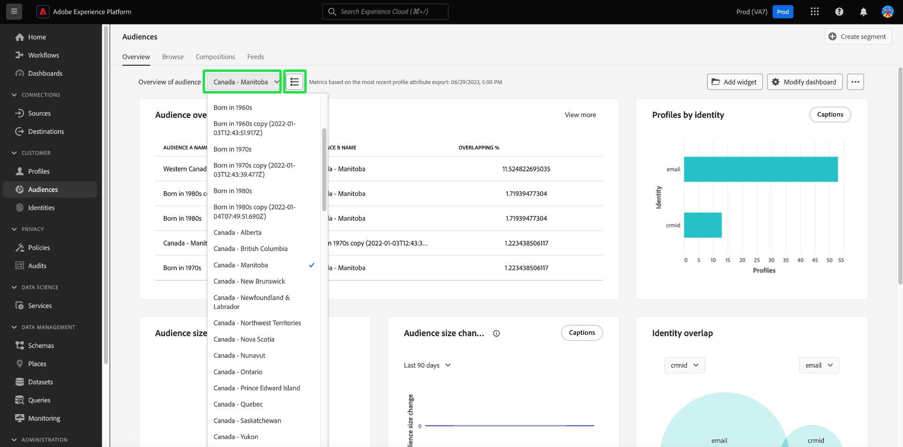
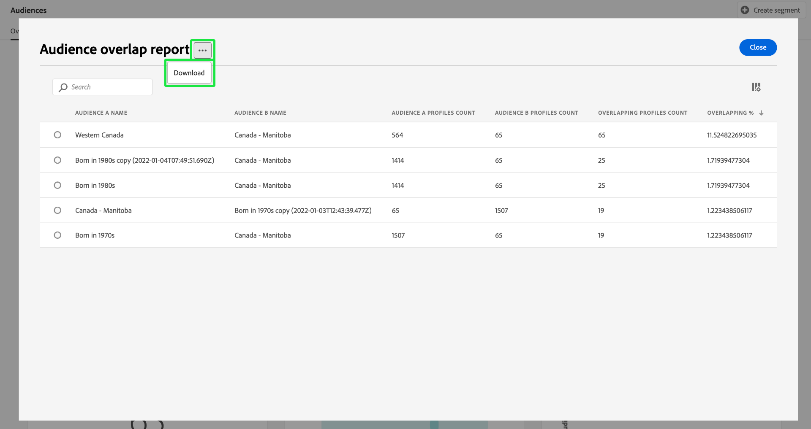

# Painel [!UICONTROL Audiences] {#audiences-dashboard}

A interface do usuário (UI) do Adobe Experience Platform fornece um painel por meio do qual você pode exibir informações importantes sobre seus públicos-alvo, conforme capturadas durante um instantâneo diário. Este guia descreve como acessar e trabalhar com o painel [!UICONTROL Audiences] na interface do usuário e fornece mais informações sobre as visualizações exibidas no painel.

Para obter uma visão geral de todos os recursos do Serviço de segmentação da Adobe Experience Platform na interface do usuário do Experience Platform, consulte o [Guia da interface do serviço de segmentação](../../segmentation/ui/overview.md).

## Dados do painel [!UICONTROL Audiences]

O painel [!UICONTROL Audiences] exibe um instantâneo dos dados do atributo (registro) que sua organização tem no repositório de perfis na Experience Platform. O instantâneo não inclui dados de evento (série temporal).

Os dados do atributo no instantâneo mostram os dados exatamente como aparecem no momento específico em que o instantâneo foi tirado. Em outras palavras, o instantâneo não é uma aproximação ou amostra dos dados, e o painel [!UICONTROL Audiences] não está sendo atualizado em tempo real.

>[!NOTE]
>
>Quaisquer alterações ou atualizações feitas nos dados desde que o instantâneo foi tirado não serão refletidas no painel até que o próximo instantâneo seja tirado.

## Explorar o painel [!UICONTROL Audiences] {#explore}

Para navegar até o painel do [!UICONTROL Audiences] na interface do usuário do Experience Platform, selecione **[!UICONTROL Audiences]** no painel à esquerda e, em seguida, selecione a guia **[!UICONTROL Overview]** para exibir o painel.

>[!NOTE]
>
>Se sua organização for nova no Experience Platform e ainda não tiver conjuntos de dados de Perfil ativos ou políticas de mesclagem criadas, o painel [!UICONTROL Audiences] não estará visível. Em vez disso, a guia [!UICONTROL Overview] exibe links e a documentação para ajudar você a começar a segmentação.

![A guia [!UICONTROL Audiences] do painel [!UICONTROL Overview] com [!UICONTROL Audiences] e [!UICONTROL Overview] realçados.](../images/audiences/dashboard-overview.png)

### Modificar o painel [!UICONTROL Audiences] {#modify}

Você pode modificar a aparência do painel [!UICONTROL Audiences] selecionando **[!UICONTROL Modify dashboard]**. Isso permite mover, adicionar e remover widgets do painel, bem como acessar o **[!UICONTROL Widget library]** para explorar widgets disponíveis e criar widgets personalizados para sua organização.

Consulte a documentação [modificando painéis](../customize/modify.md) e [Visão geral da biblioteca de widgets](../customize/widget-library.md) para saber mais.

### Adicionar widgets {#add-widget}

Selecione **[!UICONTROL Add widget]** para navegar até a biblioteca de widgets e ver uma lista dos widgets disponíveis para adicionar ao seu painel.

![A visão geral do painel [!UICONTROL Audiences] com [!UICONTROL Add widget] realçada.](../images/audiences/audiences-overview-add-widget.png)

Na biblioteca de widgets, você pode navegar pela seleção de widgets de público-alvo padrão e personalizados. Para obter informações sobre como adicionar widgets, consulte a documentação da biblioteca de widgets sobre como [adicionar um widget](../customize/widget-library.md#add-widgets).

### Exibir SQL {#view-sql}

Você pode exibir o SQL que gera os insights visualizados no painel com um alternador no espaço de trabalho [!UICONTROL Overview]. Você pode se inspirar no SQL de seus insights existentes para criar novas consultas que obtenham insights exclusivos de dados do Experience Platform com base nas necessidades comerciais. Para saber mais sobre este recurso, consulte o [Exibir Guia da Interface do Usuário do SQL](../view-sql.md).

## Selecionar um público {#select-audience}

O painel seleciona automaticamente um público-alvo a ser exibido. No entanto, é possível alterar o público-alvo usando o menu suspenso ou o seletor de público-alvo.

Para escolher um público-alvo diferente, selecione a lista suspensa ao lado do nome do público-alvo ou use o seletor de público-alvo para abrir a caixa de diálogo de seleção de público-alvo.

>[!IMPORTANT]
>
>Somente os públicos-alvo com uma contagem de perfis acima de zero são exibidos na lista de públicos-alvo selecionáveis.

![A caixa de diálogo [!UICONTROL Select audience] que exibe todos os públicos-alvo disponíveis.](../images/audiences/select-audience-dialog.png)

## Widgets e métricas {#widgets-and-metrics}

O painel [!UICONTROL Audiences] é composto de widgets, que são métricas somente leitura que fornecem informações importantes sobre o público-alvo selecionado.

A data e a hora do instantâneo mais recente são exibidas na parte superior da guia [!UICONTROL Overview], ao lado da lista suspensa de público-alvo. Todos os dados do widget são precisos a partir dessa data e hora. O carimbo de data e hora do instantâneo é fornecido em UTC; ele não está no fuso horário do usuário ou organização individual.

## Widgets padrão {#default-widgets}

Uma transferência de widget padrão é fornecida para todas as novas instâncias do Adobe Experience Platform que destacam os insights mais recentes disponíveis de seus dados. Os widgets a seguir são pré-configurados na visualização de segmentos desde o início. Detalhes completos sobre a finalidade e a função dos dispositivos podem ser encontrados nas respectivas seções.

* [[!UICONTROL Audience size]](#audience-size)
* [[!UICONTROL Audience size change trend]](#audience-size-change-trend)
* [[!UICONTROL Identity overlap]](#identity-overlap)
* [[!UICONTROL Profiles by identity]](#profiles-by-identity)

>[!NOTE]
>
>A partir de 26 de julho de 2023, os painéis de Visão geral do [!UICONTROL Profiles], [!UICONTROL Audiences] e [!UICONTROL Destinations] foram redefinidos para um novo carregamento de widget padrão para todos os usuários que não modificaram suas visualizações nos seis meses anteriores.
>Consulte a documentação nas seções de widget padrão [Perfis](./profiles.md#default-widgets) e [Destinos](./destinations.md#default-widgets) para obter detalhes sobre quais widgets são incluídos como parte dos carregamentos de widget padrão. Você pode continuar personalizando seus widgets de painel como antes.

## Widgets da IA do cliente {#customer-ai-audiences-widgets}

o Customer AI é usado para gerar pontuações de propensão personalizadas, como churn e conversão para perfis individuais em escala. A IA do cliente faz isso analisando dados existentes do Evento de experiência do consumidor para prever **pontuações de propensão de churn ou conversão**. Esses modelos de propensão de alta precisão do cliente permitem segmentação e direcionamento mais exatos. Os insights da [distribuição de pontuações](#customer-ai-distribution-of-scores) e do [resumo de pontuação](#customer-ai-scoring-summary) demonstram a divisão no seu público-alvo. Eles destacam quais perfis são a propensão alta/baixa/média e como eles são distribuídos na contagem de perfis.

* [[!UICONTROL Customer AI scoring summary]](#customer-ai-scoring-summary)
* [[!UICONTROL Customer AI distribution of scores]](#customer-ai-distribution-of-scores)

### [!UICONTROL Customer AI distribution of scores] {#customer-ai-distribution-of-scores}

>[!CONTEXTUALHELP]
>id="platform_dashboards_segments_distributionOfScores"
>title="Distribuição das pontuações"
>abstract="Este dispositivo visualiza a distribuição do número total de perfis por suas pontuações de propensão em incrementos de cinco por cento. A distribuição da contagem de perfis é determinada pelo modelo de IA e pela política de mesclagem selecionada. É possível alterar o modelo de IA no menu suspenso sob o título do dispositivo."

O widget [!UICONTROL Customer AI distribution of scores] categoriza o número total de perfis por suas pontuações de propensão. A distribuição da contagem de perfis é determinada pelo modelo de IA e pela política de mesclagem selecionada e, em seguida, visualizada em incrementos de cinco por cento que indicam sua propensão. A contagem de perfis é fornecida ao longo do eixo Y e as pontuações de propensão são fornecidas ao longo do eixo X.

>[!NOTE]
>
>Se a visualização for uma pontuação de propensão de conversão, as pontuações mais altas serão exibidas em verde e as pontuações mais baixas em vermelho. Se você estiver prevendo a propensão de churn, ela será invertida, as pontuações mais altas estarão em vermelho e as pontuações mais baixas em verde. O intervalo médio permanece amarelo, independentemente do tipo de propensão escolhido.

O modelo de IA que determina as pontuações de propensão é escolhido no seletor suspenso sob o título do widget. A lista suspensa contém uma lista de todos os modelos configurados da IA do cliente. Selecione o modelo de IA apropriado para sua análise na lista de modelos disponíveis. Se nenhum modelo de IA do cliente estiver disponível, uma mensagem no widget o direcionará para configurar pelo menos um modelo de IA do cliente e fornecerá um hiperlink para a página Configuração do modelo de IA do cliente. Consulte a documentação para obter instruções sobre [como configurar uma instância da IA do cliente](../../intelligent-services/customer-ai/user-guide/configure.md).

>[!NOTE]
>
>Selecione a lista suspensa imediatamente abaixo da guia de visão geral para alterar a política de mesclagem que determina quais perfis são incluídos na análise. Consulte a seção sobre [políticas de mesclagem](#merge-policies) para obter uma breve descrição ou a [visão geral da política de mesclagem](../../profile/merge-policies/overview.md) para obter mais detalhes.

Para navegar até a página de insights detalhados do modelo de IA do cliente selecionado, selecione **[!UICONTROL View model details]**.

![O painel Públicos-alvo da Experience Platform com o widget [!UICONTROL Customer AI distribution of scores] e [!UICONTROL View model details] realçado.](../images/segments/customer-ai-distribution-of-scores.png)

A página de insights detalhados do modelo é exibida.

Mais informações sobre a IA do cliente podem ser encontradas no [guia da interface do usuário do discover insights](../../intelligent-services/customer-ai/user-guide/discover-insights.md).

### [!UICONTROL Customer AI scoring summary] {#customer-ai-scoring-summary}

>[!CONTEXTUALHELP]
>id="platform_dashboards_segments_scoringSummary"
>title="Resumo da pontuação"
>abstract="Este dispositivo exibe o número total de perfis pontuados e os categoriza em compartimentos de propensão alta, média e baixa. O gráfico de rosquinha ilustra a composição proporcional dos perfis totais de propensão alta, média e baixa."

Este widget exibe o número total de perfis pontuados e os categoriza em compartimentos que contêm alta, média e baixa propensão como verde, amarelo e vermelho, respectivamente. Um gráfico de rosca é usado para ilustrar a composição proporcional dos perfis totais entre propensões alta, média e baixa como verde, amarelo e vermelho, respectivamente. Um perfil se qualifica para alta propensão acima de 75, média propensão entre 25 e 74 e baixa propensão abaixo de 24. Uma legenda indica o código de cor e os limites de propensões. As contagens de perfil para as tendências alta, média e baixa são exibidas em uma caixa de diálogo quando o cursor passa o mouse sobre a respectiva seção do gráfico de rosca.

>[!NOTE]
>
>Se a visualização for uma pontuação de propensão de conversão, as pontuações mais altas serão exibidas em verde e as pontuações mais baixas em vermelho. Se você estiver prevendo a propensão de churn, ela será invertida, as pontuações mais altas estarão em vermelho e as pontuações mais baixas em verde. O intervalo médio permanece amarelo, independentemente do tipo de propensão escolhido.

O menu suspenso abaixo do título do widget fornece uma lista de todos os modelos configurados da IA do cliente. Selecione o modelo de IA apropriado para sua análise na lista de modelos disponíveis. Se nenhum modelo de IA do cliente estiver disponível, uma mensagem no widget o direcionará para configurar pelo menos um modelo de IA do cliente e fornecerá um hiperlink para a página Configuração do modelo de IA do cliente. Consulte a documentação sobre [como configurar uma instância da IA do cliente](../../intelligent-services/customer-ai/user-guide/configure.md) para obter instruções detalhadas.

>[!NOTE]
>
>O número total de perfis calculados depende da política de mesclagem escolhida. Para alterar a política de mesclagem usada, selecione a lista suspensa imediatamente abaixo da guia de visão geral. Consulte a seção sobre [políticas de mesclagem](#merge-policies) para obter uma breve descrição ou a [visão geral da política de mesclagem](../../profile/merge-policies/overview.md) para obter mais detalhes.

Selecione **[!UICONTROL View model details]** para navegar até a página de insights detalhados do modelo de IA do cliente selecionado. Mais informações sobre a IA do cliente podem ser encontradas no [guia da interface do usuário do discover insights](../../intelligent-services/customer-ai/user-guide/discover-insights.md).

## Widgets padrão {#standard-widgets}

O Adobe fornece vários widgets padrão que você pode usar para visualizar métricas diferentes relacionadas aos seus públicos. Você também pode criar widgets personalizados para serem compartilhados com sua organização usando o [!UICONTROL Widget library]. Para saber mais sobre como criar widgets personalizados, comece lendo a [Visão geral da biblioteca de widgets](../customize/widget-library.md).

Para saber mais sobre cada um dos widgets padrão disponíveis, selecione o nome de um widget na lista a seguir:

* [[!UICONTROL Audience size]](#audience-size)
* [[!UICONTROL Audience activation order]](#audience-activation-order)
* [[!UICONTROL Audience size trend]](#audience-size-trend)
* [[!UICONTROL Audience size change trend]](#audience-size-change-trend)
* [[!UICONTROL Audience size trend by identity]](#audience-size-trend-by-identity)
* [[!UICONTROL Audience overlap]](#audience-overlap)
* [[!UICONTROL Audience overlap report]](#audience-overlap-report)
* [[!UICONTROL Identity overlap]](#identity-overlap)
* [[!UICONTROL Profiles by identity]](#profiles-by-identity)
* [[!UICONTROL Scheduled activations]](#scheduled-activations)

### [!UICONTROL Audience size] {#audience-size}

>[!CONTEXTUALHELP]
>id="platform_dashboards_segments_audiencesize"
>title="Tamanho do público-alvo"
>abstract="Esse dispositivo exibe o número total de perfis mesclados no público-alvo selecionado. Esse número depende da política de mesclagem aplicada aos seus dados e é correto no momento do instantâneo mais recente."

O widget **[!UICONTROL Audience size]** exibe o número total de perfis mesclados dentro do público-alvo selecionado no momento em que o instantâneo foi tirado. Esse número é o resultado da aplicação da política de mesclagem de público-alvo aos dados do seu Perfil para mesclar fragmentos de perfil e formar um único perfil para cada indivíduo no público-alvo.

Para obter mais informações sobre fragmentos e perfis mesclados, consulte a [Visão geral do Perfil do cliente em tempo real](../../profile/home.md).

![A visão geral do painel [!UICONTROL Audiences] com o widget [!UICONTROL Audience size] realçado.](../images/audiences/audience-size.png)

### [!UICONTROL Audience size trend] {#audience-size-trend}

>[!CONTEXTUALHELP]
>id="platform_dashboards_segments_audiencesizetrend"
>title="Tendência de tamanho do público-alvo"
>abstract="Esse widget fornece informações sobre o número total de perfis que atendem aos critérios de **qualquer** definição de segmento, conforme capturado durante o instantâneo diário, nos últimos 30 dias, 90 dias ou 12 meses."

O widget **[!UICONTROL Audience size trend]** fornece uma ilustração de gráfico de linhas para o número total de perfis qualificados para **qualquer** público-alvo em um determinado período. A tendência de tamanho do público pode ser visualizada em períodos de 30 dias, 90 dias e 12 meses. O período é escolhido em um menu suspenso no widget. O tamanho do público é refletido no eixo y e a hora no eixo x.

Este widget também inclui o recurso automático [!UICONTROL Captions], no qual um modelo de aprendizado de máquina analisa os dados do gráfico e do público-alvo e gera automaticamente legendas para descrever as principais tendências e eventos importantes. Selecione **[!UICONTROL Captions]** para abrir a caixa de diálogo de legendas automáticas.

![A visão geral de [!UICONTROL Audiences] exibe o widget de tendência de tamanho do Público-alvo.](../images/audiences/audience-size-trend-captions.png)

A caixa de diálogo de legendas automáticas é aberta, fornecendo insights sobre seus dados.

Para saber mais sobre a avaliação de públicos-alvo e como os perfis se qualificam e saem dos públicos-alvo, consulte a [documentação do Serviço de segmentação](../../segmentation/home.md).

### [!UICONTROL Audience size change trend] {#audience-size-change-trend}

Este widget fornece uma ilustração de gráfico de linhas da diferença no número total de perfis qualificados para um determinado público-alvo entre os instantâneos diários mais recentes. O público-alvo escolhido para análise é selecionado na lista suspensa de visão geral. O período da análise de tendência pode ser visualizado em períodos de 30 dias, 90 dias e 12 meses. O período é escolhido em um menu suspenso no widget. O tamanho do público é refletido no eixo y e a hora no eixo x.

### [!UICONTROL Audience size trend by identity] {#audience-size-trend-by-identity}

Este widget ilustra a tendência de tamanho do público-alvo para um público-alvo específico com base no tipo de identidade escolhido no menu suspenso widget. O público-alvo usado para análise é selecionado na lista suspensa de visão geral. O período da análise de tendência pode ser visualizado em períodos de 30 dias, 90 dias e 12 meses. O período é escolhido em um menu suspenso no widget.

### [!UICONTROL Audience activation order] {#audience-activation-order}

O widget [!UICONTROL Audience activation order] fornece uma tabela de três colunas que lista o nome do destino, a plataforma e a data de ativação do público-alvo. A lista é ordenada de cima para baixo de acordo com a recenticidade e pode acomodar até 10 linhas.

### [!UICONTROL Audience overlap] {#audience-overlap}

Este widget usa um diagrama de Venn para visualizar o número de pessoas que correspondem aos critérios para ambos os públicos-alvo. Os públicos-alvo usados para comparação são selecionados nos menus suspensos do widget. O número total de perfis contidos na definição de segmento relevante pode ser visto ao passar o mouse sobre um círculo ou sobre a interseção do diagrama de Venn.

Esse widget permite otimizar sua estratégia de segmentação ao visualizar as semelhanças nos resultados das suas definições de segmento.

### [!UICONTROL Audience overlap report] {#audience-overlap-report}

Esse widget tabula os dados de sobreposição de perfil para um público-alvo específico. Uma lista de cinco públicos-alvo classificados da maior para a menor porcentagem de sobreposição é fornecida para o público-alvo escolhido no menu suspenso na parte superior da tela. Para maior clareza, o público-alvo escolhido é listado na coluna [!UICONTROL AUDIENCE A NAME]. A análise de sobreposição de público-alvo é fornecida para o segundo público-alvo listado na coluna [!UICONTROL AUDIENCE B NAME]. A percentagem de sobreposição é indicada na terceira coluna, com uma precisão de doze casas decimais.

O relatório de sobreposição de público-alvo ajuda você a criar públicos-alvo novos e de alto desempenho. A observação de sobreposições de alta porcentagem permite suprimir públicos-alvo e impedir o envio do mesmo público-alvo para destinos diferentes. Elas também ajudam a identificar insights ocultos que podem ajudar com uma melhor segmentação. A baixa porcentagem de sobreposição ajuda a localizar perfis únicos a serem perseguidos.

Selecione **[!UICONTROL View more]** para abrir uma caixa de diálogo de tela inteira que contenha mais dados de sobreposição de público-alvo.

A caixa de diálogo [!UICONTROL Audience overlap report] é exibida. Essa caixa de diálogo pode conter até 50 linhas de análises de sobreposição de público-alvo divididas em seis colunas. Selecione o ícone de configurações () para remover ou adicionar colunas da tabela.

>[!NOTE]
>
>Selecione o cabeçalho da coluna **[!UICONTROL Overlapping]** para alterar a classificação dos resultados entre o mais alto e o mais baixo ou do mais alto.

Para baixar todo o relatório no formato PDF, selecione o menu de opções (**`...`**) seguido de **[!UICONTROL Download]**.

Selecione uma linha do relatório para abrir um diagrama Venn da análise de sobreposição. Passe o mouse sobre uma seção do diagrama de Venn para ver a contagem de perfis em uma caixa de diálogo.

Selecione **[!UICONTROL Close]** para retornar ao painel [!UICONTROL Audiences].

### [!UICONTROL Identity overlap] {#identity-overlap}

>[!CONTEXTUALHELP]
>id="platform_dashboards_segments_identityoverlap"
>title="Sobreposição de identidade"
>abstract="Esse dispositivo mostra a sobreposição de perfis em seu público-alvo que contém ambas as identidades escolhidas. Os círculos exibem o tamanho relativo de cada identidade. O número de perfis que contém ambos os namespaces é representado pela sobreposição entre os círculos."

O widget **[!UICONTROL Identity overlap]** exibe um diagrama de Venn ou um diagrama de conjunto, mostrando a sobreposição de perfis no seu público-alvo contendo várias identidades.

Use os menus suspensos no widget para selecionar as identidades que deseja comparar. Os círculos exibem o tamanho relativo de cada identidade escolhida, com o número de perfis contendo ambos os namespaces sendo representado pelo tamanho da sobreposição entre os círculos.

Se um cliente interagir com sua marca em mais de um canal, várias identidades serão associadas a esse cliente individual. Essa situação faz com que seja provável que sua organização tenha vários perfis contendo fragmentos de mais de uma identidade.

Para saber mais sobre identidades, visite a [documentação do Serviço de Identidade](../../identity-service/home.md).

![A visão geral do painel [!UICONTROL Audiences] com o widget de sobreposição de identidade destacado.](../images/audiences/identity-overlap.png)

### [!UICONTROL Profiles by identity] {#profiles-by-identity}

>[!CONTEXTUALHELP]
>id="platform_dashboards_segments_profilesbyidentity"
>title="Perfis por identidade"
>abstract="Esse dispositivo exibe o detalhamento das identidades em cada perfil mesclado no público-alvo selecionado."

O widget **[!UICONTROL Profiles by identity]** exibe o detalhamento das identidades em cada perfil mesclado no público-alvo selecionado. O número total de perfis por identidade pode ser maior que o número total de perfis no público-alvo, pois um perfil pode ter várias identidades associadas a ele. Em outras palavras, a adição dos valores mostrados para cada identidade pode totalizar mais do que o tamanho total do público-alvo. Isso ocorre porque se um cliente interagir com sua marca em mais de um canal, várias identidades podem ser associadas a esse cliente individual.

Selecione **[!UICONTROL Captions]** para abrir a caixa de diálogo de legendas automáticas.

![A visão geral do painel [!UICONTROL Audiences] com a opção Perfis por widget de identidade e Legendas destacada.](../images/audiences/profiles-by-identity.png)

Um modelo de aprendizado de máquina gera insights de dados automaticamente ao analisar a distribuição geral e as dimensões principais dos dados.

Para saber mais sobre identidades, visite a [documentação do Serviço de Identidade](../../identity-service/home.md).

### Ativações programadas {#scheduled-activations}

O widget [!UICONTROL Scheduled activations] fornece uma exibição tabulada dos destinos ativados mais recentemente. A tabela inclui a plataforma de destino, o nome do fluxo de ativação para esse destino e as datas de início e término da ativação para o público-alvo selecionado. Se não for fornecida uma data final para a ativação, ela será exibida como [!UICONTROL Ongoing]. O público-alvo da análise é selecionado na lista suspensa na parte superior da página.

O widget permite descobrir onde e quando o público-alvo está sendo ativado e torna mais transparentes as ativações duplicadas ou desnecessárias. Essas informações acumuladas também destacam onde as ativações foram deixadas de fora.

## Próximas etapas

Após seguir este documento, você poderá localizar o painel do [!UICONTROL Audiences] e selecionar um público-alvo para exibir. Você também deve entender as métricas exibidas nos widgets disponíveis. Para saber mais sobre como trabalhar com públicos na interface do Experience Platform, consulte o [guia da interface do usuário do Serviço de Segmentação](../../segmentation/ui/overview.md).
