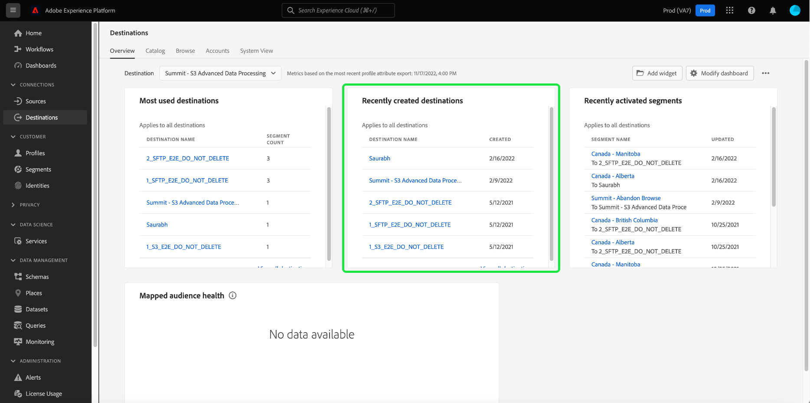

# (Beta) painel [!UICONTROL Destinos]

>[!IMPORTANT]
>
>A funcionalidade do painel descrita neste documento está atualmente em beta e não está disponível para todos os usuários. A documentação e a funcionalidade estão sujeitas a alterações.

A interface do usuário do Adobe Experience Platform (UI) fornece um painel através do qual você pode visualização informações importantes sobre os destinos ativos de sua organização, como capturados durante um instantâneo diário. Este guia descreve como acessar e trabalhar com o painel de destinos na interface do usuário e fornece mais informações sobre as métricas exibidas no painel.

Para obter uma visão geral dos destinos, bem como um catálogo de todos os destinos disponíveis no Experience Platform, visite a [visão geral dos destinos](../../destinations/home.md).

## [!UICONTROL Dados do painel ] Destinos  {#destinations-dashboard-data}

O painel [!UICONTROL Destinos] exibe um instantâneo dos destinos que sua organização habilitou no Experience Perfil. Os dados no instantâneo mostram os dados exatamente como aparecem no momento específico em que o instantâneo foi realizado. Em outras palavras, o instantâneo não é uma aproximação ou amostra dos dados e o painel de destinos não está sendo atualizado em tempo real.

>[!NOTE]
>
>Quaisquer alterações ou atualizações feitas nos dados desde que o instantâneo foi realizado não serão refletidas no painel até que o próximo instantâneo seja realizado.

## Explorar o painel de destinos

Para navegar até o painel de destinos na interface do usuário da plataforma, selecione **[!UICONTROL Destinos]** no painel esquerdo e selecione a guia **[!UICONTROL Visão geral]** para exibir o painel.

## Widgets disponíveis

O Experience Platform fornece vários widgets que você pode usar para visualizar diferentes métricas relacionadas aos seus destinos. Selecione o nome de um widget abaixo para saber mais:

* [[!UICONTROL Os destinos mais usados]](#most-used-destinations)
* [[!UICONTROL Destinos criados recentemente]](#recently-created-destinations)
* [[!UICONTROL Segmentos ativados recentemente]](#recently-activated-segments)

### [!UICONTROL Os destinos mais usados] {#most-used-destinations}

O widget **[!UICONTROL Destinos mais usados]** exibe os principais destinos de sua organização por número de segmentos mapeados a partir do último instantâneo. Esta classificação fornece informações sobre quais destinos estão sendo utilizados, além de mostrar potencialmente aqueles que podem ser subutilizados.

Por exemplo, se você configurou um destino ontem, mas não mapeou nenhum segmento para ele, seria possível ver que o destino está subutilizado no momento.

O número de segmentos mapeados mostrado na coluna de contagem de segmentos é preciso a partir do último instantâneo diário. Mapear um novo segmento para o destino não atualizará a contagem até que o próximo instantâneo seja realizado.

Selecionar o nome de um destino na lista mostrada no widget levará você aos detalhes de destino, conforme vinculado pela guia **[!UICONTROL Procurar]**. Você também pode selecionar **[!UICONTROL Visualização Tudo]** para navegar até a guia **[!UICONTROL Procurar]** e, em seguida, selecionar o nome de um destino para visualização de seus detalhes.

### [!UICONTROL Destinos criados recentemente] {#recently-created-destinations}

O widget **[!UICONTROL Destinos criados recentemente]** permite que você veja uma lista dos destinos configurados mais recentemente da sua organização.

A data de criação mostrada é precisa para o último instantâneo diário. Em outras palavras, se você criar um novo destino, ele não aparecerá na lista até que o próximo instantâneo seja realizado.

Selecionar o nome de um destino na lista mostrada no widget levará você aos detalhes de destino, conforme vinculado pela guia **[!UICONTROL Procurar]**. Você também pode selecionar **[!UICONTROL Visualização Tudo]** para navegar até a guia **[!UICONTROL Procurar]** e, em seguida, selecionar o nome de um destino para visualização de seus detalhes.

Para saber mais sobre como configurar tipos específicos de destinos, visite a [documentação de destinos](../../destinations/home.md).

### [!UICONTROL Segmentos ativados recentemente] {#recently-activated-segments}

O widget **[!UICONTROL Segmentos ativados recentemente]** fornece uma lista dos segmentos mapeados mais recentemente para um destino. Esta lista fornece um instantâneo de quais segmentos e destinos estão sendo usados ativamente no sistema e pode ajudar a solucionar problemas de mapeamentos errados.

A data atualizada mostrada exibe a última vez que o segmento foi ativado para o destino e é precisa para o último instantâneo diário. Em outras palavras, se você ativar um segmento para o destino, a data atualizada não será alterada até que o próximo instantâneo seja realizado.

Selecionar o nome de um segmento na lista mostrada no widget levará você aos detalhes do segmento. Você também pode selecionar **[!UICONTROL Visualização Tudo]** para navegar até a guia de navegação do segmento e, em seguida, selecionar o nome de um segmento para visualização de seus detalhes.

Para obter mais informações sobre como trabalhar com segmentos no Experience Platform, comece lendo a [visão geral do Serviço de segmentação](../../segmentation/home.md).

## Próximas etapas

Ao seguir este documento, você deve agora ser capaz de localizar o painel de destinos e entender as métricas exibidas nos widgets disponíveis. Para saber mais sobre como trabalhar com destinos no Experience Platform, consulte a [documentação de destinos](../../destinations/home.md).