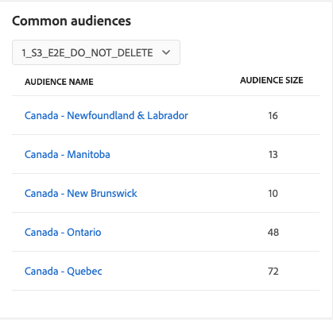
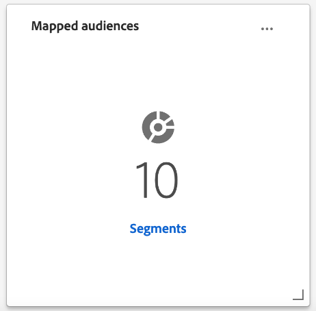

# [!UICONTROL Destinos] painel

A interface do usuário (UI) do Adobe Experience Platform fornece um painel por meio do qual você pode exibir informações importantes sobre os destinos ativos da sua organização, conforme capturados durante um instantâneo diário. Este guia descreve como acessar e trabalhar com o painel de destinos na interface do usuário e fornece mais informações sobre as métricas exibidas no painel.

Para obter uma visão geral dos destinos, bem como um catálogo de todos os destinos disponíveis no Experience Platform, visite o [documentação de destinos](../../destinations/home.md).

## [!UICONTROL Destinos] dados do painel {#destinations-dashboard-data}

O painel Destinos exibe um instantâneo dos destinos que sua organização ativou no Experience Platform. Os dados no instantâneo mostram os dados exatamente como aparecem no momento específico em que o instantâneo foi tirado. Em outras palavras, o instantâneo não é uma aproximação ou amostra dos dados, e o painel de destinos não é atualizado em tempo real.

>[!NOTE]
>
>Quaisquer alterações ou atualizações feitas nos dados desde que o instantâneo foi tirado não serão refletidas no painel até que o próximo instantâneo seja tirado.

## Explore o [!UICONTROL Destinos] painel {#explore}

Para navegar até o painel de destinos na interface do Platform, selecione **[!UICONTROL Destinos]** no painel à esquerda, selecione a variável **[!UICONTROL Visão geral]** para exibir o painel.

A data e a hora do snapshot mais recente são exibidas na parte superior do [!UICONTROL Visão geral] ao lado da lista suspensa de destino. Todos os dados do widget são precisos a partir dessa data e hora. O carimbo de data e hora do instantâneo é fornecido em UTC; ele não está no fuso horário do usuário ou organização individual.

>[!NOTE]
>
>Se sua organização for nova no Experience Platform e ainda não tiver destinos ativos, o painel Destinos e [!UICONTROL Visão geral] não estão visíveis. Em vez disso, selecione [!UICONTROL Destinos] no painel de navegação esquerdo, exibe a [!UICONTROL Catálogo] guia. Para saber mais sobre o [!UICONTROL Catálogo] consulte a guia [[!UICONTROL Destinos] guia do espaço de trabalho](../../destinations/ui/destinations-workspace.md).

### Modifique o [!UICONTROL Destinos] painel {#modify}

Selecionar **[!UICONTROL Modificar painel]** para alterar a aparência do painel de destinos. As alterações no painel são por usuário e não por toda a organização. Você pode mover, adicionar, redimensionar e remover widgets do painel e acessar a biblioteca de widgets para personalizar seu painel. Na biblioteca de widgets, você pode explorar os widgets disponíveis e criar widgets personalizados para sua organização.

Consulte a [modificação de painéis](../customize/modify.md) e [visão geral da biblioteca de widgets](../customize/widget-library.md) para saber mais.

### Adicionar widgets {#add-widget}

Selecionar **[!UICONTROL Adicionar widget]** para navegar até a biblioteca de widgets e ver uma lista dos widgets disponíveis para adicionar ao painel.

Na biblioteca de widgets, você pode navegar pela seleção de widgets de público-alvo padrão e personalizados. Para obter informações sobre como adicionar widgets, consulte a documentação da biblioteca de widgets sobre como [adicionar um widget](../customize/widget-library.md#add-widgets).

## Widgets padrão {#default-widgets}

Uma transferência de widget padrão é fornecida para todas as novas instâncias do Adobe Experience Platform que destacam os insights mais recentes disponíveis de seus dados. Os widgets a seguir são pré-configurados na visualização de segmentos desde o início. Veja abaixo detalhes completos sobre a finalidade e a função dos dispositivos.

* [[!UICONTROL Destinos mais usados]](#most-used-destinations)
* [[!UICONTROL Destinos criados recentemente]](#recently-created-destinations)
* [[!UICONTROL Segmentos ativados recentemente]](#recently-activated-segments)

>[!NOTE]
>
>Em 26 de julho de 2023, [!UICONTROL Perfis], [!UICONTROL Públicos-alvo], e [!UICONTROL Destinos] Os painéis de visão geral foram redefinidos para uma nova carga de widget padrão para todos os usuários que não modificaram suas visualizações nos seis meses anteriores.
>Consulte a documentação no [Perfis](./profiles.md#default-widgets) e [Públicos-alvo](./audiences.md#default-widgets) seções de widget padrão para obter detalhes sobre quais widgets são incluídos como parte dos carregamentos de widget padrão. Você pode continuar personalizando seus widgets de painel como antes.

## Widgets padrão {#standard-widgets}

O Adobe fornece vários widgets padrão que você pode usar para visualizar métricas diferentes relacionadas aos seus destinos e avaliar a integridade dos públicos-alvo disponíveis para sua análise de dados. Você também pode criar widgets personalizados para serem compartilhados com sua organização usando o [!UICONTROL Biblioteca de widgets]. Para saber mais sobre como criar widgets personalizados, comece lendo o [Visão geral da biblioteca de widgets](../customize/widget-library.md).

### Pré-requisitos {#prerequisites}

Antes de continuar com as descrições dos widgets padrão, verifique se você está familiarizado com as definições dos seguintes termos principais usados na documentação:

* **Definição de segmento:** Uma definição de segmento é uma **conjunto de regras** usado para descrever as principais características ou comportamento de um público-alvo. Essas regras incluem dados de atributo e evento que qualificam os perfis como parte de um público-alvo.
* **Público-alvo**: um conjunto de pessoas, contas, famílias ou outras entidades que compartilham características e comportamentos comuns.
* **Mapeado/Mapeamento**: o mapeamento de dados é o processo de mapear campos de dados de origem para campos de destino relacionados em um destino.
* **Identidade**: uma identidade é um identificador que representa exclusivamente um cliente individual, como uma ID de cookie, ID de dispositivo ou ID de email.
* **Ativar**: Ativar é a ação realizada por um usuário para mapear um público-alvo ou perfis para um destino, como o Oracle Eloqua, o Google ou o Marketing Cloud Salesforce.

Para saber mais sobre cada um dos widgets padrão disponíveis, selecione o nome de um widget na lista a seguir:

* [[!UICONTROL Destinos mais usados]](#most-used-destinations)
* [[!UICONTROL Destinos criados recentemente]](#recently-created-destinations)
* [[!UICONTROL Públicos-alvo ativados recentemente]](#recently-activated-audiences)
* [[!UICONTROL Públicos-alvo ativados recentemente por destino]](#recently-activated-audiences-by-destination)
* [[!UICONTROL Tendência de tamanho do público-alvo]](#audience-size-trend)
* [[!UICONTROL Públicos-alvo não mapeados por identidade]](#unmapped-audiences-by-identity)
* [[!UICONTROL Públicos-alvo mapeados por identidade]](#mapped-audiences-by-identity)
* [[!UICONTROL Públicos comuns]](#common-audiences)
* [[!UICONTROL Públicos mapeados]](#mapped-audiences)
* [[!UICONTROL Integridade do público mapeado]](#mapped-audience-health)
* [[!UICONTROL Contagem de destinos]](#destinations-count)
* [[!UICONTROL Status do destino]](#destination-status)
* [[!UICONTROL Destinos ativos por plataforma de destino]](#active-destinations-by-destination-platform)
* [[!UICONTROL Públicos ativados em todos os destinos]](#activated-audiences-across-all-destinations)
* [[!UICONTROL Públicos ativados]](#activated-audiences)

### [!UICONTROL Destinos mais usados] {#most-used-destinations}

>[!CONTEXTUALHELP]
>id="platform_dashboards_destinations_mostuseddestinations"
>title="Destinos mais usados"
>abstract="Esse dispositivo exibe os destinos mais ativos da sua organização de acordo com o número de públicos-alvo mapeados. Esses números são precisos no momento do último instantâneo. Essa classificação fornece informações sobre quais destinos são mais usados atualmente, destacando os que podem ser subutilizados."

A variável **[!UICONTROL Destinos mais usados]** O widget exibe os principais destinos da sua organização pelo número de públicos mapeados, a partir do último instantâneo. Essa classificação fornece insight sobre quais destinos estão sendo utilizados, além de mostrar os que podem estar subutilizados.

Por exemplo, se você configurou um destino ontem, mas não mapeou nenhum público para ele, é possível ver que o destino está subutilizado no momento.

O número de públicos mapeados exibidos na variável [!UICONTROL Contagem de público] é preciso a partir do último instantâneo diário. Mapear um novo público para o destino não atualiza a contagem até que o próximo instantâneo seja tirado.

Selecione o nome de um destino na lista mostrada no widget para navegar até os detalhes do destino para esse destino em particular. Também é possível selecionar **[!UICONTROL Exibir todos]** para navegar até o **[!UICONTROL Procurar]** e selecione o nome de um destino para exibir seus detalhes.

### [!UICONTROL Destinos criados recentemente] {#recently-created-destinations}

>[!CONTEXTUALHELP]
>id="platform_dashboards_destinations_recentlycreateddestinations"
>title="Destinos criados recentemente"
>abstract="Esse widget exibe uma lista dos destinos configurados mais recentemente em sua organização."

A variável **[!UICONTROL Destinos criados recentemente]** O widget permite visualizar uma lista dos destinos configurados mais recentemente pela sua organização.

A data de criação mostrada é precisa para o último instantâneo diário. Em outras palavras, se você criar um novo destino, ele não aparecerá na lista até que o próximo instantâneo seja tirado.

Selecionar o nome de um destino na lista mostrada no widget levará você aos detalhes do destino, como vinculado a partir do **[!UICONTROL Procurar]** guia. Também é possível selecionar **[!UICONTROL Exibir todos]** para navegar até o **[!UICONTROL Procurar]** e selecione o nome de um destino para exibir seus detalhes.

Para saber mais sobre como configurar tipos específicos de destinos, visite o [documentação de destinos](../../destinations/home.md).

### [!UICONTROL Públicos-alvo ativados recentemente] {#recently-activated-audiences}

>[!CONTEXTUALHELP]
>id="platform_dashboards_destinations_recentlyactivatedsegments"
>title="Públicos-alvo ativados recentemente"
>abstract="Esse dispositivo fornece uma lista dos públicos-alvo mapeados mais recentemente para um destino. Essa lista fornece um instantâneo dos públicos-alvo e destinos que estão sendo usados ativamente no sistema e pode ajudar na solução de problemas de mapeamentos incorretos."

A variável **[!UICONTROL Públicos ativados recentemente]** O widget fornece uma lista dos públicos-alvo mapeados mais recentemente para um destino. Essa lista fornece um instantâneo dos públicos-alvo e destinos que estão sendo usados ativamente no sistema e pode ajudar na solução de problemas de mapeamentos incorretos.

A variável [!UICONTROL Atualizado] a data exibida exibe a última vez que o público-alvo foi ativado para o destino e tem precisão para o último instantâneo diário. Em outras palavras, se você ativar um público-alvo para o destino, a data atualizada não será alterada até que o próximo instantâneo seja tirado.

Selecionar o nome de um público-alvo na lista mostrada no widget direciona você aos detalhes do público-alvo. Também é possível selecionar **[!UICONTROL Exibir todos]** para navegar até o [!UICONTROL Públicos-alvo] [!UICONTROL Procurar] e selecione o nome de um público-alvo para ver seus detalhes.

Para obter mais informações sobre como trabalhar com públicos-alvo no Experience Platform, consulte a [Visão geral do serviço de segmentação](../../segmentation/home.md).

### [!UICONTROL Públicos-alvo ativados recentemente por destino] {#recently-activated-audiences-by-destination}

>[!CONTEXTUALHELP]
>id="platform_dashboards_destinations_recentlyactivatedsegmentsbydestination"
>title="Públicos-alvo ativados recentemente por destino"
>abstract="Esse dispositivo exibe os cinco principais públicos-alvo que foram ativados mais recentemente, em ordem decrescente e de acordo com o destino escolhido na lista suspensa de visão geral."

A variável **[!UICONTROL Públicos ativados recentemente por destino]** O widget exibe os cinco principais públicos-alvo ativados mais recentemente em ordem decrescente de acordo com o destino escolhido na lista suspensa visão geral. É semelhante ao [!UICONTROL Públicos ativados recentemente] mas os dados exibidos **somente** se aplica ao destino selecionado.

Esse widget contém duas métricas: o nome dos públicos-alvo e a data em que eles foram ativados pela última vez no destino. Os dados exibidos estão corretos desde o último instantâneo diário.

Para exibir os detalhes de um público-alvo, selecione o nome dele na lista exibida.

Consulte a seção de pré-requisitos para [definições de termos usados](#prerequisites) nesta descrição.

### [!UICONTROL Tendência de tamanho do público-alvo] {#audience-size-trend}

>[!CONTEXTUALHELP]
>id="platform_dashboards_destinations_audiencesizetrend"
>title="Tendência de tamanho do público-alvo"
>abstract="Esse dispositivo ilustra o número de perfis contidos no público-alvo que estão sendo enviados para a conta de destino diariamente. O primeiro menu suspenso ajusta o período da tendência do público-alvo. O segundo menu suspenso do dispositivo seleciona o público-alvo para análise. O destino é escolhido na lista suspensa de visão geral."

A variável **[!UICONTROL Tendência de tamanho do público]** O widget descreve a relação da contagem de perfis durante um período para um público-alvo que foi mapeado para essa conta de destino. O widget usa um gráfico de linhas para ilustrar o número de perfis contidos no público-alvo, que estão sendo enviados para a conta de destino diariamente.

Um período para a tendência do público-alvo nos últimos 30 dias, 90 dias ou 12 meses pode ser ajustado usando o primeiro menu suspenso.

O segundo menu suspenso lista cada público-alvo disponível que pode ser enviado para a conta de destino escolhida na parte superior do painel.

A variável **[!UICONTROL Tendência de tamanho do público]** o widget fornece um [!UICONTROL Legendas] no canto superior direito do widget. Selecionar **[!UICONTROL Legendas]** para abrir a caixa de diálogo legendas automáticas. Um modelo de aprendizado de máquina gera legendas automaticamente para descrever as principais tendências e eventos importantes, analisando o gráfico e os dados do público-alvo.

### [!UICONTROL Públicos-alvo não mapeados por identidade] {#unmapped-audiences-by-identity}

>[!CONTEXTUALHELP]
>id="platform_dashboards_destinations_unmappedsegmentsbyidentity"
>title="Públicos-alvo não mapeados por identidade"
>abstract="Esse dispositivo lista os cinco principais públicos-alvo **não mapeados**, classificados em ordem decrescente pela contagem de identidade de um determinado destino e identidade. As IDs de filtro listadas na lista suspensa do dispositivo mudam dependendo da conta de destino selecionada na parte superior da página de visão geral."

A variável **[!UICONTROL Públicos não mapeados por identidade]** o widget lista os cinco principais **não mapeado** públicos-alvo classificados por contagem decrescente de identidades para um determinado destino e identidade. Ele destaca os públicos-alvo que são os mais benéficos a serem mapeados para a conta de destino escolhida com base na ID escolhida.

A lista suspensa ID de destino filtra os públicos-alvo disponíveis. As IDs de filtro listadas na lista suspensa mudam, dependendo da conta de destino selecionada na parte superior da página de visão geral.

A coluna Identidades conta o número de IDs de origem no público-alvo que podem ser mapeadas para a ID escolhida na lista suspensa de ID do widget.

Consulte a seção de pré-requisitos para [definições de termos usados](#prerequisites) nesta descrição.

### [!UICONTROL Públicos-alvo mapeados por identidade] {#mapped-audiences-by-identity}

>[!CONTEXTUALHELP]
>id="platform_dashboards_destinations_mappedsegmentsbyidentity"
>title="Públicos-alvo mapeados por identidade"
>abstract="Esse dispositivo fornece uma lista dos cinco principais públicos-alvo **mapeados**. A lista é ordenada do mais alto ao mais baixo de acordo com o número de IDs de origem contidas nos públicos-alvo. A ID de destino a ser contada é selecionada no menu suspenso abaixo do título do widget. As IDs de destino disponíveis no menu suspenso do widget dependem do destino escolhido na parte superior do painel de visão geral."

Esse dispositivo fornece uma lista dos cinco principais públicos-alvo **mapeados**. A lista é ordenada do mais alto ao mais baixo de acordo com o número de IDs de origem contidas nos públicos-alvo. A ID de destino a ser contada é selecionada no menu suspenso abaixo do título do widget. As IDs de destino disponíveis no menu suspenso do widget serão alteradas de acordo com o filtro de conta de destino escolhido na parte superior do painel de visão geral.

A variável **[!UICONTROL Públicos mapeados por identidade]** principais características do widget, a probabilidade de direcionar com sucesso as oportunidades de perfil para uma campanha no destino escolhido. Uma campanha direcionada eficiente não depende do número de perfis enviados para o destino, mas sim do número de IDs de origem que provavelmente serão correspondidas às IDs de destino para fornecer dados úteis e acionáveis.

### Públicos comuns {#common-audiences}

>[!CONTEXTUALHELP]
>id="platform_dashboards_destinations_commonaudiences"
>title="Públicos comuns"
>abstract="Esse dispositivo fornece uma lista dos cinco principais públicos-alvo ativados na conta de destino escolhida na parte superior da página e o destino selecionado na lista suspensa do dispositivo. A lista de públicos-alvo é ordenada de acordo com a data mais recente de ativação. O público-alvo ativado mais recentemente é exibido na parte superior."

A variável **[!UICONTROL Públicos comuns]** O widget fornece uma lista dos cinco principais públicos-alvo ativados na conta de destino escolhida na parte superior da página, e o destino selecionado na lista suspensa widget. A lista de públicos-alvo é ordenada de acordo com a data mais recente de ativação. O público-alvo ativado mais recentemente é exibido na parte superior.

A variável [!UICONTROL TAMANHO DO PÚBLICO] fornece a contagem total de perfis de cada público-alvo listado.

### Públicos mapeados {#mapped-audiences}

A variável [!UICONTROL Públicos mapeados] O widget exibe o número total de públicos mapeados que podem ser ativados para o destino selecionado na parte superior da página.

Selecionar **[!UICONTROL Públicos-alvo]** para navegar até o painel Públicos-alvo [!UICONTROL Procurar] guia. Este espaço de trabalho exibe uma lista de todas as definições de segmento para sua organização.

### Integridade do público mapeado {#mapped-audience-health}

>[!CONTEXTUALHELP]
>id="platform_dashboards_destinations_mappedaudiencehealth"
>title="Integridade do público mapeado"
>abstract="Esse dispositivo fornece uma lista de até 20 públicos-alvo mapeados cujas contagens totais de perfil apresentam pelo menos um desvio padrão do tamanho médio de públicos-alvo (em um período de 30 dias) mapeados para esse destino. Ele fornece uma métrica calculada para a dispersão dos tamanhos do público da média nos últimos 30 dias. Os tamanhos do público são classificados do maior ao menor."

O widget fornece uma lista de até 20 públicos-alvo mapeados cujo total de perfis conta, a partir do último instantâneo diário, desvio por um fator de pelo menos um desvio padrão do tamanho médio do público-alvo de 30 dias mapeado para esse destino.

Em resumo, fornece uma métrica calculada para a dispersão dos tamanhos de público-alvo da média nos últimos 30 dias. Ela compara se o tamanho do público-alvo de hoje está fora do desvio padrão histórico visto nos dados nos últimos 30 dias.

Todos os tamanhos de público no sistema são classificados de alto a baixo, conforme indicado na [!UICONTROL TAMANHO MAIS RECENTE] coluna.

Se a contagem de perfis de público-alvo mapeada estiver fora de um desvio padrão do tamanho médio do perfil mapeado nos últimos 30 dias, isso indica uma anomalia no sistema e deve ser investigado.

Se um público-alvo dentro do [!UICONTROL Integridade do público mapeado] O widget está se desviando por uma grande margem. Você deve consultar o gráfico de tendência de tamanho de público e localizar o público anômalo. A tendência pode fornecer mais informações sobre a saúde do seu público-alvo.

>[!NOTE]
>
>O tamanho padrão do widget de integridade Público-alvo mapeado pode obstruir as informações da tabela. Modifique o tamanho do widget para melhorar a legibilidade dos nomes dos públicos-alvo e títulos de coluna mapeados. Consulte a documentação de modificação de painéis para obter orientação sobre [como redimensionar um widget](../customize/modify.md).

### [!UICONTROL Contagem de destinos] {#destinations-count}

>[!CONTEXTUALHELP]
>id="platform_dashboards_destinations_destinationscount"
>title="Contagem de destinos"
>abstract="Esse widget fornece o número total de pontos de acesso disponíveis, onde um público pode ser ativado e entregue no sistema. Esse número inclui destinos ativos e inativos."

A variável [!UICONTROL Contagem de destinos] O widget fornece o número total de endpoints disponíveis nos quais um público-alvo pode ser ativado e entregue no sistema. Esse número inclui destinos ativos e inativos.

Abaixo da contagem total, selecione **[!UICONTROL Destinos]** para navegar até a guia navegação de destinos. Esta página lista todos os destinos com os quais você estabeleceu uma conexão até o momento.

### [!UICONTROL Status do destino] {#destination-status}

A variável [!UICONTROL Status do destino] O widget exibe o número total de destinos ativados como uma única métrica e usa um gráfico de rosca para ilustrar a diferença proporcional entre destinos ativados e desativados.

As contagens individuais para destinos habilitados ou desabilitados são exibidas em uma caixa de diálogo quando o cursor passa o mouse sobre a respectiva seção do gráfico de rosca.

### [!UICONTROL Destinos ativos por plataforma de destino] {#active-destinations-by-destination-platform}

O widget fornece uma tabela de duas colunas para mostrar uma lista de plataformas de destino ativas e o número total de destinos ativos para cada plataforma de destino. A lista de plataformas de destino é ordenada de cima para baixo.

### [!UICONTROL Públicos ativados em todos os destinos] {#activated-audiences-across-all-destinations}

A variável [!UICONTROL Públicos ativados em todos os destinos] O widget fornece o número total de públicos ativados em todos os destinos em uma única métrica. Esse número é preciso para o instantâneo mais recente.

Selecionar **[!UICONTROL Públicos-alvo]** para navegar até os destinos [!UICONTROL Procurar] guia. Esta página fornece uma lista de todos os destinos ativados e diversas métricas relevantes. Consulte a documentação para obter mais informações sobre o [[!UICONTROL Procurar] guia](../../destinations/ui/destinations-workspace.md#browse).

Consulte a seção de pré-requisitos para [definições de termos usados](#prerequisites) nesta descrição.

### [!UICONTROL Públicos ativados] {#activated-audiences}

Esse widget fornece uma única métrica para o número total de públicos-alvo ativados para um destino.

Selecionar **[!UICONTROL Públicos-alvo]** para navegar até a página de detalhes do painel de destinos. A variável [!UICONTROL Dados de ativação] A guia exibe uma lista de públicos-alvo que foram mapeados para o destino, incluindo a data inicial e a data final (se aplicável) e outras informações relevantes para a exportação de dados, como tipo de exportação, programação e frequência. Para exibir os detalhes sobre um público-alvo específico, selecione o nome no campo [!UICONTROL Nome do público] coluna.

Este widget ajuda você a entender o valor dos seus destinos com base no número de públicos-alvo ativados rapidamente. Ele também fornece acesso fácil a informações mais detalhadas para análise adicional.

Consulte a seção de pré-requisitos para [definições de termos usados](#prerequisites) nesta descrição.

## Próximas etapas

Ao seguir este documento, agora é possível localizar o painel de destinos e entender as métricas exibidas nos widgets disponíveis. Para saber mais sobre como trabalhar com destinos no Experience Platform, consulte o [documentação de destinos](../../destinations/home.md).
