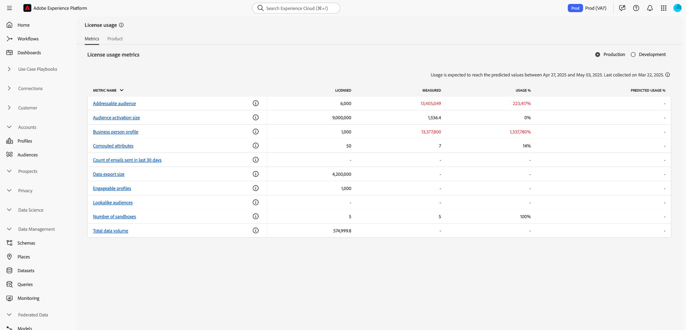
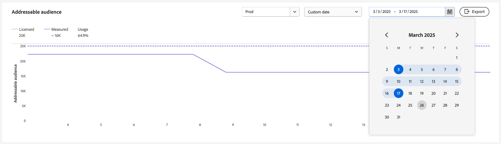

# Painel de uso da licença {#license-usage-dashboard}

>[!CONTEXTUALHELP]
>id="testy-mctestface"
>title="Caixa de diálogo de teste que não deve estar visível"
>abstract="O objeto {name} está sendo exibido em {date}."

>[!CONTEXTUALHELP]
>id="platform_dashboards_licenseusage_core"
>title="Tabela de produtos principais"
>abstract="Os principais produtos listados na tabela têm suas próprias métricas, rastreamento de uso e exibições de detalhamento no nível da sandbox. Esses produtos principais fornecem as métricas principais para rastreamento e todos os complementos estão incluídos nessas métricas."

>[!CONTEXTUALHELP]
>id="platform_dashboards_licenseusage_addons"
>title="Tabela de complementos"
>abstract="A tabela Complementos lista produtos cujas quantidades de licença são combinadas com as métricas compatíveis com os produtos principais. Esses complementos não têm métricas separadas, mas aprimoram o rastreamento de uso dos produtos principais aos quais estão associados."

>[!CONTEXTUALHELP]
>id="platform_dashboards_licenseUsage"
>title="Painel de uso da licença"
>abstract="O painel de uso da licença oferece informações sobre os produtos da Adobe Experience Platform que você adquiriu. A visão geral do painel exibe as métricas principais de seus produtos, incluindo o uso de cada uma das métricas principais e o período de licença contratado. O espaço de trabalho de detalhes exibe um detalhamento das métricas para cada produto em sandboxes específicas."
>additional-url="https://experienceleague.adobe.com/docs/experience-platform/data-lifecycle/ui/dataset-expiration.html?lang=pt-BR" text="Expirações automatizadas de conjuntos de dados"
>additional-url="https://experienceleague.adobe.com/docs/experience-platform/profile/pseudonymous-profiles.html?lang=pt-BR" text="Expiração de dados de perfis pseudônimos"

>[!CONTEXTUALHELP]
>id="platform_licenseusage"
>title="Painel de uso da licença"
>abstract="O painel de uso da licença oferece informações sobre os produtos da Adobe Experience Platform que você adquiriu. A visão geral do painel exibe as métricas principais de seus produtos, incluindo o uso de cada uma das métricas principais e o período de licença contratado. O espaço de trabalho de detalhes exibe um detalhamento das métricas para cada produto em sandboxes específicas."
>additional-url="https://experienceleague.adobe.com/docs/experience-platform/data-lifecycle/ui/dataset-expiration.html?lang=pt-BR" text="Expirações automatizadas de conjuntos de dados"
>additional-url="https://experienceleague.adobe.com/docs/experience-platform/profile/pseudonymous-profiles.html?lang=pt-BR" text="Expiração de dados de perfis pseudônimos"

>[!CONTEXTUALHELP]
>id="platform_dashboards_licenseusage_predictedusage_computehours"
>title="Horas de computação previstas"
>abstract="As horas de computação medem o tempo que os mecanismos do serviço de consultas gastam com a leitura, processamento e gravação de dados ao realizar consultas em lote. Seu uso pode atingir a quantidade licenciada. Para avaliar ou reduzir o uso, navegue até Consultas > Log e revise o histórico de consultas. Se você não tem acesso ao espaço de trabalho Consultas, entre em contato com o admin."
>additional-url="https://experience.adobe.com/#/platform/query/log.html?lang=pt-BR" text="Workspace do log de consultas"

>[!CONTEXTUALHELP]
>id="platform_dashboards_licenseusage_predictedusage_addressableaudience"
>title="Público-alvo endereçável previsto"
>abstract="O Público-alvo endereçável é o conjunto de perfis de pessoas no Perfil do cliente em tempo real que a sua organização possui autorização para engajar. Essa métrica inclui perfis diretamente identificáveis e pseudônimos. Seu uso pode atingir a quantidade licenciada. Para reduzir o uso, configure expirações de dados para o conjunto de dados ou o perfil pseudônimo."
>additional-url="https://experienceleague.adobe.com/docs/experience-platform/profile/event-expirations.html?lang=pt-BR" text="Expirações do evento de experiência"
>additional-url="https://experienceleague.adobe.com/docs/experience-platform/profile/pseudonymous-profiles.html?lang=pt-BR" text="Expiração de dados de perfis pseudônimos"

>[!CONTEXTUALHELP]
>id="platform_dashboards_licenseusage_predictedusage_engageableprofiles"
>title="Perfis engajáveis previstos"
>abstract="Perfis engajáveis são perfis de pessoas no Perfil do cliente em tempo real que sua organização tentou engajar usando o Journey Optimizer nos últimos 12 meses. Seu uso pode atingir a quantidade licenciada. Para reduzir o uso, configure expirações de dados para o conjunto de dados ou o perfil pseudônimo."
>additional-url="https://experienceleague.adobe.com/docs/experience-platform/profile/event-expirations.html?lang=pt-BR" text="Expirações do evento de experiência"
>additional-url="https://experienceleague.adobe.com/docs/experience-platform/profile/pseudonymous-profiles.html?lang=pt-BR" text="Expiração de dados de perfis pseudônimos"

>[!CONTEXTUALHELP]
>id="platform_dashboards_licenseusage_predictedusage_businesspersonprofile"
>title="Perfil de pessoa de negócios previsto"
>abstract="Os perfis de pessoa de negócios são registros no Perfil do cliente em tempo real que representam indivíduos em um contexto B2B. Seu uso pode atingir a quantidade licenciada. Para reduzir o uso, configure expirações de dados para o conjunto de dados ou o perfil pseudônimo."
>additional-url="https://experienceleague.adobe.com/docs/experience-platform/profile/event-expirations.html?lang=pt-BR" text="Expirações do evento de experiência"
>additional-url="https://experienceleague.adobe.com/docs/experience-platform/profile/pseudonymous-profiles.html?lang=pt-BR" text="Expiração de dados de perfis pseudônimos"

>[!CONTEXTUALHELP]
>id="platform_dashboards_licenseusage_predictedusage_corehours"
>title="Horas essenciais previstas"
>abstract="As horas essenciais representam o tempo de processamento consumido pelos serviços da Experience Platform. Seu uso pode atingir a quantidade licenciada. Para reduzir o uso, configure expirações de dados para o conjunto de dados ou o perfil pseudônimo."
>additional-url="https://experienceleague.adobe.com/docs/experience-platform/profile/event-expirations.html?lang=pt-BR" text="Expirações do evento de experiência"
>additional-url="https://experienceleague.adobe.com/docs/experience-platform/profile/pseudonymous-profiles.html?lang=pt-BR" text="Expiração de dados de perfis pseudônimos"

>[!CONTEXTUALHELP]
>id="platform_dashboards_licenseusage_predictedusage_totaldatavolume"
>title="Volume de dados total previsto"
>abstract="O volume de dados total é a quantidade de dados disponíveis no Perfil do cliente em tempo real para uso em fluxos de trabalho de engajamento e personalização. Seu uso pode atingir a quantidade licenciada. Para reduzir o uso, configure expirações de dados para o conjunto de dados ou o perfil pseudônimo."
>additional-url="https://experienceleague.adobe.com/docs/experience-platform/profile/event-expirations.html?lang=pt-BR" text="Expirações do evento de experiência"
>additional-url="https://experienceleague.adobe.com/docs/experience-platform/profile/pseudonymous-profiles.html?lang=pt-BR" text="Expiração de dados de perfis pseudônimos"

>[!CONTEXTUALHELP]
>id="platform_dashboards_licenseusage_predictedusage_cjaRowsAvailable"
>title="Linhas do CJA previstas disponíveis"
>abstract="As linhas do CJA disponíveis referem-se à média diária das linhas de dados disponíveis para análise no Customer Journey Analytics. Seu uso pode atingir a quantidade licenciada. Para reduzir o uso, configure expirações de dados para o conjunto de dados ou o perfil pseudônimo."
>additional-url="https://experienceleague.adobe.com/docs/experience-platform/profile/event-expirations.html?lang=pt-BR" text="Expirações do evento de experiência"
>additional-url="https://experienceleague.adobe.com/docs/experience-platform/profile/pseudonymous-profiles.html?lang=pt-BR" text="Expiração de dados de perfis pseudônimos"

>[!CONTEXTUALHELP]
>id="platform_dashboards_licenseusage_exceededusage_addressableaudience"
>title="Público-alvo endereçável previsto"
>abstract="O Público-alvo endereçável é o conjunto de perfis de pessoas no Perfil do cliente em tempo real que a sua organização possui autorização para engajar. Isso inclui perfis diretamente identificáveis e pseudônimos. Seu uso excedeu a quantidade licenciada. Para reduzir o uso, configure expirações de dados para o conjunto de dados ou o perfil pseudônimo."
>additional-url="https://experienceleague.adobe.com/docs/experience-platform/profile/event-expirations.html?lang=pt-BR" text="Expirações do evento de experiência"
>additional-url="https://experienceleague.adobe.com/docs/experience-platform/profile/pseudonymous-profiles.html?lang=pt-BR" text="Expiração de dados de perfis pseudônimos"

>[!CONTEXTUALHELP]
>id="platform_dashboards_licenseusage_exceededusage_engageableprofiles"
>title="Perfis engajáveis previstos"
>abstract="Perfis engajáveis são perfis de pessoas no Perfil do cliente em tempo real que sua organização tentou engajar usando o Journey Optimizer nos últimos 12 meses. Seu uso excedeu a quantidade licenciada. Para reduzir o uso, configure expirações de dados para o conjunto de dados ou o perfil pseudônimo."
>additional-url="https://experienceleague.adobe.com/docs/experience-platform/profile/event-expirations.html?lang=pt-BR" text="Expirações do evento de experiência"
>additional-url="https://experienceleague.adobe.com/docs/experience-platform/profile/pseudonymous-profiles.html?lang=pt-BR" text="Expiração de dados de perfis pseudônimos"

>[!CONTEXTUALHELP]
>id="platform_dashboards_licenseusage_exceededusage_businesspersonprofile"
>title="Perfil de pessoa de negócios previsto"
>abstract="Os perfis de pessoa de negócios são registros no Perfil do cliente em tempo real que representam indivíduos em um contexto B2B. Seu uso excedeu a quantidade licenciada. Para reduzir o uso, configure expirações de dados para o conjunto de dados ou o perfil pseudônimo."
>additional-url="https://experienceleague.adobe.com/docs/experience-platform/profile/event-expirations.html?lang=pt-BR" text="Expirações do evento de experiência"
>additional-url="https://experienceleague.adobe.com/docs/experience-platform/profile/pseudonymous-profiles.html?lang=pt-BR" text="Expiração de dados de perfis pseudônimos"

>[!CONTEXTUALHELP]
>id="platform_dashboards_licenseusage_exceededusage_corehours"
>title="Horas essenciais previstas"
>abstract="As horas essenciais representam o tempo de processamento consumido pelos serviços da Experience Platform. Seu uso excedeu a quantidade licenciada. Para reduzir o uso, configure expirações de dados para o conjunto de dados ou o perfil pseudônimo."
>additional-url="https://experienceleague.adobe.com/docs/experience-platform/profile/event-expirations.html?lang=pt-BR" text="Expirações do evento de experiência"
>additional-url="https://experienceleague.adobe.com/docs/experience-platform/profile/pseudonymous-profiles.html?lang=pt-BR" text="Expiração de dados de perfis pseudônimos"

>[!CONTEXTUALHELP]
>id="platform_dashboards_licenseusage_exceededusage_totaldatavolume"
>title="Volume de dados total previsto"
>abstract="O volume de dados total é a quantidade de dados disponíveis no Perfil do cliente em tempo real para uso em fluxos de trabalho de engajamento e personalização. Seu uso excedeu a quantidade licenciada. Para reduzir o uso, configure expirações de dados para o conjunto de dados ou o perfil pseudônimo."
>additional-url="https://experienceleague.adobe.com/docs/experience-platform/profile/event-expirations.html?lang=pt-BR" text="Expirações do evento de experiência"
>additional-url="https://experienceleague.adobe.com/docs/experience-platform/profile/pseudonymous-profiles.html?lang=pt-BR" text="Expiração de dados de perfis pseudônimos"

>[!CONTEXTUALHELP]
>id="platform_dashboards_licenseusage_exceededusage_cjaRowsAvailable"
>title="Linhas do CJA previstas disponíveis"
>abstract="As linhas do CJA disponíveis referem-se à média diária das linhas de dados disponíveis para análise no Customer Journey Analytics. Seu uso excedeu a quantidade licenciada. Para reduzir o uso, configure expirações de dados para o conjunto de dados ou o perfil pseudônimo."
>additional-url="https://experienceleague.adobe.com/docs/experience-platform/profile/event-expirations.html?lang=pt-BR" text="Expirações do evento de experiência"
>additional-url="https://experienceleague.adobe.com/docs/experience-platform/profile/pseudonymous-profiles.html?lang=pt-BR" text="Expiração de dados de perfis pseudônimos"

Você pode exibir informações importantes sobre o uso de licenças da sua organização no painel [!UICONTROL Uso de licenças] do Adobe Experience Platform. As informações exibidas aqui são capturadas durante um instantâneo diário da sua instância do Experience Platform.

Os relatórios de uso de licença fornecem um alto grau de granularidade. A maioria das métricas é compartilhada entre vários produtos e reflete o uso agregado em todos os produtos que as usam, não nos totais por produto. O painel fornece o uso consolidado dessas métricas em todas as sandboxes de produção ou desenvolvimento, e a métrica de uso de uma sandbox específica. Os seguintes aplicativos da Experience Platform podem ser rastreados com métricas de uso: Real-Time Customer Data Platform, Adobe Journey Optimizer e Customer Journey Analytics.

Este guia descreve como acessar e trabalhar com o painel de uso de licença na interface do usuário e fornece mais informações sobre as visualizações exibidas no painel.

Para obter uma visão geral da interface do usuário do Experience Platform, consulte o [guia da interface do usuário do Experience Platform](../../landing/ui-guide.md).

## Dados do painel de [!UICONTROL uso da licença]

O painel de [!UICONTROL Uso da licença] exibe uma lista de todos os produtos da Experience Platform que você adquiriu e todos os complementos para esses produtos. Nesse painel, você pode encontrar um instantâneo dos dados de licença da sua organização para o Experience Platform em qualquer sandbox associada.

Os dados nesse painel são exibidos exatamente como eram exibidos no momento específico em que o instantâneo foi tirado. Não é uma aproximação ou amostra, mas o painel não é atualizado em tempo real.

>[!NOTE]
>
>A maioria das métricas no painel é atualizada diariamente, com base em um instantâneo da sua instância do Experience Platform. [!UICONTROL Linhas do CJA Disponíveis] é uma exceção e é atualizada mensalmente. As métricas rotuladas com &quot;pacotes&quot;, como [!UICONTROL Pacotes de Usuários do Serviço de Consulta Adhoc], [!UICONTROL Número de Pacotes de Riqueza de Perfil] e [!UICONTROL Número de Pacotes de Segmentação de Streaming], refletem os direitos de licença para ofertas complementares e não acompanham o uso contínuo. As alterações feitas após o instantâneo não estarão visíveis até que o próximo instantâneo seja tirado.

## Explorar o painel de uso de licença {#explore}

Para navegar até o painel de uso da licença na interface do Experience Platform, selecione **[!UICONTROL Uso da licença]** no painel esquerdo. O painel contém duas guias: **[!UICONTROL Métricas]** e **[!UICONTROL Produtos]**.

>[!NOTE]
>
>O painel de uso de licença não está habilitado por padrão. Os usuários devem receber a permissão &quot;Exibir painel de uso da licença&quot; para visualizar o painel. Para obter etapas sobre como conceder permissões de acesso, consulte o [guia de permissões do painel](../permissions.md).

## Guia [!UICONTROL Métricas] {#metrics-tab}

A guia **[!UICONTROL Métricas]** fornece uma exibição centralizada de todas as métricas de uso de licença na organização. Como a maioria das métricas é compartilhada entre produtos, não há detalhamento por produto separado para essas métricas.

A tabela de métricas inclui as seguintes colunas:

| Nome da coluna | Descrição |
|---|---|
| **[!UICONTROL Nome da métrica]** | O nome da métrica de uso da licença. Cada entrada inclui um ícone de informações (`ⓘ`) que exibe uma descrição e uma lista de produtos associados. |
| **[!UICONTROL Licenciado]** | O número de unidades que sua organização está autorizada a usar, conforme definido em seu contrato. Esta métrica tem o mesmo valor que o **Valor da Licença** na guia Produtos. |
| **[!UICONTROL Medido]** | A quantidade da métrica usada atualmente por sua organização. |
| **[!UICONTROL Uso %]** | A porcentagem do valor licenciado em uso. |
| **[!UICONTROL Uso previsto %]** | O intervalo previsto de uso da métrica nas próximas 6 semanas. |

Use a opção de sandbox **[!UICONTROL Produção]** ou **[!UICONTROL Desenvolvimento]** para filtrar as métricas exibidas pelas sandboxes.

>[!NOTE]
>
>O relatório de consumo é cumulativo por tipo de sandbox. Selecionar [!UICONTROL Produção] ou [!UICONTROL Desenvolvimento] mostra o uso combinado em todas as sandboxes desse tipo.

>[!WARNING]
>
>A permissão para exibir o painel de uso de licença deve ser especificada em nível de sandbox. Adicione permissões a cada sandbox individual para visualizá-las no painel. Essa limitação será abordada em uma versão futura. Enquanto isso, a seguinte solução alternativa está disponível:
>
>1. Crie um perfil de produto no Adobe Admin Console.
>2. Em Permissão na categoria Sandbox, adicione todas as sandboxes que deseja visualizar no painel de uso de licença.
>3. Na categoria Permissão do painel do usuário, adicione a permissão &quot;Exibir painel de uso da licença&quot;.

### Exibir detalhes da métrica {#view-metric-details}

Para exibir os detalhes de uso de uma métrica específica, selecione o nome de uma métrica na lista. Uma exibição detalhada da métrica é exibida, incluindo:

- Um gráfico de linha histórico que mostra o uso ao longo do tempo
- Uma comparação entre valores licenciados e medidos
- Uso por sandbox individual
- Um seletor de sandbox para filtrar dados
- Uma opção de exportação para download de CSV

Essa visualização permite rastrear tendências, entender como cada sandbox contribui para o uso geral e exportar os dados para análise offline.

Cada gráfico inclui menus suspensos para filtrar os dados. Use o menu suspenso de intervalo de datas para ajustar o período de lookback (padrão: últimos 30 dias) ou use a lista suspensa de sandbox para exibir o uso de uma sandbox específica de Produção ou Desenvolvimento.

Você também pode selecionar uma **[!UICONTROL Data personalizada]** para escolher o período de tempo mostrado.

### Exportação de CSV {#export-metric-usage-data}

Você pode exportar dados históricos de utilização da métrica selecionada e da sandbox como um arquivo CSV diretamente da visualização de detalhes da métrica. Selecione o ícone **[!UICONTROL Exportar]** para baixar os dados do gráfico no formato de tabela. O CSV exportado facilita a análise de tendências offline ou o compartilhamento de insights de uso entre equipes.

## Guia [!UICONTROL Produtos] {#products-tab}

A guia **[!UICONTROL Produtos]** apresenta dados de uso de licença agrupados por produtos comprados e quaisquer complementos associados. A guia [!UICONTROL Produtos] contém duas tabelas:

- **[!UICONTROL Tabela de &#x200B;] de produtos principais**: esta tabela lista os principais produtos da Adobe Experience Platform licenciados pela sua organização. Cada produto lista sua métrica principal, o rastreamento de uso e o uso previsto.
- **[!UICONTROL Tabela de complementos]**: lista itens suplementares cujos valores de licença contribuem para as métricas de produtos principais. Os complementos não têm métricas separadas, mas aprimoram o rastreamento de uso dos principais produtos aos quais estão associados.

| Nome da coluna | Descrição |
|---|---|
| **[!UICONTROL Produto]** | A solução da Adobe licenciada pela sua organização. |
| **[!UICONTROL Métrica primária]** | A métrica principal usada para rastreamento nesse produto. |
| **[!UICONTROL Valor da Licença]** | O valor contratado para a quantidade máxima da métrica primária. |
| **[!UICONTROL Uso]** | A quantidade de sua métrica primária usada. |
| **[!UICONTROL Uso %]** | A porcentagem da métrica principal usada de acordo com o valor da licença. |
| **[!UICONTROL Uso previsto]** | A porcentagem de uso prevista da sua métrica principal. |

>[!NOTE]
>
>O [!UICONTROL Valor de Licença] para complementos está incluído no valor total de licença do produto principal. Os complementos não são rastreados separadamente, mas aprimoram os recursos de seus produtos associados. Por exemplo, se você comprar um pacote de cinco sandboxes como um complemento, a quantidade será adicionada ao do produto base. A tabela de complementos mostra um [!UICONTROL Valor de Licença] específico para o complemento, mas o uso real é rastreado por meio do produto base.

### Uso previsto {#predicted-usage}

>[!CONTEXTUALHELP]
>id="platform_dashboards_licenseUsage_prediction"
>title="Uso previsto"
>abstract="As previsões são baseadas no uso durante os últimos 6-7 meses e são geradas semanalmente a cada sexta-feira. Observe que as previsões de uso de licença são aproximações baseadas no uso anterior. Você é responsável por entender o uso real da sua organização e garantir que ele não ultrapasse o escopo da licença da organização na Adobe. Para reduzir o uso, é possível configurar expirações de dados do conjunto de dados ou do perfil pseudônimo para sandboxes e conjuntos de dados."
>additional-url="https://experienceleague.adobe.com/docs/experience-platform/data-lifecycle/ui/dataset-expiration.html?lang=pt-BR" text="Expirações automatizadas de conjuntos de dados"
>additional-url="https://experienceleague.adobe.com/docs/experience-platform/profile/pseudonymous-profiles.html?lang=pt-BR" text="Expiração de dados de perfis pseudônimos"

>[!CONTEXTUALHELP]
>id="platform_licenseusage_prediction"
>title="Uso previsto"
>abstract="As previsões são baseadas no uso durante os últimos 6 a 7 meses e são geradas no dia 15 de cada mês. Observe que as previsões de uso de licença são aproximações baseadas no uso anterior. Você é responsável por entender o uso real da sua organização e garantir que ele não ultrapasse o escopo da licença da organização na Adobe. Para reduzir o uso, é possível configurar expirações de dados do conjunto de dados ou do perfil pseudônimo para sandboxes e conjuntos de dados."
>additional-url="https://experienceleague.adobe.com/docs/experience-platform/data-lifecycle/ui/dataset-expiration.html?lang=pt-BR" text="Expirações automatizadas de conjuntos de dados"
>additional-url="https://experienceleague.adobe.com/docs/experience-platform/profile/pseudonymous-profiles.html?lang=pt-BR" text="Expiração de dados de perfis pseudônimos"

Gerencie e otimize proativamente seus recursos de licenciamento com previsões de uso precisas e atualizadas. A coluna [!UICONTROL Uso previsto] prevê o uso futuro de licenças no nível da sandbox em todas as sandboxes de produção e desenvolvimento para todos os produtos comprados. As previsões agora são atualizadas semanalmente, fornecendo uma previsão de seis semanas com base nos dados de uso mais recentes. Cada previsão inclui um limite inferior e superior para oferecer suporte ao planejamento informado.

>[!IMPORTANT]
>
>As previsões são atualizadas semanalmente todas as sextas-feiras. A data de atualização está incluída em um ícone de informações () acima do título da coluna.

Exiba um resumo do uso de direitos de um produto na guia [!UICONTROL Produto] na tabela [!UICONTROL Produtos principais].

![A guia [!UICONTROL Uso da licença]&#x200B;[!UICONTROL Produto] com um produto e a coluna de uso previsto realçada.](../images/license-usage/product-predicted-usage.png)

>[!NOTE]
>
>Observe que as previsões de uso de licença são aproximações baseadas no uso anterior. Você é responsável por entender o uso real da sua organização e garantir que o uso não vá além do escopo da licença da sua organização com a Adobe.

A porcentagem de uso previsto é determinada da seguinte maneira:

- Se os limites inferior e superior forem significativamente diferentes, eles serão exibidos como um intervalo (por exemplo, 32% - 35%).
- Se os limites inferior e superior forem quase idênticos e não forem zero, serão exibidos como um valor aproximado (por exemplo, ~34%).
- Se os limites inferior e superior forem quase idênticos e zero, serão exibidos como exatamente 0%.

>[!NOTE]
>
>&quot;Quase idêntico&quot; neste contexto significa que os valores são estatisticamente significativos para duas casas decimais (por exemplo, um limite inferior de 0,342 e um limite superior de 0,344 são arredondados para 34%).

O recurso de uso previsto é compatível com as seguintes métricas:

- [!UICONTROL Público-alvo endereçável]
- [!UICONTROL Perfis empresariais]
- [!UICONTROL Horas de computação]
- [!UICONTROL Número de linhas do Público-alvo de Jornada do cliente]
- [!UICONTROL Perfis envolventes]
- [!UICONTROL Volume de Dados Total]

## Métricas disponíveis {#available-metrics}

>[!IMPORTANT]
>
>A partir de 20 de agosto, os clientes com direitos para &#39;[!UICONTROL Riqueza Média de Perfil]&#39; e &#39;[!UICONTROL Armazenamento Total]&#39; viram &#39;[!UICONTROL Volume Total de Dados]&#39; no Painel de Uso de Licenças. Não houve alteração nos direitos do cliente, apenas uma simplificação das métricas de rastreamento. [!UICONTROL Volume de Dados Total] representa os dados disponíveis no Perfil de Cliente em Tempo Real para fluxos de trabalho de envolvimento e personalização. Essa métrica simplificada melhorou o gerenciamento e a medição do uso do Perfil do cliente em tempo real. Os clientes foram incentivados a entrar em contato com o representante da Adobe para obter mais esclarecimentos sobre essa alteração.

O painel de uso da licença relata várias métricas exclusivas que são aplicáveis a vários produtos na organização. As métricas disponíveis são:

| Métrica | Descrição |
|---|---|
| [!UICONTROL Tamanho do Audience Activation] | O tamanho total dos perfis ativados para qualquer destino baseado em arquivo no período de um ano. Observação: não inclui perfis enviados por meio de destinos de transmissão. |
| [!UICONTROL Público-alvo endereçável] | O conjunto de perfis de pessoas no Perfil do cliente em tempo real que sua organização tem direito a envolver, incluindo Perfis diretamente identificáveis e de pseudônimo. Esses perfis podem conter atributos, comportamentos e dados de associação de segmento. Os volumes de perfil são calculados usando o Gráfico de identidade determinístico padrão do Adobe Experience Platform e são considerados um recurso compartilhado. |
| [!UICONTROL Pacotes de Usuários do Serviço de Consulta Adhoc] | Um complemento para aumentar o seu direito de usuários simultâneos autorizados do serviço de consulta em cinco usuários simultâneos adicionais e uma consulta ad hoc adicional com execução simultânea por pacote. É possível licenciar vários pacotes adicionais de usuários de consulta ad hoc. |
| [!UICONTROL Riqueza média de perfil] | **Obsoleto** - A soma de todos os dados de produção armazenados no Serviço de Perfil de Hub em qualquer momento, dividida por cinco vezes o número de perfis empresariais autorizados. [!UICONTROL A riqueza média do perfil] é um recurso compartilhado. |
| [!UICONTROL Linhas do CJA Disponíveis] | A média diária de linhas de dados disponíveis para análise no Customer Journey Analytics. |
| [!UICONTROL Atributos computados] | Dados comportamentais agregados do perfil com base em eventos de experiência que são convertidos em um atributo de Perfil e podem ser incluídos em um Perfil de pessoa. |
| [!UICONTROL Público-alvo] | O número de perfis de pessoas identificados como &quot;Público-alvo do consumidor&quot; na ordem de venda. |
| [!UICONTROL Tamanho da Exportação de Dados] | A quantidade de dados enviados por meio de ativações de conjuntos de dados em um ano. |
| [!UICONTROL Exportações de dados] | O tamanho total dos conjuntos de dados que podem ser exportados para qualquer solução que não seja da Adobe (direta ou indiretamente) em um ano. |
| [!UICONTROL Armazenamento Data Lake] | A quantidade usada do armazenamento de dados analíticos na Adobe Experience Platform. |
| [!UICONTROL Público-alvo envolvente] | Um grupo de perfis de pessoas no Perfil do cliente em tempo real que você tentou utilizar nos últimos 12 meses usando os recursos de criação, decisão, entrega, experimentação ou orquestração da Journey Optimizer. |
| [!UICONTROL Públicos-alvo semelhantes] | Um Público-alvo semelhante ao consumidor é um público-alvo gerado pela modelagem de um Público-alvo de consumidor existente para identificar Perfis de pessoa com atributos ou comportamentos semelhantes. |
| [!UICONTROL Número de Modelos AMM] | Uma contagem do modelo de aprendizado de máquina (incorporado ao Adobe Mix Modeler) usada para medir e/ou prever um resultado especificado com base nos seus investimentos. |
| [!UICONTROL Número de Sandboxes] | A contagem de separações lógicas na sua instância de qualquer serviço sob demanda da Adobe que acessa dados e operações de isolamento da Adobe Experience Platform. |
| [!UICONTROL Número de Pacotes de Riqueza de Perfis] | Um aumento do volume de dados total autorizado em 25 KB por perfil para cada pacote adicional de riqueza do perfil. |
| [!UICONTROL Horas de Computação do Serviço de Consulta] | Uma medida do tempo utilizado pelos mecanismos do serviço de consulta para ler, processar e gravar dados no data lake ao executar uma consulta em lote. |
| [!UICONTROL Número de pacotes de segmentação de streaming] | Os pacotes atualizam a associação de segmentos de um perfil de pessoa à medida que novos dados entram no serviço de segmentação por meio de um fluxo de transmissão. A associação de segmentos é avaliada com base nos atributos atuais do perfil da pessoa e no valor do evento atual, sem considerar o comportamento histórico. A segmentação por transmissão é um recurso compartilhado. |
| [!UICONTROL Volume de Dados Total] | A quantidade total de dados disponíveis para o Perfil do cliente em tempo real usar em fluxos de trabalho de envolvimento. O Volume de Dados Total é calculado usando a seguinte fórmula: **Volume de Dados Total = Público-Alvo Endereçável × Riqueza Média do Perfil**. Essa métrica reflete os dados armazenados somente no Armazenamento de perfis e exclui o armazenamento do data lake. Ele fornece uma visualização mais focada de dados relevantes para o envolvimento baseado em perfis. Consulte as [perguntas frequentes sobre o Volume Total de Dados](../../landing/license-usage-and-guardrails/total-data-volume.md) para saber mais. |
| [!UICONTROL Volume total de saída de dados] | O volume anual cumulativo de dados exportados do Adobe Experience Platform para data warehouses de terceiros. |

<!-- |  [!UICONTROL Sandbox No of Packs] |  A logical separation within your instance of any Adobe On-demand Service that accesses Adobe Experience Platform isolating data and operations | -->

>[!TIP]
>
>Você pode verificar seus direitos de licença em seu pedido de vendas para calcular métricas como sua &quot;Permissão de armazenamento&quot;. Por exemplo,<ul><li>Abatimento de armazenamento = o número de &quot;perfis autorizados&quot; em seu contrato X Perfil médio Riqueza</li></ul>

A disponibilidade dessas métricas e a definição específica de cada uma delas variam de acordo com o licenciamento adquirido pela sua organização. Para obter definições detalhadas de cada métrica, consulte a documentação apropriada Descrição do produto:

| Licença | Descrição do produto |
| --- | --- |
| <ul><li>ADOBE EXPERIENCE PLATFORM:OD LITE</li><li>ADOBE EXPERIENCE PLATFORM:PADRÃO OD</li><li>ADOBE EXPERIENCE PLATFORM:MUITO PESADO</li></ul> | [Adobe Experience Platform](https://helpx.adobe.com/br/legal/product-descriptions/adobe-experience-platform.html) |
| <ul><li>ADOBE EXPERIENCE PLATFORM:OD</li></ul> | [Experience Platform, Serviços de Aplicativos e Serviços Inteligentes](https://helpx.adobe.com/br/legal/product-descriptions/exp-platform-app-svcs.html) |
| <ul><li>PLATAFORMA DE DADOS DO CLIENTE DE RT:OD</li><li>PLATAFORMA DE DADOS DO CLIENTE DE RT:OD PRFL PARA 10M</li><li>PLATAFORMA DE DADOS DO CLIENTE DE RT:OD PRFL PARA 50M</li></ul> | [Adobe Real-Time Customer Data Platform](https://helpx.adobe.com/br/legal/product-descriptions/real-time-customer-data-platform.html?lang=pt-BR) |
| <ul><li>AEP:ATIVAÇÃO OD</li><li>AEP:OD ATIVATION PRFL PARA 10M</li><li>AEP:OD ATIVATION PRFL ATÉ 50 M</li></ul> | [Ativação do Adobe Experience Platform](https://helpx.adobe.com/br/legal/product-descriptions/adobe-experience-platform0.html) |
| <ul><li>AEP:INTELIGÊNCIA OD</li></ul> | [Adobe Experience Platform Intelligence](https://helpx.adobe.com/br/legal/product-descriptions/adobe-experience-platform-intelligence---product-description.html) |
| <ul><li>JOURNEY OPTIMIZER SELECT:OD</li><li>JOURNEY OPTIMIZER PRIME:OD</li><li>JOURNEY OPTIMIZER ULTIMATE:OD</li><li>UNP AJO PRIME STARTER:OD</li><li>UNP AJO ULTIMATE STARTER:OD</li><li>UNP Real-Time CDP:ORQUESTRAÇÃO DE PERFIL OD</li></ul> | [Adobe Journey Optimizer](https://helpx.adobe.com/br/legal/product-descriptions/adobe-journey-optimizer.html) |

>[!WARNING]
>
>O painel de uso de licença relata apenas a licença mais recente que foi provisionada para sua organização. Se a licença mais recente provisionada para sua organização não aparecer na tabela acima, o painel de uso da licença pode não ser exibido corretamente. O suporte para licenças adicionais e várias licenças em uma única organização está planejado para uma versão futura.

## Próximas etapas

Depois de ler este documento, você pode localizar o painel de uso da licença e exibir as métricas de uso para cada produto comprado, para todas as sandboxes de produção ou desenvolvimento e para uma sandbox específica. Você pode encontrar mais informações sobre métricas disponíveis para sua organização, com base no licenciamento que sua organização adquiriu.

Para saber mais sobre outros recursos disponíveis na interface do usuário do Experience Platform, consulte o [guia da interface do usuário do Experience Platform](../../landing/ui-guide.md).
