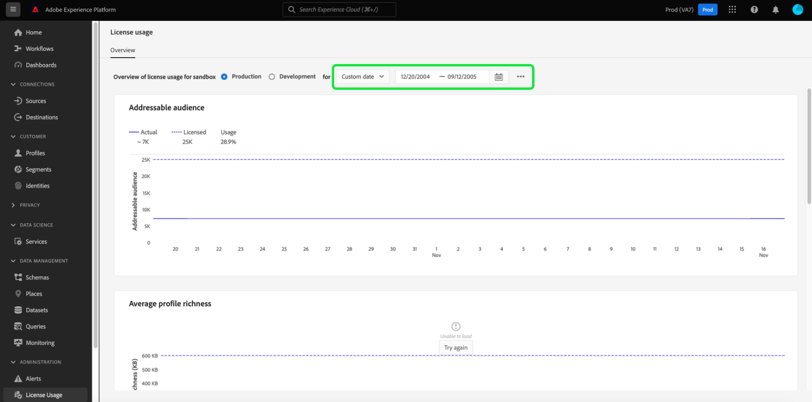

# Painel de uso da licença {#license-usage-dashboard}

A interface do usuário do Adobe Experience Platform (UI) fornece um painel através do qual você pode visualizar informações importantes sobre o uso de licenças de sua organização, conforme capturado durante um instantâneo diário. Este guia descreve como acessar e trabalhar com o painel de uso da licença na interface do usuário e fornece mais informações sobre as visualizações exibidas no painel.

Para obter uma visão geral da interface do usuário da plataforma, visite o [Guia da interface do usuário do Experience Platform](../../landing/ui-guide.md).

## Dados do painel de uso da licença

O painel de uso da licença exibe um instantâneo dos dados relacionados à licença de sua organização para o Experience Platform. Os dados no painel são exibidos exatamente como aparecem no momento específico em que o instantâneo foi tirado. Em outras palavras, o instantâneo não é uma aproximação ou amostra dos dados, e o painel não está sendo atualizado em tempo real.

>[!NOTE]
>
>Quaisquer alterações ou atualizações feitas nos dados desde que o instantâneo foi tirado não serão refletidas no painel até que o próximo instantâneo seja tirado.

## Explorar o painel de uso de licença

Para navegar até o painel de uso da licença na interface do usuário da plataforma, selecione **[!UICONTROL Uso da licença]** no painel esquerdo. Isso abre o **[!UICONTROL Visão geral]** exibindo o painel.

>[!NOTE]
>
>O painel de uso da licença não é habilitado por padrão. Os usuários devem receber a permissão &quot;Exibir painel de uso da licença&quot; para poder visualizar o painel. Para obter etapas sobre a concessão de permissões de acesso para exibir o painel de uso da licença, consulte [guia de permissões do painel](../permissions.md).

### Selecionar uma sandbox

Para escolher uma sandbox para exibir no painel, selecione [!UICONTROL Produção] ou [!UICONTROL Desenvolvimento]. A sandbox selecionada é indicada pelo botão de opção ao lado do nome da sandbox.

O relatório de consumo de sandboxes é cumulativo para todas as sandboxes do mesmo tipo. Em outras palavras, selecionar [!UICONTROL Produção] ou [!UICONTROL Desenvolvimento] O fornece relatórios de consumo para todas as sandboxes de produção ou desenvolvimento, respectivamente.

>[!WARNING]
>
>A permissão para exibir o painel de uso da licença deve ser especificada em um nível de sandbox. Isso significa que a permissão para visualizar o painel deve ser adicionada a cada sandbox individual. Essa limitação será solucionada em uma versão futura. Enquanto isso, a seguinte solução alternativa está disponível:
>
>1. Crie um perfil de produto no Adobe Admin Console.
>2. Em Permissão na categoria Sandbox , adicione todas as sandboxes que deseja visualizar no painel de uso da licença.
>3. Na categoria Permissão do painel do usuário , adicione a permissão &quot;Exibir painel de uso da licença&quot;.

### Selecionar um intervalo de datas

Depois de selecionar uma sandbox, você pode usar a lista suspensa intervalo de datas para selecionar o período de tempo a ser exibido no painel. Há várias opções disponíveis, incluindo o valor padrão dos últimos 30 dias.

Você também pode selecionar **[!UICONTROL Data personalizada]** para escolher o período exibido.

## Widgets

O painel de uso da licença é composto de widgets, que exibem métricas somente leitura, fornecendo informações importantes sobre o uso da licença de sua organização. As métricas visíveis dependem do licenciamento específico da sua organização (consulte o [métricas disponíveis](#available-metrics) para obter detalhes).

Cada widget exibe gráficos de linha que comparam os números reais de sua organização ao total disponível com o licenciamento de sua organização e fornecem uma porcentagem do uso total.

## Métricas disponíveis

O painel de uso da licença informa sobre quatro métricas principais, com mais métricas a serem adicionadas em versões subsequentes. As métricas disponíveis são:

* [!UICONTROL Público-alvo endereçável]
* [!UICONTROL Riqueza média do perfil]
* [!UICONTROL Dados digitalizados por proporção de segmentação]
* [!UICONTROL Total de armazenamento consumido]

A disponibilidade dessas métricas e a definição específica de cada uma delas variam de acordo com o licenciamento adquirido pela sua organização. Para obter definições detalhadas de cada métrica, consulte a documentação apropriada da Descrição do produto:

| Licença | Descrição do produto |
|---|---|
| <ul><li>Adobe Experience Platform:OD LITE</li><li>Adobe Experience Platform:OD STANDARD</li><li>Adobe Experience Platform:OD HEAVY</li></ul> | [Adobe Experience Platform](https://helpx.adobe.com/legal/product-descriptions/adobe-experience-platform.html) |
| <ul><li>Adobe Experience Platform:OD</li></ul> | [Experience Platform, serviços de aplicativos e serviços inteligentes](https://helpx.adobe.com/legal/product-descriptions/exp-platform-app-svcs.html) |
| <ul><li>PLATAFORMA DE DADOS DO CLIENTE RT:OD</li><li>PLATAFORMA DE DADOS DO CLIENTE RT:PRFL OD PARA 10M</li><li>PLATAFORMA DE DADOS DO CLIENTE RT:PRFL OD PARA 50 M</li></ul> | [Real-time Customer Data Platform](https://helpx.adobe.com/legal/product-descriptions/real-time-customer-data-platform.html) |
| <ul><li>AEP:ATIVAÇÃO DE OD</li><li>AEP:OD ACTIVATION PRFL TO 10M</li><li>AEP:OD ACTIVATION PRFL DE ATÉ 50 M</li></ul> | [Adobe Experience Platform Ativation](https://helpx.adobe.com/legal/product-descriptions/adobe-experience-platform0.html) |
| <ul><li>AEP:INTELIGÊNCIA DE OD</li></ul> | [Inteligência Adobe Experience Platform](https://helpx.adobe.com/legal/product-descriptions/adobe-experience-platform-intelligence---product-description.html) |
| <ul><li>Journey Optimizer SELECIONAR:OD</li><li>Journey Optimizer PRIME:OD</li><li>Journey Optimizer ULTIMATE:OD</li><li>UNP AJO PRIME STARTER:OD</li><li>UNP AJO ULTIMATE STARTER:OD</li><li>UNP RTCDP:ORQUESTRAÇÃO DE PERFIL OD</li></ul> | [Adobe Journey Optimizer](https://helpx.adobe.com/legal/product-descriptions/adobe-journey-optimizer.html) |

>[!WARNING]
>
>O painel de uso de licença informa somente a licença mais recente que foi provisionada para sua organização. Se a licença mais recente provisionada para sua organização não aparecer na tabela acima, o painel de uso da licença pode não ser exibido corretamente. O suporte para licenças adicionais e várias licenças em uma única organização está planejado para uma versão futura.

## Próximas etapas

Após ler este documento, é possível localizar o painel de uso da licença e selecionar uma sandbox para exibir. Você também pode encontrar mais informações sobre as métricas disponíveis para a sua organização, com base no licenciamento que sua organização adquiriu.

Para saber mais sobre outros recursos disponíveis na interface do usuário do Experience Platform, consulte [Guia da interface do usuário da plataforma](../../landing/ui-guide.md).
