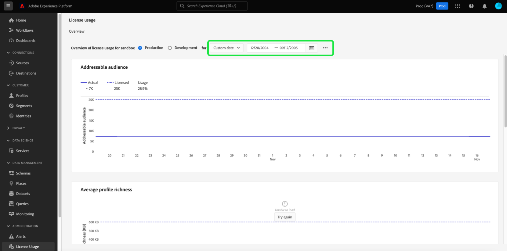

# Painel de uso da licença {#license-usage-dashboard}

A interface do usuário (UI) do Adobe Experience Platform fornece um painel por meio do qual você pode visualizar informações importantes sobre o uso de licença da organização, conforme capturadas durante um instantâneo diário. Este guia descreve como acessar e trabalhar com o painel de uso de licença na interface do usuário e fornece mais informações sobre as visualizações exibidas no painel.

Para obter uma visão geral da interface do usuário da Platform, visite o [Guia da interface de usuário do Experience Platform](../../landing/ui-guide.md).

## Dados do painel de uso da licença

O painel de uso de licença exibe um instantâneo dos dados de licença da sua organização para o Experience Platform. Os dados no painel são exibidos exatamente como são exibidos no momento específico em que o instantâneo foi tirado. Em outras palavras, o instantâneo não é uma aproximação ou amostra dos dados, e o painel não é atualizado em tempo real.

>[!NOTE]
>
>Quaisquer alterações ou atualizações feitas nos dados desde que o instantâneo foi tirado não serão refletidas no painel até que o próximo instantâneo seja tirado.

## Explorar o painel de uso de licença

Para navegar até o painel de uso de licença na interface do Platform, selecione **[!UICONTROL Uso da licença]** no painel esquerdo. Isso abre o **[!UICONTROL Visão geral]** exibindo o painel.

>[!NOTE]
>
>O painel de uso de licença não está habilitado por padrão. Os usuários devem receber a permissão &quot;Exibir painel de uso da licença&quot; para poderem exibir o painel. Para obter etapas sobre como conceder permissões de acesso para exibir o painel de uso da licença, consulte o [guia de permissões do painel](../permissions.md).

### Selecionar uma sandbox

Para escolher uma sandbox para exibir no painel, selecione [!UICONTROL Produção] ou [!UICONTROL Desenvolvimento]. A sandbox selecionada é indicada pelo botão de opção ao lado do nome da sandbox.

O relatório de consumo de sandboxes é cumulativo para todas as sandboxes do mesmo tipo. Em outras palavras, selecionar [!UICONTROL Produção] ou [!UICONTROL Desenvolvimento] O fornece relatórios de consumo para todas as sandboxes de produção ou desenvolvimento, respectivamente.

>[!WARNING]
>
>A permissão para exibir o painel de uso de licença deve ser especificada em nível de sandbox. Isso significa que a permissão para exibir o painel deve ser adicionada a cada sandbox individual. Essa limitação será abordada em uma versão futura. Enquanto isso, a seguinte solução alternativa está disponível:
>
>1. Crie um perfil de produto no Adobe Admin Console.
>2. Em Permissão na categoria Sandbox, adicione todas as sandboxes que deseja visualizar no painel de uso de licença.
>3. Na categoria de Permissão do painel do usuário, adicione a permissão &quot;Exibir painel de uso da licença&quot;.

### Selecionar um intervalo de datas

Depois de selecionar uma sandbox, você pode usar a lista suspensa de intervalo de datas para selecionar o período a ser exibido no painel. Há várias opções disponíveis, incluindo o valor padrão dos últimos 30 dias.

Também é possível selecionar **[!UICONTROL Data personalizada]** para escolher o período mostrado.

## Widgets

O painel de uso de licença é composto por widgets, que exibem métricas somente leitura que fornecem informações importantes sobre o uso de licença da sua organização. As métricas visíveis dependem do licenciamento específico da sua organização (consulte [métricas disponíveis](#available-metrics) para obter detalhes).

Cada widget exibe um gráfico de linha que compara os números reais da sua organização com o total disponível com o licenciamento da organização e fornece uma porcentagem do uso total.

## Métricas disponíveis

O painel de uso da licença relata quatro métricas principais, com mais métricas a serem adicionadas nas versões subsequentes. As métricas disponíveis são:

* [!UICONTROL Público-alvo endereçável]
* [!UICONTROL Riqueza média do perfil]
* [!UICONTROL Dados digitalizados por taxa de segmentação]
* [!UICONTROL Armazenamento total consumido]

A disponibilidade dessas métricas e a definição específica de cada uma delas variam de acordo com o licenciamento adquirido pela sua organização. Para obter definições detalhadas de cada métrica, consulte a documentação apropriada da Descrição do produto:

| Licença | Descrição do produto |
|---|---|
| <ul><li>ADOBE EXPERIENCE PLATFORM:OD LITE</li><li>ADOBE EXPERIENCE PLATFORM:PADRÃO OD</li><li>ADOBE EXPERIENCE PLATFORM:MUITO PESADO</li></ul> | [Adobe Experience Platform](https://helpx.adobe.com/legal/product-descriptions/adobe-experience-platform.html) |
| <ul><li>ADOBE EXPERIENCE PLATFORM:OD</li></ul> | [Experience Platform, serviços de aplicativos e serviços inteligentes](https://helpx.adobe.com/legal/product-descriptions/exp-platform-app-svcs.html) |
| <ul><li>PLATAFORMA DE DADOS DO CLIENTE DE RT:OD</li><li>PLATAFORMA DE DADOS DO CLIENTE DE RT:OD PRFL PARA 10M</li><li>PLATAFORMA DE DADOS DO CLIENTE DE RT:OD PRFL PARA 50M</li></ul> | [Adobe Real-time Customer Data Platform](https://helpx.adobe.com/legal/product-descriptions/real-time-customer-data-platform.html?lang=pt-BR) |
| <ul><li>AEP:ATIVAÇÃO OD</li><li>AEP:OD ATIVATION PRFL PARA 10M</li><li>AEP:OD ATIVATION PRFL ATÉ 50 M</li></ul> | [Ativação do Adobe Experience Platform](https://helpx.adobe.com/legal/product-descriptions/adobe-experience-platform0.html) |
| <ul><li>AEP:INTELIGÊNCIA OD</li></ul> | [Adobe Experience Platform Intelligence](https://helpx.adobe.com/legal/product-descriptions/adobe-experience-platform-intelligence---product-description.html) |
| <ul><li>JOURNEY OPTIMIZER SELECT:OD</li><li>JOURNEY OPTIMIZER PRIME:OD</li><li>JOURNEY OPTIMIZER ULTIMATE:OD</li><li>UNP AJO PRIME STARTER:OD</li><li>UNP AJO ULTIMATE STARTER:OD</li><li>UNP Real-Time CDP:ORQUESTRAÇÃO DE PERFIL OD</li></ul> | [Adobe Journey Optimizer](https://helpx.adobe.com/br/legal/product-descriptions/adobe-journey-optimizer.html) |

>[!WARNING]
>
>O painel de uso de licença relata apenas a licença mais recente que foi provisionada para sua organização. Se a licença mais recente provisionada para sua organização não aparecer na tabela acima, o painel de uso da licença pode não ser exibido corretamente. O suporte para licenças adicionais e várias licenças em uma única organização está planejado para uma versão futura.

## Próximas etapas

Depois de ler este documento, é possível localizar o painel de uso de licença e selecionar uma sandbox para exibir. Você também pode encontrar mais informações sobre métricas disponíveis para sua organização, com base no licenciamento que sua organização adquiriu.

Para saber mais sobre outros recursos disponíveis na interface do usuário do Experience Platform, consulte [Guia da interface do usuário da Platform](../../landing/ui-guide.md).
