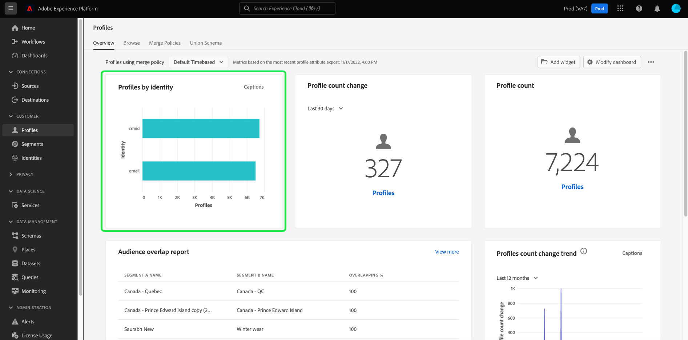

#  Profilesdashboard

A interface do usuário do Adobe Experience Platform (UI) fornece um painel pelo qual você pode visualizar informações importantes sobre seus dados [!DNL Real-time Customer Profile], conforme capturados durante um instantâneo diário. Este guia descreve como acessar e trabalhar com o painel [!UICONTROL Perfis] na interface do usuário e fornece informações sobre as métricas exibidas no painel.

Para obter uma visão geral de todos os recursos de Perfil na interface do usuário do Experience Platform, visite o [Guia da interface do usuário de perfil do cliente em tempo real](../../profile/ui/user-guide.md).

## Dados do painel de perfis

O painel [!UICONTROL Perfis] exibe um instantâneo dos dados do atributo (registro) que sua organização tem na Loja de perfis no Experience Platform. O instantâneo não inclui nenhum dado de evento (série de tempo).

Os dados do atributo no instantâneo mostram os dados exatamente como aparecem no momento específico em que o instantâneo foi tirado. Em outras palavras, o instantâneo não é uma aproximação ou amostra dos dados, e o painel de Perfil não está sendo atualizado em tempo real.

>[!NOTE]
>
>Quaisquer alterações ou atualizações feitas nos dados desde que o instantâneo foi tirado não serão refletidas no painel até que o próximo instantâneo seja tirado.

## Explorar o painel [!UICONTROL Perfis]

Para navegar até o painel [!UICONTROL Profiles] na interface do usuário da plataforma, selecione **[!UICONTROL Profiles]** no painel esquerdo e selecione a guia **[!UICONTROL Overview]** para exibir o painel.

>[!NOTE]
>
>Se sua organização for nova na Plataforma e ainda não tiver conjuntos de dados ativos do Perfil ou políticas de mesclagem criadas, o painel [!UICONTROL Perfis] não estará visível. Em vez disso, a guia [!UICONTROL Visão geral] exibe links e documentação para ajudá-lo a começar a usar o Perfil do cliente em tempo real.

### Modificar o painel [!UICONTROL Perfis]

Você pode modificar a aparência do painel [!UICONTROL Profiles] selecionando **[!UICONTROL Modificar painel]**. Isso permite mover, adicionar e remover widgets do painel, bem como acessar a **[!UICONTROL biblioteca de widgets]** para explorar os widgets disponíveis e criar widgets personalizados para sua organização.

Consulte a documentação [modificando painéis](../customize/modify.md) e [visão geral da biblioteca de widgets](../customize/widget-library.md) para saber mais.

## Mesclar políticas {#merge-policies}

As métricas exibidas no painel [!UICONTROL Profiles] são baseadas em políticas de mesclagem aplicadas aos dados do Perfil do cliente em tempo real. Quando os dados são reunidos de várias fontes para criar o perfil do cliente, é possível que os dados contenham valores conflitantes (por exemplo, um conjunto de dados pode listar um cliente como &quot;único&quot;, enquanto outro conjunto de dados pode listá-lo como &quot;casado&quot;). É tarefa da política de mesclagem determinar quais dados priorizar e exibir como parte do perfil.

Para obter mais informações sobre políticas de mesclagem, incluindo como criar, editar e declarar uma política de mesclagem padrão para sua organização, comece lendo a [visão geral das políticas de mesclagem](../../profile/merge-policies/overview.md).

O painel selecionará automaticamente uma política de mesclagem a ser exibida, mas você poderá alterar a política de mesclagem selecionada usando o menu suspenso. Para escolher uma política de mesclagem diferente, selecione o menu suspenso ao lado do nome da política de mesclagem e selecione a política de mesclagem que deseja exibir.

>[!NOTE]
>
>O menu suspenso mostra apenas as políticas de mesclagem relacionadas à Classe de Perfil Individual XDM. No entanto, se sua organização tiver criado várias políticas de mesclagem, pode significar que você precisará rolar para exibir a lista completa das políticas de mesclagem disponíveis.

## Widgets e métricas

O painel é composto de widgets, que são métricas somente leitura, fornecendo informações importantes sobre os dados do perfil.

A data e a hora da &quot;última atualização&quot; em um widget mostram quando o último instantâneo dos dados foi tirado. A data e a hora do instantâneo são fornecidas em UTC; não está no fuso horário do usuário individual ou da Organização IMS.

## Widgets padrão

O Adobe fornece vários widgets padrão que podem ser usados para visualizar métricas diferentes relacionadas aos dados do seu perfil. Você também pode criar widgets personalizados para serem compartilhados com sua organização usando a [!UICONTROL biblioteca de widgets]. Para saber mais sobre como criar widgets personalizados, comece lendo a [visão geral da biblioteca de widgets](../customize/widget-library.md).

Para saber mais sobre cada um dos widgets padrão disponíveis, selecione o nome de um widget na seguinte lista:

* [[!UICONTROL Contagem de perfis]](#profile-count)
* [[!UICONTROL Perfis adicionados]](#profiles-added)
* [[!UICONTROL Tendência da contagem de perfis]](#profiles-count-trend)
* [[!UICONTROL Perfis por identidade]](#profiles-by-identity)
* [[!UICONTROL Sobreposição de identidade]](#identity-overlap)

### [!UICONTROL Contagem de perfis] {#profile-count}

O widget **[!UICONTROL Profile count]** exibe o número total de perfis mesclados no Loja de perfis no momento em que o instantâneo foi tirado. Esse número é o resultado da política de mesclagem selecionada ser aplicada aos dados do Perfil para unir fragmentos de perfil para formar um único perfil para cada indivíduo.

Consulte a seção [sobre políticas de mesclagem anteriormente neste documento](#merge-policies) para saber mais.

>[!NOTE]
>
>O widget [!UICONTROL Profile count] pode mostrar um número diferente da contagem de perfis mostrada na guia [!UICONTROL Browse] na seção [!UICONTROL Profiles] da interface do usuário por vários motivos. O motivo mais comum é porque a guia [!UICONTROL Browse] faz referência ao número total de perfis mesclados com base na política de mesclagem padrão da organização, enquanto o widget [!UICONTROL Profile count] faz referência ao número total de perfis mesclados com base na política de mesclagem que você selecionou para exibir no painel.
>
>Outro motivo comum é devido às diferenças entre o momento em que o instantâneo do painel é tirado e o momento em que o trabalho de amostra é executado para a guia [!UICONTROL Browse]. Você pode ver quando o widget [!UICONTROL Profile count] foi atualizado pela última vez, observando o carimbo de data e hora no widget, e para saber mais sobre como o trabalho de amostra é acionado na guia [!UICONTROL Browse], consulte a seção [profile count no guia da interface do usuário de perfil do cliente em tempo real](https://experienceleague.adobe.com/docs/experience-platform/profile/ui/user-guide.html?lang=en#profile-count).

### [!UICONTROL Perfis adicionados] {#profiles-added}

O widget **[!UICONTROL Perfis adicionados]** exibe o número total de perfis mesclados que foram adicionados ao Armazenamento de perfil a partir do último instantâneo que foi tirado. Esse número é o resultado da política de mesclagem selecionada ser aplicada aos dados do Perfil para unir fragmentos de perfil para formar um único perfil para cada indivíduo. Você pode usar o seletor suspenso para exibir os perfis adicionados nos últimos 30 dias, 90 dias ou 12 meses.

>[!NOTE]
>
>O widget [!UICONTROL Perfis adicionados] reflete o número de perfis adicionados após a configuração da Loja de perfis e a assimilação de perfis. Em outras palavras, se sua organização configurar a Loja de perfis e assimilar 4.000.000 no Dia 1, em 24 horas o painel estará disponível, no entanto, o widget [!UICONTROL Perfis adicionados] será definido como 0. Isso é feito para evitar um pico associado à assimilação inicial de perfis no sistema. Nos próximos 30 dias, sua organização assimilará mais 1.000.000 perfis na Loja de perfis. Depois que o próximo instantâneo é tirado, o widget [!UICONTROL Perfis adicionados] mostraria um total de 1.000.000 perfis adicionados, enquanto o widget [!UICONTROL Contagem de perfis] exibiria 5.000.000 perfis totais.

### [!UICONTROL Tendência da contagem de perfis] {#profiles-count-trend}

O widget **[!UICONTROL Perfis conta tendência]** exibe o número total de perfis mesclados que foram adicionados à Loja de perfis diariamente nos últimos 30 dias, 90 dias ou 12 meses. Esse número é atualizado todos os dias quando o instantâneo é tirado. Portanto, se você assimilasse perfis na Platform, o número de perfis não seria refletido até que o próximo instantâneo fosse tirado. A contagem de perfis adicionada é o resultado da política de mesclagem selecionada ser aplicada aos dados do perfil para unir fragmentos de perfil para formar um único perfil para cada indivíduo.

Consulte a seção [sobre políticas de mesclagem anteriormente neste documento](#merge-policies) para saber mais.

### [!UICONTROL Perfis por identidade] {#profiles-by-identity}

O widget **[!UICONTROL Perfis por identidade]** exibe o detalhamento das identidades em todos os perfis mesclados na Loja de perfis. O número total de perfis por identidade (em outras palavras, adicionar os valores mostrados para cada namespace) pode ser maior que o número total de perfis mesclados, pois um perfil pode ter vários namespaces associados a ele. Por exemplo, se um cliente interagir com sua marca em mais de um canal, vários namespaces serão associados a esse cliente individual.

Consulte a seção [sobre políticas de mesclagem anteriormente neste documento](#merge-policies) para saber mais.

Para saber mais sobre identidades, visite a [documentação do Adobe Experience Platform Identity Service](../../identity-service/home.md).

### [!UICONTROL Sobreposição de identidade] {#identity-overlap}

O widget **[!UICONTROL Sobreposição de identidade]** exibe um diagrama Venn ou um diagrama de conjunto, mostrando a sobreposição de perfis em sua Loja de perfis que contém várias identidades.

Depois de usar os menus suspensos no widget para selecionar as identidades que deseja comparar, os círculos aparecem exibindo o tamanho relativo de cada identidade, com o número de perfis contendo ambos os namespaces sendo representado pelo tamanho da sobreposição entre os círculos. Se um cliente interagir com sua marca em mais de um canal, várias identidades serão associadas a esse cliente individual, portanto, é provável que sua organização tenha vários perfis contendo fragmentos de mais de uma identidade.

Para obter mais informações sobre fragmentos de perfil, comece lendo a seção em [fragmentos de perfil vs perfis mesclados](https://experienceleague.adobe.com/docs/experience-platform/profile/home.html?lang=en#profile-fragments-vs-merged-profiles) na visão geral do Perfil do cliente em tempo real.

Para saber mais sobre identidades, visite a [documentação do Adobe Experience Platform Identity Service](../../identity-service/home.md).

## Próximas etapas

Agora, ao seguir este documento, você pode localizar o painel Perfis e entender as métricas exibidas nos widgets disponíveis. Para saber mais sobre como trabalhar com dados [!DNL Profile] na interface do usuário do Experience Platform, consulte o [Guia da interface do usuário do perfil do cliente em tempo real](../../profile/ui/user-guide.md).
