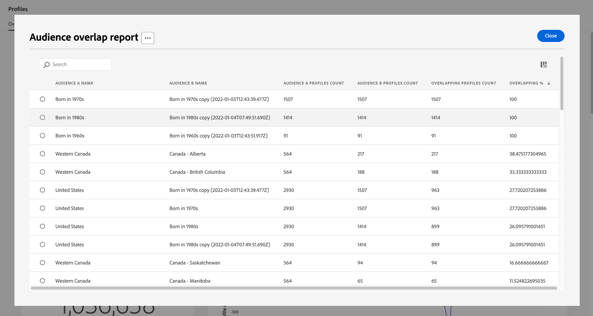

# Painel [!UICONTROL Perfis]

A interface do usuário (UI) do Adobe Experience Platform fornece um painel por meio do qual você pode exibir informações importantes sobre os dados do [!DNL Real-Time Customer Profile], conforme capturados durante um instantâneo diário. Este guia descreve como acessar e trabalhar com o painel Perfis na interface do usuário e fornece informações sobre as métricas exibidas no painel.

Consulte o [Guia da Interface do Usuário do Perfil do Cliente em Tempo Real](../../profile/ui/user-guide.md) para obter uma visão geral dos recursos de Perfil na interface do usuário do Experience Platform.

## Dados do painel de perfil

O painel Perfis exibe um instantâneo dos dados do atributo (registro) que sua organização tem na área de armazenamento Perfil do Experience Platform. O instantâneo não inclui dados de evento (série temporal).

Os dados do atributo no instantâneo mostram os dados exatamente como aparecem no momento específico em que o instantâneo foi tirado. Em outras palavras, o instantâneo não é uma aproximação ou amostra dos dados, e o painel Perfil não é atualizado em tempo real.

>[!NOTE]
>
>Quaisquer alterações ou atualizações feitas nos dados desde que o instantâneo foi tirado não serão refletidas no painel até que o próximo instantâneo seja tirado.

## Explore o painel Perfis {#explore-dashboard}

Para navegar até o painel Perfis na interface do usuário da Platform, selecione **[!UICONTROL Perfis]** no painel à esquerda e clique na guia **[!UICONTROL Visão geral]** para exibir o painel.

>[!NOTE]
>
>Se sua organização for nova na Platform e ainda não tiver conjuntos de dados de Perfil ativos ou políticas de mesclagem criadas, o painel Perfis não estará visível. Em vez disso, a guia [!UICONTROL Visão geral] exibe links e documentação para ajudar você a começar a usar o Perfil do cliente em tempo real.

### Modificar o painel Perfis {#modify-dashboard}

Você pode modificar a aparência do painel Perfis selecionando **[!UICONTROL Modificar painel]**. Você pode mover, adicionar, redimensionar e remover widgets do painel, bem como acessar a **[!UICONTROL Biblioteca de widgets]** para explorar widgets disponíveis e criar widgets personalizados para sua organização.

Para saber mais, consulte a documentação [modificando painéis](../customize/modify.md) e [Visão geral da biblioteca de widgets](../customize/widget-library.md).

### Adicionar widgets {#add-widget}

Selecione **[!UICONTROL Adicionar widget]** para navegar até a biblioteca de widgets e ver uma lista dos widgets disponíveis para adicionar ao seu painel.

Na biblioteca de widgets, você pode navegar pela seleção de widgets de público-alvo padrão e personalizados. Para obter informações sobre como adicionar widgets, consulte a documentação da biblioteca de widgets sobre como [adicionar um widget](../customize/widget-library.md#add-widgets).

### Exibir SQL {#view-sql}

Você pode exibir o SQL que gera os insights visualizados no painel com um alternador no espaço de trabalho [!UICONTROL Visão geral]. Você pode se inspirar no SQL de seus insights existentes para criar novas consultas que obtenham insights exclusivos dos dados da plataforma com base nas necessidades comerciais. Para saber mais sobre este recurso, consulte o [Exibir Guia da Interface do Usuário do SQL](../view-sql.md).

<!-- ## (Beta) Profile efficacy insights {#profile-efficacy-insights}

>[!IMPORTANT]
>
>The profile efficacy insight functionality is currently in beta and are not available to all users. The documentation and the functionality are subject to change.

The [!UICONTROL Efficacy] tab provides metrics on the quality and completeness of your profile data through the use of profile efficacy widgets. These widgets illustrate at a glance the composition of your profiles, trends in completeness over time, and assessments on the quality of your profile data.

See the [profile efficacy widgets section](#profile-efficacy-widgets) for more information on the widgets currently available.

The layout of this dashboard is also customizable by selecting [**[!UICONTROL Modify dashboard]**](../customize/modify.md) from the [!UICONTROL Overview] tab. -->

## Procurar perfis {#browse-profiles}

A guia [!UICONTROL Procurar] permite pesquisar e exibir os perfis somente leitura assimilados em sua organização. Aqui você pode ver informações importantes pertencentes ao perfil sobre suas preferências, eventos anteriores, interações e públicos.

## Detalhes do perfil {#profile-details}

Para abrir o espaço de trabalho [!UICONTROL Perfis] [!UICONTROL Detalhes], selecione uma [!UICONTROL ID de Perfil] na lista.

O espaço de trabalho [!UICONTROL Perfis] [!UICONTROL Detalhes] exibe vários widgets pré-configurados que transmitem informações específicas desse perfil. Essas informações permitem que você entenda os principais atributos do perfil rapidamente. Você também pode personalizar seu espaço de trabalho [!UICONTROL Perfis] [!UICONTROL Detalhes] criando seus próprios widgets. Consulte a seção sobre [como adicionar widgets](#add-widgets) para obter mais detalhes.

![O espaço de trabalho [!UICONTROL Perfis] [!UICONTROL Detalhes] com a guia [!UICONTROL Detalhes] realçada.](../images/profiles/profile-details-workspace.png)

### Widgets de detalhes do perfil {#widgets}

Os widgets de detalhes do perfil pré-configurados são os seguintes:

#### Perfil do cliente {#customer-profile}

O widget [!UICONTROL Perfil do cliente] exibe o nome e o sobrenome do usuário associado ao perfil, bem como sua [!UICONTROL ID de perfil]. Uma ID de perfil é um identificador gerado automaticamente associado a um tipo de identidade e representa um perfil. Para saber mais sobre identidades e namespaces de identidade, consulte a [visão geral das identidades](../../rtcdp/profile/identities-overview.md).

#### Atributos básicos {#basic-attributes}

O widget [!UICONTROL Atributos básicos] exibe os atributos usados com mais frequência para definir um perfil individual.

#### Identidades vinculadas {#linked-identities}

O widget [!UICONTROL Identidades vinculadas] exibe todas as outras identidades associadas ao perfil.

Para exibir os detalhes de identidade do perfil com mais detalhes e navegar até o espaço de trabalho [!UICONTROL Identidades], selecione **[!UICONTROL Exibir gráfico de identidade]**.

#### Preferências de canal {#channel-preferences}

O widget [!UICONTROL Preferências do canal] exibe os canais de comunicação dos quais o usuário consentiu em receber comunicação. Uma marca de seleção indica cada canal do qual o usuário consentiu em receber comunicação.

<!-- image needs a blue tick added below -->

O consentimento do cliente e as preferências de contato são tópicos complexos. Para saber como as preferências de consentimento e contexto podem ser coletadas, processadas e filtradas no Experience Platform, é recomendável ler os seguintes documentos:

* Para saber mais sobre os grupos de campos de esquema necessários para [coletar dados de consentimento de acordo com o padrão Adobe](../../landing/governance-privacy-security/consent/adobe/overview.md), consulte a documentação desses grupos de campos de esquema habilitados para perfil.
   * [[!UICONTROL Detalhes sobre consentimento e preferência]](../../xdm/field-groups/profile/consents.md)
   * [[!UICONTROL IdentityMap]](../../xdm/field-groups/profile/identitymap.md) (necessário se estiver usando o SDK móvel ou da Web da plataforma para enviar sinais de consentimento)
* Para saber como processar os dados de consentimento e preferência do cliente usando o padrão Adobe, consulte a visão geral em [processamento de consentimento no Experience Platform](../../landing/governance-privacy-security/consent/adobe/overview.md).
* Uma política combinada de governança e consentimento de dados pode ser usada para filtrar perfis para segmentação com base nas preferências de consentimento e nas regras organizacionais estabelecidas. Para saber como criar e usar essas políticas combinadas, consulte o guia do usuário em [gerenciando políticas de uso de dados](../../data-governance/policies/user-guide.md#combine-policies).

### Adicionar widgets {#add-widgets}

Para adicionar widgets personalizados ao seu espaço de trabalho [!UICONTROL Perfis] [!UICONTROL Detalhes], selecione **[!UICONTROL Personalizar detalhes do perfil]**.

![O espaço de trabalho Detalhes dos Perfis com [!UICONTROL Personalizar detalhes do perfil] foi realçado.](../images/profiles/customize-profile-details.png)

Agora é possível editar o espaço de trabalho redimensionando ou realocando os widgets. Selecione **[!UICONTROL Adicionar widget]** para criar um widget com atributos personalizados.

![O espaço de trabalho [!UICONTROL Detalhes] de Perfis com [!UICONTROL Adicionar widget] realçado.](../images/profiles/add-widget.png)

O criador do widget é exibido. Insira um nome descritivo para o widget no campo de texto [!UICONTROL Título do cartão] e selecione **[!UICONTROL Adicionar atributos]**.

![A tela do criador do widget com o campo [!UICONTROL Título do cartão] e [!UICONTROL Adicionar atributos] realçados.](../images/profiles/widget-creator.png)

Uma caixa de diálogo é exibida contendo uma visualização do esquema de união do perfil. Use o campo de pesquisa ou role a tela para localizar os atributos que você deseja relatar com seu widget. Marque a caixa de seleção de todos os atributos que deseja incluir. Selecione **[!UICONTROL Selecionar]** para continuar o fluxo de trabalho de criação.

>[!TIP]
>
>A seleção da caixa de seleção de nível superior inclui todos os elementos secundários.

![O diagrama de esquema de união com a caixa de seleção de atributo de fidelidade e [!UICONTROL Selecionar] realçados.](../images/profiles/union-schema-attributes.png)

Uma visualização do widget concluído é exibida na tela. Quando estiver satisfeito com os atributos escolhidos, selecione **[!UICONTROL Salvar]** para confirmar suas escolhas e retornar ao espaço de trabalho [!UICONTROL Perfis] [!UICONTROL Detalhes]. O widget recém-criado agora está visível no espaço de trabalho.

## Políticas de mesclagem {#merge-policies}

As métricas exibidas no painel Perfis são baseadas nas políticas de mesclagem que estão sendo aplicadas aos dados do Perfil do cliente em tempo real. Quando os dados são trazidos de várias fontes para criar o perfil do cliente, os dados podem conter valores conflitantes. Por exemplo, um conjunto de dados pode listar um cliente como &quot;único&quot;, enquanto outro conjunto de dados pode listar o cliente como &quot;casado&quot;. É o trabalho da política de mesclagem determinar quais dados priorizar e exibir como parte do perfil.

Para obter mais informações sobre políticas de mesclagem, incluindo como criar, editar e declarar uma política de mesclagem padrão para sua organização, consulte a [visão geral das políticas de mesclagem](../../profile/merge-policies/overview.md).

O painel seleciona automaticamente uma política de mesclagem a ser usada. A política de mesclagem aplicada pode ser alterada usando o menu suspenso ao lado do nome da política de mesclagem.

>[!NOTE]
>
>O menu suspenso mostra apenas políticas de mesclagem que usam o esquema `_xdm.context.profile`. No entanto, se sua organização tiver criado várias políticas de mesclagem, talvez você precise rolar a tela para visualizar a lista completa de políticas de mesclagem disponíveis.

## Esquemas de união

O painel [!UICONTROL Esquema de união] exibe o esquema de união para uma classe XDM específica. Ao selecionar a lista suspensa **[!UICONTROL Classe]**, você pode visualizar os esquemas de união para diferentes classes XDM.

Os esquemas de união são compostos de vários esquemas que compartilham a mesma classe e foram habilitados para o Perfil. Eles permitem que você veja em uma única visualização, uma combinação de cada campo contido em cada esquema que compartilha a mesma classe.

Para saber mais sobre [exibição de esquemas de união na interface do usuário da Platform](../../profile/ui/union-schema.md#view-union-schemas), consulte o guia da interface do usuário do esquema de união.

## Widgets e métricas

O painel é composto de widgets, que são métricas somente leitura que fornecem informações importantes sobre os dados do seu Perfil.

A data e a hora do instantâneo mais recente são exibidas na parte superior da guia [!UICONTROL Visão geral] ao lado da lista suspensa da política de mesclagem. Todos os dados do widget são precisos a partir dessa data e hora. O carimbo de data e hora do instantâneo é fornecido em UTC; ele não está no fuso horário do usuário ou organização individual.

## Widgets padrão {#default-widgets}

Uma transferência de widget padrão é fornecida para todas as novas instâncias do Adobe Experience Platform que destacam os insights mais recentes disponíveis de seus dados. Os widgets a seguir são pré-configurados na visualização de segmentos desde o início. Veja abaixo detalhes completos sobre a finalidade e a função dos dispositivos.

* [[!UICONTROL Contagem de perfis]](#profile-count)
* [[!UICONTROL Alteração na contagem de perfis]](#profile-count-change)
* [[!UICONTROL Tendência da alteração da contagem de perfis]](#profiles-count-change-trend)
* [[!UICONTROL Perfis por identidade]](#profiles-by-identity)
* [[!UICONTROL Sobreposição de identidade]](#identity-overlap)

>[!NOTE]
>
>A partir de 26 de julho de 2023, os painéis Visão geral dos [!UICONTROL Perfis], [!UICONTROL Públicos-alvo] e [!UICONTROL Destinos] foram redefinidos como uma nova carga de widget padrão para todos os usuários que não modificaram suas visualizações nos seis meses anteriores. Consulte a documentação nas seções de widget padrão [Destinos](./destinations.md#default-widgets) e [Públicos-alvo](./audiences.md#default-widgets) para obter detalhes sobre quais widgets são incluídos como parte dos carregamentos de widget padrão. Você pode continuar personalizando seus widgets de painel como antes.

## Widgets da IA do cliente {#customer-ai-profiles-widgets}

o Customer AI é usado para gerar pontuações de propensão personalizadas, como churn e conversão para perfis individuais em escala. A IA do cliente faz isso analisando dados existentes do Evento de experiência do consumidor para prever **pontuações de propensão de churn ou conversão**. Esses modelos de propensão de alta precisão do cliente permitem segmentação e direcionamento mais exatos. Os insights da [distribuição de pontuações](#customer-ai-distribution-of-scores) e do [resumo de pontuação](#customer-ai-scoring-summary) demonstram a divisão no seu público-alvo. Eles destacam quais perfis são a propensão alta/baixa/média e como eles são distribuídos na contagem de perfis.

* [[!UICONTROL Resumo de pontuação da IA do cliente]](#customer-ai-scoring-summary)
* [[!UICONTROL Distribuição de pontuações da IA do cliente]](#customer-ai-distribution-of-scores)

### [!UICONTROL Distribuição de pontuações da IA do cliente] {#customer-ai-distribution-of-scores}

>[!CONTEXTUALHELP]
>id="platform_dashboards_profiles_distributionOfScores"
>title="Distribuição das pontuações"
>abstract="Este dispositivo visualiza a distribuição do número total de perfis por suas pontuações de propensão em incrementos de cinco por cento. A distribuição da contagem de perfis é determinada pelo modelo de IA e pela política de mesclagem selecionada. É possível alterar o modelo de IA no menu suspenso sob o título do dispositivo."

O widget [!UICONTROL Distribuição de pontuações pela IA do cliente] categoriza o número total de perfis por suas pontuações de propensão. A distribuição da contagem de perfis é determinada pelo modelo de IA e pela política de mesclagem selecionada e, em seguida, visualizada em incrementos de cinco por cento que indicam sua propensão. A contagem de perfis é fornecida ao longo do eixo Y e as pontuações de propensão são fornecidas ao longo do eixo X.

>[!NOTE]
>
>Se a visualização for uma pontuação de propensão de conversão, as pontuações mais altas serão exibidas em verde e as pontuações mais baixas em vermelho. Se você estiver prevendo a propensão de churn, ela será invertida, as pontuações mais altas estarão em vermelho e as pontuações mais baixas em verde. O intervalo médio permanece amarelo, independentemente do tipo de propensão escolhido.

O modelo de IA que determina as pontuações de propensão é escolhido no seletor suspenso sob o título do widget. A lista suspensa contém uma lista de todos os modelos configurados da IA do cliente. Selecione o modelo de IA apropriado para sua análise na lista de modelos disponíveis. Se nenhum modelo de IA do cliente estiver disponível, uma mensagem no widget o direcionará para configurar pelo menos um modelo de IA do cliente e fornecerá um hiperlink para a página Configuração do modelo de IA do cliente. Consulte a documentação para obter instruções sobre [como configurar uma instância da IA do cliente](../../intelligent-services/customer-ai/user-guide/configure.md).

>[!NOTE]
>
>Selecione a lista suspensa imediatamente abaixo da guia de visão geral para alterar a política de mesclagem que determina quais perfis são incluídos na análise. Consulte a seção sobre [políticas de mesclagem](#merge-policies) para obter uma breve descrição ou a [visão geral da política de mesclagem](../../profile/merge-policies/overview.md) para obter mais detalhes.

Para navegar até a página de insights detalhados do modelo de IA do cliente selecionado, selecione **[!UICONTROL Exibir detalhes do modelo]**.

![O painel Públicos-alvo do Experience Platform com o [!UICONTROL widget de distribuição de pontuações pela IA do cliente] e [!UICONTROL Exibir detalhes do modelo] destacados.](../images/segments/customer-ai-distribution-of-scores.png)

A página de insights detalhados do modelo é exibida.

Mais informações sobre a IA do cliente podem ser encontradas no [guia da interface do usuário do discover insights](../../intelligent-services/customer-ai/user-guide/discover-insights.md).

### [!UICONTROL Resumo de pontuação da IA do cliente] {#customer-ai-scoring-summary}

>[!CONTEXTUALHELP]
>id="platform_dashboards_profiles_scoringSummary"
>title="Resumo da pontuação"
>abstract="Este dispositivo exibe o número total de perfis pontuados e os categoriza em compartimentos de propensão alta, média e baixa. O gráfico de rosquinha ilustra a composição proporcional dos perfis totais de propensão alta, média e baixa."

Este widget exibe o número total de perfis pontuados e os categoriza em compartimentos que contêm alta, média e baixa propensão como verde, amarelo e vermelho, respectivamente. Um gráfico de rosca ilustra a composição proporcional de perfis entre propensões alta, média e baixa. Um perfil se qualifica para alta propensão acima de 75, média propensão entre 25 e 74 e baixa propensão abaixo de 24. Uma legenda indica o código de cor e os limites de propensões. As contagens de perfil para as tendências alta, média e baixa são exibidas em uma caixa de diálogo quando o cursor passa o mouse sobre a respectiva seção do gráfico de rosca.

>[!NOTE]
>
>Se a visualização for uma pontuação de propensão de conversão, as pontuações mais altas serão exibidas em verde e as pontuações mais baixas em vermelho. Se você estiver prevendo a propensão de churn, ela será invertida, as pontuações mais altas estarão em vermelho e as pontuações mais baixas em verde. O intervalo médio permanece amarelo, independentemente do tipo de propensão escolhido.

O menu suspenso abaixo do título do widget fornece uma lista de todos os modelos configurados da IA do cliente. Selecione o modelo de IA apropriado para sua análise na lista de modelos disponíveis. Se nenhum modelo de IA do cliente estiver disponível, uma mensagem no widget o direcionará para configurar pelo menos um modelo de IA do cliente e fornecerá um hiperlink para a página Configuração do modelo de IA do cliente. Consulte a documentação sobre [como configurar uma instância da IA do cliente](../../intelligent-services/customer-ai/user-guide/configure.md) para obter instruções detalhadas.

>[!NOTE]
>
>O número total de perfis calculados depende da política de mesclagem escolhida. Para alterar a política de mesclagem usada, selecione a lista suspensa imediatamente abaixo da guia de visão geral. Consulte a seção sobre [políticas de mesclagem](#merge-policies) para obter uma breve descrição ou a [visão geral da política de mesclagem](../../profile/merge-policies/overview.md) para obter mais detalhes.

Para navegar até a página de insights detalhados do modelo de IA do cliente selecionado, selecione **[!UICONTROL Exibir detalhes do modelo]**. Mais informações sobre a IA do cliente podem ser encontradas no [guia da interface do usuário do discover insights](../../intelligent-services/customer-ai/user-guide/discover-insights.md).

## Widgets padrão {#standard-widgets}

O Adobe fornece vários widgets padrão que você pode usar para visualizar métricas diferentes relacionadas aos seus dados de perfil. Você também pode criar widgets personalizados para serem compartilhados com sua organização usando a [!UICONTROL Biblioteca de widgets]. Para saber mais sobre como criar widgets personalizados, comece lendo a [Visão geral da biblioteca de widgets](../customize/widget-library.md).

Para saber mais sobre cada um dos widgets padrão disponíveis, selecione o nome de um widget na lista a seguir:

* [[!UICONTROL Contagem de perfis]](#profile-count)
* [[!UICONTROL Tendência de contagem de perfis]](#profile-count-trend)
* [[!UICONTROL Alteração na contagem de perfis]](#profile-count-change)
* [[!UICONTROL Tendência da alteração da contagem de perfis]](#profiles-count-change-trend)
* [[!UICONTROL Tendência de alteração da contagem de perfis por identidade]](#profiles-count-change-trend-by-identity)
* [[!UICONTROL Perfis por identidade]](#profiles-by-identity)
* [[!UICONTROL Sobreposição de identidade]](#identity-overlap)
* [[!UICONTROL Perfis de identidade única]](#single-identity-profiles)
* [[!UICONTROL Perfis de identidade únicos por identidade]](#single-identity-profiles-by-identity)
* [[!UICONTROL Perfis não segmentados]](#unsegmented-profiles)
* [[!UICONTROL Tendência de alteração de perfis não segmentados]](#unsegmented-profiles-change-trend)
* [[!UICONTROL Perfis não segmentados por identidade]](#unsegmented-profiles-by-identity)
* [[!UICONTROL Públicos-alvo]](#audiences)
* [[!UICONTROL Públicos mapeados para o status de destino]](#audiences-mapped-to-destination-status)
* [[!UICONTROL Tamanho do público]](#audiences-size)
* [[!UICONTROL Sobreposição de público por política de mesclagem]](#audience-overlap-by-merge-policy)
* [[!UICONTROL Relatório de sobreposição de público-alvo]](#audience-overlap-report)

### [!UICONTROL Contagem de perfis] {#profile-count}

>[!CONTEXTUALHELP]
>id="platform_dashboards_profiles_profilecount"
>title="Contagem de perfis"
>abstract="Esse dispositivo exibe o número total de perfis mesclados no Armazenamento de perfis no momento em que o instantâneo foi tirado. O número depende da política de mesclagem selecionada e aplicada aos dados de perfil."

O widget **[!UICONTROL Contagem de perfis]** exibe o número total de perfis mesclados no repositório de perfis no momento em que o instantâneo foi tirado. Esse número é o resultado da política de mesclagem selecionada que está sendo aplicada aos dados do seu Perfil para mesclar fragmentos de perfil para formar um único perfil para cada indivíduo.

Consulte a [seção sobre políticas de mesclagem anteriormente neste documento](#merge-policies) para saber mais.

>[!NOTE]
>
>O widget [!UICONTROL Contagem de perfis] pode mostrar um número diferente da contagem de perfis mostrada na guia [!UICONTROL Procurar] da seção [!UICONTROL Perfis] da interface por vários motivos. O motivo mais comum para essa diferença é que a guia [!UICONTROL Procurar] faz referência ao número total de perfis mesclados com base na política de mesclagem padrão da sua organização, enquanto o widget [!UICONTROL Contagem de perfis] faz referência ao número total de perfis mesclados com base na política de mesclagem que você selecionou para exibir no painel.
>
>Outro motivo comum é devido às diferenças entre o momento em que o instantâneo do painel é tirado e o momento em que o trabalho de amostra é executado para a guia [!UICONTROL Procurar]. Você pode ver quando o widget [!UICONTROL Contagem de perfis] foi atualizado pela última vez observando o carimbo de data e hora no widget. Para saber mais sobre como o trabalho de amostra é acionado na guia [!UICONTROL Procurar], consulte a [seção de contagem de perfis no guia da interface do usuário do Perfil do Cliente em Tempo Real](../../profile/ui/user-guide.md#profile-count).

### [!UICONTROL Tendência de contagem de perfis] {#profile-count-trend}

O widget [!UICONTROL Tendência de contagem de perfis] usa um gráfico de linhas para ilustrar a tendência no número total de perfis contidos no sistema ao longo do tempo. Esse número total inclui todos os perfis importados para o sistema desde o último instantâneo diário. Os dados podem ser visualizados por períodos de 30 dias, 90 dias e 12 meses. O período é escolhido em um menu suspenso no widget.

### [!UICONTROL Alteração na contagem de perfis] {#profile-count-change}

>[!CONTEXTUALHELP]
>id="platform_dashboards_profiles_profilescountchange"
>title="Alteração na contagem de perfis"
>abstract="Esse dispositivo exibe o número total de perfis mesclados **adicionados** ao Armazenamento de perfis no momento do último instantâneo. O número depende da política de mesclagem selecionada e aplicada aos dados de perfil."

O widget **[!UICONTROL Alteração na contagem de perfis]** exibe o número de perfis mesclados adicionados ao repositório de perfis desde o instantâneo anterior. Esse número é o resultado da política de mesclagem selecionada que está sendo aplicada aos dados do seu Perfil para mesclar fragmentos de perfil para formar um único perfil para cada indivíduo. Você pode usar o seletor suspenso para exibir o número de perfis adicionados nos últimos 30 dias, 90 dias ou 12 meses.

>[!NOTE]
>
>O widget [!UICONTROL Alteração na contagem de perfis] reflete o número de perfis adicionados **após** a assimilação inicial de perfis e a configuração do armazenamento de perfis. Em outras palavras, se sua organização configurasse o repositório de perfis e assimilasse 4.000.000 no Dia 1, o painel estaria disponível em 24 horas. No entanto, o widget [!UICONTROL Alteração na contagem de perfis] seria definido como 0. Esse método de contagem é feito para evitar um pico associado à assimilação inicial de perfis no sistema. Nos próximos 30 dias, sua organização assimilará mais 1.000.000 perfis na loja de perfis. Depois que o próximo instantâneo for tirado, o widget [!UICONTROL Alteração na contagem de perfis] mostrará um total de 1.000.000 perfis adicionados, enquanto o widget [!UICONTROL Contagem de perfis] exibirá um total de 5.000.000 perfis.

### [!UICONTROL Tendência da alteração da contagem de perfis] {#profiles-count-change-trend}

>[!CONTEXTUALHELP]
>id="platform_dashboards_profiles_profilesaddedtrend"
>title="Tendência da alteração da contagem de perfis"
>abstract="Esse dispositivo exibe o número de perfis mesclados adicionados diariamente ao Armazenamento de perfis nos últimos 30 dias, 90 dias ou 12 meses. O número também depende da política de mesclagem selecionada que está sendo aplicada aos dados de perfil."

O widget **[!UICONTROL Tendência de alteração na contagem de perfis]** exibe o número total de perfis mesclados que foram adicionados ao repositório de perfis diariamente nos últimos 30 dias, 90 dias ou 12 meses. Esse número é atualizado todos os dias quando o instantâneo é tirado. Portanto, se você assimilasse perfis na Platform, o número de perfis não seria refletido até que o próximo instantâneo fosse tirado. A contagem de perfis adicionados é o resultado da política de mesclagem selecionada que está sendo aplicada aos dados do seu Perfil para mesclar fragmentos de perfil para formar um único perfil para cada indivíduo.

Para saber mais, consulte a [seção sobre políticas de mesclagem anteriormente neste documento](#merge-policies).

O widget **[!UICONTROL Tendência de alteração na contagem de perfis]** exibe um botão &#39;legendas&#39; na parte superior direita do widget. Para abrir a caixa de diálogo de legendas automáticas, selecione **[!UICONTROL Legendas]**.

Um modelo de aprendizado de máquina gera automaticamente legendas para descrever as principais tendências e eventos importantes analisando o gráfico e os dados. As anotações são adicionadas ao gráfico com base nas legendas. Selecione uma legenda para se concentrar em sua anotação correspondente.

### [!UICONTROL Tendência de alteração da contagem de perfis por identidade] {#profiles-count-change-trend-by-identity}

<!-- This widget uses a line graph to illustrate the change in number of profiles filtered by a chosen source identity and merge policy. -->

Este widget filtra a contagem de perfis com base em uma identidade de origem selecionada e mescla a política, em seguida, ilustra a alteração no número de vários períodos usando um gráfico de linhas. A política de mesclagem é selecionada na lista suspensa visão geral na parte superior da página, a identidade de origem e o período são selecionados nos menus suspensos widget. A tendência pode ser visualizada em períodos de 30 dias, 90 dias e 12 meses.

Este widget ajuda você a gerenciar as necessidades de ativação de destino, demonstrando o padrão de crescimento dos perfis filtrados por uma identidade necessária.

### [!UICONTROL Perfis por identidade] {#profiles-by-identity}

>[!CONTEXTUALHELP]
>id="platform_dashboards_profiles_profilesbyidentity"
>title="Perfis por identidade"
>abstract="Esse dispositivo exibe o detalhamento de todos os perfis mesclados no Armazenamento de perfis por identidades."

O widget **[!UICONTROL Perfis por identidade]** exibe o detalhamento de identidades em todos os perfis mesclados em seu repositório de perfis. O número total de perfis por identidade (em outras palavras, somando os valores mostrados para cada namespace) pode ser maior que o número total de perfis mesclados, pois um perfil pode ter vários namespaces associados a ele. Por exemplo, se um cliente interagir com sua marca em mais de um canal, vários namespaces serão associados a esse cliente individual.

Para saber mais, consulte a [seção sobre políticas de mesclagem anteriormente neste documento](#merge-policies).

Para abrir a caixa de diálogo de legendas automáticas, selecione **[!UICONTROL Legendas]**.

Um modelo de aprendizado de máquina gera insights de dados automaticamente ao analisar a distribuição geral e as dimensões principais dos dados.

Para saber mais sobre identidades, consulte a [documentação do Adobe Experience Platform Identity Service](../../identity-service/home.md).

### [!UICONTROL Sobreposição de identidade] {#identity-overlap}

>[!CONTEXTUALHELP]
>id="platform_dashboards_profiles_identityoverlap"
>title="Sobreposição de identidade"
>abstract="Esse dispositivo usa um diagrama de Venn para exibir a sobreposição de perfis no Armazenamento de perfis que contém as duas identidades selecionadas."

O widget **[!UICONTROL Sobreposição de identidade]** usa um diagrama de Venn ou define um diagrama para exibir a sobreposição de perfis no armazenamento de perfis que contém as duas identidades selecionadas.

Use os menus suspensos do widget para selecionar as identidades que deseja comparar. Círculos exibem a contagem total relativa de perfis que contêm cada identidade. O número de perfis contendo ambas as identidades é representado pelo tamanho da sobreposição entre os círculos. Se um cliente interagir com sua marca em mais de um canal, várias identidades serão associadas a esse cliente individual. Nessa situação, é provável que sua organização tenha vários perfis contendo fragmentos de mais de uma identidade.

Para obter mais informações sobre fragmentos de perfil, consulte a seção sobre [fragmentos de perfil versus perfis mesclados](../../profile/home.md#profile-fragments-vs-merged-profiles) na visão geral do Perfil do cliente em tempo real.

Para saber mais sobre identidades, consulte a [documentação do Adobe Experience Platform Identity Service](../../identity-service/home.md).

### [!UICONTROL Perfis de identidade única] {#single-identity-profiles}

>[!CONTEXTUALHELP]
>id="platform_dashboards_profiles_singleidentityprofiles"
>title="Perfis de identidade única"
>abstract="Esse widget fornece uma contagem dos perfis de sua organização que têm apenas um tipo de ID que cria sua identidade. Esse tipo de ID pode ser um email ou uma ECID."

O widget [!UICONTROL Perfis de identidade únicos] fornece uma contagem dos perfis de sua organização que têm apenas um tipo de ID que cria sua identidade. Esse tipo de ID pode ser um email ou uma ECID. A contagem de perfis é gerada a partir dos dados contidos no instantâneo mais recente.

### [!UICONTROL Perfis de identidade únicos por identidade] {#single-identity-profiles-by-identity}

Este widget usa um gráfico de barras para ilustrar o número total de perfis identificados com apenas um identificador exclusivo. O widget suporta até cinco das identidades mais comuns.

Para ver uma caixa de diálogo detalhando a contagem total de perfis de uma identidade, use o cursor para passar o mouse sobre barras individuais.

### [!UICONTROL Perfis não segmentados] {#unsegmented-profiles}

>[!CONTEXTUALHELP]
>id="platform_dashboards_profiles_unsegmentedprofiles"
>title="Perfis não segmentados"
>abstract="Esse dispositivo fornece o número total de perfis que não estão conectados a um público-alvo e representa a oportunidade de ativação de perfis em sua organização."

O widget [!UICONTROL Perfis não segmentados] fornece o número total de perfis não anexados a nenhum público-alvo. O número gerado é preciso desde o último instantâneo e representa a oportunidade de ativação de perfil em sua organização. Também indica a oportunidade de eliminar perfis que não fornecem ROI adequado.

### [!UICONTROL Tendência de alteração de perfis não segmentados] {#unsegmented-profiles-change-trend}

>[!CONTEXTUALHELP]
>id="platform_dashboards_profiles_unsegmentedprofilestrend"
>title="Tendência de perfis não segmentados"
>abstract="Esse dispositivo fornece uma ilustração de gráfico de linhas para o número de perfis que não estão conectados a um público-alvo em um determinado período. A tendência dos perfis não conectados a um público-alvo pode ser visualizada ao longo de períodos de 30 dias, 90 dias e 12 meses."

O widget [!UICONTROL Tendência de alteração de perfis não segmentados] usa um gráfico de linhas para ilustrar o número de perfis adicionados desde o último instantâneo diário que não estão anexados a nenhum público-alvo. A tendência de alteração dos perfis não anexados a nenhum público-alvo pode ser visualizada em períodos de 30 dias, 90 dias e 12 meses. O período é escolhido em um menu suspenso no widget. A contagem de perfis é refletida no eixo y e a hora no eixo x.

### [!UICONTROL Perfis não segmentados por identidade] {#unsegmented-profiles-by-identity}

>[!NOTE]
>
>O widget Perfis não segmentados por identidade foi descontinuado em outubro de 2022 e não está mais disponível.

<!-- 

>[!CONTEXTUALHELP]
>id="platform_dashboards_profiles_unsegmentedprofilesbyidentity"
>title="Unsegmented profiles by identity"
>abstract="This widget categorizes the total number of unsegmented profiles by their unique identifier."

The [!UICONTROL Unsegmented Profiles by Identity] widget categorizes the total number of unsegmented profiles by their unique identifier. The data is visualized in a bar chart for ease of comparison. 

 -->

### [!UICONTROL Públicos-alvo] {#audiences}

Este widget fornece o número total de públicos-alvo que estão prontos para serem ativados, de acordo com a política de mesclagem escolhida aplicada aos dados do seu perfil.

Selecione **[!UICONTROL Públicos-alvo]** para navegar até a guia [!UICONTROL Procurar] do painel [!UICONTROL Públicos-alvo]. A partir daí, você pode ver uma lista de todas as definições de segmento para sua organização.

<!-- https://jira.corp.adobe.com/browse/PLAT-115291 -->

<!-- * [[!UICONTROL Audiences change trend]](#audiences-change-trend) -->
<!-- ### [!UICONTROL Audiences change trend] {#audiences-change-trend}

This line graph widget visualizes the change in the total number of audiences each day, trending over time. The change in the number of audiences is dependent on the selected merge policy being applied to your profile data. The period of analysis is selected from the widget dropdown menu. The bar chart can be visualized over 30 days, 90 days, and 12-month periods.

The visualization allows you to monitor the overall health of audiences within Adobe Experience Platform by understanding trends in the growth or decline of the total number of audiences. -->

<!--  -->

### [!UICONTROL Relatório de sobreposição de público-alvo] {#audience-overlap-report}

Esse widget tabula a sobreposição de dados de todos os públicos-alvo disponíveis filtrados pela política de mesclagem. Uma lista de cinco públicos-alvo classificados das porcentagens de sobreposição mais alta para a mais baixa é fornecida para a política de mesclagem escolhida no menu suspenso na parte superior da tela. Os dois públicos analisados estão listados nas colunas [!UICONTROL AUDIENCE A NAME] e [!UICONTROL AUDIENCE B NAME]. A percentagem de sobreposição é indicada na terceira coluna, com uma precisão de doze casas decimais.

O relatório de sobreposição de público-alvo ajuda você a criar públicos-alvo novos e de alto desempenho. A observação de sobreposições de alta porcentagem permite suprimir públicos-alvo e impedir o envio do mesmo público-alvo para destinos diferentes. Elas também ajudam a identificar insights ocultos que podem ajudar com uma melhor segmentação. A baixa porcentagem de sobreposição ajuda a localizar perfis únicos a serem perseguidos.

Selecione **[!UICONTROL Exibir mais]** para abrir uma caixa de diálogo de tela inteira que contém mais dados de sobreposição de público-alvo.

A caixa de diálogo [!UICONTROL Relatório de sobreposição de público-alvo] é exibida. Essa caixa de diálogo pode conter até 50 linhas de análises de sobreposição de público-alvo divididas em seis colunas. Para remover ou adicionar colunas da tabela, selecione o ícone de configurações ().

>[!NOTE]
>
>Para alterar a classificação dos resultados entre o mais alto e o mais baixo ou do mais baixo para o mais alto, selecione o cabeçalho de coluna **[!UICONTROL Sobreposição]**.

Para baixar todo o relatório no formato PDF, selecione o menu de opções (**`...`**) seguido de **[!UICONTROL Download]**.

Para abrir um diagrama Venn da análise de sobreposição, selecione uma linha no relatório. Para ver a contagem de perfis em uma caixa de diálogo, passe o mouse sobre uma seção do diagrama de Venn.

Selecione **[!UICONTROL Fechar]** para retornar ao painel [!UICONTROL Perfis].

### [!UICONTROL Públicos mapeados para o status de destino] {#audiences-mapped-to-destination-status}

O widget [!UICONTROL Públicos-alvo mapeados para o status de destino] exibe o número total de públicos-alvo mapeados e não mapeados em uma única métrica e usa um gráfico de rosca para ilustrar a diferença proporcional entre seus totais. Os números calculados dependem da política de mesclagem escolhida.

As contagens individuais para públicos mapeados ou não mapeados são exibidas em uma caixa de diálogo quando o cursor passa o mouse sobre a respectiva seção do gráfico de rosca.

### [!UICONTROL Tamanho do público] {#audiences-size}

O widget [!UICONTROL Tamanho do público-alvo] fornece uma tabela de duas colunas que lista os nomes de até 20 públicos-alvo e o número total de perfis contidos em cada público-alvo. A lista é ordenada de cima para baixo de acordo com o número total de perfis contidos no público-alvo. A contagem total do tamanho do público depende da política de mesclagem aplicada.

Para ver informações abrangentes sobre um público-alvo, selecione um nome de público-alvo na lista fornecida para navegar até a página [!UICONTROL Públicos-alvo] [!UICONTROL Detalhes]. Além disso, ao selecionar **[!UICONTROL Exibir todos os públicos-alvo]** do final do widget, você pode navegar até a guia [!UICONTROL Públicos-alvo] [!UICONTROL Procurar] para localizar qualquer público-alvo existente.

Mais informações sobre detalhes do público podem ser encontradas na [documentação do Portal de Público](../../segmentation/ui/audience-portal.md).

### [!UICONTROL Sobreposição de público por política de mesclagem] {#audience-overlap-by-merge-policy}

Este widget usa um diagrama Venn para exibir a sobreposição de dois públicos-alvo selecionados. A política de mesclagem é escolhida na lista suspensa visão geral na parte superior da página, e os públicos-alvo para análise são selecionados em dois menus suspensos no widget. O número total de perfis contidos na definição de segmento relevante pode ser visto ao passar o mouse sobre um círculo ou a interseção.

À medida que o widget exibe o cruzamento visual das definições de segmento, você pode otimizar sua estratégia de segmentação estudando as semelhanças entre suas definições de segmento.

<!-- ## (Beta) Profile efficacy widgets {#profile-efficacy-widgets}

>[!IMPORTANT]
>
>The profile efficacy widgets are currently in Beta and are not available to all users. The documentation and the functionality are subject to change.

Adobe provides multiple widgets to assess the completeness of the ingested profiles available for your data analysis. Each of the profile efficacy widgets can be filtered by the merge policy. To change the merge policy filter, select the[!UICONTROL Profiles using merge policy] dropdown and choose the appropriate policy from the available list.

To learn more about each of the profile efficacy widgets, select the name of a widget from the following list:

* [[!UICONTROL Attribute quality assessment]](#attributes-quality-assessment)
* [[!UICONTROL Profiles by completeness]](#profiles-by-completeness)
* [[!UICONTROL Profiles completeness trend]](#profiles-completeness-trend)

### (Beta) [!UICONTROL Attributes quality assessment] {#attributes-quality-assessment}

>[!CONTEXTUALHELP]
>id="platform_dashboards_profiles_attributesqualityassessment"
>title="Attributes quality assessment"
>abstract="This widget shows the completeness and cardinality of all profiles according to their attributes. Each row describes one attribute. The **Profiles** column provides the number of profiles that have this attribute and are filled with non-null values. The **Completeness** percentage is determined by the total number of profiles that have this attribute and are filled with non-null values divided by the total number of non-empty values in the profiles for that attribute. **Cardinality** provides the total number of unique non-null values of this attribute across all attributes."

The [!UICONTROL Attribute quality assessment] widget shows the completeness and cardinality of all profiles according to their attributes. The data is accurate to the last processing date. This information is presented as a table with four columns where each row in the table represents a single attribute.

| Column  | Description  |
|---|---|
| Attribute  | The name of the attribute.  |
| Profiles  | The number of profiles that have this attribute and are filled with non-null values.  |
| Completeness  | This percentage is determined by the total number of profiles that have this attribute and are filled with non-null values. The number is calculated by dividing the total number of profiles by the total number of non-empty values in the profiles for that attribute.  |
| Cardinality  | The total number of **unique** non-null values of this attribute. It is measured across all profiles. |

### (Beta) [!UICONTROL Profiles by completeness] {#profiles-by-completeness}

>[!CONTEXTUALHELP]
>id="platform_dashboards_profiles_profilesbycompleteness"
>title="Profiles by completeness"
>abstract="The donut chart displays the percentage of profile attributes that are filled with non-null values among all observed attributes. It illustrates the proportion of profiles that are of high, medium, or low completeness. High completeness profiles have more than 70% of their attributes filled. Medium completeness profiles have between 30% and 70% of their attributes filled. Low completeness profiles have less than 30% of their attributes filled."

The [!UICONTROL Profiles by completeness] widget creates a donut chart of profile completeness since the last processing date. The completeness of a profile is measured by the percentage of attributes that are filled with non-null values among all observed attributes.

This widget shows the proportion of profiles that are of high, medium, or low completeness. By default, there are three levels of completeness configured: 

* High completeness: Profiles have more than 70% of their attributes filled. 
* Medium completeness: Profiles have between 30% and 70% of their attributes filled. 
* Low completeness: Profiles have less than 30% of their attributes filled. 

### (Beta) [!UICONTROL Profiles completeness trend] {#profiles-completeness-trend}

>[!CONTEXTUALHELP]
>id="platform_dashboards_profiles_profilescompletenesstrend"
>title="Profiles completeness trend"
>abstract="This widget creates a stacked area chart to depict the trend of profile completeness over time. Completeness is measured by the percentage of attributes that are filled with non-null values among all observed attributes."

This widget creates a stacked area chart to depict the trend of profile completeness over time. Completeness is measured by the percentage of attributes filled with non-null values among all observed attributes. It categorizes the profile completeness as high, medium, or low completeness since the last processing date.

The x-axis represents time, the y-axis represents the number of profiles, and the colors represent the three levels of profile completeness. 

The three levels of completeness are:

* High completeness: Profiles have more than 70% of attributes filled. 
* Medium completeness: Profiles have less than 70% and more than 30% of attributes filled. 
* Low completeness: Profiles have less than 30% of attributes filled.

 -->

## Próximas etapas

Ao seguir esse documento, agora é possível localizar o painel de perfis e entender as métricas exibidas nos widgets disponíveis. Para saber mais sobre como trabalhar com dados do [!DNL Profile] na interface do usuário do Experience Platform, consulte o [Guia da interface do usuário do Perfil do Cliente em Tempo Real](../../profile/ui/user-guide.md).
