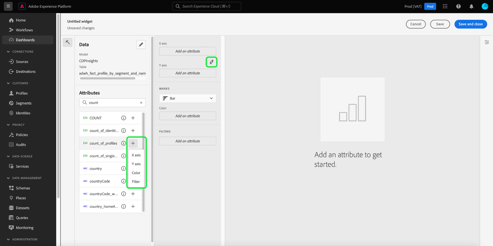

# Rastreamento e análise de consentimento

No cenário de marketing de hoje, você precisa entender e respeitar as preferências de consentimento do cliente. O Adobe Real-Time Customer Data Platform oferece a capacidade de os profissionais de marketing analisarem o consentimento do cliente para criar confiança, cumprir as regulamentações de privacidade e fornecer experiências mais personalizadas.

Este documento detalha como criar um painel de consentimento para vários casos de uso de marketing para dados do Real-Time CDP. Especificamente, ele se concentra em como criar um público-alvo com os atributos apropriados para suas necessidades comerciais e, em seguida, consumir os insights por meio do uso de widgets pré-configurados na interface do usuário do Adobe Experience Platform. Um método alternativo de criar seu próprio widget personalizado com o recurso de painéis definido pelo usuário também é apresentado.

## Casos de uso {#use-cases}

Os casos de uso abordados neste guia são tendência de consentimento e sobreposição de consentimento.

- **Tendência de consentimento** rastreia a tendência do consentimento do usuário ao longo do tempo. A análise das alterações de preferência de consentimento ajuda os profissionais de marketing a planejar e executar campanhas que se adaptam a essas alterações de preferência do usuário. Por exemplo, você pode querer executar campanhas educacionais direcionadas, campanhas de transparência e confiança ou campanhas de incentivo para impulsionar opções de consentimento. Você também pode correlacionar campanhas que podem ter um impacto negativo no consentimento para reduzir proativamente a frequência dessas campanhas.
- **Sobreposição de consentimento** usa a sobreposição entre canais de consentimento para fornecer mensagens personalizadas consistentes em vários canais para seus clientes que consentiram com vários canais. Os profissionais de marketing podem priorizar e alocar recursos para determinados canais em que um grau mais alto de consentimento e mensagens personalizadas podem repercutir nos clientes e gerar taxas de resposta mais altas.

## Criar públicos-alvo com consentimento {#create-consent-audiences}

Para criar um painel de consentimento, primeiro crie um público-alvo de todos os perfis que consentiram em entrar em contato com o. Para navegar até o Construtor de segmentos do Real-Time Customer Data Platform, selecione **[!UICONTROL Audiences]** na navegação à esquerda da interface do usuário do Experience Platform. Na guia [!UICONTROL Customer] do painel [!UICONTROL Audiences], selecione **[!UICONTROL Create audience]** na parte superior direita da exibição e, em seguida, **[!UICONTROL Build rules]**.

![O painel [!UICONTROL Audiences] com [!UICONTROL Customer], [!UICONTROL Audiences] e [!UICONTROL Create segment] realçados.](../images/insights-use-cases/consent-analysis/create-audience.png)

O Construtor de segmentos é exibido. Em seguida, selecione **[!UICONTROL XDM Individual Profile]** entre as opções disponíveis. Consulte a documentação para obter mais informações sobre a [tela do construtor de regras](../../segmentation/ui/segment-builder.md#rule-builder-canvas).

![O Construtor de Segmentos com a pasta de atributos [!UICONTROL XDM Individual Profile] realçada.](../images/insights-use-cases/consent-analysis/xdm-individual-profile.png)

Localize seus atributos de consentimento nas opções disponíveis. Selecione **[!UICONTROL Consents and Preferences]**.

>[!NOTE]
>
>Se você tiver mantido o consentimento do usuário em um atributo diferente do grupo de campos recomendado do Adobe, deverá selecionar esses atributos em vez dos mostrados abaixo.

Mais informações podem ser encontradas no [tratamento do consentimento na documentação de segmentação](../../segmentation/tutorials/consents.md#handling-consent-in-segmentation).

![O Construtor de Segmentos com a pasta de atributos [!UICONTROL Consent and Preferences] realçada.](../images/insights-use-cases/consent-analysis/consent-and-preferences.png)

As várias opções de consentimento e preferência são exibidas. Como esta demonstração foca no consentimento para contato em vários canais de marketing, selecione **[!UICONTROL Marketing Preferences]**.

![O Construtor de Segmentos com a pasta [!UICONTROL Marketing Preferences] realçada.](../images/insights-use-cases/consent-analysis/marketing-preferences.png)

A lista de preferências de marketing é exibida. Embora esse exemplo de caso de uso se concentre em email, SMS e chamadas, também é possível criar insights para qualquer outra combinação ou para a totalidade das opções. Para cada um dos canais, execute as etapas abaixo para criar um público-alvo.

Para configurar um público, selecione **[!UICONTROL Receive SMS]** / **[!UICONTROL Receive email]** / **[!UICONTROL Receive calls]**.

A pasta [!UICONTROL Subscriptions] é exibida. Nas opções disponíveis, selecione e arraste o atributo **[!UICONTROL Choice Value]** para o painel central e selecione o valor desejado no menu suspenso. Nesse caso, selecione **Sim (aceitar)**. Em seguida, nomeie o público-alvo de acordo com suas necessidades comerciais e forneça uma descrição simples.

>[!NOTE]
>
>Há um limite flexível no número de públicos que você é recomendado criar. Mais informações podem ser encontradas na [documentação de medidas de proteção de segmentação](../../profile/guardrails.md#segmentation-guardrails).

![O atributo [!UICONTROL Choice Value] com o valor [!UICONTROL Yes (opt-in)] realçado no construtor de segmentos. O nome e a descrição do público-alvo também são destacados.](../images/insights-use-cases/consent-analysis/choice-value.png)

Após criar os públicos-alvo necessários, eles serão listados na guia [!UICONTROL Audiences] [!UICONTROL Browse].

>[!NOTE]
>
>Ao criar um público-alvo, é necessário aguardar a conclusão do trabalho de segmentação em lote antes que os dados estejam disponíveis para começar a criar seu painel de consentimento. A segmentação em lote descreve o processo de mover todos os dados de perfil de uma só vez pelas definições de segmento para produzir os públicos correspondentes. Depois de criado, esse público-alvo é salvo e armazenado para que você o exporte e use. Os segmentos em lote são avaliados automaticamente a cada 24 horas.

## Consumir insights {#consume-insights}

O Adobe criou vários insights que estão automaticamente disponíveis para você nos painéis Perfis, Públicos-alvo e Destinos. Qualquer público-alvo criado é automaticamente utilizável com esses insights pré-configurados. Consulte a documentação do widget padrão para obter uma lista dos insights disponíveis nos painéis [Perfis](../guides/profiles.md#standard-widgets), [Públicos-alvo](../guides/audiences.md#standard-widgets) e [Destinos](../guides/destinations.md).

## Sobreposição de público-alvo {#audience-overlap}

Para revisar a sobreposição entre dois públicos-alvo de consentimento, adicione o [!UICONTROL Audience overlap by merge policy] ao painel Perfis e selecione os públicos-alvo desejados nos menus suspensos. Consulte a documentação para obter instruções sobre como adicionar um widget ao seu painel na [*Política de sobreposição de público-alvo por mesclagem*](../guides/profiles.md#audience-overlap-by-merge-policy) para obter mais informações sobre a insight.

<!-- Image needs updating to night mode -->

É possível visualizar a sobreposição de todos os públicos-alvo nos quais os usuários consentiram em receber chamadas em todos os outros públicos-alvo, com o relatório de sobreposição de público-alvo no painel Públicos-alvo. Para exibir a sobreposição de públicos-alvo de consentimento, navegue primeiro para a guia [!UICONTROL Audiences] [!UICONTROL Overview]. A partir daí, você pode adicionar o widget [!UICONTROL Audience overlap report] ao painel Públicos-alvo. Após a criação do widget, selecione o público-alvo **[!UICONTROL User consented to calls]** no menu suspenso Visão geral do público-alvo na parte superior da página. Em seguida, selecione **[!UICONTROL View more]** no widget Relatório de sobreposição de público-alvo para ver até 50 das sobreposições principais e até 50 das sobreposições mínimas em relação ao segmento selecionado.

<!-- Image needs updating to night mode -->

A caixa de diálogo Relatório de sobreposição de público-alvo é expandida para mostrar dados adicionais de sobreposição de público-alvo.

<!-- Image needs updating to night mode -->

## Tendências de tamanho do público-alvo {#audience-size-trends}

Ao criar um público-alvo com base em consentimento, ele é direcionado automaticamente para até 12 meses a partir da data de criação do público-alvo. Para ter uma tendência totalmente funcional do consentimento do cliente, adicione os seguintes widgets à página [!UICONTROL Segments] [!UICONTROL Overview]. Esses insights oferecem um meio poderoso de rastrear como o seu consentimento está mudando com o tempo. Eles até se correlacionam com qualquer campanha que você execute em paralelo e que possa afetar o consentimento de forma positiva ou negativa. As descrições oferecidas para esses widgets se aplicam a um caso de uso de consentimento.

- [Tendência de tamanho do público-alvo](../guides/audiences.md#audience-size-trend): esse widget oferece uma maneira de acompanhar como seu respectivo consentimento foi alterado ao longo do tempo.
- [Tendência de alteração no tamanho do público-alvo](../guides/audiences.md#audience-size-change-trend): esse widget acompanha o modo como o consentimento do cliente é alterado diariamente. Por exemplo, se a contagem do consentimento do cliente cair em 100.000, você poderá ver como essa alteração ocorreu diariamente.
- [Tendência de tamanho do público por identidade](../guides/audiences.md#audience-size-trend-by-identity): com este widget, você pode acompanhar como seu respectivo consentimento mudou com o tempo, mas foi filtrado ainda mais por uma identidade específica, como um email.

<!-- Image needs updating to night mode -->

## Painel de visão geral do Audiences {#audiences-overview-dashboard}

Depois de criar um público-alvo relacionado ao consentimento, como &quot;Usuários consentidos com SMS&quot;, você pode exibir as principais informações de consentimento personalizadas sobre o público-alvo adicionando os widgets apropriados ao painel Visão geral do público-alvo. Navegue até [!UICONTROL Audiences] [!UICONTROL Overview] e adicione os widgets escolhidos da biblioteca de widgets. Qualquer widget adicionado à sua exibição do painel pode ser redimensionado e movido usando o recurso [!UICONTROL Modify dashboard]. Sua visualização personalizada pode conter insights, como a tendência ao longo do tempo (até 12 meses), as sobreposições com outros públicos-alvo e a composição de identidade do público-alvo. Um exemplo de exibição é mostrado abaixo.

## Painéis definidos pelo usuário {#usr-defined-dashboards}

Você também pode criar seus próprios widgets com painéis definidos pelo usuário. Criar seu próprio widget fornece controle total sobre o tipo de widget, além de flexibilidade para adicionar filtros e muito mais, diretamente no Adobe Real-Time CDP.

Por exemplo, se você quiser direcionar vários públicos-alvo de consentimento no mesmo gráfico, para que possa ver ao longo do tempo como cada uma de suas preferências de consentimento foi alterada. Esse tipo de visualização é possível com painéis definidos pelo usuário em etapas mínimas e uma configuração única. Primeiro, selecione **[!UICONTROL Dashboards]** na navegação à esquerda. O espaço de trabalho [!UICONTROL Dashboards] é exibido. Depois selecione **[!UICONTROL Create dashboard]**. Instruções completas sobre como [criar um painel e um widget personalizado](../standard-dashboards.md) podem ser encontradas no guia de painéis definido pelo usuário.

Quando você [selecionar seu modelo de dados](../standard-dashboards.md#select-data-model) no widget composer, selecione `CDPInsights` seguido de **[!UICONTROL Next]**. A caixa de diálogo [!UICONTROL Select table] é exibida.

A próxima exibição exibe uma lista das tabelas disponíveis no painel esquerdo. Selecione o `adwh_fact_profile_by_segment_and_namespace_trendlines`.

Depois que o widget composer for preenchido com dados da tabela escolhida, execute as etapas abaixo:

- [Pesquise [!UICONTROL Attributes]](../standard-dashboards.md#add-filter-attributes) por `[!UICONTROL date]`, em seguida, use o ícone + para adicionar o atributo `[!UICONTROL date]` ao eixo X do menu suspenso.
  
- Pesquise [!UICONTROL Attributes] por `[!UICONTROL count_of_profiles]`, em seguida, use o ícone + para adicionar o atributo `[!UICONTROL count_of_profiles]` ao eixo Y do menu suspenso.
- Selecione o ícone `...` (elipses) no campo [!UICONTROL Y-axis] e selecione a função de agregação [!UICONTROL SUM] no menu suspenso.
  
- Selecione o menu suspenso [!UICONTROL Marks] e altere o tipo de gráfico para [!UICONTROL Line].
- Procure [!UICONTROL Attributes] por `[!UICONTROL segment_name]`, em seguida, use o ícone + para adicionar `segment_name` como [!UICONTROL Filter] no menu suspenso. A caixa de diálogo [!UICONTROL Filter: Segment_name] é exibida. Selecione os públicos-alvo criados anteriormente que estão relacionados ao consentimento. Para este exemplo, selecione **[!UICONTROL Users Consented to Calls]**, **[!UICONTROL Users Consented to SMS]** e **[!UICONTROL Users Consented to Email]**, seguido por **[!UICONTROL Apply]**.
- Pesquise [!UICONTROL Attributes] por `[!UICONTROL segment_name]` e selecione o ícone + para adicionar `segment_name` como [!UICONTROL Color] no menu suspenso.
- Abra [o painel [!UICONTROL Properties]](../standard-dashboards.md#widget-properties) e forneça um [!UICONTROL Widget title] e [!UICONTROL Axis label] apropriados.
  
- Selecione **[!UICONTROL Save and close]** para confirmar suas configurações.

>[!TIP]
>
>Agora é possível redimensionar ou mover o widget para o tamanho e a posição desejados antes de salvar o painel.

A imagem abaixo demonstra como o widget concluído é exibido e outros insights personalizados em potencial. Para obter mais detalhes sobre os tipos de widgets que podem ser criados, consulte a [documentação sobre modelo de dados](../data-models/cdp-insights-data-model-b2c.md).

<!-- The diagram shows straight lines due to a lack of data, however in your environment the trends will reflect the actual changes over time. -->

## Rastreamento de políticas de consentimento {#consent-policies}

Os painéis de consentimento criados capturam apenas a **distribuição de atributos de consentimento e preferência**.

>[!NOTE]
>
>Para clientes do **Adobe Healthcare Shield** ou do **Adobe Privacy &amp; Security Shield**, esses painéis **não** refletem qualquer rastreamento de políticas de consentimento. O rastreamento disponível inclui o número de políticas criadas, ativadas e o impacto na associação do público-alvo.

## Próximas etapas

Ao ler este documento, você aprendeu a criar painéis para obter uma visualização abrangente das preferências de consentimento do cliente usando os insights do Real-Time CDP. Este documento demonstra como o Real-Time CDP fornece uma solução robusta para o cenário atual de privacidade focada, em que a coleta, a segmentação, a análise e as campanhas de marketing personalizadas com base em dados de consentimento são cruciais para os profissionais de marketing.
