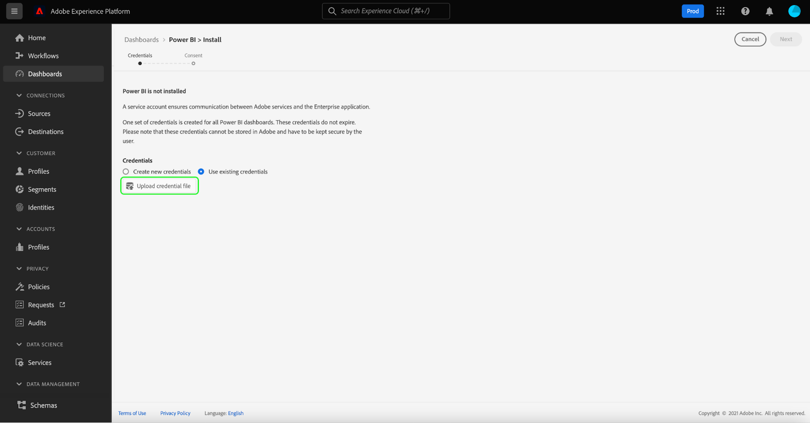

# Modelos de relatório do Power BI para painéis

O recurso de modelo de relatório Power BI permite criar relatórios atraentes preenchidos com dados do Adobe Experience Platform. O processo de instalação simplificado instala automaticamente widgets padrão para o Perfil do cliente em tempo real, segmentação e destinos. A instalação também conecta o Power BI aos seus modelos de dados para que você possa personalizar e estender facilmente seus modelos de relatório. Esses relatórios podem ser compartilhados em toda a organização sem que os recipients precisem de credenciais para a organização na plataforma.

Este documento fornece instruções sobre como conectar o Adobe Experience Platform ao aplicativo do Power BI e usar modelos de relatório para compartilhar insights de dados importantes da Platform com usuários externos.

## Introdução

Antes de continuar com este tutorial, é recomendável ter uma boa compreensão da [composição de esquema](../../xdm/schema/composition.md) em Experience Platform e de como os atributos são incluídos no Perfil do cliente em tempo real por meio do [esquema de união](../../xdm/schema/composition.md#union).

Para instalar a integração de aplicativos do Power BI, os usuários devem ter adquirido primeiro as seguintes permissões da Platform:

- Gerenciar consultas
- Gerenciar sandboxes

Para saber como atribuir essas permissões, leia a documentação do [controle de acesso](../../access-control/home.md).

Você também deve ter uma conta do Power BI para seguir este tutorial. Para criar uma conta, navegue até a [página inicial do Power BI](https://powerbi.microsoft.com/en-us/) e siga o processo de inscrição. Os usuários desta conta do Power BI também devem habilitar a configuração **Criar espaço de trabalho** em suas configurações do Power BI. Essa configuração é encontrada nas configurações de locatário do portal de administração do Power BI. Se sua conta for fornecida por seu locatário ou empregador, entre em contato com seu respectivo administrador para ativar essa configuração.

>[!NOTE]
>
>Para que a guia Painéis apareça na navegação à esquerda da interface do usuário da Platform e a visualização Inventário do painel fique visível, é necessário ter acesso a qualquer um dos painéis Perfil, Segmentação ou Destino como parte de sua licença da Platform.

## Instalar a integração de aplicativo do Power BI

Na interface da Platform, selecione **[!UICONTROL Painéis]** na navegação à esquerda para abrir o espaço de trabalho [!UICONTROL Painéis]. A guia [!UICONTROL Procurar] exibe uma lista de exibições de painel disponíveis no momento. Para saber mais sobre a exibição dos painéis disponíveis, consulte a [documentação do inventário](../inventory.md).

Em seguida, selecione a guia **[!UICONTROL Integrações]**. A página de integração de aplicativos do Power BI é exibida. Aqui, selecione **[!UICONTROL Instalar]** para iniciar a instalação.

>[!NOTE]
>
>O botão [!UICONTROL Instalar] está desabilitado, a menos que você tenha as permissões Gerenciar Serviço de Consulta e Gerenciar Sandboxes.

### Fornecer credenciais

A primeira etapa do processo de instalação é fornecer credenciais sem expiração para a integração de aplicativos do Power BI. Há duas opções disponíveis para fornecer estas: [[!UICONTROL Criar novas credenciais]](#create-new-credentials) ou [[!UICONTROL Usar credenciais existentes]](#use-existing-credentials). Selecione a opção apropriada para continuar.

#### Criar novas credenciais {#create-new-credentials}

Há dois campos obrigatórios ao gerar novas credenciais: [!UICONTROL Nome] e [!UICONTROL Atribuído a]. O campo [!UICONTROL Atribuído a] está relacionado ao endereço de email associado à sua conta do Power BI.

>[!IMPORTANT]
>
>A criação de credenciais sem expiração requer que você tenha determinadas permissões e funções atribuídas. As permissões necessárias são Gerenciar sandboxes e Gerenciar integração do serviço de consulta. As funções necessárias são de administrador e desenvolvedor do Adobe Experience Platform. Para saber como atribuir essas permissões, leia a documentação do [controle de acesso](../../access-control/home.md).

Para saber mais sobre como gerar credenciais do Serviço de Consulta sem expiração, consulte o [guia de credenciais sem expiração](../../query-service/ui/credentials.md#non-expiring-credentials).

Após gerar credenciais sem expiração pela primeira vez, um arquivo JSON é baixado para essa máquina. Esse arquivo JSON pode ser compartilhado com outros usuários como credenciais para concluir o processo de instalação.

#### Usar credenciais existentes {#use-existing-credentials}

Um arquivo de credencial JSON também pode ser carregado para passar na validação. Esses arquivos JSON que contêm valores de credencial sem expiração são baixados para o computador local que está sendo usado quando uma credencial sem expiração é criada.

>[!IMPORTANT]
>
>Para usar uma credencial existente sem expiração, o usuário já deve ter recebido uma credencial. Se o usuário não tiver uma credencial atribuída e não puder criar uma nova usando o Adobe Admin Console, ele não poderá continuar com o processo de instalação.

Selecione **[!UICONTROL Carregar arquivo de credencial]** e selecione o arquivo JSON apropriado para carregar na caixa de diálogo exibida.

Depois de fornecer as credenciais sem expiração, elas são validadas automaticamente pela Platform. Uma mensagem de confirmação é exibida assim que a validação é bem-sucedida. Selecione **[!UICONTROL Avançar]** para examinar o contrato de consentimento do aplicativo do Power BI.

### Dar consentimento

A tela de consentimento é exibida. Selecione **[!UICONTROL Revisar consentimento]** para abrir uma nova janela detalhando as permissões necessárias para que o Power BI acesse e use seus dados de acordo com os termos de serviço e a política de privacidade.

Selecione **[!UICONTROL Aceitar]** para conceder permissão ao Power BI para acessar e usar os dados da sua plataforma.

>[!NOTE]
>
>Se você sair do processo de instalação a qualquer momento antes de dar o consentimento, a integração de aplicativos do Power BI não será instalada no inventário de painéis.

Após fornecer o consentimento, o modelo de relatório é instalado automaticamente no ambiente do Power BI como parte do processo de instalação. Em seguida, o Power BI usa as credenciais sem expiração para acessar a Platform, executar sequencialmente todas as consultas SQL e preencher o modelo de relatório com os dados retornados.

Selecione **[!UICONTROL Concluir]** para retornar ao inventário do painel.

Agora que o modelo de relatório do Power BI está instalado, ele aparece na lista de painéis disponíveis na guia [!UICONTROL Procurar]. Selecione **[!UICONTROL Power BI]** na lista para navegar até o ambiente do Power BI.

>[!IMPORTANT]
>
>Os administradores do Power BI precisam verificar se os usuários têm as permissões de acesso apropriadas para visualizar esses painéis no ambiente do Power BI.

## espaço de trabalho do Power BI

Depois de fazer logon no [espaço de trabalho do Power BI](https://dxt.powerbi.com), os modelos de relatório ficam disponíveis para cada um dos serviços aos quais você tem acesso. Os modelos de relatório incluem perfis, segmentos e painéis de destinos **somente** se eles tiverem as permissões de exibição correspondentes.

Por padrão, os widgets padrão de perfis, segmentos e destinos estão disponíveis nos relatórios de modelo do Power BI.

>[!NOTE]
>
>Você deve ter permissões de edição ativadas para um determinado painel para permitir que esse painel seja instalado no ambiente do Power BI.

Após a instalação de um painel no Power BI, os modelos de relatório são exibidos para todos os usuários por padrão. Se quiser restringir o acesso a qualquer modelo de relatório, desative o acesso para os usuários em questão no ambiente do Power BI.

## Personalizar o modelo de relatório do Power BI

Com o uso de widgets personalizados, é possível adicionar atributos personalizados ao modelo de dados para enriquecer os modelos de relatório fornecidos pelo Power BI.

>[!NOTE]
>
>Os atributos que você pode usar para widgets personalizados dependem do que está disponível no esquema de união. Para saber como visualizar e explorar esquemas de união em benefício de seus widgets personalizados, consulte o [guia da interface do usuário de esquema de união](../../profile/ui/union-schema.md).

### Criar um widget personalizado

Widgets personalizados são criados por meio da Biblioteca de widgets. Consulte a [Visão geral da Biblioteca de Elementos](../customize/widget-library.md) para obter uma introdução ao recurso e o [tutorial para a criação de um elemento personalizado](../customize/custom-widgets.md) para obter instruções específicas.

>[!IMPORTANT]
>
>Os widgets personalizados recém-criados são **não** sincronizados automaticamente entre os painéis do Adobe Experience Platform e os modelos de relatório do Power BI. Todos os widgets personalizados criados na interface do usuário da Platform devem ser recriados manualmente no ambiente do Power BI.

### Recriar o widget personalizado no ambiente do Power BI

Depois que o painel tiver as métricas e os atributos apropriados contidos nos widgets personalizados, você estará pronto para modificar o modelo de relatório exibido no ambiente do Power BI. Consulte a [documentação do Power BI](https://docs.microsoft.com/en-us/power-bi/) para obter informações sobre como editar um relatório por meio de sua interface.

## Excluir a integração de aplicativos do Power BI

Para excluir o painel, navegue até o inventário do painel e selecione o ícone excluir () ao lado do nome do painel.

>[!NOTE]
>
>Somente o usuário que instalou o painel do Power BI pode excluir a integração da interface do usuário da Platform.

Um popover de confirmação é exibido. Selecione **[!UICONTROL Excluir]** para confirmar o processo.

>[!IMPORTANT]
>
>A exclusão do painel de Power BI da interface do usuário da Platform **não** exclui os modelos de relatório disponíveis em seu ambiente do Power BI. Se você quiser excluir completamente as informações contidas nos modelos de relatório do Power BI, será necessário fazer logon na sua conta do Power BI e excluir os modelos de relatório desse ambiente. Depois de excluído, um usuário pode reinstalar o painel do Power BI seguindo as mesmas instruções de instalação descritas acima.

## Próximas etapas

Ao ler este documento, você entende melhor como os modelos de relatório do Power BI podem ser integrados à Platform para compartilhar insights de dados atraentes de seus perfis, segmentos ou painéis de destinos. Consulte a [visão geral de personalização do painel](../customize/overview.md) para saber mais sobre como personalizar seus painéis.
