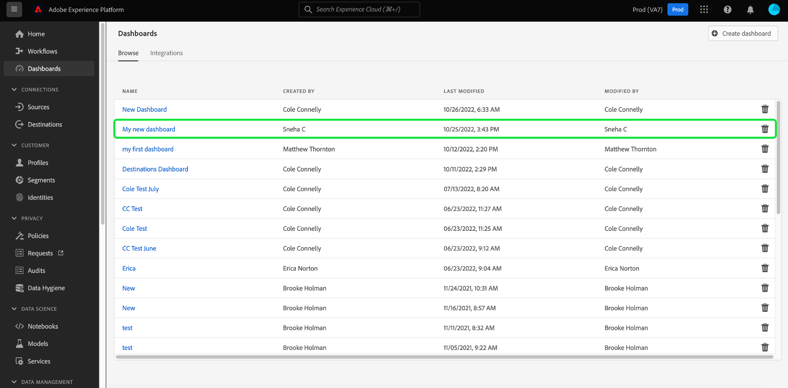

# Exibir painéis configurados

Se sua organização tiver vários painéis disponíveis no Adobe Experience Platform, você poderá revisar esses painéis na interface do usuário (UI).

Para exibir os painéis configurados por sua organização, selecione **[!UICONTROL Painéis]** na navegação à esquerda e selecione o **[!UICONTROL Procurar]** guia .

Uma lista de todos os painéis disponíveis na sua instância da plataforma é exibida na guia [!UICONTROL Procurar] guia . Isso inclui painéis integrados criados pela sua organização que foram configurados por meio de aplicativos de terceiros.

Você pode visualizar um painel individual selecionando o nome do painel na lista.

Quando selecionado, o painel é aberto na interface do usuário da plataforma ou em um espaço de trabalho de aplicativo totalmente integrado que requer que você faça logon usando as credenciais necessárias.
