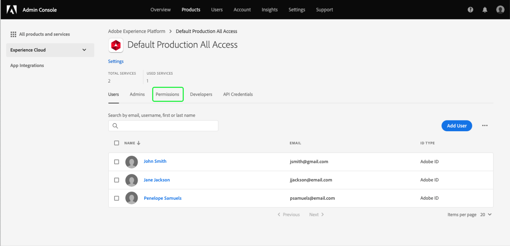

# Permissões de acesso para painéis

Para conceder aos usuários a capacidade de exibir, editar e atualizar painéis, primeiro você deve ativar permissões. No Adobe Experience Platform, o controle de acesso é fornecido por meio da Adobe Admin Console. Essa funcionalidade utiliza perfis de produto no [!DNL Admin Console], que vincula usuários com permissões e sandboxes.

Este documento fornece um resumo de como fornecer acesso a permissões de painel específicas no Admin Console. Para obter informações detalhadas sobre obter e atribuir permissões de acesso, comece lendo a [visão geral do controle de acesso](../access-control/home.md).

>[!NOTE]
>
>Para configurar o controle de acesso para [!DNL Experience Platform], você deve ter privilégios de administrador para uma organização que tenha uma integração de produto [!DNL Experience Platform]. Consulte o artigo do Adobe Help Center sobre [funções administrativas](https://helpx.adobe.com/enterprise/using/admin-roles.html) para obter mais informações.

## Permissões disponíveis {#available-permissions}

Há duas permissões principais que são necessárias para acessar painéis no Experience Platform. Essas permissões são:

* **Exibir painel** de uso de licença: Essa permissão permite que os usuários acessem somente leitura o painel de uso da licença na interface do usuário do Experience Platform.
* **Gerenciar painéis** padrão: Essa permissão permite que os usuários adicionem atributos personalizados que ainda não estão no data warehouse.

As etapas a seguir mostrarão como adicionar essas permissões usando o Admin Console.

## Selecionar perfis de produto

Para conceder aos usuários acesso aos painéis no Experience Platform, comece fazendo logon no [Adobe Admin Console](https://adminconsole.adobe.com) e selecionando **Produtos** no início da navegação.

Selecione **Adobe Experience Platform** na lista suspensa Experience Cloud na navegação à esquerda ou nos cartões listados em *Todos os produtos e serviços*. Na página do produto Adobe Experience Platform, selecione o perfil de produto ao qual deseja adicionar as permissões de painel ou selecione **Novo perfil** para criar um novo perfil de produto.

O perfil de produto selecionado é aberto, mostrando os usuários associados a esse perfil de produto. Para gerenciar as permissões do perfil do produto, selecione **Permissões**.

## Adicionar/editar permissões

A guia **Permissões** exibe todas as permissões disponíveis para o perfil do produto. Localize a linha **Painéis** e observe que atualmente diz &quot;0 de 2 incluídos&quot;, ou seja, não há permissões de painel habilitadas para o perfil do produto.

Para editar as permissões do painel, selecione **Editar** na linha do painel.

A caixa de diálogo **Editar Permissões** é aberta, mostrando itens de permissão disponíveis e itens de permissão incluídos. Você pode selecionar o sinal de mais (`+`) ao lado da permissão para adicioná-lo ou selecionar **+ Adicionar tudo** para adicionar todas as permissões de uma só vez.

Para obter descrições das permissões, consulte a seção [permissões disponíveis](#available-permissions) anteriormente neste documento.

>[!NOTE]
>
>Não é necessário habilitar todas as permissões para todos os usuários. Dependendo da estrutura de sua organização, talvez você queira criar perfis de produto separados para determinados usuários e conceder acesso limitado (como somente leitura).

Após adicionar as permissões, selecione **Save** para retornar ao perfil de produto.

Ao retornar ao perfil do produto, é possível verificar se as permissões foram adicionadas confirmando que a linha **Painéis** mostra &quot;2 de 2 incluídos&quot;.

## Próximas etapas

Agora que você adicionou permissões de acesso aos painéis, os usuários em sua organização podem começar a visualizar painéis na interface do usuário do Experience Platform e executar outras ações com base nas permissões atribuídas.