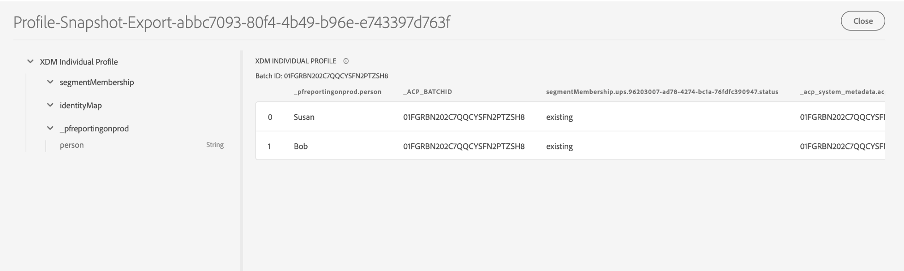

# Explorar, verificar e processar conjuntos de dados de painéis usando o Serviço de query

A Adobe Experience Platform fornece informações importantes sobre o perfil, o segmento e os dados de destinos de sua organização por meio de painéis disponíveis na interface do usuário do Experience Platform. Em seguida, você pode usar o Serviço de query da Adobe Experience Platform para explorar, verificar e processar os conjuntos de dados brutos que alimentam esses painéis no lago de dados.

## Introdução ao Serviço de query

O Adobe Experience Platform Query Service oferece suporte aos profissionais de marketing para obter insights de seus dados, permitindo o uso do SQL padrão para consultar dados no lago de dados. O Serviço de query oferece uma interface de usuário e uma API que pode ser usada para unir qualquer conjunto de dados no lago de dados e capturar os resultados da query como novos conjuntos de dados para uso em relatórios, aprendizado de máquina ou para assimilação no Perfil do cliente em tempo real.

Para saber mais sobre o Serviço de query e sua função no Experience Platform, comece lendo a [Visão geral do Serviço de query](../query-service/home.md).

## Conjuntos de dados disponíveis

Você pode usar o Serviço de query para consultar conjuntos de dados brutos para painéis de perfil, segmento e destinos. As seções a seguir descrevem os conjuntos de dados brutos que podem ser encontrados no lago de dados.

### Conjuntos de dados do atributo de perfil

Os insights do painel de perfis são vinculados às políticas de mesclagem que foram definidas pela sua organização. Para cada política de mesclagem ativa, há um conjunto de dados de atributo de perfil disponível no lago de dados.

A convenção de nomenclatura desses conjuntos de dados é **Profile-Snapshot-Export** seguida de um valor alfanumérico aleatório gerado pelo sistema. Por exemplo: `Profile-Snapshot-Export-abbc7093-80f4-4b49-b96e-e743397d763f`.

Para entender o esquema completo de cada conjunto de dados de exportação de instantâneo de perfil, você pode visualizar e explorar os conjuntos de dados [usando o visualizador de conjunto de dados](../catalog/datasets/user-guide.md) na interface do usuário do Experience Platform.



#### Mapeamento de conjuntos de dados de atributos de perfil para mesclar IDs de política

Cada conjunto de dados de atributo de perfil é intitulado **Exportação de Instantâneo de Perfil** seguido por um valor alfanumérico aleatório gerado pelo sistema. Por exemplo: `Profile-Snapshot-Export-abbc7093-80f4-4b49-b96e-e743397d763f`.

Esse valor alfanumérico é uma sequência de caracteres aleatória gerada pelo sistema que mapeia para uma ID de política de mesclagem de uma das políticas de mesclagem criadas pela organização. O mapeamento de cada ID de política de mesclagem para sua string de conjunto de dados de atributo de perfil relacionada é mantido no conjunto de dados `adwh_dim_merge_policies`.

O conjunto de dados `adwh_dim_merge_policies` contém os seguintes campos:

* `merge_policy_name`
* `merge_policy_id`
* `merge_policy`
* `dataset_id`

Esse conjunto de dados pode ser explorado usando a interface do Editor de consultas no Experience Platform. Para saber mais sobre como usar o Editor de consultas, consulte o [Guia da interface do usuário do Editor de consultas](../query-service/ui/user-guide.md).

### Conjunto de dados de metadados do segmento

Há um conjunto de dados de metadados de segmento disponível no lago de dados que contém metadados para cada um dos segmentos da organização.

A convenção de nomenclatura desse conjunto de dados é **Segmentdefinition-Snapshot-Export** seguida de um valor alfanumérico. Por exemplo: `Segmentdefinition-Snapshot-Export-acf28952-2b6c-47ed-8f7f-016ac3c6b4e7`

Para entender o esquema completo de cada conjunto de dados de exportação de instantâneo de definição de segmento, você pode visualizar e explorar os conjuntos de dados [usando o visualizador de conjunto de dados](../catalog/datasets/user-guide.md) na interface do usuário do Experience Platform.


### Conjunto de dados de metadados de destino

Os metadados para todos os destinos ativados de sua organização estão disponíveis como um conjunto de dados bruto no lago de dados.

A convenção de nomenclatura desse conjunto de dados é **DIM_Destination**.

Para entender o esquema completo do conjunto de dados de destino DIM, você pode visualizar e explorar o conjunto de dados [usando o visualizador de conjunto de dados](../catalog/datasets/user-guide.md) na interface do usuário do Experience Platform.


## Exemplo de consultas

As consultas de exemplo a seguir incluem amostras de SQL que podem ser usadas no Serviço de query para explorar, verificar e processar os conjuntos de dados brutos que alimentam seus painéis.

### Contagem de perfis por identidade

Esse insight de perfil fornece um detalhamento de identidades em todos os perfis mesclados no conjunto de dados.

>[!NOTE]
>
>O número total de perfis por identidade (em outras palavras, adicionar os valores mostrados para cada namespace) pode ser maior que o número total de perfis mesclados, pois um perfil pode ter vários namespaces associados a ele. Por exemplo, se um cliente interagir com sua marca em mais de um canal, vários namespaces serão associados a esse cliente individual.

**Query**

```sql
Select
        Key namespace,
        count(1) count_of_profiles
     from
        (
           Select
               explode(identitymap)
           from
              Profile-Snapshot-Export-abbc7093-80f4-4b49-b96e-e743397d763f
        )
     group by
        namespace;
```

### Contagem de perfis por segmento

Esse insight de público-alvo fornece o número total de perfis mesclados em cada segmento no conjunto de dados. Esse número é o resultado da aplicação da política de mesclagem de segmentos aos seus dados de Perfil para unir fragmentos de perfil para formar um único perfil para cada indivíduo no segmento.

```sql
Select          
        concat_ws('-', key, source_namespace) segment_id,
        count(1) count_of_profiles
      from
        (
            Select
              Upper(key) as source_namespace,
              explode(value)
            from
              (
                  Select
                    explode(Segmentmembership)
                  from
                    Profile-Snapshot-Export-abbc7093-80f4-4b49-b96e-e743397d763f
              )
        )
      group by
      segment_id
```

## Próximas etapas

Ao ler este guia, agora você pode usar o Serviço de query para realizar várias consultas para explorar e processar os conjuntos de dados brutos que alimentam seus painéis de perfil, segmento e destinos.

Para saber mais sobre cada painel e suas métricas, selecione um painel na lista de painéis disponíveis na navegação da documentação.
