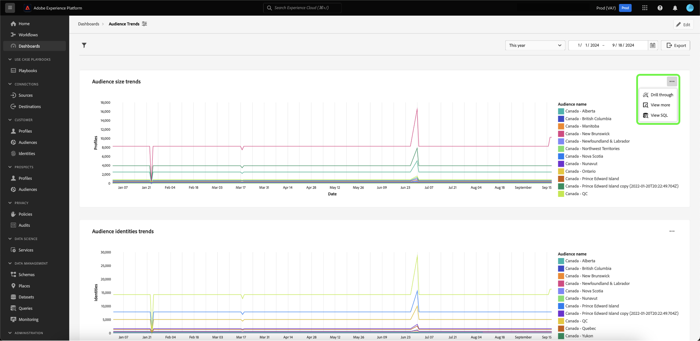
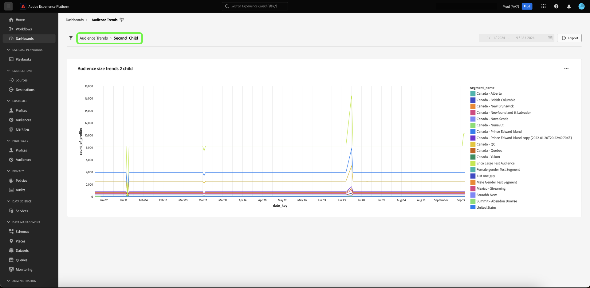

# Drill-through {#drill-through}

Os drill-throughs facilitam a análise de dados em várias camadas, simplificando a navegação de qualquer gráfico para um novo painel. Esse recurso facilita a transição de visões gerais de alto nível para relatórios detalhados ao estudar tendências, comportamento do cliente, indicadores operacionais e muito mais, garantindo que você sempre tenha o contexto necessário.

O sistema garante que a análise que você inicia continue perfeitamente durante toda a experiência de drill-through, transmitindo automaticamente filtros globais e filtros de intervalo de datas dos painéis de origem para os painéis de destino. Para facilitar a navegação entre várias camadas do estudo, o sistema permite drill-throughs de vários níveis.

## Criar um drill-through {#create-drill-through}

Para criar um drill-through, primeiro selecione **[!UICONTROL Editar]** no modo de exibição de painel.

Selecione as reticências no gráfico que você deseja detalhar e selecione **[!UICONTROL Editar]**.

No painel [!UICONTROL Propriedades], use o botão de alternância para habilitar **[!UICONTROL Habilitar drill-through]** e use o menu suspenso para selecionar o **[!UICONTROL Painel de destino]**. Certifique-se de que a opção de **[!UICONTROL Passagem de filtro]** esteja habilitada e selecione **[!UICONTROL Salvar e fechar]**.

>[!INFO]
>
>Repita as etapas destacadas acima para o painel de destino para configurar um drill-through de vários níveis.

## Exibir um drill-through {#view-drill-through}

Para exibir um drill-through, selecione reticências no gráfico na exibição de painel e selecione **[!UICONTROL Drill-through]**.

O painel de destino de drill-through é exibido. Você pode repetir essa etapa se tiver drill-throughs de vários níveis.

>[!NOTE]
>
>Quaisquer filtros aplicados no painel de origem são passados para o painel de destino. No entanto, os filtros de data e os filtros globais são desativados nos painéis secundários.

## Remover um drill-through {#remove-drill-through}

Para remover um drill-through, primeiro selecione **[!UICONTROL Editar]** no modo de exibição de painel.

Selecione as reticências no gráfico que você deseja remover um drill-through e selecione **[!UICONTROL Editar]**.

No painel [!UICONTROL Propriedades], selecione a opção para desabilitar o **[!UICONTROL Habilitar drill-through]** e selecione **[!UICONTROL Salvar e fechar]**.

Painel de propriedades do ![gráfico com a alternância desabilitada para [!UICONTROL Habilitar drill-through] realçada.](../images/sql-insights-query-pro-mode/drill-through-disable.png)

## Próximas etapas

Depois de ler este documento, agora você sabe como criar um drill-through para seu painel. Você também pode aprender a gerar gráficos a partir de modelos de dados existentes na interface do usuário do Adobe Experience Platform com o [guia de modo de design guiado](../standard-dashboards.md).
