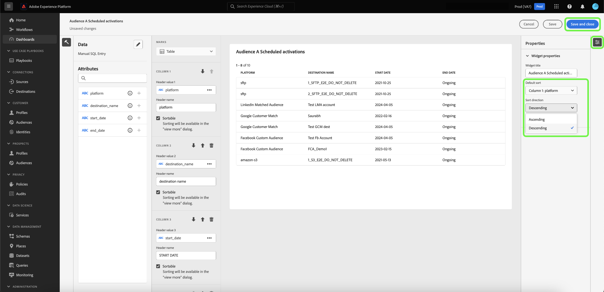
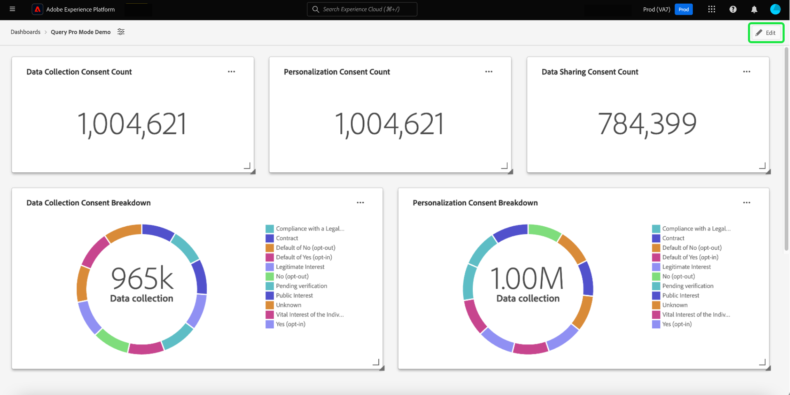

# SQL Insights para relatórios estendidos do aplicativo

Use consultas SQL personalizadas para extrair insights de diversos conjuntos de dados estruturados com eficiência. Os técnicos podem usar o modo query pro para executar análises complexas com SQL e, em seguida, compartilhar essa análise com usuários não técnicos por meio de gráficos em seu painel personalizado ou exportá-los em arquivos CSV. Esse método de criação de insight é adequado para tabelas com relações claras e permite um maior grau de personalização em seus insights e filtros que podem se adequar a casos de uso de nicho.

>[!IMPORTANT]
>
>O modo pro de consulta só está disponível para usuários que compraram a [SKU do Data Distiller](../../query-service/data-distiller/overview.md).

Para gerar insights do SQL, primeiro você deve criar um painel.

## Criar um painel personalizado {#create-custom-dashboard}

Para criar um painel personalizado, selecione **[!UICONTROL Dashboards]** no painel de navegação esquerdo para abrir o espaço de trabalho Painéis. Em seguida, selecione **[!UICONTROL Create dashboard]**.

A caixa de diálogo **[!UICONTROL Create dashboard]** é exibida. Há duas opções para escolher o método de criação de painel. Para criar seus insights, você pode usar um modelo de dados existente com o [[!UICONTROL Guided design mode]](../standard-dashboards.md) ou seu próprio SQL com o [!UICONTROL Query pro mode].

<!-- Maybe reference Guided design mode in other places on UDD doc. -->

O uso de um modelo de dados existente tem os benefícios de fornecer uma estrutura estruturada, eficiente e escalável personalizada para suas necessidades comerciais específicas. Para saber como [criar insights de um modelo de dados existente](../standard-dashboards.md#create-widget), consulte o guia do painel personalizado.

Os insights gerados a partir de consultas SQL oferecem muito mais flexibilidade e personalização. Os técnicos podem usar o modo query pro para realizar análises complexas no SQL e, em seguida, compartilhar essa análise com usuários não técnicos por meio desse recurso do painel. Selecione **[!UICONTROL Query pro mode]** seguido por **[!UICONTROL Save]**.

>[!NOTE]
>
>Depois de fazer uma seleção, não é possível alterar essa seleção nesse painel. Em vez disso, você deve criar um novo painel com um método de criação de painel diferente.

![A caixa de diálogo [!UICONTROL Create dashboard] com o modo Pro de Consulta e Salvar está realçada.](../images/sql-insights-query-pro-mode/query-pro-mode.png)

## Visão geral do modo Query pro {#query-pro-mode}

O modo profissional de consulta é um fluxo de trabalho baseado no editor SQL que orienta você pelo processo de geração de insights com consultas SQL personalizadas na interface do Adobe Experience Platform. Antes de gerar insights com consultas SQL personalizadas, primeiro crie um painel.

## Compor SQL {#compose-sql}

Depois de criar um painel com o modo query pro, a caixa de diálogo **[!UICONTROL Enter SQL]** é exibida. Selecione um banco de dados (modelo de dados do insights) para consultar no menu suspenso e insira uma consulta adequada para seu conjunto de dados no editor do query pro.

>[!NOTE]
>
>O modo Query pro está disponível somente para usuários que compraram o SKU do Data Distiller. O [[!UICONTROL Guided design mode]](../standard-dashboards.md) está disponível a todos os usuários para criar insights de um modelo de dados existente.

Consulte o [Guia do usuário do Editor de Consultas](../../query-service/ui/user-guide.md#query-authoring) para obter informações sobre seus elementos de interface.

![A caixa de diálogo [!UICONTROL Enter SQL] com o menu suspenso do conjunto de dados e o ícone de execução está realçada. A caixa de diálogo tem uma consulta SQL preenchida e a guia de parâmetros de consulta é exibida.](../images/sql-insights-query-pro-mode/enter-sql-database-dropdown.png)

### Parâmetros de consulta {#query-parameters}

Para incluir [filtros globais](./filters/global-filter.md) ou [filtros de data](./filters/date-filter.md), sua consulta **deve** usar parâmetros de consulta. Ao compor sua instrução no modo query pro, você deve fornecer valores de amostra se sua consulta usar parâmetros de consulta. Os valores de amostra permitem executar a instrução SQL e criar o gráfico. Observe que os valores de amostra fornecidos ao compor a instrução são substituídos pelos valores reais selecionados para o filtro de data ou global no tempo de execução.

>[!IMPORTANT]
>
>Se quiser usar um filtro global, você deve colocar um parâmetro de consulta em seu SQL e, em seguida, vincular esse parâmetro de consulta ao filtro global no compositor de widgets. Na captura de tela abaixo, `CONSENT_VALUE_FILTER` é usado no SQL como um parâmetro de consulta para um filtro global. Consulte a [documentação do filtro global](./filters/global-filter.md#enable-global-filter) para obter mais informações sobre como fazer isso.

Para executar a consulta, selecione o ícone executar (). O Editor de consultas exibe a guia resultados. Em seguida, para confirmar sua configuração e abrir o widget composer, selecione **[!UICONTROL Select]**.

>[!TIP]
>
>Se sua consulta usa parâmetros de consulta, execute a consulta uma vez para preencher previamente todas as chaves de parâmetros de consulta usadas. A consulta falhará, mas a interface do usuário exibirá automaticamente a guia Parâmetros de consulta e listará todas as chaves incluídas. Adicione os valores apropriados para suas chaves.

![A caixa de diálogo [!UICONTROL Enter SQL] com entrada SQL, a guia de resultados exibida e Selecionar realçado.](../images/sql-insights-query-pro-mode/enter-sql-select.png)

## Preencher widget {#populate-widget}

O widget composer agora é preenchido com as colunas do SQL executado. O tipo de painel é indicado no canto superior esquerdo, neste caso é [!UICONTROL Manual SQL Entry]. Selecione o ícone de lápis () para editar o SQL a qualquer momento.

>[!TIP]
>
>Os atributos disponíveis são colunas retiradas do SQL executado.

Para criar o widget, use os atributos listados na coluna [!UICONTROL Attributes]. Você pode usar a barra de pesquisa para procurar atributos ou rolar a lista.

### Adicionar atributos {#add-attributes}

Para adicionar um atributo ao seu widget, selecione o ícone de adição () ao lado de um nome de atributo. O menu suspenso exibido permite adicionar um atributo ao gráfico a partir das opções determinadas pelo seu SQL. Tipos de gráficos diferentes têm opções diferentes, como uma lista suspensa dos eixos X e Y.

Neste exemplo de gráfico de rosca, as opções são tamanho e cor. A cor detalha os resultados do gráfico de rosca e o tamanho é a métrica real usada. Adicione um atributo ao campo [!UICONTROL Color] para dividir os resultados em cores diferentes com base na composição desse atributo.

>[!TIP]
>
>Selecione o ícone de seta para cima e para baixo () para alternar a disposição dos eixos X e Y em gráficos de barras ou de linhas.

Para alterar o tipo de gráfico do seu widget, selecione uma das opções disponíveis na lista suspensa [!UICONTROL Marks]. As opções incluem [!UICONTROL Line], [!UICONTROL Donut], [!UICONTROL Big number] e [!UICONTROL Bar]. Uma vez selecionado, uma visualização prévia das configurações atuais do seu widget é gerada.

## Atributos de tabela avançados {#advanced-attributes}

Para aplicar recursos de classificação automática a qualquer ou todas as colunas das tabelas, selecione **[!UICONTROL Edit]** para editar todo o painel.

Selecione as reticências (`...`) no gráfico de tabela ao qual você deseja adicionar a classificação de coluna e selecione **[!UICONTROL Edit]**.

Para habilitar a classificação de qualquer coluna, marque as caixas **[!UICONTROL Sortable]**.

Selecione o ícone de propriedades () no painel direito para abrir o painel [!UICONTROL Properties]. No painel **[!UICONTROL Properties]**, use o menu suspenso para selecionar a coluna **[!UICONTROL Default sort]** e, em seguida, use o menu suspenso para selecionar a **[!UICONTROL Sort direction]**. Finalmente, selecione **[!UICONTROL Save and close]**.

Para saber mais sobre como usar os recursos de classificação, redimensionamento de colunas e paginação, consulte [Exibir mais](./view-more.md).

## Propriedades do dispositivo {#properties}

Selecione o ícone de propriedades () no painel direito para abrir o painel de propriedades. No painel [!UICONTROL Properties], insira um nome para o widget no campo de texto **[!UICONTROL Widget title]**. Também é possível renomear vários aspectos do gráfico.

>[!NOTE]
>
>Os campos específicos disponíveis na barra lateral de propriedades variam de acordo com o tipo de gráfico que você está editando.

## Salve o widget {#save-widget}

Salvar no widget composer salva o widget localmente no painel. Para salvar seu trabalho e continuar mais tarde, selecione **[!UICONTROL Save]**. Um ícone de marca de verificação abaixo do nome do widget indica que o widget foi salvo. Como alternativa, quando você estiver satisfeito com o seu widget, selecione **[!UICONTROL Save and close]** para disponibilizá-lo para todos os outros usuários com acesso ao seu painel. Selecione Cancelar para abandonar o trabalho e retornar ao painel personalizado.

## Editar seu painel e gráficos {#edit}

Selecione **[!UICONTROL Edit]** para editar todo o painel ou qualquer um dos seus insights. No modo de edição, você pode redimensionar widgets, editar o SQL ou criar e aplicar filtros globais e temporais. Esses filtros restringem os dados exibidos nos widgets do painel. É uma maneira conveniente de atualizar e ajustar rapidamente seus insights para casos de uso diferentes.

Selecione **[!UICONTROL Add filter]** para criar um [[!UICONTROL Date filter]](#create-date-filter) ou um [[!UICONTROL Global filter]](#create-global-filter). Depois de criado, todos os filtros globais e de data estarão disponíveis no [ícone de filtro](#select-global-filter) () do seu painel.

## Editar, duplicar ou excluir uma insight

Consulte o guia Painel Personalizado para obter instruções sobre como [editar, duplicar ou excluir um widget existente](../standard-dashboards.md#duplicate).

## Próximas etapas

Depois de ler este documento, agora você sabe como gravar consultas SQL na interface do usuário do Adobe Experience Platform para gerar gráficos para seus painéis personalizados. Em seguida, saiba como enriquecer ainda mais seus dados [criando um filtro de datas](./filters/date-filter.md) ou [criando um filtro global](./filters/global-filter.md).

Você também pode saber mais sobre outros recursos de Insights Personalizados, incluindo [as diferentes opções de exibição para seus dados analisados por SQL](./view-more.md) ou como [exibir o SQL por trás de seus insights personalizados](./view-sql.md).
