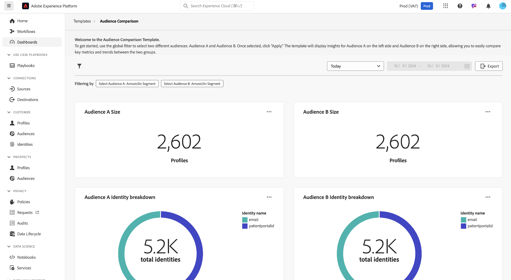

# Comparação de públicos-alvo

O painel [!UICONTROL Comparação de público-alvo] compara e contrasta as métricas principais de público-alvo em uma exibição lado a lado. Nesse painel, você pode executar várias ações para comparar dois grupos de públicos-alvo e analisar as métricas principais entre eles. Em seguida, você pode tomar decisões orientadas por dados em relação à segmentação de público e às estratégias de direcionamento.

## Definir comparações de público {#set-audience-comparisons}

Para permitir insights e comparações mais significativos, use os filtros do sistema para direcionar com precisão os segmentos de público-alvo e o período que você está interessado em analisar. Selecione o ícone de filtro () para escolher dois públicos diferentes ([!UICONTROL Público-alvo A] e [!UICONTROL Público-alvo B]) e definir parâmetros específicos para comparação.

A caixa de diálogo [!UICONTROL Filtro] é exibida. Para escolher o primeiro público a ser analisado, selecione a lista suspensa **[!UICONTROL Selecionar público-alvo a]**. Neste exemplo, `California Patients` foi selecionado como Público-alvo A. Esse público-alvo é exibido no lado esquerdo da comparação depois que o filtro é aplicado.

Em seguida, escolha um segundo público-alvo a ser comparado a [!UICONTROL Público-alvo A] na lista suspensa **[!UICONTROL Selecionar público-alvo B]**. Nesta imagem, [!UICONTROL Usuários Consentidos com Email] foi selecionado como [!UICONTROL Público-alvo]. Este público é exibido no lado direito do painel [!UICONTROL Comparação de públicos-alvo] depois que o filtro é aplicado.

### Ajustar intervalos de datas {#adjust-date-ranges}

Você também pode filtrar seus dados por períodos específicos para ver como esses públicos-alvo se comportam ou se alteram em um intervalo de datas personalizado. Para definir um intervalo de tempo para filtrar os dados do público-alvo por um período específico, selecione as datas de início e término nos campos de calendário.

A caixa de diálogo também indica quantos filtros são aplicados (na captura de tela abaixo, dois filtros estão sendo usados: Público-alvo A e Público-alvo B e hoje como um intervalo de datas). Para remover todos os filtros aplicados, selecione **[!UICONTROL Limpar tudo]**.

Depois de definir os públicos-alvo e o intervalo de datas, selecione **[!UICONTROL Aplicar]** para atualizar o painel [!UICONTROL Comparação de públicos-alvo].

O painel agora mostra os gráficos comparativos exibidos lado a lado para cada público-alvo.

## Gráficos de comparação de público-alvo disponíveis {#available-charts}

<!-- Potentially could expand this section to include images of each widget.  -->

O painel fornece vários gráficos para comparar insights:

- [[!UICONTROL Tamanho do público]](../../guides/audiences.md#audience-size): rastreie facilmente o tamanho de cada público com base no número de perfis que eles contêm. Essa métrica ajuda você a entender a escala dos dois públicos-alvo que estão sendo comparados.
- [!UICONTROL Detalhamento da identidade do público-alvo]: um gráfico de pizza fornece um detalhamento da composição relativa das identidades em cada público-alvo. Você pode visualizar o número total de identidades e examinar como diferentes identificadores (como email ou ID de CRM) contribuem para esse total. Este gráfico ajuda você a entender a composição de cada público com base nos tipos de identidade. Passe o mouse sobre uma seção do gráfico de pizza para ver um número exato de identidades.
- [[!UICONTROL Tendência de tamanho do público-alvo]](../../guides/audiences.md#audience-size-trend): este gráfico representa as tendências de tamanho ao longo do tempo para o público-alvo escolhido. Use esses gráficos para visualizar como o tamanho de cada público foi alterado em um período selecionado, com picos e depressões indicando períodos de crescimento ou redução no número de perfis.
- [[!UICONTROL Tendência de alteração de tamanho do público-alvo]](../../guides/audiences.md#audience-size-change-trend): este gráfico exibe as tendências de alteração de tamanho para o público-alvo escolhido. Ele visualiza quanto o tamanho do público-alvo aumentou ou diminuiu ao longo do tempo e permite identificar mudanças ou tendências significativas na população do público-alvo.

>[!NOTE]
>
>Os gráficos [!UICONTROL Tendência de tamanho do público] e [!UICONTROL Tendência de alteração de tamanho do público] ajudam a rastrear e comparar o tamanho absoluto e as flutuações de tamanho entre dois públicos em um período especificado. Essas informações facilitam a compreensão dos padrões e fatores que influenciam as alterações no público-alvo.

## Exportar insights {#export-insights}

Depois de aplicar filtros e analisar os públicos, é possível exportar os dados para fins de análise offline e relatórios. Para exportar seus insights, selecione **[!UICONTROL Exportar]** na parte superior direita da tabela. A caixa de diálogo PDF de impressão é exibida. Nessa caixa de diálogo, é possível salvar como um PDF ou imprimir os dados mostrados na tabela.

Selecione **[!UICONTROL Modelos]** para retornar à visão geral do [!UICONTROL Modelo].

## Próximas etapas

Depois de ler este documento, você aprendeu a comparar as métricas principais entre diferentes grupos de público-alvo usando o painel **Comparação de público-alvo**. Para continuar melhorando sua segmentação de público e as estratégias de direcionamento, explore outros Modelos de Distiller de dados que fornecem insights adicionais. Consulte os guias da interface [Tendências de público-alvo](./trends.md), [Sobreposições de identidade de público-alvo](./identity-overlaps.md) e [Sobreposições de público-alvo avançadas](./overlaps.md) para aprimorar ainda mais suas tomadas de decisão e otimizar os esforços de engajamento.

