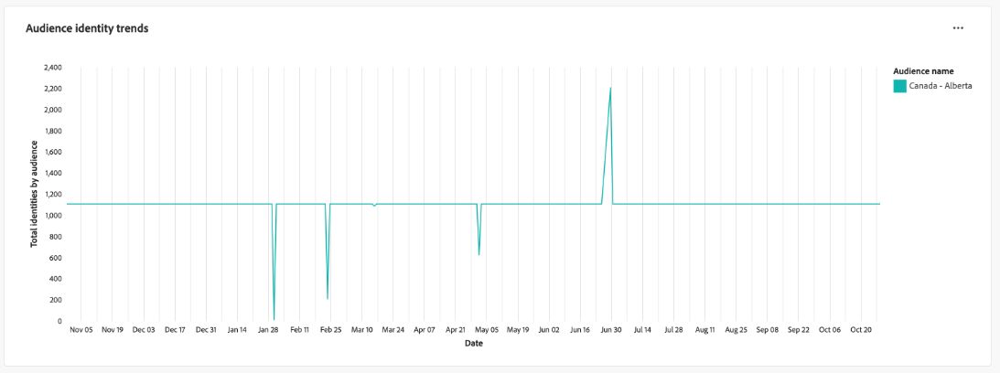

# Sobreposições de identidade de público-alvo

Analise as sobreposições de identidade para os públicos-alvo selecionados com o painel [!UICONTROL Sobreposições de identidade de público-alvo]. Você pode usar insights sobre como as diferentes identidades em um público-alvo se relacionam entre si para otimizar as estratégias de compilação, reduzir a redundância e melhorar a precisão da segmentação do cliente. Desenvolva estratégias eficazes de direcionamento e simplifique as interações com o cliente, com uma melhor compreensão da sobreposição entre os tipos de identidade.

## Filtragem de públicos {#filter-audiences}

Use filtros personalizados para a análise direcionada de públicos-alvo e tipos de identidade específicos para garantir que os dados apresentados estejam alinhados às suas metas de análise. Para iniciar a análise, selecione o ícone de filtro ().

A caixa de diálogo **[!UICONTROL Filtros]** é exibida. Nessa exibição, escolha os filtros globais para configurar o público-alvo, a política de mesclagem e as identidades para comparação. Selecione suas configurações para análise no menu suspenso de cada seção

1. Selecione um **[!UICONTROL Público-alvo]**: escolha o segmento de público-alvo que você deseja analisar (por exemplo, **Canadá - Alberta**).
2. Especifique uma **[!UICONTROL Política de mesclagem]**: defina a política de mesclagem que determina como as identidades são combinadas entre o público selecionado (na captura de tela de exemplo, a política **Baseado em tempo padrão** é selecionada).
3. Selecione uma **[!UICONTROL Identidade A]** e uma **[!UICONTROL Identidade B]** para comparação**: escolha os dois tipos de identidade a serem comparados. No exemplo, a **Identidade A** está selecionada como &quot;crmId&quot; e a **Identidade B** está selecionada como &quot;email&quot;.
4. **Definir um intervalo de datas**: escolha um intervalo predefinido como &quot;Hoje&quot; ou defina manualmente as datas de início e término usando os campos de calendário.

>[!TIP]
>
>Para limpar todos os filtros globais personalizados, selecione **[!UICONTROL Limpar tudo]** na caixa de diálogo [!UICONTROL Filtros]. Para remover um único filtro, selecione &#39;[!UICONTROL X]&#39; à direita do nome do filtro.

Depois de escolher os filtros, selecione **[!UICONTROL Aplicar]** para atualizar o painel.

## Insights do painel disponíveis {#available-insights}

O painel **Sobreposições de identidade de público-alvo** fornece várias visualizações e dados tabulados para ajudar você a entender as sobreposições de identidade e tendências no seu público-alvo.

### Sobreposições de identidades do público-alvo {#overlaps-table}

A tabela **[!UICONTROL Sobreposições de identidade de público-alvo]** exibe sobreposições de identidade com base nos filtros selecionados. Use essas informações para avaliar a sobreposição entre os diferentes tipos de identidade e entender com que eficiência as identidades estão sendo resolvidas. A tabela abaixo explica em detalhes cada coluna:

| Nome da coluna | Descrição |
|-----------------|-------------------------------|
| **[!UICONTROL Nome do público-alvo]** | O nome do público que está sendo analisado. Essa coluna identifica qual segmento de público-alvo está sendo revisado para garantir que os insights estejam focados no grupo-alvo pretendido. |
| **[!UICONTROL Identidade A]** e **[!UICONTROL Identidade B]** | As identidades sendo comparadas (por exemplo, `crmId` e `email`). Saber quais tipos de identidade estão sendo comparados ajuda a identificar quais estratégias de resolução de identidade contribuem para a sobreposição de público-alvo e otimizam esses relacionamentos. |
| **[!UICONTROL Contagem de sobreposições]** | A contagem de perfis em que ambas as identidades estão presentes. Essa métrica fornece insights sobre a extensão da sobreposição de identidade no público-alvo. Essas informações são cruciais para avaliar com que eficiência várias identidades estão sendo resolvidas em perfis unificados, que, por sua vez, podem melhorar as estratégias de direcionamento e personalização. |
| **[!UICONTROL Contagem de Identidades A]** | O número total de perfis no público selecionado que contêm **Identidade A**. Use essas informações para entender a prevalência do tipo de identidade principal no público-alvo e avaliar sua função na análise de sobreposição. |

### Detalhamento de identidade {#identity-breakdown}

O gráfico **[!UICONTROL Detalhamento de Identidade]** mostra a composição relativa de identidades dentro do público-alvo selecionado. O eixo X representa o número total de identidades no público selecionado, enquanto o eixo Y representa o nome do público que está sendo analisado. Use essa visualização para entender a prevalência de cada tipo de identidade e avaliar o impacto de sua estratégia de gerenciamento de identidades. O gráfico diferencia entre tipos de identidade usando cores distintas, fornecendo uma visão geral rápida de como as identidades são distribuídas entre seu público-alvo.

>[!TIP]
>
>Passe o mouse sobre as colunas para ver a contagem individual de perfis para cada tipo de identidade.

### Tendências da identidade do público-alvo {#audience-identity-trends}

O gráfico **[!UICONTROL Tendências de Identidade de Público-Alvo]** fornece informações sobre como o número total de identidades foi alterado ao longo do tempo. O eixo X representa o intervalo de datas que está sendo analisado, enquanto o eixo Y representa o número total de identidades por público-alvo. Use essa métrica para rastrear o crescimento de identidades, avaliar a estabilidade e medir a eficácia dos esforços contínuos de gerenciamento de identidades.

>[!TIP]
>
>Passe o mouse sobre uma data no gráfico para ver o número total de identidades para o público-alvo em uma data específica.

## Exportar Insights {#export-insights}

Após analisar as sobreposições de identidade, é possível exportar os dados para análise ou relatórios offline. Para exportar seus dados, selecione **[!UICONTROL Exportar]** na parte superior direita da tabela. A caixa de diálogo PDF de impressão é exibida, permitindo salvar os dados visualizados como um PDF ou imprimi-los.

O painel **Sobreposições de identidade de público-alvo** fornece informações essenciais sobre como identidades diferentes se cruzam entre os públicos-alvo selecionados. Ao aproveitar esses insights, você pode refinar as estratégias de identificação, reduzir a redundância e garantir que a segmentação do público-alvo seja mais precisa e eficaz.

## Próximas etapas

Depois de ler este documento, você aprendeu a obter insights valiosos sobre sobreposições de identidade para públicos-alvo selecionados usando o painel **Sobreposições de identidade de público-alvo**. Para aprimorar ainda mais sua compreensão da segmentação de público e gerenciamento de identidade, explore outros Modelos de Distiller de dados que fornecem insights abrangentes. Consulte os guias da interface de [Tendências de público-alvo](./trends.md), [Comparação de público-alvo](./comparison.md) e [Sobreposições de público-alvo avançadas](./overlaps.md) para continuar melhorando suas estratégias de direcionamento e participação.

