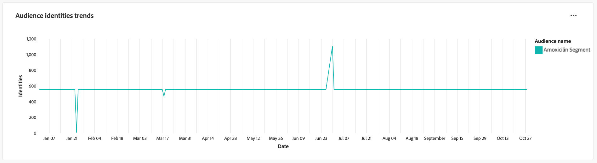

# Tendências do público-alvo

Analise como seus públicos mudam com o tempo com visualizações das principais métricas de público-alvo no painel [!UICONTROL Tendências do público-alvo]. Esse painel ajuda a rastrear tendências, como o crescimento do público-alvo, o número de identidades e a contagem de perfis de identidade únicos, além de permitir que você tome decisões orientadas por dados. Ao analisar essas métricas, os profissionais de marketing podem otimizar as estratégias de direcionamento, melhorar o envolvimento do público-alvo e refinar seus esforços de segmentação para campanhas mais eficazes.

## Filtragem de públicos {#filter-audiences}

Para iniciar a análise, use o filtro global para selecionar os públicos específicos e o intervalo de datas que deseja analisar. Selecione o ícone de filtro () para abrir a caixa de diálogo **[!UICONTROL Filtro]**, onde é possível:

1. **Selecionar um público-alvo**: escolha o público-alvo que deseja analisar (na captura de tela de exemplo, o público-alvo **Amoxicillin** foi selecionado).
1. **Definir um intervalo de datas**: escolha um intervalo predefinido no menu suspenso ou selecione manualmente datas de início e término usando os campos de calendário.

Depois de definir seus filtros, selecione **[!UICONTROL Aplicar]** para atualizar o painel. Os filtros escolhidos são aplicados e os insights focalizados nos públicos selecionados durante um período específico são exibidos. Seus filtros personalizados garantem que os dados sejam relevantes para suas metas de análise.

## Gráficos de tendência do público-alvo disponível {#available-charts}

Há três gráficos principais para ajudar você a entender as métricas de público-alvo ao longo do tempo. Para cada gráfico, você pode selecionar a elipse (`...`) na parte superior direita seguida por [!UICONTROL Exibir mais] para exibir um formulário tabulado dos resultados ou baixar os dados como um arquivo CSV para exibir em uma planilha. Para obter mais detalhes, consulte o [Exibir mais guia](../view-more.md).

>[!TIP]
>
>Você pode passar o mouse sobre uma data específica em qualquer gráfico para exibir a contagem de perfis individuais em uma caixa de diálogo.

### Tendências de tamanho do público {#audience-size-trends}

O gráfico **[!UICONTROL Tendências de tamanho do público-alvo]** mostra o número de perfis no público-alvo selecionado ao longo do tempo. Isso ajuda a rastrear o crescimento ou a redução do público-alvo. Você pode usar este gráfico para monitorar a eficácia do engajamento e entender as alterações no tamanho do público-alvo.

### Tendências de identidades de público {#audience-identities-trends}

O gráfico **[!UICONTROL Tendências de identidades de público-alvo]** fornece informações sobre o número total de identidades no segmento do público-alvo. Use este gráfico para entender como as identidades exclusivas estão contribuindo para o tamanho geral do público-alvo. Ele fornece uma indicação de estabilidade e engajamento do público-alvo.

### Tendências de tamanho do público-alvo de identidade única {#single-identity-audience-size-trends}

O gráfico **[!UICONTROL Tendências de tamanho de público-alvo de identidade única]** mostra a contagem de membros do público-alvo com apenas uma identidade. Essa métrica é valiosa para entender a composição do seu público-alvo, especialmente em termos de exclusividade de identidade, e ajuda a medir a eficácia dos esforços de compilação de identidade.

## Exportar Insights {#export-insights}

Depois de analisar as métricas e aplicar filtros relevantes, é possível exportar os dados para fins de análise offline ou relatórios. Para fazer isso, selecione **[!UICONTROL Exportar]** na parte superior direita da tabela. A caixa de diálogo PDF de impressão é exibida. Nessa caixa de diálogo, é possível salvar os dados visualizados como um PDF ou imprimi-los.

## Próximas etapas

Depois de ler este documento, você aprendeu a obter insights valiosos sobre o comportamento do público-alvo ao longo do tempo através do painel **Tendências do público-alvo**. Para saber mais sobre outros Modelos de Data Distiller que podem ajudá-lo a tomar decisões informadas, otimizar a segmentação e melhorar as estratégias de engajamento, consulte os guias de interface do [Comparação de público-alvo](./comparison.md), [Sobreposições de identidade de público-alvo](./identity-overlaps.md) e [Sobreposições de público-alvo avançadas](./overlaps.md).
