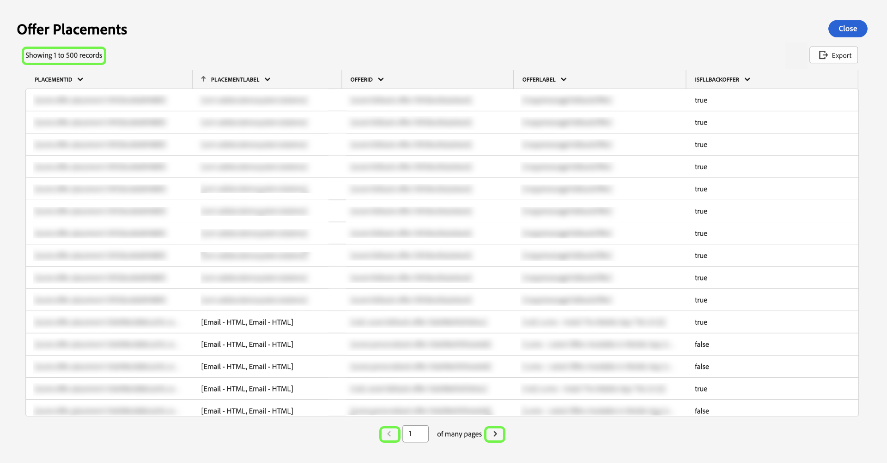

# Exibir mais {#view-more}

Depois de criar um [insight personalizado](./overview.md) com o [modo profissional de consulta](./overview.md#query-pro-mode), você poderá exibir os dados do seu gráfico em diferentes formatos. Você pode exibir um formulário tabulado dos resultados ou baixar os dados como um arquivo CSV para exibir em uma planilha.

## Resultados em tabela {#tabulated-results}

Para cada gráfico criado usando o modo pro de consulta por meio do SQL, é possível exibir os resultados tabelados de sua análise na interface do Experience Platform.

No painel personalizado, selecione as reticências (`...`) em qualquer widget para acessar as opções [!UICONTROL Exibir mais] e [!UICONTROL Exibir SQL].

## Baixar CSV {#download-csv}

O recurso [!UICONTROL Exibir mais] exibe os pontos de dados específicos do gráfico em forma de tabela. Para simplificar o processo de compartilhamento e manipulação de dados, você pode baixar os dados processados no formato CSV nesta caixa de diálogo. Selecione **[!UICONTROL Baixar CSV]** para baixar seus dados.

>[!NOTE]
>
>O download do CSV é limitado aos primeiros 500 registros.

## Classificar por coluna {#sort-column}

Ao exibir resultados tabelados, você pode usar a funcionalidade de classificação para classificar por coluna em ordem crescente ou decrescente. No painel personalizado, selecione as reticências (`...`) em qualquer tabela para acessar a opção [!UICONTROL Exibir mais].

Você pode classificar colunas selecionando o menu suspenso ao lado do nome da coluna e, em seguida, **[!UICONTROL Classificar em ordem crescente]** ou **[!UICONTROL Classificar em ordem decrescente]**.

>[!NOTE]
>
>As opções [!UICONTROL Classificar em Ordem Crescente] e [!UICONTROL Classificar em Ordem Decrescente] só aparecerão para colunas que tenham sido configuradas com a [funcionalidade de classificação](./overview.md#advanced-attributes).

## Redimensionar uma coluna {#resize-column}

É possível redimensionar colunas em resultados tabelados para melhorar a legibilidade dos dados. No painel personalizado, selecione as reticências (`...`) da tabela para acessar a opção [!UICONTROL Exibir mais]. Use o menu suspenso ao lado do nome da coluna para redimensioná-la e selecione **[!UICONTROL Redimensionar coluna]**.

Selecione o controle deslizante e arraste para a esquerda ou direita para ajustar o tamanho da coluna conforme necessário.

## Paginação de tabela {#table-pagination}

A paginação é aplicada automaticamente às tabelas no recurso [!UICONTROL Exibir mais], eliminando a necessidade de modificar manualmente as consultas SQL. Esse recurso garante que os dados sejam apresentados em um formato mais gerenciável, o que facilita o processo de navegação por grandes conjuntos de dados.

É possível ver até 500 registros por página. Para navegar pelos registros, use o **[!UICONTROL >]** localizado na parte inferior da página.

## Próximas etapas

Depois de ler este documento, agora você sabe como visualizar os resultados tabulados da análise SQL do gráfico personalizado e baixar os dados como um arquivo CSV. Consulte o documento SQL de exibição para saber como [exibir o SQL por trás de seus insights personalizados](./view-sql.md).

Você também pode aprender a gerar gráficos a partir de modelos de dados existentes na interface do usuário do Adobe Experience Platform com o [guia de modo de design guiado](../standard-dashboards.md).
