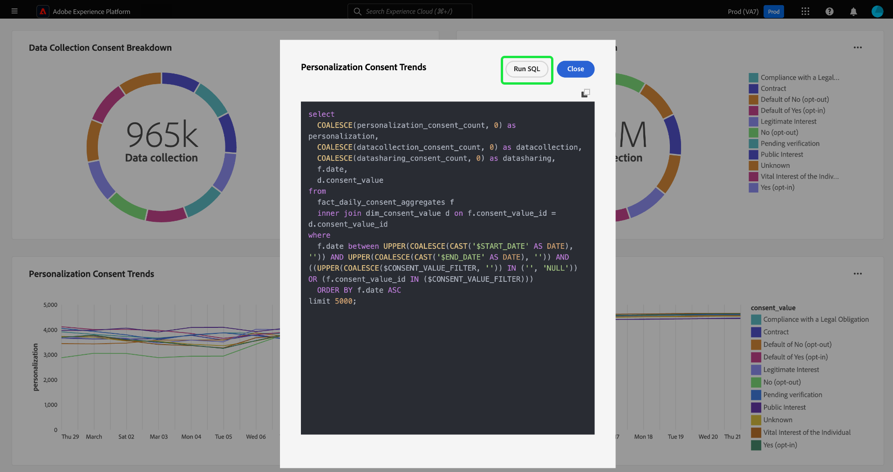

# Exibir SQL {#view-sql}

Depois de criar um [insight personalizado](./overview.md) com o [modo profissional de consulta](./overview.md#query-pro-mode), você poderá exibir o SQL que preenche seus gráficos com o recurso Exibir SQL.

No painel personalizado, selecione as reticências (`...`) em qualquer widget para acessar as opções [!UICONTROL Exibir mais] e [!UICONTROL Exibir SQL].

Para exibir o SQL por trás de seus insights personalizados, selecione a opção **[!UICONTROL Exibir SQL]**. A caixa de diálogo é intitulada com o nome do insight. Nesta visualização, você pode copiar o SQL para a área de transferência para usar como base para a criação futura de gráficos no modo query pro, ou abrir o SQL diretamente no Editor de consultas. Selecione **[!UICONTROL Executar SQL]** para abrir a consulta no Editor de Consultas.

Selecione **[!UICONTROL Fechar]** para fechar a caixa de diálogo.

## Próximas etapas

Depois de ler este documento, agora você sabe como visualizar o SQL por trás de seus insights personalizados. Veja o documento Exibir mais para saber como [comparar seu gráfico personalizado com os resultados tabulados de sua análise SQL](./view-more.md).

Você também pode aprender a gerar gráficos a partir de modelos de dados existentes na interface do usuário do Adobe Experience Platform com o [guia de modo de design guiado](../standard-dashboards.md).
