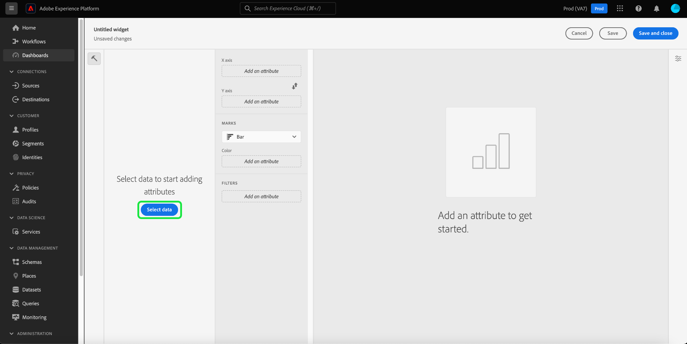
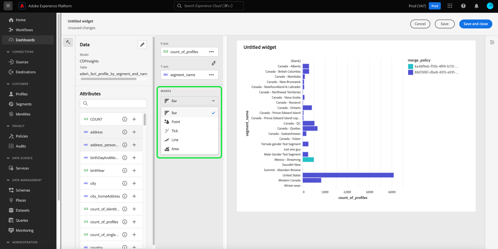

# Painéis de controle padrão

Use os Painéis do Adobe Experience Platform para acelerar insights e personalizar a visualização por meio do recurso Painéis. Use esse recurso para criar e gerenciar painéis personalizados, nos quais você pode criar, adicionar e editar widgets de bespoke para visualizar as métricas principais relevantes para sua organização.

<!-- Getting started / permissions section commented out for Beta. This will be necessary after GA only

## Getting started

To view dashboards in Adobe Experience Platform you must have the appropriate permissions enabled. Please read the [dashboards permissions documentation](./permissions.md#available-permissions) to learn how to grant users the ability to view, edit, and update Experience Platform dashboards using Adobe Admin Console. If you do not have administrator privileges for your organization, contact your product administrator to obtain the required permissions. -->

## Criar um painel personalizado

Para criar um painel personalizado, primeiro, navegue até o inventário do painel. Selecione **[!UICONTROL Dashboards]** na navegação à esquerda da interface do Experience Platform, seguido por **[!UICONTROL Create dashboard]**.

Antes de adicionar um painel personalizado, o inventário de painéis está vazio e exibe &quot;Nenhum painel encontrado&quot;. mensagem. Depois de criado, todos os painéis são listados no inventário de painéis.

<!-- >[!NOTE]
>
>To edit an existing dashboard, select the dashboard name from the inventory list followed by the pencil icon ()
>{width="100" zoomable="yes"} -->

A caixa de diálogo [!UICONTROL Create dashboard] é exibida. Insira um nome descritivo amigável para a coleção de widgets que você deseja criar e selecione **[!UICONTROL Save]**.

Os usuários que compraram o Data Distiller SKU têm a opção de usar consultas SQL personalizadas para criar seus insights. Consulte a [visão geral do modo profissional da consulta](./sql-insights-query-pro-mode/overview.md) para obter instruções sobre este fluxo de trabalho.

O painel em branco recém-criado é exibido com o nome escolhido no canto superior esquerdo da exibição.

## Criar um dispositivo {#create-widget}

>[!CONTEXTUALHELP]
>id="platform_dashboards_udd_maxwidgets"
>title="Número máximo de dispositivos"
>abstract="O serviço do painel permite até 10 dispositivos. Depois de adicionar dez widgets ao painel, a opção [!UICONTROL Add new widget] é desabilitada e aparece em cinza."

No novo modo de exibição de painel, selecione **[!UICONTROL Add new widget]** para iniciar o processo de criação do widget.

>[!IMPORTANT]
>
>Cada painel aceita até dez widgets. Depois de adicionar dez widgets ao painel, a opção [!UICONTROL Add new widget] é desabilitada e aparece em cinza.

### Widget composer

A área de trabalho do compositor de widgets é exibida. Em seguida, selecione **[!UICONTROL Select data]** para escolher o modelo de dados a partir do qual adicionar atributos aos seus widgets.

#### Selecionar modelo de dados {#select-data-model}

A caixa de diálogo [!UICONTROL Select data model] é exibida. Selecione um modelo de dados na coluna à esquerda para exibir uma lista de visualização de todas as tabelas disponíveis. O modelo de dados pré-configurado para o Real-Time Customer Data Platform é denominado [!UICONTROL CDPInsights].

>[!TIP]
>
>Selecione o ícone de informações () para ver o nome completo do modelo de dados se ele for muito longo para ser exibido no painel de dados.

A lista de visualização fornece detalhes sobre as tabelas contidas no modelo de dados. A tabela abaixo fornece descrições dos campos de coluna e seus valores em potencial.

| Campo Coluna | Descrição |
|---|---|
| [!UICONTROL Title] | O nome da tabela. |
| [!UICONTROL Table type] | O tipo de tabela. Os tipos possíveis incluem: `fact`, `dimension` e `none`. |
| [!UICONTROL Records] | O número de registros associados à tabela escolhida. |
| [!UICONTROL Lookups] | O número de tabelas unidas à tabela escolhida. |
| [!UICONTROL Attributes] | O número de atributos para a tabela escolhida. |

Selecione **[!UICONTROL Next]** para confirmar sua escolha de modelo de dados. A próxima exibição exibe uma lista das tabelas disponíveis no painel esquerdo. Selecione uma tabela para ver um detalhamento abrangente dos dados contidos na tabela selecionada.

### Preencher widget {#populate-widget}

O painel [!UICONTROL Preview] contém guias para [!UICONTROL Sample records] e [!UICONTROL Attributes]. A guia [!UICONTROL Sample records] fornece um subconjunto dos registros da tabela selecionada em uma exibição tabulada. A guia [!UICONTROL Attributes] fornece o nome do atributo, o tipo de dados e a tabela de origem para cada atributo associado à tabela selecionada.

Selecione uma tabela na lista disponível no painel à esquerda para fornecer dados para o widget e selecione **[!UICONTROL Select]** para retornar ao compositor de widgets.

O widget composer agora é preenchido com dados da tabela escolhida.

O modelo de dados e a tabela selecionada atualmente são exibidos na parte superior do painel à esquerda, e os atributos disponíveis para criar seu widget são listados na coluna [!UICONTROL Attributes]. Você pode usar a barra de pesquisa para procurar atributos em vez de rolar a lista ou alterar o modelo de dados escolhido selecionando o ícone de lápis () no painel esquerdo.

#### Adicionar e filtrar atributos {#add-and-filter-attributes}

Selecione o ícone adicionar () ao lado de um nome de atributo para adicionar um atributo ao seu widget. O menu suspenso exibido permite adicionar um atributo como eixo X, eixo Y, uma cor ou um filtro para o widget. O atributo [!UICONTROL Color] permite diferenciar os resultados das marcas dos eixos X e Y com base na cor. Ele faz isso dividindo os resultados em cores diferentes com base em sua composição de um terceiro atributo.

>[!TIP]
>
>Se quiser inverter a organização dos eixos X e Y, selecione o ícone de seta para cima e para baixo () para trocar sua organização.

Para alterar o tipo de gráfico do seu widget, selecione a lista suspensa [!UICONTROL Marks] e escolha entre as opções disponíveis. As opções incluem barras, pontos, barras, linhas ou área. Uma vez selecionado, uma visualização prévia das configurações atuais do seu widget é gerada.

Ao adicionar um atributo como filtro, é possível selecionar quais valores incluir ou excluir do widget. Após adicionar um filtro da lista de atributos, a caixa de diálogo [!UICONTROL Filter] é exibida, onde você pode marcar ou desmarcar valores usando suas caixas de seleção.

#### Filtrar dados históricos {#filter-historical-data}

Para filtrar os dados históricos dos insights gerados pelo seu widget, adicione o atributo `date_key` como filtro e selecione **[!UICONTROL Recent date]** seguido de **[!UICONTROL Apply]**. Esse filtro garante que os dados usados para derivar insights sejam obtidos do instantâneo do sistema mais recente.

![A caixa de diálogo [!UICONTROL Filter: date_key] com [!UICONTROL Recent date] e [!UICONTROL Apply] foi realçada.](./images/standard-dashboards/recent-date.png)

Como alternativa, você pode criar um período personalizado para filtrar seus dados. Selecione **[!UICONTROL Select dates]** para estender a caixa de diálogo com uma lista de datas disponíveis. Use a caixa de seleção **[!UICONTROL Select all]** para habilitar ou desabilitar todas as opções disponíveis ou marque a caixa de seleção de cada dia individualmente. Finalmente, selecione **[!UICONTROL Apply]** para confirmar suas escolhas.

>[!NOTE]
>
>Se o atributo `date_key` já tiver sido adicionado como filtro, selecione as reticências seguidas por **[!UICONTROL Edit]** nas opções suspensas para alterar o período do filtro.

![A caixa de diálogo [!UICONTROL Filter: date_key] com caixas de seleção de dia individual foi marcada e desmarcada.](./images/standard-dashboards/select-dates.png)

### Propriedades do dispositivo

Selecione o ícone de propriedades () no painel direito para abrir o painel de propriedades. No painel [!UICONTROL Properties], insira um nome para o widget no campo de texto [!UICONTROL Widget title].

No painel de propriedades do widget, você pode editar vários aspectos do seu widget. Você tem controle total para editar o local da legenda do widget. Para mover a legenda, selecione a lista suspensa [!UICONTROL Legend placement] e escolha o local desejado na lista de opções disponíveis. Você também pode renomear o rótulo associado à legenda e ao eixo X ou Y inserindo um novo nome no campo de texto [!UICONTROL Legend title] ou no campo de texto [!UICONTROL Axis label], respectivamente.

#### Salve o widget {#save-widget}

Salvar no widget composer salva o widget localmente no painel. Para salvar seu trabalho e retomar o mesmo posteriormente, selecione **[!UICONTROL Save]**. Um ícone de marca de verificação abaixo do nome do widget indica que o widget foi salvo. Como alternativa, quando você estiver satisfeito com o seu widget, selecione **[!UICONTROL Save and close]** para disponibilizá-lo para todos os outros usuários com acesso ao seu painel. Selecione **[!UICONTROL Cancel]** para abandonar seu trabalho e retornar ao seu painel personalizado.

>[!TIP]
>
>Selecione o ícone de propriedades () ao lado do nome do painel para ver detalhes sobre sua criação. Você pode alterar o nome do painel na caixa de diálogo exibida.

Os widgets podem ser reorganizados e redimensionados enquanto estiverem neste espaço de trabalho. Selecione **[!UICONTROL Save]** para preservar o nome do painel e o layout configurado.

Para garantir que cada consulta de um painel de insights do Adobe Real-Time Customer Data Platform tenha recursos suficientes para ser executada com eficiência, a API rastreia o uso de recursos atribuindo slots de simultaneidade a cada consulta. O sistema pode processar até quatro queries simultâneas e, portanto, quatro slots de query simultâneos estarão disponíveis a qualquer momento. As consultas são colocadas em uma fila com base em slots de simultaneidade e, em seguida, aguardam na fila até que slots de simultaneidade suficientes estejam disponíveis.

### Editar, duplicar ou excluir um widget {#duplicate}

Depois de criar um widget, você pode editar, duplicar ou excluir widgets inteiros de seu painel personalizado.

>[!TIP]
>
>Para alternar entre qualquer um dos painéis personalizados existentes, selecione Painéis na barra de navegação à esquerda e, em seguida, selecione o nome do painel na lista de inventário.

Selecione o ícone de lápis () na parte superior direita do painel personalizado para entrar no modo de edição.

Em seguida, selecione as reticências na parte superior direita do widget que você deseja editar, copiar ou excluir. Selecione a ação apropriada no menu suspenso.

>[!NOTE]
>
>A duplicação permite personalizar os atributos de um insight para criar um widget exclusivo sem precisar começar do zero. Se você duplicar um widget, ele aparecerá no painel personalizado. Você pode selecionar as reticências do novo widget, seguido por **[!UICONTROL Edit]**, para personalizar seu insight.

## Próximas etapas e recursos adicionais

Ao ler este documento, você tem uma melhor compreensão de como criar um painel personalizado e como criar, editar e atualizar widgets personalizados para esse painel.

Para descobrir as métricas e visualizações pré-configuradas disponíveis para os painéis [perfis](./guides/profiles.md#standard-widgets), [segmentos](./guides/audiences.md#standard-widgets) e [destinos](./guides/destinations.md#standard-widgets), consulte a lista de widgets padrão em suas respectivas documentações.

Para reforçar sua compreensão dos painéis no Experience Platform, assista ao seguinte vídeo:

>[!VIDEO](https://video.tv.adobe.com/v/3417878?captions=por_br&quality=12&learn=on)
