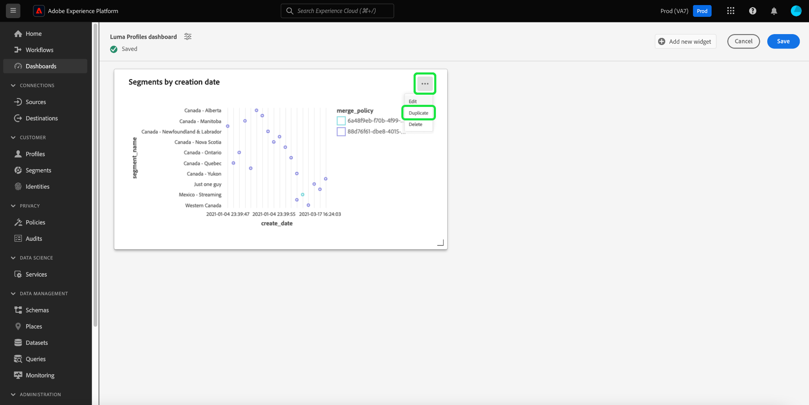

# Painéis definidos pelo usuário

Os Painéis do Adobe Experience Platform ajudam você a acelerar insights e personalizar a visualização por meio do recurso de painéis definido pelo usuário. Este recurso permite que você crie e gerencie painéis personalizados onde é possível criar, adicionar e editar widgets personalizados para visualizar as métricas principais relevantes para sua organização.

<!-- Getting started / permissions section commented out for Beta. This will be necessary after GA only

## Getting started

To view dashboards in Adobe Experience Platform you must have the appropriate permissions enabled. Please read the [dashboards permissions documentation](./permissions.md#available-permissions) to learn how to grant users the ability to view, edit, and update Experience Platform dashboards using Adobe Admin Console. If you do not have administrator privileges for your organization, contact your product administrator to obtain the required permissions. -->

## Criar um painel personalizado

Para criar um painel personalizado, primeiro, navegue até o inventário do painel. Selecionar **[!UICONTROL Painéis]** da navegação à esquerda da interface do usuário do Platform, seguida por **[!UICONTROL Criar painel]**.

Antes de adicionar um painel personalizado, o inventário de painéis está vazio e exibe &quot;Nenhum painel encontrado&quot;. mensagem. Depois de criado, todos os painéis definidos pelo usuário são listados no inventário de painéis.

>[!NOTE]
>
>Para editar um painel existente, selecione o nome do painel na lista de inventário seguido pelo ícone de lápis ()

A variável [!UICONTROL Criar painel] será exibida. Insira um nome descritivo amigável para a coleção de dispositivos que você deseja criar e selecione **[!UICONTROL Salvar]**.

O painel em branco recém-criado é exibido com o nome escolhido no canto superior esquerdo da exibição.

## Criar um widget {#create-widget}

>[!CONTEXTUALHELP]
>id="platform_dashboards_udd_maxwidgets"
>title="Número máximo de widgets"
>abstract="Painéis definidos pelo usuário comportam até dez widgets. Depois de adicionar dez widgets ao painel, a opção [!UICONTROL Adicionar novo widget] fica desativada e é exibida em cinza."

Na nova visualização de painel, selecione **[!UICONTROL Adicionar novo widget]** para iniciar o processo de criação do widget.

>[!IMPORTANT]
>
>Painéis definidos pelo usuário comportam até dez widgets. Depois de adicionar dez widgets ao painel, a opção [!UICONTROL Adicionar novo widget] fica desativada e é exibida em cinza.

### Widget composer

A área de trabalho do compositor de widgets é exibida. Em seguida, selecione **[!UICONTROL Selecionar dados]** para escolher o modelo de dados a partir do qual adicionar atributos aos seus widgets.

#### Selecionar modelo de dados {#select-data-model}

A variável [!UICONTROL Selecionar modelo de dados] será exibida. Selecione um modelo de dados na coluna à esquerda para exibir uma lista de visualização de todas as tabelas disponíveis. O modelo de dados pré-configurado para o Real-time Customer Data Platform é chamado de [!UICONTROL CDPInsights].

>[!TIP]
>
>Selecione o ícone de informações () para ver o nome completo do modelo de dados se ele for muito longo para ser exibido no painel de dados.

A lista de visualização fornece detalhes sobre as tabelas contidas no modelo de dados. A tabela abaixo fornece descrições dos campos de coluna e seus valores em potencial.

| Campo Coluna | Descrição |
|---|---|
| [!UICONTROL Title] | O nome da tabela. |
| [!UICONTROL Tipo de tabela] | O tipo de tabela. Os tipos possíveis incluem: `fact`, `dimension`, e `none`. |
| [!UICONTROL Registros] | O número de registros associados à tabela escolhida. |
| [!UICONTROL Pesquisas] | O número de tabelas unidas à tabela escolhida. |
| [!UICONTROL Atributos] | O número de atributos para a tabela escolhida. |

Selecionar **[!UICONTROL Próxima]** para confirmar sua escolha de modelo de dados. A próxima exibição exibe uma lista das tabelas disponíveis no painel esquerdo. Selecione uma tabela para ver um detalhamento abrangente dos dados contidos na tabela selecionada.

### Preencher widget {#populate-widget}

A variável [!UICONTROL Visualizar] painel contém guias para [!UICONTROL Registros de amostra] e [!UICONTROL Atributos]. A variável [!UICONTROL Registros de amostra] A guia fornece um subconjunto dos registros da tabela selecionada em uma exibição tabulada. A variável [!UICONTROL Atributos] A guia fornece o nome do atributo, o tipo de dados e a tabela de origem para cada atributo associado à tabela selecionada.

Selecione uma tabela na lista disponível no painel à esquerda para fornecer dados para o widget e selecione **[!UICONTROL Selecionar]** para retornar ao widget composer.

O widget composer agora é preenchido com dados da tabela escolhida.

O modelo de dados e a tabela selecionada no momento são exibidos na parte superior do painel à esquerda, e os atributos disponíveis para criar seu widget são listados na [!UICONTROL Atributos] coluna. Você pode usar a barra de pesquisa para procurar atributos em vez de rolar a lista ou alterar o modelo de dados escolhido selecionando o ícone de lápis () no painel esquerdo.

#### Adicionar e filtrar atributos {#add-and-filter-attributes}

Selecione o ícone adicionar () ao lado de um nome de atributo para adicionar um atributo ao seu widget. O menu suspenso exibido permite adicionar um atributo como eixo X, eixo Y, uma cor ou um filtro para o widget. A variável [!UICONTROL Cor] O atributo permite diferenciar os resultados das marcas dos eixos X e Y com base na cor. Ele faz isso dividindo os resultados em cores diferentes com base em sua composição de um terceiro atributo.

>[!TIP]
>
>Se quiser inverter a organização dos eixos X e Y, selecione o ícone de seta para cima e para baixo () para mudar de acordo.

Para alterar o tipo de gráfico do seu widget, selecione o [!UICONTROL Marcas] e escolha entre as opções disponíveis. As opções incluem barras, pontos, barras, linhas ou área. Uma vez selecionado, uma visualização prévia das configurações atuais do seu widget é gerada.

Ao adicionar um atributo como filtro, é possível selecionar quais valores incluir ou excluir do widget. Depois de adicionar um filtro da lista de atributos, a variável [!UICONTROL Filtro] será exibida, onde você poderá marcar ou desmarcar valores usando suas caixas de seleção.

#### Filtrar dados históricos {#filter-historical-data}

Para filtrar os dados históricos dos insights gerados pelo seu widget, adicione o `date_key` atributo como filtro e selecione **[!UICONTROL Data recente]** seguido por **[!UICONTROL Aplicar]**. Esse filtro garante que os dados usados para derivar insights sejam obtidos do instantâneo do sistema mais recente.

![A variável [!UICONTROL Filtro: date_key] diálogo com [!UICONTROL Data recente] e [!UICONTROL Aplicar] destacado.](./images/user-defined-dashboards/recent-date.png)

Como alternativa, você pode criar um período personalizado para filtrar seus dados. Selecionar **[!UICONTROL Selecionar datas]** para estender a caixa de diálogo com uma lista de datas disponíveis. Use o **[!UICONTROL Selecionar tudo]** para ativar ou desativar todas as opções disponíveis, ou marque a caixa de seleção de cada dia individualmente. Finalmente, selecione **[!UICONTROL Aplicar]** para confirmar suas escolhas.

>[!NOTE]
>
>Se a variável `date_key` já foi adicionado como filtro, selecione as reticências seguidas por **[!UICONTROL Editar]** nas opções suspensas para alterar o período do filtro.

![A variável [!UICONTROL Filtro: date_key] caixa de diálogo com caixas de seleção de dia individual marcada e desmarcada.](./images/user-defined-dashboards/select-dates.png)

### Propriedades do widget

Selecione o ícone de propriedades () no painel direito para abrir o painel de propriedades. No [!UICONTROL Propriedades] insira um nome para o widget na caixa [!UICONTROL Título do widget] campo de texto.

No painel de propriedades do widget, você pode editar vários aspectos do seu widget. Você tem controle total para editar o local da legenda do widget. Para mover a legenda, selecione o [!UICONTROL Posicionamento da legenda] e escolha o local desejado na lista de opções disponíveis. Também é possível renomear o rótulo associado à legenda e ao eixo X ou Y inserindo um novo nome na variável [!UICONTROL Título da legenda] campo de texto ou [!UICONTROL Rótulo do eixo] campo de texto, respectivamente.

#### Salve o widget {#save-widget}

Salvar no widget composer salva o widget localmente no painel. Para salvar seu trabalho e retomá-lo posteriormente, selecione **[!UICONTROL Salvar]**. Um ícone de marca de verificação abaixo do nome do widget indica que o widget foi salvo. Como alternativa, quando estiver satisfeito com o widget, selecione **[!UICONTROL Salvar e fechar]** para disponibilizar o widget para todos os outros usuários com acesso ao painel. Selecionar **[!UICONTROL Cancelar]** para abandonar seu trabalho e retornar ao painel personalizado.

>[!TIP]
>
>Selecione o ícone de propriedades () ao lado do nome do painel para ver detalhes sobre sua criação. Você pode alterar o nome do painel na caixa de diálogo exibida.

Os widgets podem ser reorganizados e redimensionados enquanto estiverem neste espaço de trabalho. Selecionar **[!UICONTROL Salvar]** para preservar o nome do painel e o layout configurado.

Para garantir que cada consulta de um painel de insights do Adobe Real-time Customer Data Platform tenha recursos suficientes para ser executada com eficiência, a API rastreia o uso de recursos atribuindo slots de simultaneidade a cada consulta. O sistema pode processar até quatro queries simultâneas e, portanto, quatro slots de query simultâneos estarão disponíveis a qualquer momento. As consultas são colocadas em uma fila com base em slots de simultaneidade e, em seguida, aguardam na fila até que slots de simultaneidade suficientes estejam disponíveis.

### Duplicar um widget

Depois de criar um widget, você pode duplicar todo o widget e personalizar seus atributos para criar um widget exclusivo sem precisar começar do zero. Para duplicar um widget, primeiro, navegue até o inventário do painel. Em seguida, selecione o nome do painel na lista de inventário. O painel personalizado é exibido.

Selecione o ícone de lápis () na parte superior direita do painel personalizado para entrar no modo de edição.

Em seguida, selecione as reticências na parte superior direita do widget que você deseja copiar, seguidas por **[!UICONTROL Duplicar]** na lista de opções disponíveis.

Um widget duplicado é exibido no painel definido pelo usuário. Selecione as reticências do novo widget, seguido por **[!UICONTROL Editar]**, para personalizar o novo widget.

## Próximas etapas e recursos adicionais

Ao ler este documento, você tem uma melhor compreensão de como criar um painel personalizado e como criar, editar e atualizar widgets personalizados para esse painel.

Para descobrir as métricas e visualizações pré-configuradas disponíveis para o [perfis](./guides/profiles.md#standard-widgets), [segmentos](./guides/audiences.md#standard-widgets), e [destinos](./guides/destinations.md#standard-widgets) painéis, consulte a lista de widgets padrão em sua respectiva documentação.

Para reforçar sua compreensão dos painéis definidos pelo usuário no Experience Platform, assista ao vídeo a seguir:

>[!VIDEO](https://video.tv.adobe.com/v/3409637?quality=12&learn=on)
