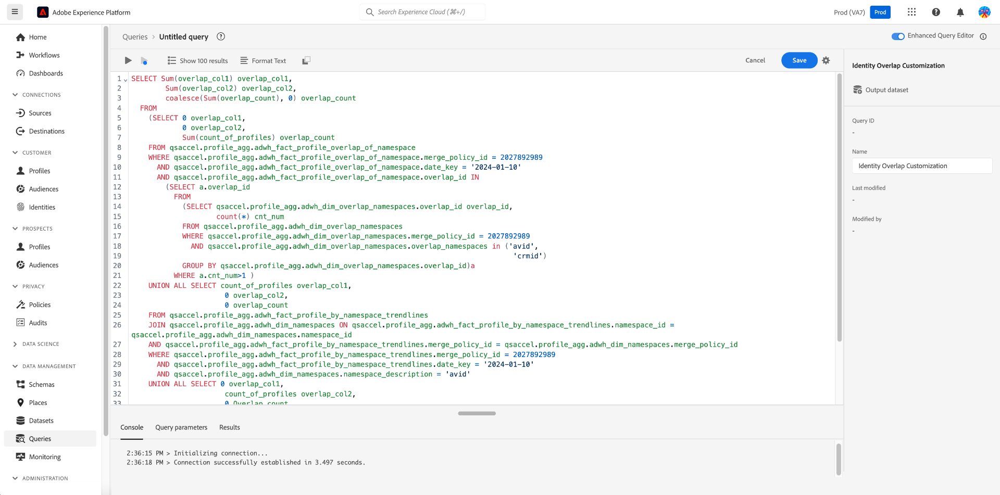

# Exibir insight SQL

Use o recurso [!UICONTROL Exibir SQL] para exibir o SQL por trás de seu Perfil, Público-alvo, Destino e insights personalizados e executar a consulta sob demanda por meio do Editor de Consultas. Inspire-se no SQL de mais de 40 insights existentes para criar novas consultas que obtêm insights exclusivos dos dados da plataforma com base nas necessidades da empresa.

## Navegue até a visão geral do painel {#navigate-to-overview}

Para abrir o painel escolhido, selecione **[!UICONTROL Perfis]**, **[!UICONTROL Públicos-alvo]** ou **[!UICONTROL Destinos]** na navegação à esquerda. Em seguida, selecione **[!UICONTROL Visão geral]** nas opções de guia, se o espaço de trabalho não for exibido automaticamente.

Como alternativa, selecione **[!UICONTROL Painéis]** na navegação à esquerda, seguido do nome do seu painel personalizado. A visão geral do painel definido pelo usuário é exibida.

![A interface do usuário do Experience Platform com [!UICONTROL Perfis], [!UICONTROL Públicos-alvo], [!UICONTROL Destinos] e [!UICONTROL Painéis] destacados.](./images/view-sql/dashboard-navigation.png)

## Alternância Exibir SQL {#toggle}

Um botão está disponível na visão geral do Perfil, Público-alvo, Destino e painéis definidos pelo usuário para ativar ou desativar o recurso.

>[!NOTE]
>
>Se você habilitar a opção [!UICONTROL Exibir SQL], não poderá alterar os filtros de nível global e de widget até desabilitar o recurso.

![A opção [!UICONTROL Exibir SQL] foi realçada.](./images/view-sql/view-sql-toggle.png)

Habilite o botão para exibir o texto [!UICONTROL Exibir SQL] em cada insight individual.

![Um insight com [!UICONTROL Exibir SQL] realçado.](./images/view-sql/insight-view-sql.png)

Selecione **[!UICONTROL Exibir SQL]** para abrir uma caixa de diálogo que contém o SQL do widget.

## Caixa de diálogo SQL {#sql-dialog}

Uma caixa de diálogo é exibida contendo o título do insight e do SQL que o gera.

>[!TIP]
>
>Você pode copiar toda a instrução SQL para a área de transferência selecionando o ícone copiar () na parte superior direita da caixa de diálogo.

Selecione **[!UICONTROL Executar SQL]** para abrir o Editor de Consultas com a consulta pré-preenchida.

![Uma caixa de diálogo de insight com [!UICONTROL Executar SQL] realçada.](./images/view-sql/run-sql.png)

## Editar SQL existente {#edit-sql}

O Editor de consultas é exibido. Agora você pode editar a instrução e consultar os dados da plataforma de uma maneira que melhor atenda às suas necessidades de relatórios. Salve o novo modelo de consulta com um nome apropriado.

## Próximas etapas

Depois de ler este documento, agora você entende como acessar o SQL para qualquer insight nos painéis padrão ou em um painel definido pelo usuário. Se ainda não tiver feito isso, é recomendável ler o [documento do Modelo de Dados do Real-time Customer Data Platform Insights](./data-models/cdp-insights-data-model-b2c.md). Esse documento contém insights sobre como personalizar modelos SQL para relatórios Real-Time CDP personalizados para suas necessidades de marketing e KPI.
