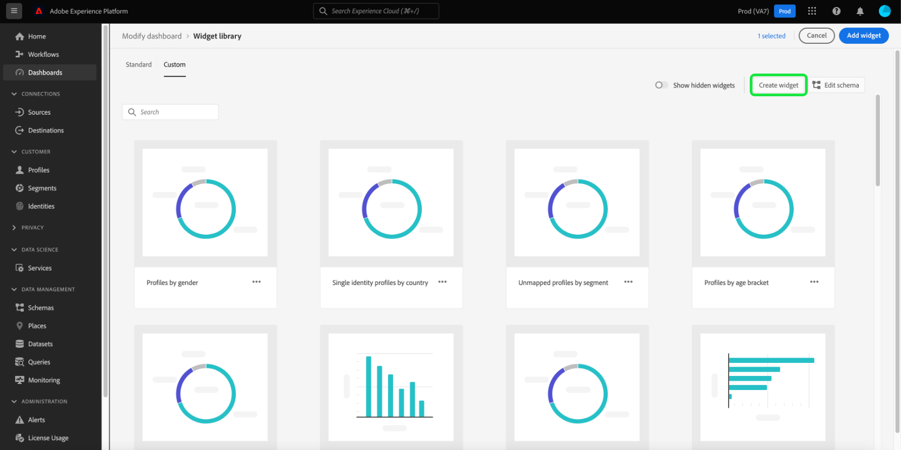

# (Beta) Biblioteca de widgets {#widget-library}

>[!IMPORTANT]
>
>A funcionalidade do painel está atualmente na versão beta e não está disponível para todos os usuários. A documentação e a funcionalidade estão sujeitas a alterações.

Na interface do usuário do Adobe Experience Platform, você pode visualizar e interagir com os dados de sua organização usando vários painéis. Você também pode atualizar alguns desses painéis adicionando novos widgets à visualização do painel. Além dos widgets padrão fornecidos pelo Adobe, você pode criar widgets personalizados e compartilhá-los em toda a organização.

Este guia fornece instruções passo a passo para adicionar widgets padrão e criar widgets personalizados para personalizar as informações exibidas na interface do usuário de plataforma [!UICONTROL Profiles] e [!UICONTROL Segments].

Para obter informações sobre como modificar o local e o tamanho dos widgets nos painéis [!UICONTROL Profiles], [!UICONTROL Destinations] e [!UICONTROL Segments], consulte o [guia modificar painéis](modify.md).

>[!NOTE]
>
>Os widgets mostrados no painel de uso da licença [!UICONTROL Não podem ser personalizados. ] Para saber mais sobre esse painel exclusivo, leia a [documentação do painel de uso da licença](guides/license-usage.md).

## Acessar a biblioteca de widgets

Em qualquer painel (por exemplo, no painel Perfis ), você pode selecionar **[!UICONTROL Modificar painel]** seguido por **[!UICONTROL Biblioteca de widgets]** para acessar a biblioteca de widgets.

>[!NOTE]
>
>O botão [!UICONTROL Biblioteca de widgets] só aparece depois que [!UICONTROL Modificar painel] é selecionado.

A [!UICONTROL biblioteca de widget] contém duas guias, [!UICONTROL Standard] e [!UICONTROL Custom].

* A guia **[!UICONTROL Standard]** contém widgets criados pelo Adobe e permite atualizar seu painel usando essas métricas padrão. Para saber mais sobre como adicionar widgets padrão ao painel, consulte a seção [widgets padrão](#standard-widgets) neste guia.
* A guia **[!UICONTROL Personalizado]** permite criar e compartilhar widgets em sua organização. Para obter as etapas completas para criar seus próprios widgets, consulte a seção [widgets personalizados](#custom-widgets) neste guia.

## Widgets padrão {#standard-widgets}

A guia **[!UICONTROL Standard]** contém widgets criados pelo Adobe, divididos em categorias. Selecionar uma categoria exibe os widgets disponíveis para esse painel. Cada widget aparece como um cartão, fornecendo o título, a descrição e uma amostra de visualização da métrica.

>[!NOTE]
>
>Os widgets só podem ser adicionados ao painel que corresponda à categoria selecionada. Por exemplo, somente os widgets da categoria [!UICONTROL Profiles] podem ser adicionados ao painel [!UICONTROL Profiles].

Para escolher um widget padrão para adicionar ao painel, realce o widget e marque a caixa de seleção do widget. Com pelo menos um widget selecionado, o botão **[!UICONTROL Adicionar widget]** é iluminado.

>[!NOTE]
>
>O contador no canto superior direito da biblioteca de widgets mostra o número total de widgets selecionados.

Selecione **[!UICONTROL Adicionar widget]** para adicionar widgets selecionados ao painel.

## Widgets personalizados {#custom-widgets}

>[!IMPORTANT]
>
>Sua organização pode criar no máximo 20 widgets personalizados na biblioteca de widgets.

Para personalizar ainda mais a aparência dos painéis no Experience Platform, você pode criar widgets e compartilhá-los com outros usuários em sua organização. Na biblioteca de widgets, selecione a guia **[!UICONTROL Personalizado]** para começar a criar widgets personalizados. Na guia [!UICONTROL Personalizado], todos os widgets criados por sua organização ficam visíveis. Neste exemplo, nenhum widget personalizado foi criado ainda.

### Selecionar atributos

Para criar widgets personalizados, os atributos de Perfil do cliente em tempo real devem ser identificados para garantir que os dados sejam incluídos como parte do instantâneo diário. Se sua organização não selecionou atributos de perfil, o botão [!UICONTROL Configurar esquema] aparece no canto superior direito da biblioteca de widgets.

Quando pelo menos um atributo personalizado foi selecionado, o botão [!UICONTROL Editar esquema] aparece no canto superior direito da biblioteca de widgets. Selecione **[!UICONTROL Edit schema]** para abrir a caixa de diálogo **[!UICONTROL Select union schema field]** para exibir os atributos selecionados e adicionar mais atributos.

>[!IMPORTANT]
>
>Uma organização pode selecionar no máximo 20 atributos.

Para selecionar um atributo, navegue até o atributo no esquema de união (ou use pesquisa) e marque a caixa de seleção ao lado do atributo. Marcar a caixa de seleção também adiciona o atributo à lista **[!UICONTROL Atributos selecionados]** no lado direito da caixa de diálogo.

>[!NOTE]
>
>Para que um atributo fique visível para seleção, ele deve ser um dos seguintes: Sequência, Data, Data-Hora, Booleano, Curto, Longo, Número Inteiro ou Byte. Os tipos de dados Mapear e Duplicar não são suportados e ficam esmaecidos para que não possam ser selecionados.

Depois de escolher os atributos que deseja adicionar, selecione **[!UICONTROL Save]** para salvar os atributos e retornar à guia de widgets personalizados.

Os atributos recém-selecionados estão disponíveis após o instantâneo diário quando os dados são atualizados.

### Criar um widget personalizado

Para criar um widget personalizado, selecione **[!UICONTROL Criar]** no centro da biblioteca de widgets ou, se os widgets personalizados já tiverem sido criados, selecione **[!UICONTROL Criar widget]** no canto superior direito da biblioteca de widgets.

Na caixa de diálogo **[!UICONTROL Criar widget]**, você pode fornecer um título e uma descrição para o novo widget e escolher o atributo que deseja que o widget exiba. Para escolher um atributo, selecione o botão de opção ao lado do atributo que deseja adicionar.

>[!NOTE]
>
>Somente um atributo pode ser selecionado por widget. Além disso, se um widget já tiver sido criado para um atributo, o atributo aparecerá esmaecido.

Uma visualização do novo widget é exibida na caixa de diálogo, mostrando um gráfico de barras horizontal com dados de zombaria.

>[!NOTE]
>
>A única métrica atualmente suportada para todos os atributos é a contagem de perfis e a única visualização atualmente suportada para widgets personalizados é um gráfico de barras horizontal.
>
>Os dados mostrados no widget de exemplo são apenas para fins ilustrativos. A visualização não exibe os dados reais da organização.

Para salvar seu novo widget e retornar à guia [!UICONTROL Personalizado], selecione **[!UICONTROL Criar]**. O novo widget agora está disponível para ser adicionado a um painel ao escolher o widget da biblioteca e selecionar **[!UICONTROL Adicionar widget]**.

### Arquivar um widget personalizado

Depois que um widget é adicionado à biblioteca, ele pode ser arquivado usando o botão **[!UICONTROL Arquivar]**. Também é possível editar o widget para atualizar o título ou os campos de descrição.

## Próximas etapas

Após a leitura deste documento, agora é possível acessar a [!UICONTROL biblioteca de widgets] e usá-la para adicionar widgets a um painel ou criar widgets personalizados para sua organização. Para modificar o tamanho e o local dos widgets no painel, consulte o [guia modificar painéis](modify.md).