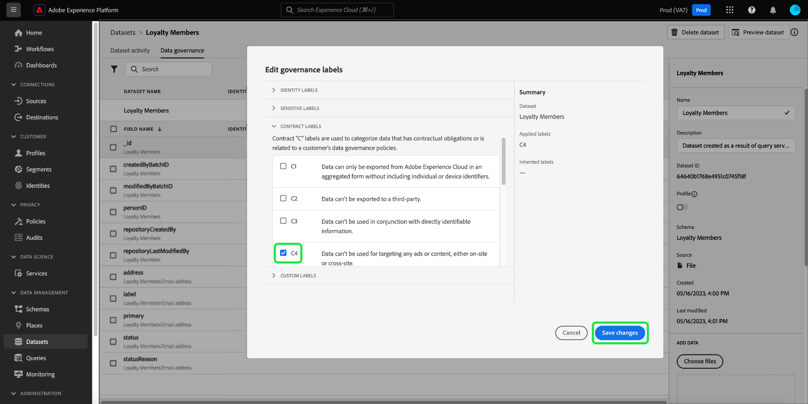

# Guia completo de governança de dados

Para controlar quais ações de marketing podem ser executadas em determinados conjuntos de dados e campos no Adobe Experience Platform, você deve configurar o seguinte:

1. [Aplique rótulos](#labels) aos campos de esquemas ou aos conjuntos de dados inteiros cujo uso você deseja restringir.
1. [Configure e habilite as políticas de governança de dados](#policy) que determinam quais tipos de dados rotulados podem ser usados para determinadas ações de marketing.
1. [Aplique ações de marketing aos seus destinos](#destinations) para indicar quais políticas se aplicam aos dados enviados a esses destinos.

Após concluir a configuração de rótulos, políticas de governança e ações de marketing, você pode [testar a aplicação da política](#test) para garantir que ela funcione conforme o esperado.

Este guia aborda todo o processo de configuração e aplicação de uma política de governança de dados na interface do usuário do Experience Platform. Para obter informações mais detalhadas sobre os recursos usados neste guia, consulte a documentação de visão geral sobre os seguintes tópicos:

* [Governança de dados do Adobe Experience Platform](./home.md)
* [Rótulos de uso de dados](./labels/overview.md)
* [Políticas de uso de dados](./policies/overview.md)
* [Aplicação de política](./enforcement/overview.md)

>[!NOTE]
>
>Este guia foca em como configurar e aplicar políticas para como os dados são usados ou ativados no Experience Platform. Se você estiver tentando restringir o **acesso** aos dados propriamente ditos de determinados usuários do Experience Platform em sua organização, consulte o manual completo sobre o [controle de acesso baseado em atributos](../access-control/abac/end-to-end-guide.md). O controle de acesso baseado em atributos também usa rótulos e políticas, mas para um caso de uso diferente da governança de dados.

## Aplicar rótulos {#labels}

>[!IMPORTANT]
>
>Os rótulos não podem mais ser aplicados a campos individuais no nível do conjunto de dados. Esse workflow foi substituído em favor da aplicação de rótulos no nível do schema. No entanto, ainda é possível rotular um conjunto de dados inteiro. Quaisquer rótulos aplicados anteriormente a campos de conjuntos de dados individuais ainda serão compatíveis por meio da interface do usuário do Experience Platform até 31 de maio de 2024. Para garantir que seus rótulos sejam consistentes em todos os esquemas, todos os rótulos anteriormente anexados a campos no nível do conjunto de dados devem ser migrados para o nível do esquema por você no ano seguinte. Consulte a seção sobre [migrando rótulos aplicados anteriormente](#migrate-labels) para obter instruções sobre como fazer isso.

Você pode [aplicar rótulos a um esquema](#schema-labels) para que todos os conjuntos de dados baseados nesse esquema herdem os mesmos rótulos. Isso permite gerenciar os rótulos para governança de dados, consentimento e controle de acesso em um único local. Ao impor restrições de uso de dados no nível do esquema, o efeito se propaga downstream para todos os conjuntos de dados baseados nesse esquema. Os rótulos aplicados no nível de campo de esquema são compatíveis com casos de uso de Governança de dados e podem ser descobertos na guia [!UICONTROL Governança de dados] do espaço de trabalho de Conjuntos de dados na coluna [!UICONTROL Nome do campo] como rótulos somente leitura.

Se houver um conjunto de dados específico no qual você deseja aplicar restrições de uso de dados, você poderá [aplicar rótulos diretamente a esse conjunto de dados](#dataset-labels) ou a campos específicos nesse conjunto de dados.

Como alternativa, você pode [aplicar rótulos a um esquema](#schema-labels) para que todos os conjuntos de dados baseados nesse esquema herdem os mesmos rótulos.

>[!NOTE]
>
>Para obter mais informações sobre os diferentes rótulos de uso de dados e seu uso pretendido, consulte a [referência de rótulos de uso de dados](./labels/reference.md). Se os rótulos principais disponíveis não cobrirem todos os casos de uso desejados, você também poderá [definir seus próprios rótulos personalizados](./labels/user-guide.md#manage-custom-labels).

### Aplicar rótulos a um conjunto de dados inteiro {#dataset-labels}

Selecione **[!UICONTROL Conjuntos de dados]** na navegação à esquerda e selecione o nome do conjunto de dados ao qual deseja aplicar rótulos. Opcionalmente, é possível usar o campo de pesquisa para restringir a lista de conjuntos de dados exibidos.

A visualização de detalhes do conjunto de dados é exibida. Selecione a guia **[!UICONTROL Governança de dados]** para exibir uma lista dos campos do conjunto de dados e quaisquer rótulos que já foram aplicados a eles. Selecione o ícone de lápis para editar os rótulos dos conjuntos de dados.

A caixa de diálogo [!UICONTROL Editar rótulos de governança] é exibida. Selecione o rótulo de governança apropriado e selecione **[!UICONTROL Salvar]**.

### Aplicar rótulos a um esquema {#schema-labels}

Selecione **[!UICONTROL Esquemas]** na navegação à esquerda e, em seguida, selecione o esquema ao qual deseja adicionar rótulos na lista.

>[!TIP]
>
>Se você não tiver certeza de qual esquema se aplica a um conjunto de dados específico, selecione **[!UICONTROL Conjuntos de dados]** na navegação à esquerda e, em seguida, selecione o link na coluna **[!UICONTROL Esquema]** para o conjunto de dados desejado. Selecione o nome do esquema no popover exibido para abri-lo no Editor de esquemas.
>
>

A estrutura do schema aparece no Editor de esquemas. Aqui, selecione a guia **[!UICONTROL Rótulos]** para mostrar uma exibição de lista dos campos do esquema e dos rótulos que já foram aplicados a eles. Marque as caixas de seleção ao lado dos campos aos quais você deseja adicionar rótulos e selecione **[!UICONTROL Aplicar rótulos de acesso e de governança de dados]** no painel direito.

>[!NOTE]
>
>Se quiser adicionar rótulos a todos os campos no esquema, selecione o ícone de lápis na linha superior.
>
>

A caixa de diálogo [!UICONTROL Aplicar rótulos de acesso e governança de dados] é exibida. Selecione os rótulos que deseja aplicar ao campo de esquema escolhido. Quando terminar, selecione **[!UICONTROL Salvar]**.

Continue seguindo as etapas acima para aplicar rótulos a campos diferentes (ou esquemas diferentes), conforme necessário. Quando terminar, você poderá prosseguir para a próxima etapa de [habilitação das políticas de governança de dados](#policy).

### Migrar rótulos aplicados anteriormente no nível do conjunto de dados {#migrate-labels}

Selecione **[!UICONTROL Conjunto de dados]** na navegação à esquerda e selecione o nome do conjunto de dados do qual você deseja migrar rótulos. Opcionalmente, é possível usar o campo de pesquisa para restringir a lista de conjuntos de dados exibidos.

A visualização de detalhes do conjunto de dados é exibida. Selecione a guia **[!UICONTROL Governança de dados]** para exibir uma lista dos campos do conjunto de dados e quaisquer rótulos que já foram aplicados a eles. Selecione o ícone de cancelamento ao lado de qualquer rótulo que você deseja remover de um campo. Uma caixa de diálogo de confirmação é exibida. Selecione [!UICONTROL Remover rótulo] para confirmar suas escolhas.

Depois de remover o rótulo do campo do conjunto de dados, navegue até o Editor de esquemas para adicionar o rótulo ao esquema. As instruções sobre como fazer isso podem ser encontradas na [seção sobre como aplicar rótulos a um esquema](#schema-labels).

>[!TIP]
>
>Você pode selecionar o nome do esquema no painel direito, seguido pelo link na caixa de diálogo exibida para navegar até o esquema apropriado.
>

Depois de migrar os rótulos necessários, verifique se você habilitou as [políticas de governança de dados](#policy) corretas.

## Habilitar políticas de governança de dados {#policy}

Depois de aplicar rótulos aos seus esquemas e/ou conjuntos de dados, você pode criar políticas de governança de dados que restringem as ações de marketing para as quais determinados rótulos podem ser usados.

Selecione **[!UICONTROL Políticas]** na navegação à esquerda para exibir uma lista de políticas principais definidas pela Adobe, bem como quaisquer políticas personalizadas criadas anteriormente pela sua organização.

Cada rótulo principal tem uma política principal associada que, quando ativada, impõe as restrições de ativação apropriadas a quaisquer dados que contenham esse rótulo. Para habilitar uma política principal, selecione-a na lista e, em seguida, selecione o **[!UICONTROL Status da política]** para **[!UICONTROL Habilitado]**.

Se as políticas principais disponíveis não abrangerem todos os seus casos de uso (como quando você está empregando rótulos personalizados definidos em sua organização), é possível definir uma política personalizada. No espaço de trabalho **[!UICONTROL Políticas]**, selecione **[!UICONTROL Criar política]**.

![Imagem mostrando o botão [!UICONTROL Criar política] sendo selecionado na interface](./images/e2e/create-policy.png)

Uma janela pop-up é exibida, solicitando que você selecione o tipo de política que deseja criar. Selecione **[!UICONTROL Política de governança de dados]** e **[!UICONTROL Continuar]**.

![Imagem mostrando a opção [!UICONTROL Política de governança de dados] sendo selecionada](./images/e2e/governance-policy.png)

Na próxima tela, forneça um **[!UICONTROL Nome]** e uma **[!UICONTROL Descrição]** opcional para a política. Na tabela abaixo, selecione os rótulos que você deseja que esta política verifique. Em outras palavras, esses são os rótulos que a política impedirá que sejam usados para as ações de marketing especificadas na próxima etapa.

Se você selecionar vários rótulos, poderá usar as opções no painel direito para determinar se todos os rótulos devem estar presentes para que a política imponha restrições de uso ou se apenas um dos rótulos precisa estar presente. Quando terminar, selecione **[!UICONTROL Próximo]**.

Na próxima tela, selecione as ações de marketing para as quais essa política restringirá a utilização dos rótulos selecionados anteriormente. Clique em **[!UICONTROL Avançar]** para continuar.

A tela final mostra um resumo dos detalhes da política e as ações que ela restringirá para quais rótulos. Selecione **[!UICONTROL Concluir]** para criar a política.

A política foi criada, mas está definida como [!UICONTROL Desabilitada] por padrão. Selecione a política na lista e defina o **[!UICONTROL Status da política]** como **[!UICONTROL Habilitado]** para habilitar a política.

Continue seguindo as etapas acima para criar e ativar as políticas necessárias antes de passar para a próxima etapa.

## Gerenciar ações de marketing para destinos {#destinations}

Para que suas políticas ativadas determinem com precisão quais dados podem ser ativados para um destino, é necessário atribuir ações de marketing específicas a esse destino.

Por exemplo, considere uma política habilitada que impeça que qualquer dado contendo um rótulo `C2` seja usado para a ação de marketing &quot;[!UICONTROL Exportar para Terceiros]&quot;. Ao ativar dados para um destino, a política verifica quais ações de marketing estão presentes no destino. Se &quot;[!UICONTROL Exportar para Terceiros]&quot; estiver presente, tentar ativar dados com um rótulo `C2` resultará em uma violação de política. Se &quot;[!UICONTROL Exportar para Terceiros]&quot; não estiver presente, a política não será imposta para o destino e os dados com rótulos `C2` poderão ser ativados livremente.

Ao [conectar um destino na interface](../destinations/ui/connect-destination.md), a etapa **[!UICONTROL Governança]** do fluxo de trabalho permite selecionar as ações de marketing que se aplicam a esse destino, que determinam quais políticas de governança de dados são aplicadas ao destino.

## Testar aplicação de política {#test}

Depois de rotular os dados, ativar as políticas de governança de dados e atribuir ações de marketing aos destinos, você pode testar se as políticas estão sendo aplicadas conforme esperado.

Se você configurar as coisas corretamente, ao tentar ativar dados restritos por suas políticas, a ativação será automaticamente negada e uma mensagem de violação de política será exibida, descrevendo informações detalhadas sobre a linhagem de dados que causou a violação.

Consulte o documento sobre [aplicação automática de política](./enforcement/auto-enforcement.md) para obter detalhes sobre como interpretar mensagens de violação de política.

## Próximas etapas

Este guia abordou as etapas necessárias para configurar e aplicar políticas de governança de dados em seus workflows de ativação. Para obter informações mais detalhadas sobre os componentes da Governança de dados envolvidos neste guia, consulte a seguinte documentação:

* [Rótulos de uso de dados](./labels/overview.md)
* [Políticas de uso de dados](./policies/overview.md)
* [Aplicação de política](./enforcement/overview.md)
