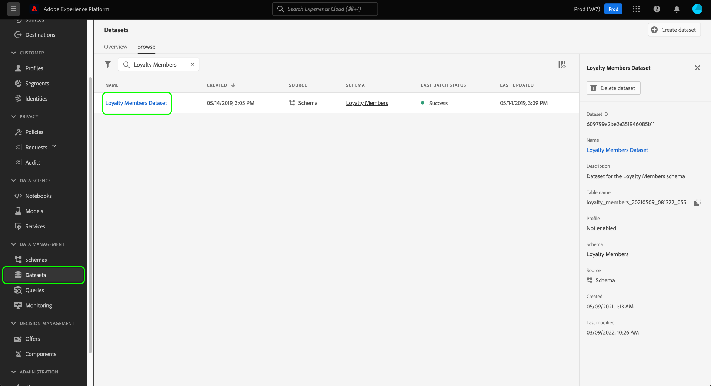

# Guia completo de governança de dados

Para controlar quais ações de marketing podem ser executadas em determinados conjuntos de dados e campos no Adobe Experience Platform, você deve configurar o seguinte:

1. [Aplicar rótulos](#labels) aos conjuntos de dados e campos cujo uso você deseja restringir.
1. [Configurar e ativar políticas de governança de dados](#policy) que determinam quais tipos de dados rotulados podem ser usados para determinadas ações de marketing.
1. [Aplicar ações de marketing aos seus destinos](#destinations) para indicar quais políticas se aplicam aos dados enviados para esses destinos.

Depois de concluir a configuração de rótulos, políticas de governança e ações de marketing, você poderá [testar a aplicação de políticas](#test) para garantir que funcione conforme o esperado.

Este guia aborda todo o processo de configuração e aplicação de uma política de governança de dados na interface do usuário da plataforma. Para obter informações mais detalhadas sobre os recursos usados neste guia, consulte a documentação de visão geral sobre os seguintes tópicos:

* [Governança de dados do Adobe Experience Platform](./home.md)
* [Rótulos de uso de dados](./labels/overview.md)
* [Políticas de uso de dados](./policies/overview.md)
* [Aplicação de política](./enforcement/overview.md)

>[!NOTE]
>
>Este guia foca em como configurar e aplicar políticas para como os dados são usados ou ativados no Experience Platform. Se você estiver tentando restringir **acesso** aos dados em si para determinados usuários da Platform em sua organização, consulte o manual completo sobre [controle de acesso baseado em atributos](../access-control/abac/end-to-end-guide.md) em vez disso. O controle de acesso baseado em atributos também usa rótulos e políticas, mas para um caso de uso diferente da governança de dados.

## Aplicar rótulos {#labels}

Se houver um conjunto de dados específico no qual você deseja aplicar restrições de uso de dados, é possível [aplicar rótulos diretamente a esse conjunto de dados](#dataset-labels) ou campos específicos nesse conjunto de dados.

Como alternativa, você pode [aplicar rótulos a um esquema](#schema-labels) para que todos os conjuntos de dados baseados nesse esquema herdem os mesmos rótulos.

>[!NOTE]
>
>Para obter mais informações sobre os diferentes rótulos de uso de dados e seu uso pretendido, consulte a [referência de rótulos de uso de dados](./labels/reference.md). Se as etiquetas principais disponíveis não cobrirem todos os casos de uso desejados, você pode [definir seus próprios rótulos personalizados](./labels/user-guide.md#manage-custom-labels) também.

### Aplicar rótulos a um conjunto de dados {#dataset-labels}

Selecionar **[!UICONTROL Conjuntos de dados]** na navegação à esquerda, selecione o nome do conjunto de dados ao qual deseja aplicar rótulos. Opcionalmente, é possível usar o campo de pesquisa para restringir a lista de conjuntos de dados exibidos.

A visualização de detalhes do conjunto de dados é exibida. Selecione o **[!UICONTROL Governança de dados]** para exibir uma lista dos campos do conjunto de dados e quaisquer rótulos que já foram aplicados a eles. Marque as caixas de seleção ao lado dos campos aos quais você deseja adicionar rótulos e selecione **[!UICONTROL Editar rótulos de governança]** no painel direito.

>[!NOTE]
>
>Se quiser adicionar rótulos a todo o conjunto de dados, marque a caixa de seleção ao lado de **[!UICONTROL Nome do campo]** para realçar todos os campos antes de selecionar **[!UICONTROL Editar rótulos de governança]**.
>
>

Na próxima caixa de diálogo, selecione os rótulos que deseja aplicar aos campos do conjunto de dados escolhidos anteriormente. Quando terminar, selecione **[!UICONTROL Salvar alterações]**.

Continue seguindo as etapas acima para aplicar rótulos a campos diferentes (ou conjuntos de dados diferentes), conforme necessário. Quando terminar, você poderá continuar com a próxima etapa do [ativação de políticas de governança de dados](#policy).

### Aplicar rótulos a um esquema {#schema-labels}

Selecionar **[!UICONTROL Esquemas]** na navegação à esquerda, selecione o schema ao qual deseja adicionar rótulos na lista.

>[!TIP]
>
>Se não tiver certeza de qual esquema se aplica a um conjunto de dados específico, selecione **[!UICONTROL Conjuntos de dados]** na navegação à esquerda, selecione o link na guia **[!UICONTROL Esquema]** para o conjunto de dados desejado. Selecione o nome do esquema no popover exibido para abri-lo no Editor de esquemas.
>
>

A estrutura do schema aparece no Editor de esquemas. Aqui, selecione a variável **[!UICONTROL Rótulos]** para mostrar uma visualização de lista dos campos do esquema e dos rótulos que já foram aplicados a eles. Marque as caixas de seleção ao lado dos campos aos quais você deseja adicionar rótulos e selecione **[!UICONTROL Editar rótulos de governança]** no painel direito.

>[!NOTE]
>
>Se quiser adicionar rótulos a todos os campos no esquema, selecione o ícone de lápis na linha superior.
>
>

Na próxima caixa de diálogo, selecione os rótulos que deseja aplicar aos campos de esquema escolhidos anteriormente. Quando terminar, selecione **[!UICONTROL Salvar]**.

Continue seguindo as etapas acima para aplicar rótulos a campos diferentes (ou esquemas diferentes), conforme necessário. Quando terminar, você poderá continuar com a próxima etapa do [ativação de políticas de governança de dados](#policy).

## Habilitar políticas de governança de dados {#policy}

Depois de aplicar rótulos aos seus esquemas e/ou conjuntos de dados, você pode criar políticas de governança de dados que restringem as ações de marketing para as quais determinados rótulos podem ser usados.

Selecionar **[!UICONTROL Políticas]** na navegação à esquerda, para ver uma lista das políticas principais definidas pelo Adobe, bem como quaisquer políticas personalizadas criadas anteriormente pela sua organização.

Cada rótulo principal tem uma política principal associada que, quando ativada, impõe as restrições de ativação apropriadas a quaisquer dados que contenham esse rótulo. Para habilitar uma política principal, selecione-a na lista e, em seguida, selecione a opção **[!UICONTROL Status da política]** alternar para **[!UICONTROL Ativado]**.

Se as políticas principais disponíveis não abrangerem todos os seus casos de uso (como quando você está empregando rótulos personalizados definidos em sua organização), é possível definir uma política personalizada. No **[!UICONTROL Políticas]** espaço de trabalho, selecione **[!UICONTROL Criar política]**.

![Imagem mostrando o [!UICONTROL Criar política] botão que está sendo selecionado na interface](./images/e2e/create-policy.png)

Uma janela pop-up é exibida, solicitando que você selecione o tipo de política que deseja criar. Selecionar **[!UICONTROL Política de governança de dados]** e selecione **[!UICONTROL Continuar]**.

![Imagem mostrando o [!UICONTROL Política de governança de dados] opção que está sendo selecionada](./images/e2e/governance-policy.png)

Na próxima tela, forneça um **[!UICONTROL Nome]** e opcional **[!UICONTROL Descrição]** para a política. Na tabela abaixo, selecione os rótulos que você deseja que esta política verifique. Em outras palavras, esses são os rótulos que a política impedirá que sejam usados para as ações de marketing especificadas na próxima etapa.

Se você selecionar vários rótulos, poderá usar as opções no painel direito para determinar se todos os rótulos devem estar presentes para que a política imponha restrições de uso ou se apenas um dos rótulos precisa estar presente. Quando terminar, selecione **[!UICONTROL Próxima]**.

Na próxima tela, selecione as ações de marketing para as quais essa política restringirá a utilização dos rótulos selecionados anteriormente. Clique em **[!UICONTROL Avançar]** para continuar.

A tela final mostra um resumo dos detalhes da política e as ações que ela restringirá para quais rótulos. Selecionar **[!UICONTROL Concluir]** para criar a política.

A política é criada, mas está definida como [!UICONTROL Desabilitado] por padrão. Selecione a política na lista e defina o **[!UICONTROL Status da política]** alternar para **[!UICONTROL Ativado]** para ativar a política.

Continue seguindo as etapas acima para criar e ativar as políticas necessárias antes de passar para a próxima etapa.

## Gerenciar ações de marketing para destinos {#destinations}

Para que suas políticas ativadas determinem com precisão quais dados podem ser ativados para um destino, é necessário atribuir ações de marketing específicas a esse destino.

Por exemplo, considere uma política ativada que impeça quaisquer dados que contenham uma `C2` de ser usado para a ação de marketing &quot;[!UICONTROL Exportar para terceiros]&quot;. Ao ativar dados para um destino, a política verifica quais ações de marketing estão presentes no destino. Se &quot;[!UICONTROL Exportar para terceiros]&quot; estiver presente, tentando ativar dados com um `C2` rótulo resulta em uma violação de política. Se &quot;[!UICONTROL Exportar para terceiros]&quot; não estiver presente, a política não será imposta para o destino e os dados com `C2` rótulos podem ser ativados livremente.

Quando [conectar um destino na interface do usuário](../destinations/ui/connect-destination.md), o **[!UICONTROL Governança]** a etapa no fluxo de trabalho permite selecionar as ações de marketing que se aplicam a esse destino, que determinam quais políticas de governança de dados são aplicadas ao destino.

## Testar aplicação de política {#test}

Depois de rotular os dados, ativar as políticas de governança de dados e atribuir ações de marketing aos destinos, você pode testar se as políticas estão sendo aplicadas conforme esperado.

Se você configurar as coisas corretamente, ao tentar ativar dados restritos por suas políticas, a ativação será automaticamente negada e uma mensagem de violação de política será exibida, descrevendo informações detalhadas sobre a linhagem de dados que causou a violação.

Consulte o documento sobre [aplicação automática de política](./enforcement/auto-enforcement.md) para obter detalhes sobre como interpretar mensagens de violação de política.

## Próximas etapas

Este guia abordou as etapas necessárias para configurar e aplicar políticas de governança de dados em seus workflows de ativação. Para obter informações mais detalhadas sobre os componentes da Governança de dados envolvidos neste guia, consulte a seguinte documentação:

* [Rótulos de uso de dados](./labels/overview.md)
* [Políticas de uso de dados](./policies/overview.md)
* [Aplicação de política](./enforcement/overview.md)
