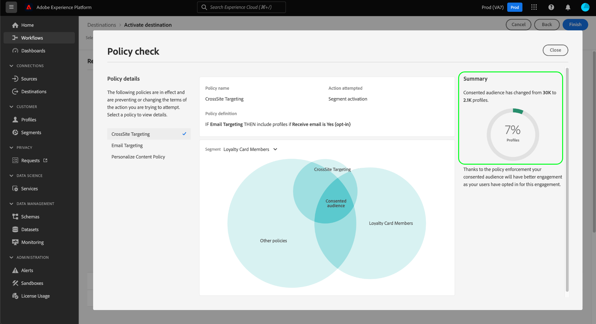

# Aplicação automática da política

Depois que os dados forem rotulados e as políticas de uso forem definidas, é possível impor a conformidade do uso de dados com as políticas. Ao ativar segmentos de público-alvo para destinos, o Adobe Experience Platform aplica automaticamente as políticas de uso caso ocorra qualquer violação.

## Pré-requisitos

Este guia requer um entendimento prático dos serviços da plataforma envolvidos na aplicação automática. Consulte a seguinte documentação para saber mais antes de continuar com este guia:

* [Governança de dados do Adobe Experience Platform](../home.md): A estrutura pela qual a Platform aplica a conformidade do uso de dados por meio do uso de rótulos e políticas.
* [Perfil do cliente em tempo real](../../profile/home.md): Fornece um perfil de consumidor unificado e em tempo real com base em dados agregados de várias fontes.
* [Serviço de segmentação do Adobe Experience Platform](../../segmentation/home.md): O mecanismo de segmentação em [!DNL Platform] usado para criar segmentos de público-alvo a partir dos perfis do cliente com base nos comportamentos e atributos do cliente.
* [Destinos](../../destinations/home.md): Os destinos são integrações pré-criadas com aplicativos comumente usados que permitem a ativação simplificada de dados da Platform para campanhas de marketing entre canais, campanhas por email, publicidade direcionada e muito mais.

## Fluxo de imposição {#flow}

O diagrama a seguir ilustra como a aplicação de política é integrada ao fluxo de dados da ativação do segmento:

Quando um segmento é ativado pela primeira vez, [!DNL Policy Service] Controlos das políticas aplicáveis com base nos seguintes fatores:

* Os rótulos de uso de dados aplicados aos campos e conjuntos de dados no segmento a ser ativado.
* O objetivo de marketing do destino.
* (Beta) Os perfis que consentiram ser incluídos na ativação do segmento, com base nas políticas de consentimento configuradas.

>[!NOTE]
>
>Se houver rótulos de uso de dados que tenham sido aplicados apenas a determinados campos em um conjunto de dados (em vez de todo o conjunto de dados), a imposição desses rótulos em nível de campo na ativação ocorrerá somente sob as seguintes condições:
>
>* Os campos são usados na definição do segmento.
>* Os campos são configurados como atributos projetados para o destino.

## Linhagem de dados {#lineage}

A linhagem de dados desempenha um papel fundamental na forma como as políticas são aplicadas na Plataforma. Em termos gerais, a linhagem de dados refere-se à origem de um conjunto de dados e o que acontece com ele (ou onde ele se move) ao longo do tempo.

No contexto da Governança de dados, a linhagem permite que os rótulos de uso de dados se propaguem de conjuntos de dados a serviços de downstream que consomem seus dados, como Perfil do cliente em tempo real e destinos. Isso permite que as políticas sejam avaliadas e aplicadas em vários pontos-chave na jornada dos dados por meio da plataforma, e fornece contexto aos consumidores de dados sobre o motivo da violação de uma política.

No Experience Platform, a aplicação da política está relacionada com a seguinte linhagem:

1. Os dados são assimilados na Platform e armazenados em **conjuntos de dados**.
1. Os perfis do cliente são identificados e construídos a partir desses conjuntos de dados ao mesclar fragmentos de dados de acordo com a variável **política de mesclagem**.
1. Grupos de perfis são divididos em **segmentos** com base em atributos comuns.
1. Os segmentos são ativados para downstream **destinos**.

Cada estágio na linha do tempo acima representa uma entidade que pode contribuir para a aplicação de políticas, conforme descrito na tabela abaixo:

| Estágio da linhagem de dados | Papel na aplicação da política |
| --- | --- |
| Conjunto de dados | Os conjuntos de dados contêm rótulos de uso de dados (aplicados no conjunto de dados ou no nível do campo) que definem para quais casos de uso o conjunto de dados inteiro ou campos específicos podem ser usados. Violações de política ocorrerão se um conjunto de dados ou campo contendo determinados rótulos for usado para uma finalidade restrita por uma política.  Todos os atributos de consentimento coletados de seus clientes também são armazenados em conjuntos de dados. Se você tiver acesso às políticas de consentimento (atualmente em beta), todos os perfis que não atenderem aos requisitos de atributo de consentimento de suas políticas serão excluídos dos segmentos ativados para um destino. |
| Política de mesclagem | As políticas de mesclagem são as regras que a Platform usa para determinar como os dados serão priorizados ao mesclar fragmentos de vários conjuntos de dados. Violações de política ocorrerão se suas políticas de mesclagem estiverem configuradas para que os conjuntos de dados com rótulos restritos sejam ativados em um destino. Consulte a [visão geral das políticas de mesclagem](../../profile/merge-policies/overview.md) para obter mais informações. |
| Segmento | As regras de segmento definem quais atributos devem ser incluídos nos perfis do cliente. Dependendo dos campos incluídos em uma definição de segmento, o segmento herdará quaisquer rótulos de uso aplicados a esses campos. Violações de política ocorrerão se você ativar um segmento cujos rótulos herdados são restritos pelas políticas aplicáveis do destino, com base em seu caso de uso de marketing. |
| Destino | Ao configurar um destino, uma ação de marketing (às vezes chamada de caso de uso de marketing) pode ser definida. Esse caso de uso correlaciona-se a uma ação de marketing, conforme definido em uma política. Em outras palavras, a ação de marketing que você define para um destino determina quais políticas de uso de dados e políticas de consentimento se aplicam a esse destino.  As violações da política de uso de dados ocorrem se você ativar um segmento cujos rótulos de uso são restritos para a ação de marketing do destino.  (Beta) Quando um segmento é ativado, todos os perfis que não contêm os atributos de consentimento necessários para a ação de marketing (conforme definido pelas suas políticas de consentimento) são excluídos do público-alvo ativado. |

>[!IMPORTANT]
>
>Algumas políticas de uso de dados podem especificar dois ou mais rótulos com uma relação AND. Por exemplo, uma política pode restringir uma ação de marketing se os rótulos `C1` E `C2` estão presentes, mas não restringem a mesma ação se apenas um desses rótulos estiver presente.
>
>Quando se trata de imposição automática, a estrutura de Governança de dados não considera a ativação de segmentos separados em um destino como uma combinação de dados. Portanto, o exemplo `C1 AND C2` a política **NOT** imposta se esses rótulos estiverem incluídos em segmentos separados. Em vez disso, essa política só é aplicada quando ambos os rótulos estão presentes no mesmo segmento após a ativação.

Quando ocorrem violações de política, as mensagens resultantes que aparecem na interface do usuário fornecem ferramentas úteis para explorar a linhagem de dados de contribuição da violação para ajudar a resolver o problema. Mais detalhes são fornecidos na próxima seção.

## Mensagens de aplicação de política {#enforcement}

As seções abaixo destacam as diferentes mensagens de imposição de política que aparecem na interface do usuário da plataforma:

* [Violação da política de uso de dados](#data-usage-violation)
* [Avaliação da política de consentimento](#consent-policy-evaluation)

### Violação da política de uso de dados {#data-usage-violation}

Se ocorrer uma violação de política ao tentar ativar um segmento (ou [fazer edições em um segmento já ativado](#policy-enforcement-for-activated-segments)) a ação é impedida e aparece uma portadora indicando que uma ou mais políticas foram violadas. Depois que uma violação é acionada, a variável **[!UICONTROL Salvar]** estiver desabilitado para a entidade que você está modificando até que os componentes apropriados sejam atualizados para estar em conformidade com as políticas de uso de dados.

Selecione uma violação de política na coluna esquerda do portador para exibir detalhes dessa violação.

A mensagem de violação fornece um resumo da política violada, incluindo as condições que a política está configurada para verificar, a ação específica que acionou a violação e uma lista de possíveis resoluções para o problema.

Um gráfico de linhagem de dados é exibido abaixo do resumo da violação, permitindo visualizar quais conjuntos de dados, políticas de mesclagem, segmentos e destinos estavam envolvidos na violação da política. A entidade que você está alterando está realçada no gráfico, indicando qual ponto no fluxo está causando a ocorrência da violação. Você pode selecionar um nome de entidade no gráfico para abrir a página de detalhes da entidade em questão.

Também é possível usar a variável **[!UICONTROL Filtro]** ícone () para filtrar as entidades exibidas por categoria. Pelo menos duas categorias devem ser selecionadas para que os dados sejam exibidos.

Selecionar **[!UICONTROL Exibição de lista]** para exibir a linhagem de dados como uma lista. Para voltar ao gráfico visual, selecione **[!UICONTROL Exibição do caminho]**.

### Avaliação da política de consentimento (Beta) {#consent-policy-evaluation}

>[!IMPORTANT]
>
>Atualmente, as políticas de consentimento estão em beta e sua organização pode ainda não ter acesso a elas.

Se tiver [políticas de consentimento criadas](../policies/user-guide.md#consent-policy) e estiverem ativando um segmento para um destino, você pode ver como suas políticas de consentimento afetam a porcentagem de perfis incluídos na ativação.

#### Avaliação de pré-ativação

Assim que você alcançar o **[!UICONTROL Revisão]** step when [ativação de um destino](../../destinations/ui/activation-overview.md), selecione **[!UICONTROL Exibir políticas aplicadas]**.

Uma caixa de diálogo de verificação de política é exibida mostrando uma pré-visualização de como suas políticas de consentimento afetam o público-alvo consentido segmento ativado.

A caixa de diálogo mostra o público-alvo consentido para um segmento de cada vez. Para visualizar a avaliação de política de um segmento diferente, use o menu suspenso acima do diagrama para selecionar um na lista.

Use o painel esquerdo para alternar entre as políticas de consentimento aplicáveis para o segmento selecionado. As políticas que não estão selecionadas são representadas no &quot;[!UICONTROL Outras políticas]&quot; do diagrama.

O diagrama exibe a sobreposição entre três grupos de perfis:

1. Perfis qualificados para o segmento selecionado
1. Perfis qualificados para a política de consentimento selecionada
1. Perfis qualificados para as outras políticas de consentimento aplicáveis para o segmento (referido como &quot;[!UICONTROL Outras políticas]&quot; no diagrama)

Os perfis qualificados para os três grupos acima representam o público-alvo consentido para o segmento selecionado, resumido no painel direito.

Passe o mouse sobre um dos públicos-alvo no diagrama para mostrar o número de perfis que ele contém.

O público-alvo consentido é representado pela sobreposição central do diagrama e pode ser destacado como as outras seções.

#### Aplicação da execução do fluxo

Quando os dados são ativados para um destino, os detalhes da execução do fluxo mostram o número de identidades que foram excluídas devido às políticas de consentimento ativas.

## Aplicação de políticas para segmentos ativados {#policy-enforcement-for-activated-segments}

A aplicação de políticas ainda se aplica aos segmentos depois de terem sido ativados, restringindo quaisquer alterações a um segmento ou ao seu destino que resultariam em uma violação de política. Devido a como [linhagem de dados](#lineage) funciona na aplicação de políticas, qualquer uma das ações a seguir pode possivelmente acionar uma violação:

* Atualização de rótulos de uso de dados
* Alteração de conjuntos de dados para um segmento
* Alterar predicados do segmento
* Alteração das configurações de destino

Se qualquer uma das ações acima acionar uma violação, essa ação será impedida de ser salva e uma mensagem de violação de política será exibida, garantindo que os segmentos ativados continuem em conformidade com as políticas de uso de dados ao serem modificados.

## Próximas etapas

Este documento cobriu como a aplicação automática de política funciona no Experience Platform. Para obter etapas sobre como integrar programaticamente a aplicação de políticas em seus aplicativos usando chamadas de API, consulte o guia em [Aplicação baseada em API](./api-enforcement.md).
