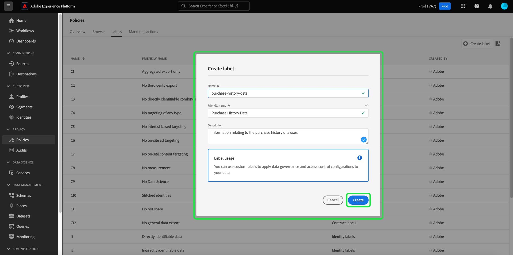

# Gerenciar rótulos de uso de dados na interface {#user-guide}

>[!CONTEXTUALHELP]
>id="platform_privacyConsole_dataGovernance_description"
>title="Governar o uso de dados na plataforma"
>abstract="<h2>Descrição</h2>
A estrutura de Governança de dados na Experience Platform permite rotular atributos e esquemas de acordo com restrições de uso de dados e configurar políticas que identifiquem e respeitem essas restrições para ações de marketing específicas.
"

Este guia do usuário aborda etapas para trabalhar com rótulos de uso de dados na [!DNL Experience Platform] interface do usuário.

## Gerenciar rótulos {#manage-labels}

Para aplicar rótulos aos seus dados, é necessário **[!UICONTROL Gerenciar rótulos de uso]** permissão para uso na sandbox de produção padrão chamada &quot;prod&quot;. Para criar um rótulo personalizado, você também deve ter direitos administrativos no perfil do produto. Cada organização tem apenas uma lista de rótulos aplicáveis e, no momento, não há suporte para a exclusão de rótulos.

Consulte o guia sobre como [configurar permissões](https://experienceleague.adobe.com/docs/platform-learn/getting-started-for-data-architects-and-data-engineers/configure-permissions.html?lang=pt-BR) ou o [visão geral do controle de acesso](../../access-control/home.md) para obter mais informações sobre como atribuir uma permissão. Se você não tiver acesso ao Admin Console da sua organização, entre em contato com o administrador da organização.

## Gerenciar rótulos no nível do esquema

Você pode adicionar rótulos diretamente a um esquema ou campos dentro desse esquema. Quaisquer campos aplicados no nível do esquema serão propagados para todos os conjuntos de dados baseados nesse esquema.

>[!NOTE]
>
>Se suas políticas de uso de dados foram criadas antes de você rotular o campo, é possível encontrar uma caixa de diálogo de violação de política de governança ao aplicar rótulos ao novo esquema. Esta caixa de diálogo indica que a aplicação deste rótulo violará uma política de uso existente. Use o diagrama de linhagem de dados para entender quais outras alterações de configuração precisam ser feitas antes de você poder adicionar o rótulo ao campo de esquema.
>
>
>
>Consulte a [documentação de violação da política de uso de dados](https://experienceleague.adobe.com/en/docs/experience-platform/data-governance/enforcement/auto-enforcement#data-usage-violation) para obter mais informações sobre violações parciais de políticas.

Para gerenciar rótulos de uso de dados no nível do esquema, você deve selecionar um esquema existente ou criar um novo. Depois de fazer logon no Adobe Experience Platform, selecione **[!UICONTROL Esquemas]** no painel de navegação esquerdo para abrir a **[!UICONTROL Esquemas]** espaço de trabalho. Essa página lista todos os esquemas criados que pertencem à sua organização, juntamente com detalhes úteis relacionados a cada esquema.

A próxima seção fornece etapas para criar um novo esquema ao qual aplicar rótulos. Se quiser editar os rótulos de um esquema existente, selecione o esquema na lista e vá para [adição de rótulos de uso de dados ao esquema](#add-labels).

### Criar um novo esquema

Para criar um novo esquema, selecione **[!UICONTROL Criar esquema]** no canto superior direito da **[!UICONTROL Esquemas]** espaço de trabalho. Consulte o guia sobre [como criar um esquema usando o Editor de esquemas](../../xdm/tutorials/create-schema-ui.md#create) para obter instruções completas. Como alternativa, você pode [criar um esquema usando a API do Registro de esquema](../../xdm/tutorials/create-schema-api.md) se necessário.

### Adicionar rótulos de uso de dados a um esquema {#add-labels-to-schema}

Depois de criar um novo esquema ou selecionar um esquema existente na lista da [!UICONTROL Procurar] guia do [!UICONTROL Esquemas] selecione um campo do esquema no Editor de esquemas. No [!UICONTROL Propriedades do campo] barra lateral, selecione **[!UICONTROL Aplicar rótulos de acesso e governança de dados]**.

É exibida uma caixa de diálogo com a qual é possível aplicar e gerenciar rótulos de uso de dados no nível do esquema e do campo. Consulte o tutorial XDM para obter instruções completas sobre [como adicionar ou editar rótulos de uso de dados para esquemas XDM](../../xdm/tutorials/labels.md#select-schema-field).

### Adicionar rótulos de uso de dados a um conjunto de dados específico {#add-labels-to-dataset}

>[!CONTEXTUALHELP]
>id="platform_privacyConsole_dataGovernance_instructions"
>title="Instruções"
>abstract="<ol><li>Selecione <a href="https://experienceleague.adobe.com/docs/experience-platform/data-governance/labels/user-guide.html?lang=pt-BR">Conjuntos de dados</a> na navegação à esquerda e selecione o conjunto de dados cujos dados você deseja restringir.</li><li>Na visualização de detalhes do conjunto de dados, selecione a guia <b>Governança de dados</b>.</li><li>Selecione os campos do conjunto de dados que deseja restringir e selecione <b>Editar rótulos de governança</b> para rotular os dados com base em restrições de uso.</li><li>Depois de rotular os dados, selecione <a href="https://experienceleague.adobe.com/docs/experience-platform/data-governance/policies/overview.html?lang=pt-BR">Políticas</a> na navegação à esquerda, e selecione <b>Criar Política</b>.</li><li>Escolha criar uma <a href="https://experienceleague.adobe.com/docs/experience-platform/data-governance/policies/user-guide.html#create-governance-policy">Política de governança de dados</a>, em seguida, selecione os rótulos de uso de dados que a política aplicará à política.</li><li>Selecione as ações de marketing que a política negará para quaisquer dados que contenham esses rótulos. Depois que a política for criada, selecione-a na lista e ative-a usando o botão no painel direito.</li><li>Para cada política ativada, a Platform impede que quaisquer dados contendo os rótulos especificados sejam usados para as ações de marketing definidas. Essa imposição ocorre automaticamente quando você tenta ativar dados rotulados para um destino com ações de marketing associadas (casos de uso).</li></ol>"

>[!IMPORTANT]
>
>Os rótulos não podem mais ser aplicados a campos no nível do conjunto de dados. Esse workflow foi substituído em favor da aplicação de rótulos no nível do schema. Quaisquer rótulos aplicados anteriormente no nível do objeto do conjunto de dados ainda serão compatíveis por meio da interface do usuário da plataforma até 31 de maio de 2024. Para garantir que seus rótulos sejam consistentes em todos os esquemas, todos os rótulos anteriormente anexados a campos no nível do conjunto de dados devem ser migrados para o nível do esquema por você no ano seguinte. Consulte a documentação para obter instruções sobre [como migrar rótulos aplicados anteriormente do conjunto de dados para o nível do esquema](../e2e.md#migrate-labels).

Os rótulos podem ser aplicados a todo o conjunto de dados do **[!UICONTROL Governança de dados]** guia do **[!UICONTROL Conjuntos de dados]** espaço de trabalho. O espaço de trabalho permite gerenciar rótulos de uso de dados no nível do conjunto de dados.

![A variável [!UICONTROL Governança de dados] guia do [!UICONTROL Conjuntos de dados] espaço de trabalho com a Governança de dados destacada.](../images/labels/dataset-governance.png)

Para editar rótulos de uso de dados no nível do conjunto de dados, comece selecionando o ícone de lápis () na linha do nome do conjunto de dados.

![A variável [!UICONTROL Governança de dados] guia do [!UICONTROL Conjuntos de dados] espaço de trabalho com o ícone editar lápis realçado.](../images/labels/dataset-level-edit.png)

A variável **[!UICONTROL Editar rótulos de governança]** será aberta. Na caixa de diálogo, marque as caixas ao lado dos rótulos que deseja aplicar ao conjunto de dados. Lembre-se de que esses rótulos serão herdados por todos os campos no conjunto de dados. A variável **[!UICONTROL Rótulos aplicados]** atualizações de cabeçalho ao marcar cada caixa, mostrando os rótulos escolhidos. Depois de selecionar os rótulos desejados, selecione **[!UICONTROL Salvar alterações]**.

A variável **[!UICONTROL Governança de dados]** O espaço de trabalho será exibido novamente, mostrando os rótulos que você aplicou no nível do conjunto de dados na linha inicial da tabela. Você também pode ver os rótulos, indicados por cartões individuais, que são herdados para cada um dos campos no conjunto de dados.

![A variável [!UICONTROL Governança de dados] guia do [!UICONTROL Conjuntos de dados] espaço de trabalho com rótulos de nível de conjunto de dados aplicados e rótulos de campo de conjunto de dados herdados destacados.](../images/labels/applied-dataset-labels.png)

### Remover rótulos de um conjunto de dados {#remove-labels-from-a-dataset}

Os rótulos adicionados no nível do conjunto de dados têm um &quot;x&quot; ao lado do cartão. Isso permite remover os rótulos de todo o conjunto de dados. Os rótulos herdados ao lado de cada campo não têm um &quot;x&quot; ao lado deles e aparecem &quot;esmaecidos&quot;. Esses **os rótulos herdados são somente leitura**, o que significa que eles não podem ser removidos ou editados no nível do campo.

<!-- ## View labels at the dataset field level {#view-labels-at-dataset-field-level} -->

<!-- To view labels inherited by the dataset from the schema level, select **[!UICONTROL Datasets]** to navigate to the datasets workspace and select the relevant dataset from the list. 

Next, select the **[!UICONTROL Data Governance]** tab to show the labels that have been applied to the dataset. You can also see that the labels are inherited down to each of the fields within the dataset.

The inherited labels beside each field do not have an "x" next to them and appear "greyed out" with no ability to remove or edit. This is because **inherited fields are read-only**, meaning they cannot be removed at the field level. -->

<!--Beleive can cut above here  -->

A variável **[!UICONTROL Mostrar rótulos herdados]** a opção está ativada por padrão, o que permite visualizar os rótulos herdados do esquema para seus campos. A desativação da alternância oculta todos os rótulos herdados no conjunto de dados.

<!-- Labels applied to the dataset appear in read-only form within the **[!UICONTROL Data Governance]** view for that dataset. 

 -->

>[!NOTE]
>
>Os rótulos aplicados antes da desativação do recurso de rotulagem do conjunto de dados podem ser removidos do conjunto de dados localizando o conjunto de dados relevante e selecionando o ícone de cancelamento no rótulo.
>
>Consulte a documentação para obter instruções sobre [como migrar rótulos aplicados anteriormente do conjunto de dados para o nível do esquema](../e2e.md#migrate-labels).

## Gerenciar rótulos personalizados {#manage-custom-labels}

>[!CONTEXTUALHELP]
>id="platform_governance_createlabels"
>title="Criar rótulos"
>abstract="Os rótulos permitem categorizar conjuntos de dados e campos de acordo com as políticas de uso que se aplicam a esses dados. A Platform fornece um conjunto padrão de rótulos para você usar, mas também é possível criar rótulos personalizados específicos da sua organização."

Você pode criar seus próprios rótulos de uso personalizados na **[!UICONTROL Políticas]** espaço de trabalho no [!DNL Experience Platform] IU. Selecionar **[!UICONTROL Políticas]** no painel de navegação esquerdo, selecione **[!UICONTROL Rótulos]** para exibir uma lista de rótulos existentes. Aqui, selecione **[!UICONTROL Criar rótulo]**.

A variável **[!UICONTROL Criar rótulo]** será exibida. Aqui, forneça as seguintes informações para o novo rótulo:

* **[!UICONTROL Nome]**: um identificador exclusivo para o rótulo. Esse valor é usado para fins de pesquisa e, portanto, deve ser curto e conciso.
* **[!UICONTROL Nome amigável]**: um nome de exibição amigável para o rótulo.
* **[!UICONTROL Descrição]**: (opcional) uma descrição do rótulo para fornecer mais contexto.

Quando terminar, selecione **[!UICONTROL Criar]**.

A caixa de diálogo é fechada e o rótulo personalizado recém-criado é exibido na lista sob o **[!UICONTROL Rótulos]** guia.

O rótulo agora pode ser selecionado em **[!UICONTROL Rótulos personalizados]** ao editar rótulos de uso para conjuntos de dados e campos ou ao criar políticas de uso de dados.

## Próximas etapas

Agora que você adicionou rótulos de uso de dados no nível do conjunto de dados e do campo, é possível começar a assimilar dados no [!DNL Experience Platform]. Para saber mais, comece lendo o [documentação de assimilação de dados](../../ingestion/home.md).

Agora também é possível definir políticas de uso de dados com base nos rótulos aplicados. Para obter mais informações, consulte [visão geral das políticas de uso de dados](../policies/overview.md).

<!-- The workflow of this video is now outdated. This can be enabled once the video has been updated

## Additional resources

The following video is intended to support your understanding of Data Governance, and outlines how to apply labels to a dataset and individual fields.

>[!VIDEO](https://video.tv.adobe.com/v/29709?quality=12&enable10seconds=on&speedcontrol=on) -->
