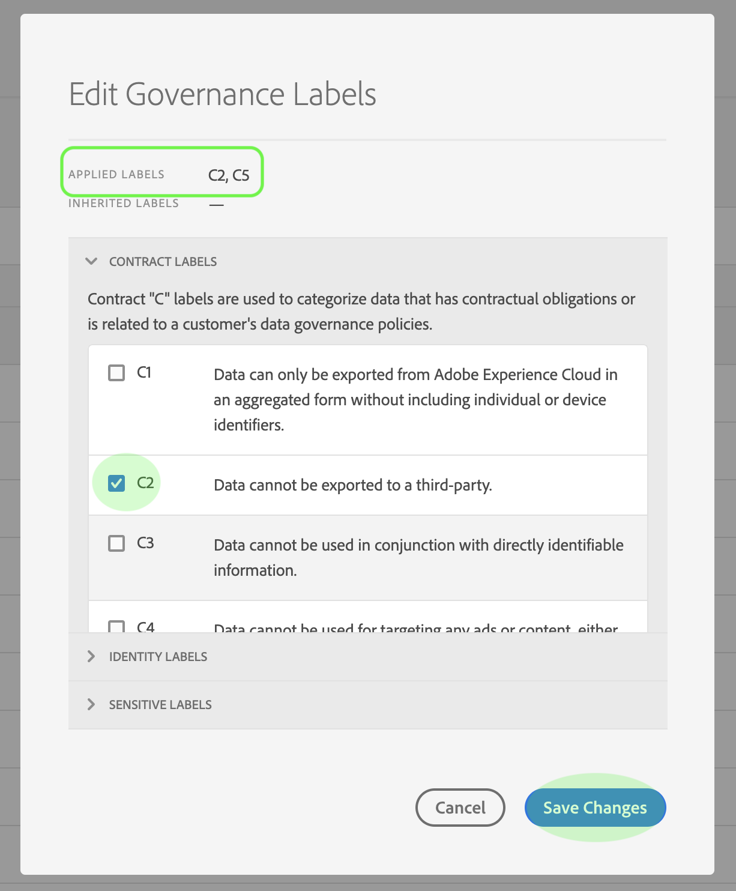
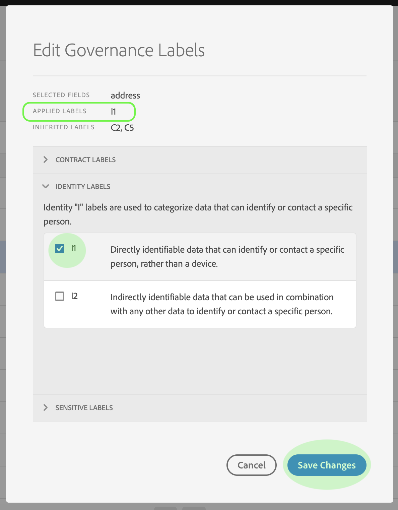

# Guia do usuário de etiquetas de uso de dados

Este guia do usuário aborda as etapas para trabalhar com rótulos de uso de dados (também conhecidos como rótulos DULE) na interface do usuário da plataforma Experience. Antes de usar o guia, consulte a visão geral [do](../home.md) Data Governance para obter uma introdução mais robusta à estrutura DULE.

## Gerenciamento de rótulos de uso de dados no nível do conjunto de dados

Para gerenciar rótulos de uso de dados no nível do conjunto de dados, é necessário selecionar um conjunto de dados existente ou criar um novo. Depois de fazer logon na Adobe Experience Platform, selecione **Conjuntos** de dados na navegação à esquerda para abrir a área de trabalho _Conjuntos_ de dados. Esta página lista todos os conjuntos de dados criados pertencentes à sua organização, juntamente com detalhes úteis relacionados a cada conjunto de dados.

A próxima seção fornece etapas para a criação de um novo conjunto de dados para aplicar rótulos. Se desejar editar rótulos para um conjunto de dados existente, selecione o conjunto de dados na lista e pule para frente para [adicionar rótulos de uso de dados ao conjunto de dados](#add-labels).

### Criar um novo conjunto de dados

>[!NOTE] Neste exemplo, um conjunto de dados é criado usando um schema do Modelo de Dados de Experiência (XDM) pré-configurado. Para obter mais informações sobre schemas XDM, consulte a visão geral [do Sistema](../../xdm/home.md) XDM e [as noções básicas da composição](../../xdm/schema/composition.md)do schema.

Para criar um novo conjunto de dados, clique em **Criar conjunto** de dados no canto superior direito da área de trabalho _Conjuntos_ de dados.

A tela _Criar conjunto de dados_ é exibida. Aqui, clique em **Criar conjunto de dados a partir do Schema**.

A tela _Selecionar Schema_ é exibida, lista todos os schemas disponíveis que você pode usar para criar um conjunto de dados. Clique no botão de opção ao lado de um schema para selecioná-lo. A seção _Schemas_ no lado direito exibe detalhes adicionais sobre o schema selecionado. Depois de selecionar um schema, clique em **Avançar**.

A tela _Configurar conjunto de dados_ é exibida. Forneça um **nome** (obrigatório) e uma **descrição** (opcional, mas recomendado) para seu novo conjunto de dados, em seguida, clique em **Concluir**.

A página Atividade _do Conjunto de_ Dados é exibida, exibindo informações sobre o conjunto de dados recém-criado. Neste exemplo, o conjunto de dados é denominado &quot;Membros de Fidelidade&quot;, portanto, a navegação superior mostra _Conjuntos de Dados > Membros_ de Fidelidade.

### Adicionar rótulos de uso de dados ao conjunto de dados {#add-labels}

Depois de criar um novo conjunto de dados ou selecionar um conjunto de dados existente na lista na área de trabalho _Conjuntos_ de dados, clique em Controle **de** dados para abrir a área de trabalho _Controle_ de dados. A área de trabalho permite gerenciar rótulos de uso de dados no nível do conjunto de dados e no nível do campo.

Para editar rótulos de uso de dados no nível do conjunto de dados, clique no start ao lado do nome do conjunto de dados.

A caixa de diálogo _Editar rótulos_ de controle é aberta. Na caixa de diálogo, marque as caixas ao lado dos rótulos que deseja aplicar ao conjunto de dados. Lembre-se de que esses rótulos serão herdados por todos os campos no conjunto de dados. O cabeçalho Rótulos __ Aplicados é atualizado conforme você marca cada caixa, mostrando os rótulos que você escolheu. Depois de selecionar os rótulos desejados, clique em **Salvar alterações**.

 

A área de trabalho do _Data Governance_ é exibida novamente, mostrando os rótulos que você aplicou no nível do conjunto de dados. Você também pode ver que os rótulos são herdados para cada um dos campos no conjunto de dados.

Observe que um &quot;x&quot; é exibido ao lado dos rótulos no nível do conjunto de dados, permitindo que você remova os rótulos. Os rótulos herdados ao lado de cada campo não têm um &quot;x&quot; ao lado deles e aparecem &quot;acinzentados&quot; sem a capacidade de remover ou editar. Isso ocorre porque os campos **herdados são somente** leitura, o que significa que não podem ser removidos no nível do campo.

A opção **Mostrar rótulos** herdados está ativada por padrão, o que permite que você veja quaisquer rótulos herdados do conjunto de dados para seus campos. A alternância oculta qualquer rótulo herdado no conjunto de dados.

## Gerenciamento de rótulos de uso de dados no nível do campo do conjunto de dados

Continuando o fluxo de trabalho para [adicionar e editar rótulos de uso de dados no nível](#add-labels)do conjunto de dados, você também pode gerenciar rótulos no nível do campo na área de trabalho do _Data Governance_ para esse conjunto de dados.

Para aplicar rótulos de uso de dados a um campo individual, marque a caixa de seleção ao lado do nome do campo e clique em **Editar rótulos** de controle.

A caixa de diálogo _Editar rótulos_ de controle é exibida. A caixa de diálogo exibe cabeçalhos mostrando campos selecionados, rótulos aplicados e rótulos herdados. Observe que os rótulos herdados (C2 e C5) ficam esmaecidos na caixa de diálogo. Eles são rótulos somente leitura herdados do nível do conjunto de dados e, portanto, só podem ser editados no nível do conjunto de dados.

 

Selecione rótulos de nível de campo clicando na caixa de seleção ao lado de cada rótulo que você deseja usar. À medida que você seleciona rótulos, o cabeçalho Rótulos __ aplicados é atualizado para mostrar os rótulos aplicados aos campos exibidos no cabeçalho Campos __ selecionados. Depois de terminar de selecionar rótulos de nível de campo, clique em **Salvar alterações**.

 

A área de trabalho do _Data Governance_ é exibida novamente, exibindo os rótulos em nível de campo selecionados na linha ao lado do nome do campo. Observe que a etiqueta de nível de campo tem um &quot;x&quot; ao lado, permitindo que você remova a etiqueta.

Você pode repetir essas etapas para continuar adicionando e editando rótulos de nível de campo para campos adicionais, incluindo a seleção de vários campos para aplicar rótulos de nível de campo simultaneamente.

É importante lembrar que a herança move somente do nível superior para baixo (conjunto de dados → campos), o que significa que os rótulos aplicados no nível do campo não são propagados para outros campos ou conjuntos de dados.

## Próximas etapas

Agora que você adicionou rótulos de uso de dados no nível do conjunto de dados e do campo, é possível começar a assimilar dados na Experience Platform. Para saber mais, leia a documentação [de ingestão de](../../ingestion/home.md)dados em start.

## Recursos adicionais

O vídeo a seguir tem como objetivo oferecer suporte para a compreensão do Data Governance e descreve como aplicar rótulos a um conjunto de dados e a campos individuais.

>[!VIDEO](https://video.tv.adobe.com/v/29709?quality=12&enable10seconds=on&speedcontrol=on)
