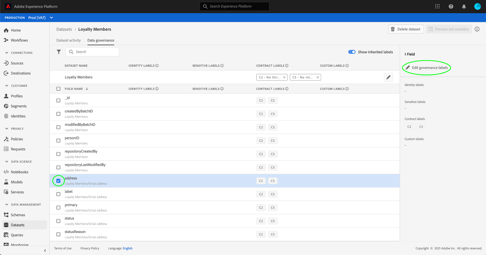

# Gerenciar rótulos de uso de dados na interface do usuário

Este guia do usuário aborda as etapas para trabalhar com rótulos de uso de dados na interface do usuário [!DNL Experience Platform]. Antes de usar o guia, consulte a [[!DNL Data Governance] visão geral](../home.md) para obter uma introdução mais robusta à estrutura [!DNL Data Governance].

## Gerenciar rótulos no nível do conjunto de dados

Para gerenciar rótulos de uso de dados no nível do conjunto de dados, é necessário selecionar um conjunto de dados existente ou criar um novo. Depois de fazer logon no Adobe Experience Platform, selecione **[!UICONTROL Datasets]** na navegação à esquerda para abrir o espaço de trabalho **[!UICONTROL Datasets]**. Esta página lista todos os conjuntos de dados criados pertencentes à sua organização, juntamente com detalhes úteis relacionados a cada conjunto de dados.

A próxima seção fornece etapas para criar um novo conjunto de dados para aplicar rótulos. Se desejar editar rótulos para um conjunto de dados existente, selecione o conjunto de dados na lista e pule para [adicionar rótulos de uso de dados ao conjunto de dados](#add-labels).

### Criar um novo conjunto de dados

>[!NOTE]
>
>Neste exemplo, um conjunto de dados é criado usando um esquema pré-configurado [!DNL Experience Data Model] (XDM). Para obter mais informações sobre esquemas XDM, consulte a [Visão geral do sistema XDM](../../xdm/home.md) e as [noções básicas da composição do esquema](../../xdm/schema/composition.md).

Para criar um novo conjunto de dados, selecione **[!UICONTROL Criar conjunto de dados]** no canto superior direito do espaço de trabalho **[!UICONTROL Conjuntos de dados]**.

A tela **[!UICONTROL Criar conjunto de dados]** é exibida. Aqui, selecione **[!UICONTROL Criar conjunto de dados do esquema]**.

A tela **[!UICONTROL Selecionar esquema]** é exibida, listando todos os esquemas disponíveis que você pode usar para criar um conjunto de dados. Selecione o botão de opção ao lado de um schema para selecioná-lo. A seção **[!UICONTROL Schemas]** no lado direito exibe detalhes adicionais sobre o schema selecionado. Depois de selecionar um schema, selecione **[!UICONTROL Next]**.

A tela **[!UICONTROL Configurar conjunto de dados]** é exibida. Forneça um nome (obrigatório) e uma descrição (opcional, mas recomendado) para seu novo conjunto de dados, em seguida, selecione **[!UICONTROL Finish]**.

A página **[!UICONTROL Atividade do conjunto de dados]** é exibida, exibindo informações sobre o conjunto de dados recém-criado. Neste exemplo, o conjunto de dados é denominado &quot;Membros de fidelidade&quot;, portanto, a navegação superior mostra **Conjuntos de dados > Membros de fidelidade**.

### Adicionar rótulos de uso de dados ao conjunto de dados {#add-labels}

Depois de criar um novo conjunto de dados ou selecionar um conjunto de dados existente na lista no espaço de trabalho **[!UICONTROL Conjuntos de dados]**, selecione **[!UICONTROL Governança de dados]** para abrir o espaço de trabalho **[!UICONTROL Governança de dados]**. O espaço de trabalho permite gerenciar rótulos de uso de dados no nível do conjunto de dados e no nível do campo.

Para editar rótulos de uso de dados no nível do conjunto de dados, comece selecionando o ícone de lápis ao lado do nome do conjunto de dados.

A caixa de diálogo **[!UICONTROL Editar rótulos de governança]** é aberta. Na caixa de diálogo , marque as caixas ao lado dos rótulos que deseja aplicar ao conjunto de dados. Lembre-se de que esses rótulos serão herdados por todos os campos no conjunto de dados. O cabeçalho **[!UICONTROL Rótulos Aplicados]** é atualizado conforme você marca cada caixa, mostrando os rótulos escolhidos. Após selecionar os rótulos desejados, selecione **[!UICONTROL Salvar alterações]**.

O espaço de trabalho **[!UICONTROL Governança de dados]** é exibido novamente, mostrando os rótulos que você aplicou no nível do conjunto de dados. Você também pode ver que os rótulos são herdados para cada um dos campos no conjunto de dados.

Observe que um &quot;x&quot; é exibido ao lado dos rótulos no nível do conjunto de dados, permitindo remover os rótulos. Os rótulos herdados ao lado de cada campo não têm um &quot;x&quot; ao lado e aparecem &quot;esmaecidos&quot; sem capacidade de remover ou editar. Isso ocorre porque **os campos herdados são somente leitura**, o que significa que não podem ser removidos no nível do campo.

A opção **[!UICONTROL Mostrar rótulos herdados]** está ativada por padrão, o que permite visualizar quaisquer rótulos herdados do conjunto de dados para seus campos. A desativação da alternância oculta todos os rótulos herdados no conjunto de dados.

## Gerenciar rótulos no nível do campo

Continuando o fluxo de trabalho para [adicionar e editar rótulos de uso de dados no nível do conjunto de dados](#add-labels), você também pode gerenciar rótulos em nível de campo no espaço de trabalho **[!UICONTROL Governança de dados]** desse conjunto de dados.

Para aplicar rótulos de uso de dados a um campo individual, marque a caixa de seleção ao lado do nome do campo e selecione **[!UICONTROL Editar rótulos de governança]**.

A caixa de diálogo **[!UICONTROL Editar rótulos de governança]** é exibida. A caixa de diálogo exibe cabeçalhos mostrando campos selecionados, rótulos aplicados e rótulos herdados. Observe que os rótulos herdados (C2 e C5) estão esmaecidos na caixa de diálogo. Eles são rótulos somente leitura herdados do nível do conjunto de dados e, portanto, só podem ser editados no nível do conjunto de dados.

Selecione rótulos de nível de campo marcando a caixa de seleção ao lado de cada rótulo que deseja usar. À medida que você seleciona rótulos, o cabeçalho **[!UICONTROL Rótulos Aplicados]** é atualizado para mostrar rótulos aplicados aos campos mostrados no cabeçalho **[!UICONTROL Campos Selecionados]**. Depois de concluir a seleção de rótulos de nível de campo, selecione **[!UICONTROL Salvar alterações]**.

O espaço de trabalho **[!UICONTROL Governança de dados]** reaparece, o que agora exibe os rótulos de nível de campo selecionados na linha ao lado do nome do campo. Observe que o rótulo de nível de campo tem um &quot;x&quot; ao lado dele, permitindo remover o rótulo.

É possível repetir essas etapas para continuar adicionando e editando rótulos de nível de campo para campos adicionais, incluindo a seleção de vários campos para aplicar rótulos de nível de campo simultaneamente.

É importante lembrar que a herança se move somente do nível superior para baixo (campos do conjunto de dados → ), o que significa que os rótulos aplicados no nível do campo não são propagados para outros campos ou conjuntos de dados.

## Gerenciar rótulos personalizados

Você pode criar seus próprios rótulos de uso personalizados no espaço de trabalho **[!UICONTROL Policies]** na interface do usuário [!DNL Experience Platform]. Selecione **[!UICONTROL Policies]** na navegação à esquerda e, em seguida, selecione **[!UICONTROL Labels]** para exibir uma lista de rótulos existentes. Aqui, selecione **[!UICONTROL Criar rótulo]**.

A caixa de diálogo **[!UICONTROL Criar rótulo]** é exibida. A partir daqui, forneça as seguintes informações para o novo rótulo:

* **[!UICONTROL Identificador]**: Um identificador exclusivo para o rótulo. Esse valor é usado para fins de pesquisa e, portanto, deve ser curto e conciso.
* **[!UICONTROL Nome]**: Um nome de exibição amigável para o rótulo.
* **[!UICONTROL Descrição]**: (Opcional) Uma descrição do rótulo para fornecer um contexto adicional.

Quando terminar, selecione **[!UICONTROL Criar]**.

A caixa de diálogo é fechada e o rótulo personalizado recém-criado aparece na lista sob a guia **[!UICONTROL Labels]**.

O rótulo agora pode ser selecionado em **[!UICONTROL Rótulos personalizados]** ao editar rótulos de uso para conjuntos de dados e campos, ou ao criar políticas de uso de dados.

 

## Próximas etapas

Agora que você adicionou rótulos de uso de dados no conjunto de dados e no nível do campo, é possível começar a assimilar dados em [!DNL Experience Platform]. Para saber mais, comece lendo a [documentação de assimilação de dados](../../ingestion/home.md).

Agora, também é possível definir políticas de uso de dados com base nos rótulos aplicados. Para obter mais informações, consulte a [visão geral das políticas de uso de dados](../policies/overview.md).

## Recursos adicionais

O vídeo a seguir tem como objetivo auxiliar a compreensão de [!DNL Data Governance] e descreve como aplicar rótulos a um conjunto de dados e campos individuais.

>[!VIDEO](https://video.tv.adobe.com/v/29709?quality=12&enable10seconds=on&speedcontrol=on)
