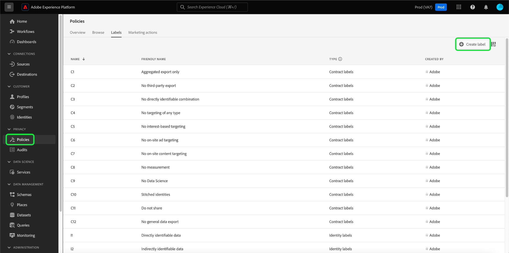

# Gerenciar rótulos de uso de dados na interface {#user-guide}

>[!CONTEXTUALHELP]
>id="platform_privacyConsole_dataGovernance_description"
>title="Descrição"
>abstract=""

Este guia do usuário aborda etapas para trabalhar com rótulos de uso de dados na [!DNL Experience Platform] interface do usuário.

## Gerenciar rótulos no nível do conjunto de dados

>[!IMPORTANT]
>
>A aplicação de rótulos no nível do conjunto de dados só é compatível com casos de uso de governança de dados. Se estiver tentando criar políticas de acesso para os dados, você deverá [aplicar rótulos ao esquema](../../xdm/tutorials/labels.md) em que o conjunto de dados se baseia. Consulte a visão geral em [controle de acesso baseado em atributos](../../access-control/abac/overview.md) para obter mais informações.

Para gerenciar rótulos de uso de dados no nível do conjunto de dados, selecione um conjunto de dados existente ou crie um novo. Depois de fazer logon no Adobe Experience Platform, selecione **[!UICONTROL Conjuntos de dados]** no painel de navegação esquerdo para abrir a **[!UICONTROL Conjuntos de dados]** espaço de trabalho. Essa página lista todos os conjuntos de dados criados pertencentes à sua organização, juntamente com detalhes úteis relacionados a cada conjunto de dados.

A próxima seção fornece etapas para criar um novo conjunto de dados ao qual aplicar rótulos. Se quiser editar rótulos para um conjunto de dados existente, selecione o conjunto de dados na lista e vá para [adicionar rótulos de uso de dados ao conjunto de dados](#add-labels).

### Criar um novo conjunto de dados

>[!NOTE]
>
>Neste exemplo, um conjunto de dados é criado usando um [!DNL Experience Data Model] Esquema de (XDM). Para obter mais informações sobre esquemas XDM, consulte a [Visão geral do sistema XDM](../../xdm/home.md) e [noções básicas da composição do esquema](../../xdm/schema/composition.md).

Para criar um novo conjunto de dados, selecione **[!UICONTROL Criar conjunto de dados]** no canto superior direito da **[!UICONTROL Conjuntos de dados]** espaço de trabalho.

A variável **[!UICONTROL Criar conjunto de dados]** é exibida. Aqui, selecione **[!UICONTROL Criar conjunto de dados a partir do esquema]**.

A variável **[!UICONTROL Selecionar esquema]** é exibida, listando todos os esquemas disponíveis que você pode usar para criar um conjunto de dados. Selecione o botão de opção ao lado de um schema para selecioná-lo. A variável **[!UICONTROL Esquemas]** no lado direito exibe detalhes adicionais sobre o schema selecionado. Depois de selecionar um esquema, selecione **[!UICONTROL Próxima]**.

A variável **[!UICONTROL Configurar conjunto de dados]** é exibida. Forneça um nome (obrigatório) e uma descrição (opcional, mas recomendado) para seu novo conjunto de dados e selecione **[!UICONTROL Concluir]**.

A variável **[!UICONTROL Atividade do conjunto de dados]** será exibida, mostrando informações sobre o conjunto de dados recém-criado. Neste exemplo, o conjunto de dados é chamado de &quot;Membros de fidelidade&quot;, portanto, a navegação superior mostra **Conjuntos de dados > Membros de fidelidade**.

### Adicionar rótulos de uso de dados ao conjunto de dados {#add-labels}

Depois de criar um novo conjunto de dados ou selecionar um conjunto de dados existente na lista do **[!UICONTROL Conjuntos de dados]** espaço de trabalho, selecione **[!UICONTROL Governança de dados]** para abrir o **[!UICONTROL Governança de dados]** espaço de trabalho. O espaço de trabalho permite gerenciar rótulos de uso de dados no nível do conjunto de dados e do campo.

Para editar rótulos de uso de dados no nível do conjunto de dados, comece selecionando o ícone de lápis ao lado do nome do conjunto de dados.

A variável **[!UICONTROL Editar rótulos de governança]** será aberta. Na caixa de diálogo, marque as caixas ao lado dos rótulos que deseja aplicar ao conjunto de dados. Lembre-se de que esses rótulos serão herdados por todos os campos no conjunto de dados. A variável **[!UICONTROL Rótulos aplicados]** atualizações de cabeçalho ao marcar cada caixa, mostrando os rótulos escolhidos. Depois de selecionar os rótulos desejados, selecione **[!UICONTROL Salvar alterações]**.

A variável **[!UICONTROL Governança de dados]** espaço de trabalho será exibido novamente, mostrando os rótulos que você aplicou no nível do conjunto de dados. Você também pode ver que os rótulos são herdados para cada um dos campos no conjunto de dados.

Observe que um &quot;x&quot; é exibido ao lado dos rótulos no nível do conjunto de dados, permitindo remover os rótulos. Os rótulos herdados ao lado de cada campo não têm um &quot;x&quot; ao lado deles e aparecem &quot;esmaecidos&quot; sem capacidade de remover ou editar. Isso ocorre porque **os campos herdados são somente leitura**, o que significa que não podem ser removidos no nível do campo.

A variável **[!UICONTROL Mostrar rótulos herdados]** a opção está ativada por padrão, o que permite visualizar os rótulos herdados do conjunto de dados para seus campos. A desativação da alternância oculta todos os rótulos herdados no conjunto de dados.

## Gerenciar rótulos no nível do campo do conjunto de dados {#manage-labels-at-dataset-field-level}

>[!CONTEXTUALHELP]
>id="platform_privacyConsole_dataGovernance_instructions"
>title="Instruções"
>abstract=""

>[!IMPORTANT]
>
>A aplicação de rótulos no nível de campo do conjunto de dados só é compatível com casos de uso de governança de dados. Se estiver tentando criar políticas de acesso para os dados, você deverá [aplicar rótulos ao esquema](../../xdm/tutorials/labels.md) em que o conjunto de dados se baseia. Consulte a visão geral em [controle de acesso baseado em atributos](../../access-control/abac/overview.md) para obter mais informações.

Continuar o fluxo de trabalho para [adicionar e editar rótulos de uso de dados no nível do conjunto de dados](#add-labels), também é possível gerenciar rótulos em nível de campo no **[!UICONTROL Governança de dados]** para esse conjunto de dados.

Para aplicar rótulos de uso de dados a um campo individual, marque a caixa de seleção ao lado do nome do campo e selecione **[!UICONTROL Editar rótulos de governança]**.

A variável **[!UICONTROL Editar rótulos de governança]** será exibida. A caixa de diálogo exibe cabeçalhos mostrando campos selecionados, rótulos aplicados e rótulos herdados. Observe que os rótulos herdados (C2 e C5) estão esmaecidos na caixa de diálogo. Eles são rótulos somente leitura herdados do nível do conjunto de dados e, portanto, só podem ser editados nesse nível.

Selecione os rótulos de nível de campo marcando a caixa de seleção ao lado de cada rótulo que você deseja usar. Ao selecionar rótulos, a variável **[!UICONTROL Rótulos aplicados]** atualizações de cabeçalho para mostrar rótulos aplicados aos campos mostrados no **[!UICONTROL Campos Selecionados]** cabeçalho. Quando terminar de selecionar rótulos no nível do campo, selecione **[!UICONTROL Salvar alterações]**.

A variável **[!UICONTROL Governança de dados]** o espaço de trabalho será exibido novamente, exibindo agora os rótulos em nível de campo selecionados na linha ao lado do nome do campo. Observe que o rótulo de nível de campo tem um &quot;x&quot; ao lado dele, permitindo que você remova o rótulo.

Você pode repetir essas etapas para continuar adicionando e editando rótulos de nível de campo para campos adicionais, incluindo a seleção de vários campos para aplicar rótulos de nível de campo simultaneamente.

É importante lembrar que a herança se move somente do nível superior para baixo (conjunto de dados → campos), o que significa que os rótulos aplicados no nível do campo não são propagados para outros campos ou conjuntos de dados.

## Gerenciar rótulos no nível do esquema

Você pode adicionar rótulos diretamente a um esquema ou campos dentro desse esquema. Quaisquer campos aplicados no nível do esquema serão propagados para todos os conjuntos de dados baseados nesse esquema.

Veja o tutorial sobre [gerenciamento de rótulos em nível de esquema](../../xdm/tutorials/labels.md) para obter mais informações.

## Gerenciar rótulos personalizados {#manage-custom-labels}

>[!CONTEXTUALHELP]
>id="platform_governance_createlabels"
>title="Criar rótulos"
>abstract="Rótulos permitem categorizar conjuntos de dados e campos de acordo com as políticas de uso que se aplicam a esses dados. A Platform fornece um conjunto padrão de rótulos para você usar, mas você também pode criar rótulos personalizados específicos para sua organização."

Você pode criar seus próprios rótulos de uso personalizados na **[!UICONTROL Políticas]** espaço de trabalho no [!DNL Experience Platform] IU. Selecionar **[!UICONTROL Políticas]** no painel de navegação esquerdo, selecione **[!UICONTROL Rótulos]** para exibir uma lista de rótulos existentes. Aqui, selecione **[!UICONTROL Criar rótulo]**.

A variável **[!UICONTROL Criar rótulo]** será exibida. Aqui, forneça as seguintes informações para o novo rótulo:

* **[!UICONTROL Identificador]**: um identificador exclusivo para o rótulo. Esse valor é usado para fins de pesquisa e, portanto, deve ser curto e conciso.
* **[!UICONTROL Nome]**: um nome de exibição amigável para o rótulo.
* **[!UICONTROL Descrição]**: (opcional) uma descrição do rótulo para fornecer mais contexto.

Quando terminar, selecione **[!UICONTROL Criar]**.

A caixa de diálogo é fechada e o rótulo personalizado recém-criado é exibido na lista sob o **[!UICONTROL Rótulos]** guia.

O rótulo agora pode ser selecionado em **[!UICONTROL Rótulos personalizados]** ao editar rótulos de uso para conjuntos de dados e campos ou ao criar políticas de uso de dados.

 

## Próximas etapas

Agora que você adicionou rótulos de uso de dados no nível do conjunto de dados e do campo, é possível começar a assimilar dados no [!DNL Experience Platform]. Para saber mais, comece lendo o [documentação de assimilação de dados](../../ingestion/home.md).

Agora também é possível definir políticas de uso de dados com base nos rótulos aplicados. Para obter mais informações, consulte [visão geral das políticas de uso de dados](../policies/overview.md).

## Recursos adicionais

O vídeo a seguir é destinado a apoiar sua compreensão da Governança de dados e descreve como aplicar rótulos a um conjunto de dados e campos individuais.

>[!VIDEO](https://video.tv.adobe.com/v/29709?quality=12&enable10seconds=on&speedcontrol=on)
