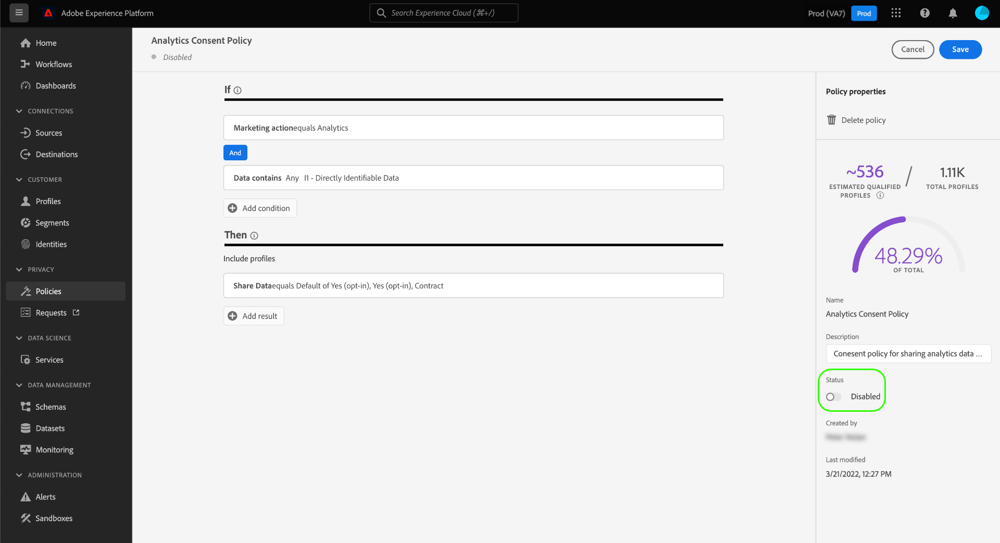

# Gerenciar políticas de uso de dados na interface {#user-guide}

>[!CONTEXTUALHELP]
>id="platform_privacyConsole_dataUsagePolicies_description"
>title="Integrar e aplicar o consentimento do cliente nos dados do seu perfil"
>abstract="<h2>Descrição</h2>
A Experience Platform permite integrar os dados de consentimento coletados dos clientes nos seus respectivos perfis. É possível configurar políticas de consentimento para determinar se esses dados podem ser incluídos em segmentos ativados para determinados destinos.
"

Este documento aborda como usar o espaço de trabalho **[!UICONTROL Policies]** na interface do usuário do Adobe Experience Platform para criar e gerenciar políticas de uso de dados.

>[!NOTE]
>
>Para obter informações sobre como gerenciar políticas de controle de acesso na interface, consulte o [guia da interface do usuário do controle de acesso baseado em atributos](../../access-control/abac/ui/policies.md).

>[!IMPORTANT]
>
>Todas as políticas de uso de dados (incluindo as políticas principais fornecidas pelo Adobe) são desativadas por padrão. Para que uma política individual seja considerada para aplicação, você deve ativar manualmente essa política. Consulte a seção sobre [habilitação de políticas](#enable) para obter etapas sobre como fazer isso na interface.

## Pré-requisitos

Este guia requer uma compreensão funcional dos [!DNL Experience Platform] conceitos a seguir:

* [Governança de dados](../home.md)
* [Políticas de uso de dados](./overview.md)

## Exibir políticas existentes {#view-policies}

Na interface do usuário do [!DNL Experience Platform], selecione **[!UICONTROL Policies]** para abrir o espaço de trabalho **[!UICONTROL Policies]**. Na guia **[!UICONTROL Browse]**, você pode ver uma lista de políticas disponíveis, incluindo seus rótulos associados, ações de marketing e status.

Se você tiver acesso às políticas de consentimento, selecione o botão **[!UICONTROL Consent policies]** para vê-las na guia [!UICONTROL Browse].

Selecione uma política listada para exibir sua descrição e tipo. Se uma política personalizada for selecionada, controles adicionais serão exibidos para editar, excluir ou [habilitar/desabilitar a política](#enable).

## Criar uma política personalizada {#create-policy}

Para criar uma nova política de uso de dados personalizada, selecione **[!UICONTROL Create policy]** no canto superior direito da guia **[!UICONTROL Browse]** no espaço de trabalho **[!UICONTROL Policies]**.

A caixa de diálogo [!UICONTROL Choose type of policy] é exibida. Selecione uma [política de consentimento](#consent-policy) ou uma [política de governança de dados](#create-governance-policy).

### Usar políticas de consentimento e governança de dados em conjunto {#combine-policies}

>[!NOTE]
>
>Atualmente, as políticas de consentimento estão disponíveis apenas para organizações que compraram o Adobe Healthcare Shield ou o Adobe Privacy &amp; Security Shield.

As políticas de governança e consentimento podem ser usadas em conjunto para criar regras robustas para governar públicos mapeados para um destino. As políticas de consentimento são de natureza inclusiva, o que significa que elas determinam quais perfis podem ser incluídos em cada experiência de marketing. Por outro lado, as políticas de governança excluem o uso de atributos específicos rotulados de serem configurados para ativação.

Usando esse comportamento, você pode configurar uma combinação de políticas e regras de consentimento que incluam os perfis corretos, mas o impede de incluir dados que vão contra as regras organizacionais definidas. Um exemplo seria quando você deseja excluir dados confidenciais da inclusão, mas ainda pode direcionar usuários consentidos para marketing via redes sociais. As etapas necessárias para esse cenário estão descritas no infográfico abaixo.

### Criar uma política de governança de dados {#create-governance-policy}

O fluxo de trabalho **[!UICONTROL Create policy]** é exibido. Comece fornecendo um nome e uma descrição para a nova política.

Em seguida, selecione os rótulos de uso de dados nos quais a política será baseada. Ao selecionar vários rótulos, você tem a opção de escolher se os dados devem conter todos os rótulos ou apenas um deles para que a política seja aplicada. Selecione **[!UICONTROL Next]** quando terminar.

A etapa **[!UICONTROL Select marketing actions]** é exibida. Escolha as ações de marketing apropriadas na lista fornecida e selecione **[!UICONTROL Next]** para continuar.

>[!NOTE]
>
>Ao selecionar várias ações de marketing, a política as interpreta como uma regra &quot;OR&quot;. Em outras palavras, a política se aplica se **qualquer** das ações de marketing selecionadas for executada.

A etapa **[!UICONTROL Review]** é exibida, permitindo que você revise os detalhes da nova política antes de criá-la. Quando estiver satisfeito, selecione **[!UICONTROL Finish]** para criar a política.

A guia **[!UICONTROL Browse]** será exibida novamente, listando agora a política recém-criada no status &quot;Rascunho&quot;. Para habilitar a política, consulte a próxima seção.

### Criar uma política de consentimento {#consent-policy}

>[!CONTEXTUALHELP]
>id="platform_privacyConsole_dataUsagePolicies_instructions"
>title="Instruções"
>abstract="<ul><li>Certifique-se de que está assimilando dados de preferência em seus esquemas de união por meio do conector de origem do OneTrust ou do esquema XDM padrão para consentimento.</li><li>Selecione <a href="https://experienceleague.adobe.com/docs/experience-platform/data-governance/policies/overview.html?lang=pt-BR">Políticas</a> na navegação à esquerda, e depois <a href="https://experienceleague.adobe.com/docs/experience-platform/data-governance/policies/user-guide.html?lang=pt-BR#create-governance-policy">Criar Política</a>.</li><li>Na seção <b>Se</b>, descreva as condições ou ações que acionarão a verificação de política.</li><li>Na seção <b>Então</b>, insira os atributos de consentimento que devem estar presentes para que um perfil seja incluído na ação que acionou a política.</li><li>Selecionar <b>Salvar</b> para criar a política. Para habilitar a política, selecione o botão de alternância <b>Status</b> no painel direito.</li><li>A Experience Platform aplica automaticamente suas políticas de consentimento ativadas quando você ativa segmentos para destinos e fornece detalhes sobre como cada política afeta o tamanho do público-alvo.</li><li>Para obter mais ajuda com esse recurso, consulte o guia em <a href="https://experienceleague.adobe.com/docs/experience-platform/data-governance/policies/user-guide.html?lang=pt-BR#consent-policy">criação de políticas de consentimento</a> na Experience League.</li></ul>"

>[!IMPORTANT]
>
>As políticas de consentimento só estão disponíveis para organizações que compraram o **Adobe Healthcare Shield** ou o **Adobe Privacy &amp; Security Shield**.

Se você optar por criar uma política de consentimento, uma nova tela será exibida, permitindo configurar a nova política.

Para usar as políticas de consentimento, você deve ter atributos de consentimento presentes nos dados do perfil. Consulte o guia sobre [processamento de consentimento no Experience Platform](../../landing/governance-privacy-security/consent/adobe/overview.md) para obter etapas detalhadas sobre como incluir os atributos necessários no esquema de união.

As políticas de consentimento são compostas de dois componentes lógicos:

* **[!UICONTROL If]**: a condição que acionará a verificação de política. Isso pode ser baseado em uma determinada ação de marketing que está sendo executada, na presença de determinados rótulos de uso de dados ou em uma combinação dos dois.
* **[!UICONTROL Then]**: os atributos de consentimento que devem estar presentes para que um perfil seja incluído na ação que acionou a política.

>[!NOTE]
>
>As políticas de consentimento oferecem suporte à criação avançada de regras com vários tipos de campos e operadores. Para obter uma referência completa dos tipos de campos, operadores e exemplos de criação de regras compatíveis, consulte a [Referência de regras de política de consentimento](./consent-policy-rule-building-reference.md).

#### Configurar condições {#consent-conditions}

>[!CONTEXTUALHELP]
>id="platform_governance_policies_consentif"
>title="Condição “Se”"
>abstract="Comece definindo as condições que acionarão a verificação de política. As condições podem incluir determinadas ações de marketing, a presença de determinados rótulos de governança de dados ou uma combinação de ambos. Use a lógica AND/OR para criar relações condicionais complexas entre várias condições."

Na seção **[!UICONTROL If]**, selecione as ações de marketing e/ou rótulos de uso de dados que devem acionar essa política. Selecione **[!UICONTROL View all]** e **[!UICONTROL Select labels]** para exibir as listas completas de ações de marketing e rótulos disponíveis, respectivamente.

Depois de adicionar pelo menos uma condição, você pode selecionar **[!UICONTROL Add condition]** para continuar adicionando outras condições, conforme necessário, escolhendo o tipo de condição apropriado na lista suspensa.

Se você selecionar mais de uma condição, poderá usar o ícone que aparece entre elas para alternar o relacionamento condicional entre &quot;AND&quot; e &quot;OR&quot;.

#### Selecionar atributos de consentimento {#consent-attributes}

>[!CONTEXTUALHELP]
>id="platform_governance_policies_consentthen"
>title="Condição “Então”"
>abstract="Depois que a condição “Se” for definida, use a seção “Então” para selecionar pelo menos um atributo de consentimento do esquema de união. Você deve navegar pelos campos de contêiner (Objeto, Mapa, Matriz) para chegar aos campos primitivos (Sequência, Número, Booleano, etc.) para a criação de regras. Esse campo primitivo é o atributo que deve estar presente para que os perfis sejam incluídos na ação regida por essa política."

Na seção **[!UICONTROL Then]**, selecione pelo menos um atributo de consentimento do esquema de união. Esse é o atributo que deve estar presente para que os perfis sejam incluídos na ação regida por essa política. Você pode escolher uma das opções sugeridas ou selecionar **[!UICONTROL View all]** para escolher o atributo diretamente do esquema de união.

>[!NOTE]
>
>As políticas de consentimento aceitam tipos de campos primitivos (String, Number, Boolean, Date) e tipos de contêineres (Object, Map, Array). É possível navegar em containers para selecionar atributos específicos e aplicar a lógica AND/OR para combinar regras. Para obter uma referência completa dos tipos de campos, operadores e exemplos de criação de regras compatíveis, consulte a [referência de criação de regra de política de consentimento](./consent-policy-rule-building-reference.md).

Se você selecionar **[!UICONTROL View all]**, a caixa de diálogo **[!UICONTROL Select consent attribute]** será exibida. Selecione os atributos de consentimento que você deseja que esta política verifique. Como alternativa, nessa caixa de diálogo, você pode selecionar **[!UICONTROL Advanced Schema search]** para escolher um campo primitivo aninhado a ser avaliado como parte da política. Selecione **[!UICONTROL Done]** para confirmar suas configurações.

### Pesquisa avançada de esquema {#advanced-schema-search}

Na caixa de diálogo **[!UICONTROL Select consent attribute]**, selecione **[!UICONTROL Advanced Schema search]** para abrir a caixa de diálogo **[!UICONTROL Select union schema field]**. Nessa exibição, selecione atributos de nível raiz ou aninhados de tipos de campos primitivos, como string, número, booleano e data, bem como tipos de contêineres, como objeto, mapa e matriz.

#### Campos de valor fixo para uma condição de política {#fixed-value-fields}

Quando você seleciona um campo de valor fixo como uma condição de política, o painel [!UICONTROL Selected attributes] exibe os valores predefinidos no esquema de dados.

>[!NOTE]
>
>Se um campo estiver configurado com um conjunto fixo de valores (por exemplo, como um enum ou outro vocabulário controlado), o construtor de políticas aplicará essa restrição para garantir que as condições sejam avaliadas somente em relação a dados válidos e padronizados.

Para manter a qualidade e a consistência dos dados, a interface renderiza esses valores como caixas de seleção selecionáveis, em vez de campos de texto livre. Essa abordagem reduz a validação manual e ajuda a política de consentimento a avaliar os dados de forma confiável.

Para definir a condição, marque as caixas de seleção dos valores que deseja que a política avalie.

#### Mapear campos de tipo de dados para uma condição de política {#map-data-type-fields}

Ao selecionar um campo primitivo contido em um tipo de dados de Mapa, opções de configuração adicionais aparecem no painel **[!UICONTROL Selected attributes]**. Use essas opções para configurar verificações de consentimento em várias chaves sem precisar de uma política separada para cada chave. Esse método de configuração simplifica o gerenciamento de políticas, reduzindo o número de políticas que precisam ser criadas.

##### Configurar atributos de tipo de dados do mapa {#configure-map-attributes}

Para configurar um atributo do tipo Mapa, siga as etapas abaixo:

No diagrama do esquema de união, selecione um campo primitivo (como uma sequência ou um número) contido em um tipo de dados Mapa. O painel **[!UICONTROL Selected attributes]** é atualizado para exibir opções de configuração adicionais para esse campo.

No painel **[!UICONTROL Selected attributes]**, configure como a política avalia as chaves de mapa marcando ou desmarcando a caixa de seleção **[!UICONTROL Find any matching item]**.

| Opção | Ação | Comportamento da política |
| --- | --- | --- |
| A caixa de seleção **[!UICONTROL Find any matching item]** está **marcada** | O campo de texto **[!UICONTROL within]** está desabilitado. | A política verifica **todas as chaves** no mapa. Qualquer chave em que o campo aninhado atenda à condição de valor é considerada uma correspondência para a política. Isso é útil para impor a conformidade global em atributos com chaves dinâmicas. |
| A caixa de seleção **[!UICONTROL Find any matching item]** está **desmarcada** | Você deve inserir um nome de chave específico no campo de texto **[!UICONTROL within]**. | A política verifica apenas a chave do mapa especificada no campo **[!UICONTROL within]**. Somente os perfis em que o campo aninhado de uma chave específica atender ao valor definido são correspondidos. Isso é útil para políticas que visam um programa específico ou chave de frequência (por exemplo, `frequencyMap.m1`). |

Insira o valor do campo primitivo selecionado que a política deve avaliar. Por exemplo, se o tipo de campo for `Integer`, insira um valor numérico.

Selecione **[!UICONTROL Select]** para confirmar sua configuração e retornar ao construtor de políticas.

Depois de selecionar pelo menos um atributo de consentimento, o painel **[!UICONTROL Policy properties]** será atualizado para mostrar o número estimado de perfis incluídos nesta política, juntamente com a porcentagem de perfis afetados no repositório de perfis. A contagem estimada de perfis é atualizada automaticamente à medida que você altera a configuração da política.

Para adicionar outros atributos de consentimento, selecione **[!UICONTROL Add result]**. Isso cria outra regra para incluir perfis com base nesses atributos.

>[!NOTE]
>
>Para editar um atributo existente, selecione o nome do atributo e o ícone de lápis (). A caixa de diálogo **[!UICONTROL Select union schema field]** é aberta para que você faça alterações.
>
>

Continue adicionando ou ajustando condições e atributos de consentimento até que a política corresponda aos seus requisitos. Quando terminar, insira um nome e uma descrição (opcional) e selecione **[!UICONTROL Save]** para criar a política.

A política de consentimento agora é criada e seu status é definido como [!UICONTROL Disabled] por padrão. Para habilitar a política imediatamente, selecione o botão **[!UICONTROL Status]** no painel direito.

#### Verificar imposição de política

Depois de criar e habilitar uma política de consentimento, você pode visualizar como ela afeta seus públicos-alvo consentidos ao ativar segmentos para destinos. Consulte a seção sobre [avaliação de política de consentimento](../enforcement/auto-enforcement.md#consent-policy-evaluation) para obter mais informações.

## Ativar ou desativar uma política {#enable}

Todas as políticas de uso de dados (incluindo as políticas principais fornecidas pelo Adobe) são desativadas por padrão. Para que uma política individual seja considerada para aplicação, é necessário habilitar manualmente essa política por meio da API ou da interface.

Você pode habilitar ou desabilitar políticas da guia **[!UICONTROL Browse]** no espaço de trabalho **[!UICONTROL Policies]**. Selecione uma política personalizada na lista para exibir seus detalhes à direita. Em **[!UICONTROL Status]**, selecione o botão de alternância para habilitar ou desabilitar a política.

## Exibir ações de marketing {#view-marketing-actions}

No espaço de trabalho **[!UICONTROL Policies]**, selecione a guia **[!UICONTROL Marketing actions]** para exibir uma lista de ações de marketing disponíveis definidas pela Adobe e por sua própria organização.

## Criar uma ação de marketing {#create-marketing-action}

Para criar uma nova ação de marketing personalizada, selecione **[!UICONTROL Create marketing action]** no canto superior direito da guia **[!UICONTROL Marketing actions]** no espaço de trabalho **[!UICONTROL Policies]**.

A caixa de diálogo **[!UICONTROL Create marketing action]** é exibida. Insira um nome e uma descrição para a ação de marketing e selecione **[!UICONTROL Create]**.

A ação recém-criada aparece na guia **[!UICONTROL Marketing actions]**. Agora você pode usar a ação de marketing ao [criar novas políticas de uso de dados](#create-policy).

## Editar ou excluir uma ação de marketing {#edit-delete-marketing-action}

>[!NOTE]
>
>Somente ações de marketing personalizadas definidas por sua organização podem ser editadas. As ações de marketing definidas pelo Adobe não podem ser alteradas ou excluídas.

No espaço de trabalho **[!UICONTROL Policies]**, selecione a guia **[!UICONTROL Marketing actions]** para exibir uma lista de ações de marketing disponíveis definidas pela Adobe e por sua própria organização. Selecione uma ação de marketing personalizada na lista e, em seguida, use os campos fornecidos na seção à direita para editar os detalhes da ação de marketing.

Se a ação de marketing não estiver sendo usada por nenhuma política de uso existente, você poderá excluí-la selecionando **[!UICONTROL Delete marketing action]**.

>[!NOTE]
>
>Tentar excluir uma ação de marketing que está sendo usada por uma política existente faz com que uma mensagem de erro seja exibida, indicando que a tentativa de exclusão falhou.

## Próximas etapas

Este documento forneceu uma visão geral de como gerenciar as políticas de uso de dados na interface do usuário do [!DNL Experience Platform]. Para obter etapas sobre como gerenciar políticas usando o [!DNL Policy Service API], consulte o [guia do desenvolvedor](../api/getting-started.md). Para obter informações sobre como impor políticas de uso de dados, consulte a [visão geral de imposição de política](../enforcement/overview.md).

O vídeo a seguir fornece uma demonstração de como trabalhar com políticas de uso na interface do usuário do [!DNL Experience Platform]:

>[!VIDEO](https://video.tv.adobe.com/v/37143?captions=por_br&quality=12&learn=on)
