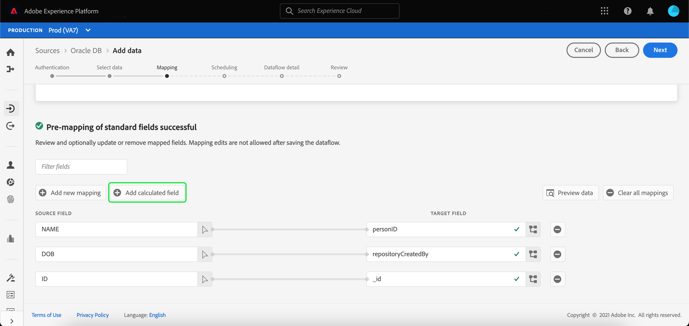
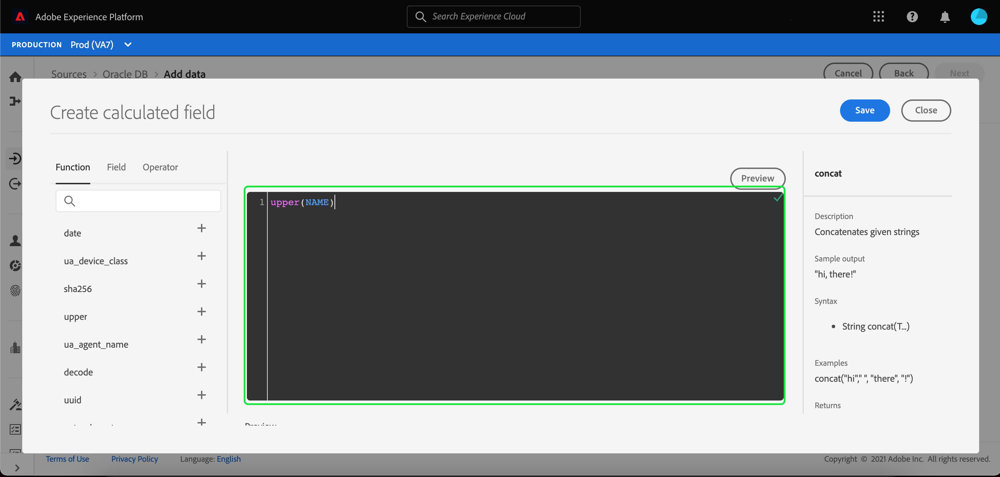

# Campos calculados

Os campos calculados permitem que os valores sejam criados com base nos atributos no schema de entrada. Esses valores podem ser atribuídos aos atributos no schema de destino e receber um nome e uma descrição para permitir uma referência mais fácil.

Para criar um campo calculado, selecione **[!UICONTROL Add calculated field]**.

O painel **[!UICONTROL Criar campo calculado]** é exibido. A caixa de diálogo à esquerda contém os campos, as funções e os operadores suportados nos campos calculados. Selecione uma das guias para começar a adicionar funções, campos ou operadores ao editor de expressão.

| Tabulação | Descrição |
| --- | ----------- |
| Função | A guia funções lista as funções disponíveis para transformar os dados. Para saber mais sobre as funções que você pode usar nos campos calculados, leia o guia em [usando as funções de Preparação de Dados (Mapeador)](./functions.md). |
| Campo | A guia fields lista campos e atributos disponíveis no schema de origem. |
| Operador | A guia operadores lista os operadores disponíveis para transformar os dados. |

É possível adicionar campos, funções e operadores manualmente usando o editor de expressão no centro. Selecione o editor para começar a criar uma expressão.

Selecione **[!UICONTROL Salvar]** para continuar.

A tela de mapeamento é exibida novamente com o campo de origem recém-criado. Aplique o campo de destino correspondente apropriado e selecione **[!UICONTROL Finish]** para concluir o mapeamento.

