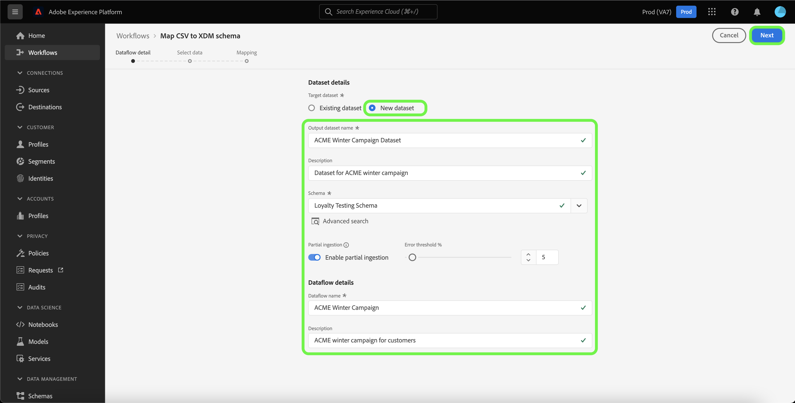
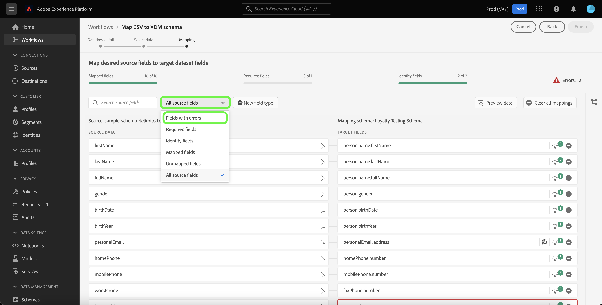
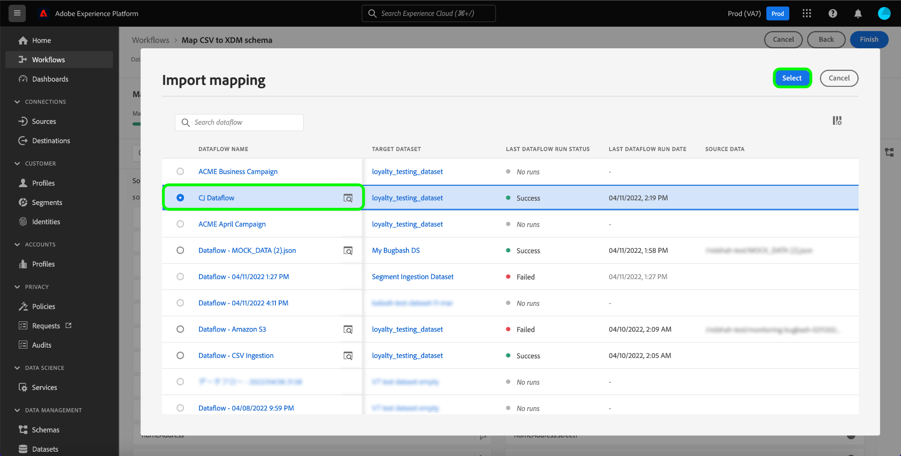

# Guia da interface do usuário de preparação de dados

Este documento fornece instruções sobre como usar funções de preparação de dados na interface do usuário do Adobe Experience Platform para mapear arquivos CSV para um esquema XDM.

## Introdução

Este tutorial requer uma compreensão funcional dos seguintes componentes da plataforma:

* [[!DNL Experience Data Model (XDM)] Sistema](../../xdm/home.md): A estrutura padronizada pela qual a Platform organiza os dados de experiência do cliente.
   * [Noções básicas da composição do schema](../../xdm/schema/composition.md): Saiba mais sobre os elementos básicos dos esquemas XDM, incluindo princípios-chave e práticas recomendadas na composição do schema.
   * [Tutorial do Editor de esquemas](../../xdm/tutorials/create-schema-ui.md): Saiba como criar esquemas personalizados usando a interface do Editor de esquemas.
* [Serviço de identidade](../../identity-service/home.md): Obtenha uma melhor visão de clientes individuais e seu comportamento ao unir identidades em dispositivos e sistemas.
* [[!DNL Real-time Customer Profile]](../../profile/home.md): Fornece um perfil de consumidor unificado e em tempo real com base em dados agregados de várias fontes.
* [Fontes](../../sources/home.md): O Experience Platform permite que os dados sejam assimilados de várias fontes, fornecendo a capacidade de estruturar, rotular e aprimorar os dados recebidos usando os serviços da plataforma.

## Detalhes do fluxo de dados

>[!TIP]
>
>Você pode acessar os detalhes do fluxo de dados selecionando qualquer origem no catálogo de fontes. Para obter mais informações, consulte o [visão geral das fontes](../../sources/home.md).

Antes de mapear seus dados CSV para um esquema XDM, primeiro você deve estabelecer os detalhes do seu fluxo de dados.

O [!UICONTROL Detalhes do fluxo de dados] permite selecionar se deseja assimilar seus dados CSV em um conjunto de dados de destino existente ou em um novo conjunto de dados de destino. Um conjunto de dados existente vem com um esquema de destino pré-criado para mapear seus dados, enquanto um novo conjunto de dados requer que você selecione um esquema existente ou crie um novo schema para mapear seus dados.

### Usar um conjunto de dados de destino existente

Para assimilar seus dados CSV em um conjunto de dados existente, selecione **[!UICONTROL Conjunto de dados existente]**. Você pode recuperar um conjunto de dados existente usando o [!UICONTROL Pesquisa avançada] ou percorrendo a lista de conjuntos de dados existentes no menu suspenso.

Com um conjunto de dados selecionado, forneça um nome para o seu fluxo de dados e uma descrição opcional.

Durante esse processo, também é possível ativar [!UICONTROL Diagnóstico de erros] e [!UICONTROL Ingestão parcial]. [!UICONTROL Diagnóstico de erros] permite a geração detalhada de mensagens de erro para qualquer registro incorreto que ocorra no seu fluxo de dados, enquanto [!UICONTROL Ingestão parcial] O permite assimilar dados contendo erros, até um determinado limite definido manualmente. Consulte a [visão geral da ingestão parcial de lote](../../ingestion/batch-ingestion/partial.md) para obter mais informações.

### Usar um novo conjunto de dados de destino

Para assimilar seus dados CSV em um novo conjunto de dados, selecione **[!UICONTROL Novo conjunto de dados]** e, em seguida, forneça um nome de conjunto de dados de saída e uma descrição opcional. Em seguida, selecione um esquema para mapear usando o [!UICONTROL Pesquisa avançada] ou rolando pela lista de schemas existentes no menu suspenso.

Com um esquema selecionado, forneça um nome para o seu fluxo de dados e uma descrição opcional e, em seguida, aplique a variável [!UICONTROL Diagnóstico de erros] e [!UICONTROL Ingestão parcial] configurações desejadas para o fluxo de dados. Quando terminar, selecione **[!UICONTROL Próximo]**.

## Selecionar dados

O [!UICONTROL Selecionar dados] será exibida, fornecendo uma interface para carregar seus arquivos locais e visualizar sua estrutura e conteúdo. Selecionar **[!UICONTROL Escolher arquivos]** para fazer upload de um arquivo CSV em seu sistema local. Como alternativa, você pode arrastar e soltar o arquivo CSV que deseja fazer upload no [!UICONTROL Arrastar e soltar arquivos] painel.

>[!TIP]
>
>Atualmente, apenas os arquivos CSV são compatíveis com o upload de arquivo local. O tamanho máximo de arquivo para cada arquivo é de 1 GB.

Depois que o arquivo é carregado, a interface de visualização é atualizada para exibir o conteúdo e a estrutura do arquivo.

Dependendo do arquivo, é possível selecionar um delimitador de coluna, como guias, vírgulas, barra vertical ou um delimitador de coluna personalizado para os dados de origem. Selecione o **[!UICONTROL Delimitador]** seta suspensa e selecione o delimitador apropriado no menu.

Quando terminar, selecione **[!UICONTROL Próximo]**.

## Mapeamento

O **[!UICONTROL mapeamento]** A interface fornece uma ferramenta abrangente para mapear campos de origem do esquema de origem para os campos XDM de destino apropriados no esquema de destino.

### Noções básicas da interface de mapeamento

A interface de mapeamento inclui um painel que fornece informações sobre a integridade dos campos de mapeamento no contexto do fluxo de trabalho de assimilação. O painel exibe os seguintes detalhes sobre os campos de mapeamento:

| Propriedade | Descrição |
| --- | --- |
| [!UICONTROL Campos mapeados] | Exibe o número total de campos de origem que foram mapeados para um campo XDM de destino, independentemente dos erros. |
| [!UICONTROL Campos obrigatórios] | Exibe o número de campos de mapeamento necessários. |
| [!UICONTROL Campos de identidade] | Exibe o número total de campos de mapeamento definidos como identidade. Esses campos de mapeamento são representados por um ícone de impressão digital. |
| [!UICONTROL Erros] | Exibe o número de campos de mapeamento incorretos. |

A interface de mapeamento também fornece um painel de opções que você pode escolher para interagir ou filtrar melhor por meio dos campos de mapeamento.

Para pesquisar um conjunto de mapeamentos específico, selecione **[!UICONTROL Pesquisar campos de origem]** e insira o nome dos dados de origem que deseja isolar.

Selecionar **[!UICONTROL Todos os campos de origem]** para ver um menu suspenso de opções de filtragem para restringir melhor sua visualização da interface de mapeamento.

As opções de filtragem são:

| Campos de origem | Descrição |
| --- | --- |
| [!UICONTROL Todos os campos de origem] | Essa opção exibe todos os campos de origem do esquema de origem. Essa opção é exibida por padrão. |
| [!UICONTROL Campos obrigatórios] | Essa opção filtra o schema de origem para exibir apenas os campos necessários para concluir o mapeamento. |
| [!UICONTROL Campos de identidade] | Essa opção filtra o schema de origem para exibir somente os campos marcados para Identidade. |
| [!UICONTROL Campos mapeados] | Essa opção filtra o schema de origem para exibir apenas os campos que já foram mapeados. |
| [!UICONTROL Campos não mapeados] | Essa opção filtra o schema de origem para exibir apenas os campos que ainda precisam ser mapeados. |
| [!UICONTROL Campos com recomendação] | Essa opção filtra o schema de origem para exibir apenas os campos que contêm recomendações de mapeamento. |

Selecionar **[!UICONTROL Campos com erros]** para ver todos os campos de mapeamento com erros.

Uma exibição isolada de campos de mapeamento incorretos é exibida, permitindo corrigir erros por meio de recomendações de mapeamento inteligente ou pela árvore de mapeamento manual.

### Adicionar um novo tipo de campo

Você pode adicionar um novo campo de mapeamento ou um campo calculado selecionando **[!UICONTROL Novo tipo de campo]**.

#### Novo campo de mapeamento

Para adicionar um novo campo de mapeamento, selecione **[!UICONTROL Novo tipo de campo]** e depois selecione **[!UICONTROL Adicionar novo campo]** no menu suspenso exibido.

Em seguida, selecione o campo de origem que deseja adicionar da árvore de esquema de origem que é exibida e selecione **[!UICONTROL Selecionar]**.

A interface de mapeamento é atualizada com o campo de origem selecionado e um campo de destino vazio. Selecionar **[!UICONTROL Mapear campo de destino]** para começar a mapear o novo campo de origem para o campo XDM de destino apropriado.

Uma árvore de esquema de destino interativa é exibida, permitindo percorrer manualmente pelo esquema de destino e localizar o campo XDM de destino apropriado para seu campo de origem.

Quando terminar, selecione o ícone de schema para fechar a interface do schema de destino.

#### Campos calculados {#calculated-fields}

Os campos calculados permitem que os valores sejam criados com base nos atributos no schema de entrada. Esses valores podem ser atribuídos aos atributos no schema de destino e receber um nome e uma descrição para permitir uma referência mais fácil.

Para criar um campo calculado, selecione **[!UICONTROL Novo tipo de campo]** e depois selecione **[!UICONTROL Adicionar campo calculado]**

O **[!UICONTROL Criar campo calculado]** será exibido. A caixa de diálogo à esquerda contém os campos, as funções e os operadores suportados nos campos calculados. Selecione uma das guias para começar a adicionar funções, campos ou operadores ao editor de expressão.

| Tabulação | Descrição |
| --- | ----------- |
| [!UICONTROL Função] | A guia funções lista as funções disponíveis para transformar os dados. Para saber mais sobre as funções que você pode usar nos campos calculados, leia o guia em [usando funções de Preparação de dados (Mapeador)](../functions.md). |
| [!UICONTROL Campo] | A guia fields lista campos e atributos disponíveis no schema de origem. |
| [!UICONTROL Operador] | A guia operadores lista os operadores disponíveis para transformar os dados. |

É possível adicionar campos, funções e operadores manualmente usando o editor de expressão no centro. Selecione o editor para começar a criar uma expressão. Depois de concluir, selecione **[!UICONTROL Salvar]** para continuar.

### Importar mapeamento {#import}

Você pode reutilizar o mapeamento de um fluxo de dados existente para reduzir o tempo de configuração manual da assimilação de dados e limitar os erros. Selecionar **[!UICONTROL Importar mapeamento]** para reutilizar um mapeamento existente.

O [!UICONTROL Importar mapeamento] for exibida, fornecendo uma lista de fluxos de dados para escolha.

Selecione o ícone de visualização para visualizar o mapeamento do fluxo de dados selecionado.

A janela de pré-visualização permite inspecionar o mapeamento existente antes de importar para o fluxo de dados. Depois de verificar o mapeamento, você pode selecionar **[!UICONTROL Voltar]** para retornar à lista de fluxos de dados e inspecionar outro conjunto de mapeamento, ou você pode selecionar **[!UICONTROL Selecionar]** para continuar.

Como alternativa, você pode selecionar o mapeamento que deseja importar da janela de lista de fluxos de dados. Selecione o fluxo de dados que contém o mapeamento que deseja importar e selecione **[!UICONTROL Selecionar]** para continuar.

A interface é atualizada com o mapeamento importado.

>[!NOTE]
>
>Qualquer conjunto de mapeamento existente que você estabeleça ou para as recomendações de mapeamento do ML será substituído pelo mapeamento importado de um fluxo de dados existente.

Selecionar **[!UICONTROL Visualizar dados]** para ver os resultados de mapeamento de até 100 linhas de dados de amostra do conjunto de dados selecionado.

Durante a visualização, a coluna de identidade é priorizada como o primeiro campo, pois são as informações principais necessárias ao validar resultados de mapeamento. Quando terminar, selecione **[!UICONTROL Fechar]**.

Para remover todos os campos de mapeamento, selecione **[!UICONTROL Limpar todos os mapeamentos]**.

### Usar a interface de mapeamento

A Platform fornece automaticamente recomendações inteligentes para campos mapeados automaticamente com base no esquema de destino ou conjunto de dados selecionado. É possível ajustar manualmente as regras de mapeamento para atender aos casos de uso ou corrigir quaisquer campos de mapeamento duplicados para apagar erros.

Selecione o ícone da lâmpada no campo de destino que deseja ajustar.

O [!UICONTROL Recomendações de mapeamento] painel pop-up é exibido, exibindo uma lista de campos de destino recomendados que podem ser mapeados para um campo de origem específico. Por padrão, a primeira recomendação é aplicada automaticamente.

Às vezes, mais de uma recomendação está disponível para o schema de origem. Quando isso acontece, o cartão de mapeamento exibe a recomendação mais importante, seguida por um ícone que contém o número de recomendações adicionais disponíveis. Selecionar o ícone da lâmpada mostrará uma lista das recomendações adicionais. Você pode escolher uma das recomendações alternativas marcando a caixa de seleção ao lado da recomendação para a qual deseja mapear.

Aqui, você pode alterar o campo de destino selecionado para corrigir um erro ou corresponder ao seu caso de uso.

Como alternativa, você pode selecionar **[!UICONTROL Selecionar manualmente]** para usar manualmente a árvore interativa de mapeamento do esquema de destino.

A interface de mapeamento do esquema de destino aparece na mesma exibição dos campos de mapeamento, permitindo modificar pares de mapeamento na mesma tela. Selecione o campo de destino que se ajusta ao caso de uso ou que corrige seus erros.

Quando terminar, selecione **[!UICONTROL Concluir]** para continuar.

## Próximas etapas

Ao ler este documento, você mapeou com êxito um arquivo CSV em um esquema XDM de destino usando a interface de mapeamento na interface do usuário da plataforma. Consulte os seguintes documentos para obter mais informações:

* [Visão geral da preparação de dados](../home.md)
* [Visão geral das fontes](../../sources/home.md)
* [Monitorar fluxos de dados de fontes na interface do usuário](../../dataflows/ui/monitor-sources.md)
