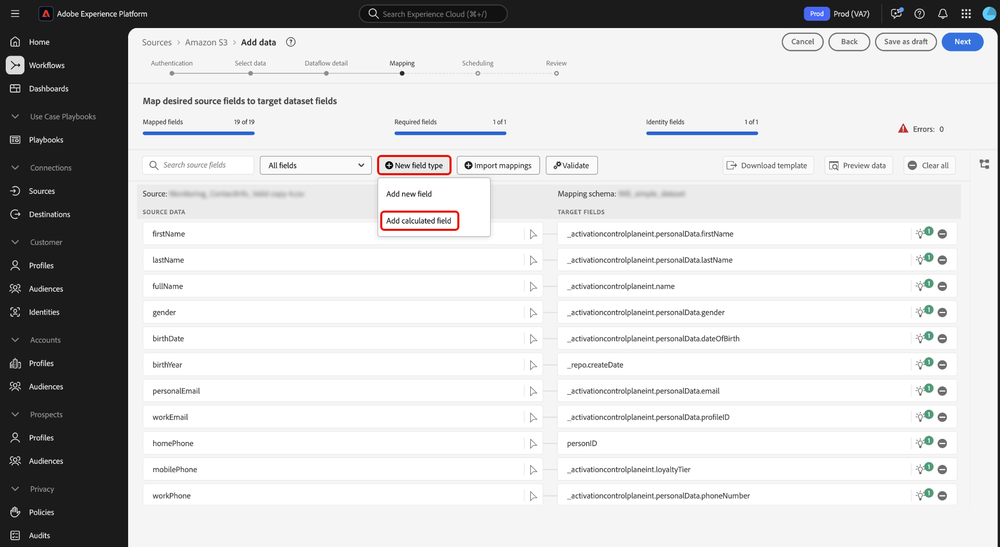
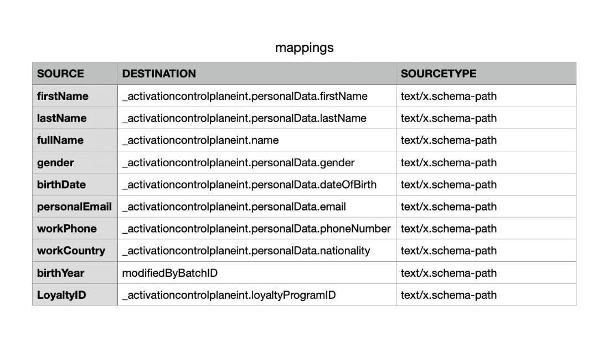

# Guia da interface de preparação de dados {#data-prep-ui-guide}

>[!CONTEXTUALHELP]
>id="platform_data_prep_import_mapping"
>title="Baixar modelo"
>abstract="Baixe o modelo csv para executar o mapeamento offline."

Leia este guia para saber como usar as funções de mapeamento [preparação de dados](../home.md) na interface do usuário do Adobe Experience Platform para mapear arquivos CSV para um esquema [Experience Data Model (XDM)](../../xdm/home.md).

## Introdução

Este tutorial requer uma compreensão funcional dos seguintes componentes do Experience Platform:

* [[!DNL Experience Data Model (XDM)] Sistema](../../xdm/home.md): a estrutura padronizada pela qual o Experience Platform organiza os dados de experiência do cliente.
   * [Noções básicas sobre a composição de esquema](../../xdm/schema/composition.md): saiba mais sobre os blocos de construção básicos de esquemas XDM, incluindo princípios-chave e práticas recomendadas na composição de esquema.
   * [Tutorial do Editor de esquemas](../../xdm/tutorials/create-schema-ui.md): saiba como criar esquemas personalizados usando a interface do Editor de esquemas.
* [Serviço de identidade](../../identity-service/home.md): obtenha uma melhor visão dos clientes individuais e de seu comportamento unindo as identidades de vários dispositivos e sistemas.
* [[!DNL Real-Time Customer Profile]](../../profile/home.md): Fornece um perfil de consumidor unificado em tempo real com base em dados agregados de várias fontes.
* [Fontes](../../sources/home.md): o Experience Platform permite a assimilação de dados de várias fontes, ao mesmo tempo em que fornece a capacidade de estruturar, rotular e aprimorar os dados recebidos usando os serviços do Experience Platform.

## Acessar a interface de mapeamento na interface do

Você pode acessar a interface de mapeamento na interface por dois caminhos diferentes.

1. Na interface do Experience Platform, selecione **[!UICONTROL Workflows]** no menu de navegação esquerdo e, em seguida, selecione **[!UICONTROL Map CSV to XDM schema]**. Em seguida, forneça os detalhes do fluxo de dados e selecione os dados que deseja assimilar. Quando terminar, você é levado para a interface de mapeamento, onde é possível configurar o mapeamento entre os dados de origem e um esquema XDM.
2. Também é possível acessar a interface de mapeamento por meio do espaço de trabalho de origens.

## Mapear arquivos CSV em um esquema XDM

Use a interface de mapeamento e o conjunto de ferramentas abrangente fornecido para mapear com êxito os campos de dados do esquema de origem para os campos XDM de destino apropriados no esquema de destino.

### Noções básicas sobre a interface de mapeamento {#mapping-interface}

Consulte o painel na parte superior da interface para obter informações sobre a integridade dos campos de mapeamento no contexto do workflow de assimilação. O painel exibe os seguintes detalhes em relação aos campos de mapeamento:

| Propriedade | Descrição |
| --- | --- |
| [!UICONTROL Mapped fields] | Exibe o número total de campos de origem que foram mapeados para um campo XDM de destino, independentemente de erros. |
| [!UICONTROL Required fields] | Exibe o número de campos de mapeamento necessários. |
| [!UICONTROL Identity fields] | Exibe o número total de campos de mapeamento definidos como identidade. Esses campos de mapeamento são representados por um ícone de impressão digital. |
| [!UICONTROL Errors] | Exibe o número de campos de mapeamento incorretos. |

{style="table-layout:auto"}

Em seguida, você pode usar as opções listadas no cabeçalho para interagir ou filtrar melhor pelos campos de mapeamento.

| Opção | Descrição |
| --- | --- |
| [!UICONTROL Search source fields] | Use a barra de pesquisa para navegar até um campo de origem específico. |
| [!UICONTROL All fields] | Selecione **[!UICONTROL All fields]** para exibir um menu suspenso de opções para filtrar seus mapeamentos. As opções de filtro disponíveis incluem:<ul><li>**[!UICONTROL Required fields]**: Filtra a interface para exibir apenas os campos necessários para concluir o fluxo de trabalho.</li><li> **[!UICONTROL Identity fields]**: Filtra a interface para exibir apenas campos marcados como identidades.</li><li>**[!UICONTROL Mapped fields]**: Filtra a interface para exibir somente campos que já foram mapeados.</li><li>**[!UICONTROL Unmapped fields]**: Filtra a interface para exibir somente campos que ainda não foram mapeados.</li><li>**[!UICONTROL Fields with errors]**: Filtra a interface para exibir somente campos com erros.</li></ul> |
| [!UICONTROL New field type] | Selecione **[!UICONTROL New field type]** para adicionar um novo campo ou um campo calculado. Para obter mais informações, leia a seção sobre [adição de um novo tipo de campo](#add-a-new-field-type). |
| [!UICONTROL Import mappings] | Selecione **[!UICONTROL Import mappings]** para importar mapeamentos de um arquivo ou fluxo de dados existente. Para obter mais informações, leia a seção sobre [importação de mapeamentos](#import-mapping). |
| [!UICONTROL Validate] | Selecione **[!UICONTROL Validate]** para procurar erros nos mapeamentos. |
| [!UICONTROL Download template] | Selecione **[!UICONTROL Download template]** para exportar e baixar um arquivo CSV de seus mapeamentos. |
| [!UICONTROL Preview data] | Selecione **[!UICONTROL Preview data]** para usar o painel de visualização e inspecionar a estrutura e o conteúdo do conjunto de dados de origem. |
| [!UICONTROL Clear all] | Selecione **[!UICONTROL Clear all]** para excluir todos os mapeamentos da interface. |

{style="table-layout:auto"}

### Adicionar um novo tipo de campo {#add-a-new-field-type}

Você pode adicionar um novo campo de mapeamento ou um campo calculado selecionando **[!UICONTROL New field type]**.

#### Novo campo de mapeamento

Para adicionar um novo campo de mapeamento, selecione **[!UICONTROL New field type]** e, em seguida, selecione **[!UICONTROL Add new field]** no menu suspenso exibido.

Em seguida, selecione o campo de origem que deseja adicionar da árvore de esquema de origem exibida e selecione **[!UICONTROL Select]**.

A interface de mapeamento é atualizada com o campo de origem selecionado e um campo de destino vazio. Selecione **[!UICONTROL Map target field]** para começar a mapear o novo campo de origem para seu campo XDM de destino apropriado.

Uma árvore de esquema de destino interativa é exibida, permitindo navegar manualmente pelo esquema de destino e localizar o campo XDM de destino apropriado para o campo de origem.

#### Campos calculados {#calculated-fields}

Os campos calculados permitem que valores sejam criados com base nos atributos no esquema de entrada. Esses valores podem ser atribuídos a atributos no esquema de destino e receber um nome e uma descrição para facilitar a referência. Os campos calculados têm um comprimento máximo de 4096 caracteres.

Para criar um campo calculado, selecione **[!UICONTROL New field type]** e **[!UICONTROL Add calculated field]**

A janela **[!UICONTROL Create calculated field]** é exibida. Use a interface para inserir seus campos calculados e consulte a caixa de diálogo à esquerda para obter campos, funções e operadores compatíveis.

| Tabulação | Descrição |
| --- | ----------- |
| [!UICONTROL Function] | A guia functions lista as funções disponíveis para transformar os dados. Para saber mais sobre as funções que você pode usar em campos calculados, leia o guia em [usando funções de Preparo de Dados (Mapeador)](../functions.md). |
| [!UICONTROL Field] | A guia fields lista campos e atributos disponíveis no schema de origem. |
| [!UICONTROL Operator] | A guia operators lista os operadores disponíveis para transformar os dados. |

Você pode adicionar campos, funções e operadores manualmente usando o editor de expressão no centro. Selecione o editor para começar a criar uma expressão. Quando terminar, selecione **[!UICONTROL Save]** para continuar.

### Importar mapeamento {#import-mapping}

Você pode reduzir o tempo de configuração manual do processo de assimilação de dados e limitar erros usando a funcionalidade de mapeamento de importação do preparo de dados. Você pode importar mapeamentos de um fluxo existente ou de um arquivo exportado.

>[!BEGINTABS]

>[!TAB Importar mapeamento do fluxo]

Se você tiver vários fluxos de dados com base em arquivos de origem e esquemas de destino semelhantes, poderá importar o mapeamento existente e reutilizá-los para novos fluxos de dados.

Para importar o mapeamento de um fluxo de dados existente, selecione **[!UICONTROL Import mappings]** e **[!UICONTROL Import mapping from flow]**.

Em seguida, use a janela pop-up para localizar o fluxo de dados cujo mapeamento você deseja importar. Durante essa etapa, você também pode usar a função de pesquisa para isolar um fluxo de dados específico e recuperar seus mapeamentos. Quando terminar, selecione **[!UICONTROL Select]**.

>[!TAB Importar mapeamento do arquivo]

Em alguns casos, pode ser necessário implementar um grande número de mapeamentos para seus dados. Você pode fazer isso manualmente com a interface de mapeamento, mas também pode exportar seu modelo de mapeamento e configurar os mapeamentos em uma planilha offline para economizar tempo e evitar tempos limite do usuário no Experience Platform.

Para importar o mapeamento de um arquivo exportado, selecione **[!UICONTROL Import mappings]** e **[!UICONTROL Import mapping from file]**.

Em seguida, use a janela [!UICONTROL Upload template] para baixar uma cópia CSV dos mapeamentos. Em seguida, você pode configurar os mapeamentos localmente no dispositivo, usando qualquer software que suporte a edição de tipos de arquivos CSV. Durante essa etapa, você deve garantir que esteja usando apenas os campos fornecidos no arquivo de origem e no esquema de destino.

+++Selecione para exibir um exemplo de um arquivo de mapeamento exportado

+++

Quando terminar, selecione **[!UICONTROL Upload file]** e selecione o arquivo csv atualizado de seus mapeamentos. Aguarde um breve momento para que o sistema seja processado e selecione **[!UICONTROL Done]**.

>[!ENDTABS]

Com os mapeamentos concluídos, agora é possível selecionar **[!UICONTROL Finish]** e prosseguir para a próxima etapa para concluir o fluxo de dados.

>[!TIP]
>
>Depois de concluir a criação dos mapeamentos, aguarde até 10 minutos antes de iniciar a assimilação de dados. Esse período de espera garante que os novos mapeamentos sejam totalmente salvos e estejam disponíveis no sistema.

## Próximas etapas

Agora é possível mapear com êxito um arquivo CSV para um esquema XDM de destino usando a interface de mapeamento na interface do Experience Platform. Para obter mais informações, leia os seguintes documentos:

* [Visão geral do Preparo de dados](../home.md)
* [Visão geral das fontes](../../sources/home.md)
* [Monitorar fluxos de dados de fontes na interface do usuário](../../dataflows/ui/monitor-sources.md)
