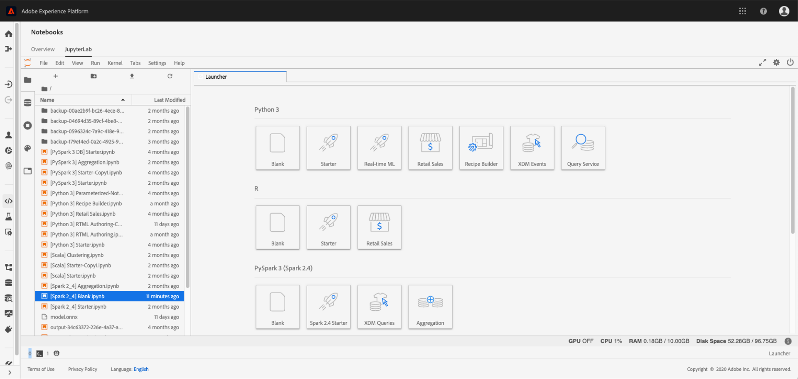

# Visão geral do Data Science Workspace

Adobe Experience Platform [!DNL Data Science Workspace] O usa aprendizagem de máquina e inteligência artificial para liberar insights de seus dados. Integrado ao Adobe Experience Platform, [!DNL Data Science Workspace] O ajuda você a fazer previsões usando seu conteúdo e ativos de dados nas soluções do Adobe.

Os cientistas de dados de todos os níveis de habilidades encontrarão ferramentas sofisticadas e fáceis de usar que suportam o desenvolvimento rápido, o treinamento e o ajuste de fórmulas de aprendizado de máquina - todos os benefícios da tecnologia de IA, sem a complexidade.

Com [!DNL Data Science Workspace], os cientistas de dados podem criar facilmente APIs de serviços inteligentes - viabilizadas pelo aprendizado de máquina. Esses serviços funcionam com outros serviços da Adobe, incluindo o Adobe Target e a Adobe Analytics Cloud, para ajudar você a automatizar experiências digitais personalizadas e direcionadas na Web, no desktop e em aplicativos móveis.

Este guia fornece uma visão geral dos principais conceitos relacionados a [!DNL Data Science Workspace].

## Introdução

A empresa atual coloca uma alta prioridade na mineração de grandes dados para previsões e insights que os ajudarão a personalizar experiências de clientes e fornecer mais valor aos clientes - e aos negócios.
Por mais importante que seja, passar dos dados para os insights pode ter um custo alto. Geralmente requer cientistas de dados qualificados que realizam pesquisas de dados intensivas e demoradas para desenvolver modelos de aprendizado de máquina, ou receitas, que potencializam serviços inteligentes. O processo é longo, a tecnologia é complexa, e os cientistas de dados qualificados podem ser difíceis de encontrar.

Com [!DNL Data Science Workspace], o Adobe Experience Platform permite trazer a IA com foco em experiência para toda a empresa, simplificando e acelerando o uso de dados para insights para código com:
- Uma estrutura de aprendizado de máquina e tempo de execução
- Acesso integrado aos dados armazenados no Adobe Experience Platform
- Um schema de dados unificado criado em [!DNL Experience Data Model] (XDM)
- O poder de computação essencial para o aprendizado de máquina/IA e o gerenciamento de grandes conjuntos de dados
- Receitas de aprendizado de máquina pré-criadas para acelerar o salto em experiências orientadas por IA
- Criação, reutilização e modificação simplificadas de receitas para cientistas de dados de níveis variados de competências
- Publicação e compartilhamento inteligentes de serviços em apenas alguns cliques - sem um desenvolvedor - e monitoramento e retreinamento para otimização contínua de experiências personalizadas de clientes

Os cientistas de dados de todos os níveis de habilidade obterão insights mais rapidamente e mais eficazes em experiências digitais.

## Introdução

Antes de entrar nos detalhes da [!DNL Data Science Workspace], veja um breve resumo dos termos principais:

| Termo | Definição |
|---------------------|------------------------------------------------------------------------------------------------------------------------------------------------------------------------------------------------------------------------------------------------------------------------------------------------------------------------------------------------------------------------------------------------------------------------------------------------------------------|
| [!DNL Data Science Workspace] | [!DNL Data Science Workspace] within [!DNL Experience Platform] permite que os clientes criem modelos de aprendizado de máquina utilizando dados em [!DNL Experience Platform] e Adobe Solutions para gerar insights e previsões inteligentes para tecer experiências digitais deliciosas do usuário final. |
| Inteligência artificial | A inteligência artificial é uma teoria e desenvolvimento de sistemas computacionais que são capazes de executar tarefas que normalmente exigem inteligência humana, como percepção visual, reconhecimento de voz, tomada de decisões e tradução entre línguas. |
| Aprendizagem de Máquina | O aprendizado de máquina é o campo de estudo que permite aos computadores a capacidade de aprender sem ser explicitamente programado. |
| [!DNL Sensei] Estrutura ML | [!DNL Sensei] O ML Framework é uma estrutura unificada de aprendizado de máquina em todo o Adobe que utiliza dados em [!DNL Experience Platform] capacitar os cientistas de dados no desenvolvimento de serviços de inteligência orientados para a aprendizagem de máquinas de uma forma mais rápida, escalável e reutilizável. |
| [!DNL Experience Data Model] | [!DNL Experience Data Model] (XDM) é o esforço de padronização levado pelo Adobe para definir esquemas padrão, como [!DNL Profile] e [!DNL ExperienceEvent], para Gerenciamento de experiência do cliente. |
| [!DNL JupyterLab] | [!DNL JupyterLab] O é uma interface baseada na Web de código aberto para o Project Jupyter e está totalmente integrada ao [!DNL Experience Platform]. |
| Receitas | Uma fórmula é termo treinado para uma especificação de modelo e um contêiner de nível superior que representa um aprendizado de máquina específico, algoritmo de IA ou conjunto de algoritmos, lógica de processamento e configuração necessários para criar e executar um modelo e, portanto, ajudar a resolver problemas específicos de negócios. |
| Modelo | Um modelo é uma instância de uma fórmula de aprendizado de máquina treinada com dados históricos e configurações para resolver um caso de uso comercial. |
| Treinamento | O treinamento é o processo de padrões de aprendizado e insights de dados rotulados. |
| Modelo treinado | Um modelo treinado representa o resultado executável de um processo de treinamento modelo, no qual um conjunto de dados de treinamento foi aplicado à instância do modelo. Um modelo treinado manterá uma referência em qualquer serviço Web inteligente criado a partir dele. O modelo treinado é adequado para pontuação e criação de um serviço Web inteligente. As modificações em um modelo treinado podem ser rastreadas como uma nova versão. |
| Pontuação | A pontuação é o processo de geração de insights de dados usando um modelo treinado. |
| Serviço de | Um serviço implantado expõe a funcionalidade de uma inteligência artificial, modelo de aprendizado de máquina ou algoritmo avançado por meio de uma API, para que possa ser consumido por outros serviços ou aplicativos para criar aplicativos inteligentes. |

O gráfico a seguir descreve a relação hierárquica entre Receitas, Modelos, Execuções de Treinamento e Execuções de Pontuação.

## Noções básicas do [!DNL Data Science Workspace]

Com [!DNL Data Science Workspace], seus cientistas de dados podem simplificar o complicado processo de descoberta de insights em grandes conjuntos de dados. Criado com base em uma estrutura comum de aprendizado de máquina e tempo de execução, [!DNL Data Science Workspace] O oferece gerenciamento avançado de fluxo de trabalho, gerenciamento de modelos e escalabilidade. Os serviços inteligentes oferecem suporte à reutilização de fórmulas de aprendizado de máquina para potencializar uma variedade de aplicativos criados com produtos e soluções de Adobe.

### Acesso a dados único

Os dados são a pedra angular da IA e do aprendizado de máquina.

[!DNL Data Science Workspace] seja totalmente integrado ao Adobe Experience Platform, incluindo o Data Lake, [!DNL Real-time Customer Profile]e [!DNL Unified Edge]. Explore todos os dados organizacionais armazenados no Adobe Experience Platform de uma só vez, juntamente com grandes bibliotecas de dados e de profundo aprendizado, como [!DNL Spark] ML e ML [!DNL TensorFlow]. Se não encontrar o que precisa, assimile seus próprios conjuntos de dados usando o esquema padronizado XDM.

### Receitas de aprendizado de máquina pré-criadas

[!DNL Data Science Workspace] O inclui fórmulas pré-criadas de aprendizado de máquina para necessidades comerciais comuns, como previsão de vendas de varejo e detecção de anomalias, de modo que cientistas e desenvolvedores de dados não precisam começar do zero. Atualmente, três receitas são oferecidas, [previsão de compra de produto](./pre-built-recipes/product-purchase-prediction.md), [recomendações de produto](./pre-built-recipes/product-recommendations.md)e [vendas a retalho](./pre-built-recipes/retail-sales.md).

[//]: # (The built-in recipe gallery offers recommendations for prebuilt recipes based on your business needs.)

Se preferir, você pode adaptar uma receita pré-criada às suas necessidades, importar uma receita ou começar do zero para criar uma receita personalizada. No entanto, você começa, uma vez que treina e hiperajusta uma receita, criar um serviço inteligente personalizado não requer um desenvolvedor - apenas alguns cliques e você está pronto para criar uma experiência digital direcionada e personalizada.

### Fluxo de trabalho focado no cientista de dados

Seja qual for o seu nível de conhecimento em ciência de dados, [!DNL Data Science Workspace] O ajuda a simplificar e acelerar o processo de encontrar insights em dados e aplicá-los a experiências digitais.

### Exploração de dados

Encontrar os dados certos e prepará-los é a parte mais intensiva em mão de obra na construção de uma receita eficaz. [!DNL Data Science Workspace] O e o Adobe Experience Platform ajudarão você a obter dos dados para insights mais rapidamente.

No Adobe Experience Platform, seus dados entre canais são centralizados e armazenados no esquema padronizado do XDM, para que os dados sejam mais fáceis de localizar, entender e limpar. Um armazenamento único de dados baseado em um esquema comum pode salvar inúmeras horas de exploração e preparação de dados.

Enquanto você navega, use R, [!DNL Python]ou Scala com o [!DNL Jupyter Notebook] para navegar pelo catálogo de dados no [!DNL Platform]. Usando um desses idiomas, você também pode aproveitar [!DNL Spark] ML e TensorFlow. Comece do zero ou use um dos modelos de notebook fornecidos para problemas comerciais específicos.

Como parte do fluxo de trabalho da exploração de dados, também é possível assimilar novos dados ou usar recursos existentes para ajudar na preparação dos dados.

### Criação

Com [!DNL Data Science Workspace], você decide como deseja criar receitas.

- Economize tempo ao procurar uma fórmula pré-criada que atenda às necessidades de sua empresa, que pode ser usada como está ou configurada para atender às suas necessidades específicas.
- Crie uma receita do zero, usando o tempo de execução de criação no Jupyter Notebook para desenvolver e registrar a receita.
- Faça upload de uma receita criada fora do Adobe Experience Platform para [!DNL Data Science Workspace] ou importar código de receita de um repositório, como [!DNL Git], usando a autenticação e a integração disponíveis entre [!DNL Git] e [!DNL Data Science Workspace].

### Experimentação

O Data Science Workspace oferece uma flexibilidade tremenda ao processo de experimentação. Comece com a receita. Em seguida, crie uma instância separada, usando o mesmo algoritmo principal emparelhado com características exclusivas, como parâmetros de hiperajuste. Você pode criar quantas instâncias forem necessárias, treinando e pontuando cada instância quantas vezes desejar. Enquanto você os treina, [!DNL Data Science Workspace] rastreia receitas, instâncias de receita e instâncias treinadas, juntamente com métricas de avaliação, para que não seja necessário.

### Operacionalização

Quando você está feliz com sua receita, são apenas alguns cliques para criar um serviço inteligente. Não é necessário codificar - você pode fazer isso sozinho, sem se inscrever em um desenvolvedor ou engenheiro. Por fim, publique o serviço inteligente no Adobe IO e ele estará pronto para que sua equipe de experiência digital consuma.

<!--You can also publish your intelligent service to the Service Gallery, where it's available to specific people, specific organizations, or everyone who develops data solutions on Adobe Experience Platform. You can even share it with your external partners, and they can share their intelligent service with you. And the next time you're starting a new recipe, you can check the Service Gallery to see if there's a similar intelligent service you can use to get started. -->

### Melhoria contínua

[!DNL Data Science Workspace] rastreia onde os serviços inteligentes são chamados e como estão se saindo. À medida que os dados são transferidos, é possível avaliar a precisão do serviço inteligente para fechar o loop e treiná-las novamente conforme necessário para melhorar o desempenho. O resultado é um refinamento contínuo na precisão da personalização do cliente.

### Acesso a novos recursos e conjuntos de dados

Os cientistas de dados podem aproveitar as novas tecnologias e conjuntos de dados assim que estiverem disponíveis por meio dos serviços da Adobe. Por meio de atualizações frequentes, fazemos o trabalho de integrar conjuntos de dados e tecnologias na plataforma, para que você não precise.

### Segurança e paz de espírito

A segurança de seus dados é uma prioridade máxima do Adobe. O Adobe protege seus dados com processos e controles de segurança desenvolvidos para ajudar a cumprir padrões, regulamentos e certificações aceitos pelo setor.

A segurança é integrada em software e serviços como parte do ciclo de vida do produto Adobe Secure.
Para saber mais sobre a segurança, conformidade e outros dados do Adobe e do software, visite a página de segurança em https://www.adobe.com/security.html.

## [!DNL Data Science Workspace] em ação

As previsões e insights fornecem as informações necessárias para fornecer uma experiência altamente personalizada a cada cliente que visita seu site, entra em contato com a central de atendimento ou participa de outras experiências digitais. Veja como o seu trabalho diário acontece com [!DNL Data Science Workspace].

### Definir o problema

Tudo começa com um problema comercial. Por exemplo, uma central de atendimento online precisa de contexto para ajudá-los a tornar um sentimento negativo do cliente positivo.

Há muitos dados sobre o cliente. Eles navegaram pelo site, colocaram itens no carrinho e até fizeram pedidos. Eles podem ter recebido emails, usado cupons ou contatado a central de atendimento anteriormente. A receita, portanto, precisa usar os dados disponíveis sobre o cliente e suas atividades para determinar a propensão a comprar e recomendar uma oferta que o cliente provavelmente apreciará e usará.

No momento do contato da central de atendimento, o cliente ainda tem dois pares de sapatos no carrinho, mas removeu uma camisa. Com essas informações, o serviço inteligente pode recomendar que o agente da central de atendimento ofereça um cupom para 20% de desconto nos sapatos durante a chamada. Se o cliente usar o cupom, essas informações serão adicionadas ao conjunto de dados e as previsões se tornarão ainda melhores na próxima vez que o cliente fizer chamadas.

### Explore e prepare os dados

Com base no problema de negócios definido, você sabe que a receita deve analisar todas as transações da Web do cliente, incluindo visitas ao site, pesquisas, exibições de página, links clicados, ações do carrinho, ofertas recebidas, emails recebidos, interações da central de atendimento e assim por diante.

Um cientista de dados normalmente gasta até 75% do tempo necessário para criar uma receita explorando e transformando os dados. Os dados geralmente vêm de vários repositórios e são salvos em esquemas diferentes - eles devem ser combinados e mapeados antes de serem usados para criar uma receita.

[//]: # (Your first step is to check the recipe gallery to see if an existing recipe meets your needs, or comes close. An alternative is to import a recipe you created outside of Adobe Experience Platform. Starting with an existing recipe often streamlines the data exploration phase and makes it easier for a data scientist.)

Se você estiver começando do zero ou configurando uma receita existente, inicie a pesquisa de dados em um catálogo de dados centralizado e padronizado para sua organização, o que simplifica consideravelmente a busca. Você pode até descobrir que outro cientista de dados em sua organização já identificou um conjunto de dados semelhante e optar por ajustar esse conjunto de dados em vez de começar do zero.
Todos os dados no Adobe Experience Platform estão em conformidade com um esquema XDM padronizado, eliminando a necessidade de criar um modelo complexo para unir dados ou obter ajuda de um engenheiro de dados.

Se você não encontrar imediatamente os dados necessários, mas eles existirem fora da Adobe Experience Platform, é uma tarefa relativamente simples de assimilar conjuntos de dados adicionais, que também se transformará no esquema XDM padronizado.\
Você pode usar [!DNL Jupyter Notebook] para simplificar o pré-processamento de dados - possivelmente começando com um modelo de notebook ou um notebook usado anteriormente para a propensão a comprar.

### Criar a receita

Se você já encontrou uma receita que atenda a todas as suas necessidades, poderá seguir para a experimentação. Ou você pode modificar a receita um pouco ou criar uma do zero - aproveitando a [!DNL Data Science Workspace] criação de tempo de execução em [!DNL Jupyter Notebook]. O uso do tempo de execução da criação garante que ambos possam usar o [!DNL Data Science Workspace] fluxo de trabalho de treinamento e pontuação e converter a receita posteriormente para que possa ser armazenada e reutilizada por outras pessoas em sua organização.

Você também pode importar uma receita para o [!DNL Data Science Workspace] e aproveite os fluxos de trabalho de experimentação ao criar seu serviço inteligente.

### Experimente com a receita

Com uma receita que incorpora os algoritmos principais de aprendizado de máquina, muitas instâncias de receita podem ser criadas com uma única receita. Essas instâncias de receita são chamadas de modelos. Um modelo requer treinamento e avaliação para otimizar sua eficiência e eficácia operacional, um processo que normalmente consiste em tentativa e erro.

À medida que você treina seus modelos, as execuções de treinamento e as avaliações são geradas. [!DNL Data Science Workspace] acompanha as métricas de avaliação de cada modelo exclusivo e suas execuções de treinamento. As métricas de avaliação geradas pela experimentação permitirão determinar a execução do treinamento que tem melhor desempenho.

Visite o [API](./models-recipes/train-evaluate-model-api.md) ou [interface](./models-recipes/train-evaluate-model-ui.md) tutorial sobre como treinar e avaliar modelos em [!DNL Data Science Workspace].

### Operacionalizar o modelo

Ao selecionar a melhor fórmula treinada para atender às suas necessidades de negócios, você pode criar um serviço inteligente em [!DNL Data Science Workspace] sem assistência ao desenvolvedor. São apenas alguns cliques - sem necessidade de codificação. Um serviço inteligente publicado é acessível a outros membros de sua organização sem a necessidade de recriar o modelo.

Um serviço inteligente publicado é configurável para se treinar automaticamente de tempos em tempos usando novos dados à medida que eles se tornam disponíveis. Isso garante que seu serviço mantenha sua eficiência e eficácia enquanto o tempo continua.

## Próximas etapas

[!DNL Data Science Workspace] ajuda a simplificar e simplificar o fluxo de trabalho da ciência de dados, desde a coleta de dados a algoritmos até serviços inteligentes para cientistas de dados de todos os níveis de habilidades. Com as ferramentas sofisticadas [!DNL Data Science Workspace] , é possível reduzir significativamente o tempo dos dados para insights.

Mais importante, [!DNL Data Science Workspace] Coloca a ciência de dados e os recursos de otimização algorítmica da plataforma de marketing líder do Adobe nas mãos dos cientistas de dados empresariais. Pela primeira vez, as empresas podem trazer algoritmos proprietários para a plataforma, aproveitando os recursos avançados de aprendizado de máquina Adobe e IA para fornecer experiências altamente personalizadas de clientes em escala maciça.

Com o casamento entre a experiência da marca e o aprendizado de máquina Adobe, as empresas têm o poder de impulsionar mais valor comercial e fidelidade da marca dando aos clientes o que querem, antes que eles peçam.

Para obter mais informações, como um fluxo de trabalho diário completo, comece lendo o [Apresentação do Data Science Workspace](./walkthrough.md) documentação.

## Recursos adicionais

O vídeo a seguir foi criado para oferecer suporte à compreensão do [!DNL Data Science Workspace].

>[!VIDEO](https://video.tv.adobe.com/v/30567?quality=12&amp;enable10seconds=on&amp;speedcontrol=on)