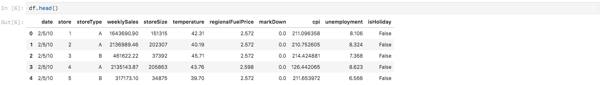

# Analise seus dados usando notebooks

>[!NOTE]
>
>O Área de trabalho de ciência de dados não está mais disponível para compra.
>
>Esta documentação destina-se a clientes existentes com direitos anteriores à Data Science Área de trabalho.

Esta tutorial foca em como usar os notebooks Jupyter, construídos nos Área de trabalho de Ciência de Dados, para acessar, explorar e visualizar seus dados. Ao final desta tutorial, você deve compreender alguns dos recursos que a Jupyter Notebooks oferta para entender melhor seus dados.

Os seguintes conceitos são introduzidos:

- **[!DNL JupyterLab]:** [[!DNL JupyterLab]](https://blog.jupyter.org/jupyterlab-is-ready-for-users-5a6f039b8906) é a interface de última geração baseada na Web para o Project Jupyter e é bem integrada ao [!DNL Adobe Experience Platform].
- **Lotes:** conjuntos de dados são compostos de lotes. Um lote é um conjunto de dados coletados por um período e processados juntos como uma única unidade. Novos lotes são criados quando dados são adicionados a um conjunto de dados.
- **SDK do acesso de dados (obsoleto):** o SDK do acesso aos dados foi descontinuado. Use o [[!DNL Platform SDK]](../authoring/platform-sdk.md) guia.

## Explore notebooks em data science Área de trabalho

Nesta seção, são explorados dados que foram assimilados anteriormente nos schema de vendas no varejo.

O Data Science Workspace permite que os usuários criem [!DNL Jupyter Notebooks] por meio da plataforma [!DNL JupyterLab], onde podem criar e editar fluxos de trabalho de aprendizado de máquina. O [!DNL JupyterLab] é uma ferramenta de colaboração servidor-cliente que permite aos usuários editar documentos do bloco de anotações via navegador da Web. Esses blocos de anotações podem conter código executável e elementos rich text. Para nossos propósitos, usaremos o Markdown para descrição de análise e código [!DNL Python] executável para realizar exploração e análise de dados.

### Escolha seu espaço de trabalho

Ao iniciar o [!DNL JupyterLab], nos é apresentada uma interface baseada na Web para o Jupyter Notebooks. Dependendo do tipo de notebook escolhido, o kernel correspondente será iniciado.

Ao comparar qual ambiente usar, devemos considerar as limitações de cada serviço. Por exemplo, se estamos usando a biblioteca [pandas](https://pandas.pydata.org/) com [!DNL Python], como usuário comum, o limite de RAM é de 2 GB. Mesmo sendo um usuário avançado, estaríamos limitados a 20 GB de RAM. Se estiver lidando com computações maiores, faria sentido usar [!DNL Spark] que oferece 1,5 TB que é compartilhado com todas as instâncias do bloco de anotações.

Por padrão, o Tensorflow fórmula funcionar em um cluster GPU e Python for executado dentro de um cluster de CPU.

### Criar um novo notebook

[!DNL Adobe Experience Platform] No interface, selecione [!UICONTROL Data Science] no menu superior para levá-lo ao data science Área de trabalho. Neste página, selecione [!DNL JupyterLab] para abrir a [!DNL JupyterLab] iniciador. Você deve ver um página semelhante a este.


Em nosso tutorial, estaremos usando [!DNL Python] 3 no Notebook Jupyter para mostrar como acessar e explorar os dados. Na página do Iniciador, há blocos de anotações de exemplo fornecidos. Vamos usar a receita de Vendas a Varejo para [!DNL Python] 3.


A fórmula de Vendas de varejo é um exemplo independente que usa o mesmo conjunto de dados de Vendas de varejo para mostrar como os dados podem ser explorados e visualizados no Jupyter Notebook. Além disso, o notebook aprofunda-se em treinamento e verificação. Mais informações sobre este bloco de anotações específico podem ser encontradas nesta [apresentação](../walkthrough.md).

### Acessar dados

>[!NOTE]
>
>Ela `data_access_sdk_python` está obsoleta e não é mais recomendada. Consulte a conversão do [SDK de acesso de dados em Platform tutorial do SDK](../authoring/platform-sdk.md) para converter seu código. As mesmas etapas abaixo ainda se aplicam a esse tutorial.

Acessaremos internamente os dados de [!DNL Adobe Experience Platform] e os dados externamente. Usaremos o `data_access_sdk_python` biblioteca para acessar dados internos, como conjuntos de dados e esquemas XDM. Para dados externos, usaremos os pandas [!DNL Python] biblioteca.

#### Dados externos

Com o notebook Vendas no varejo aberto, encontre o cabeçalho &quot;Carregar dados&quot;. O código [!DNL Python] a seguir usa a estrutura de dados `DataFrame` dos pandas e a função [read_csv()](https://pandas.pydata.org/pandas-docs/stable/generated/pandas.read_csv.html#pandas.read_csv) para ler o CSV hospedado em [!DNL Github] no DataFrame:


A estrutura de dados DataFrame de Pandas é uma estrutura de dados rotulada bidimensional. Para ver rapidamente as dimensões de nossos dados, podemos usar o `df.shape`. Isso retorna uma tupla que representa a dimensionalidade do DataFrame:


Finalmente, podemos dar uma olhada no que nossos dados parecem curtir. Podemos usar `df.head(n)` para visualização as primeiras `n` linhas do DataFrame:


#### [!DNL Experience Platform] dados

Agora, vamos acessar [!DNL Experience Platform] os dados.

##### Por ID do conjunto de dados

Para esta seção, estamos usando o conjunto de dados de Vendas de varejo, que é o mesmo conjunto de dados usado no bloco de anotações de amostra Vendas de varejo.

No Jupyter Notebook, você pode acessar os dados da **guia Dados**  à esquerda. Ao selecionar a guia, duas pastas são fornecidas. Selecione a pasta **[!UICONTROL Conjuntos de dados]**.


Agora, no diretório Conjuntos de dados, é possível ver todos os conjuntos de dados assimilados. Observe que pode levar um minuto para carregar todas as entradas se seu diretório estiver preenchido com conjuntos de dados.

Como a conjunto de dados é a mesma, queremos substituir os dados de carga da seção anterior que usa dados externos. Selecione o bloco de código em **Carregar dados** e pressione a **tecla &#39;d&#39;** no teclado duas vezes. Verifique se a focalizar está no bloco e não no texto. **Pressione &quot;esc&quot;** para escapar do focalizar de texto antes de pressionar **&#39;d&#39;** duas vezes.

Agora, podemos clique com o botão direito no `Retail-Training-<your-alias>` conjunto de dados e selecionar a opção &quot;Explorar dados em notebook&quot; na lista suspensa. Uma entrada de código executável aparecerá no seu notebook.

>[!TIP]
>
>Consulte o [[!DNL Platform SDK]](../authoring/platform-sdk.md) guia para converter seu código.

```PYTHON
from data_access_sdk_python.reader import DataSetReader
from datetime import date
reader = DataSetReader()
df = reader.load(data_set_id="xxxxxxxx", ims_org="xxxxxxxx@AdobeOrg")
df.head()
```

Se você estiver trabalhando em outros núcleos [!DNL Python]além disso, consulte [essa página](https://github.com/adobe/acp-data-services-dsw-reference/wiki/Accessing-Data-on-the-Platform) para acessar os [!DNL Adobe Experience Platform]dados na variável .

Selecionar a célula executável e pressionar a botão de reprodução na barra de ferramentas executará o código executável. A saída `head()` será uma tabela com as chaves do conjunto de dados como colunas e as primeiras n linhas no conjunto de dados. `head()` aceita um argumento inteiro para especificar quantas linhas deve ser saída. Por padrão, é 5.



Se você reiniciar o kernel e executar todas as células novamente, você deverá obter as mesmas saídas de antes.


### Explore seus dados

Agora que podemos acessar seus dados, vamos focalizar nos dados em si usando estatísticas e visualização. O conjunto de dados que estamos usando é um conjunto de dados de varejo que dá informações diversas sobre 45 lojas diferentes em um determinado dia. Algumas características de um determinado e `date` `store` incluem o seguinte:
- `storeType`
- `weeklySales`
- `storeSize`
- `temperature`
- `regionalFuelPrice`
- `markDown`
- `cpi`
- `unemployment`
- `isHoliday`

#### Resumo estatístico

Podemos usar [!DNL Python's] pandas biblioteca para obter o tipo de dados de cada atributo. A saída da chamada a seguir fornecerá informações sobre o número de entradas e o tipo de dados de cada uma das colunas:

```PYTHON
df.info()
```


Essas informações são úteis, pois conhecer o tipo de dados de cada coluna nos permitirá saber como tratar os dados.

Agora vamos ver o resumo estatístico. Somente os numérico tipos de dados serão mostrados, portanto `date`, `storeType`e `isHoliday` não serão emitidos:

```PYTHON
df.describe()
```


Com isso, podemos ver que há 6435 instâncias para cada característica. Além disso, informações estatísticas como média, desvio padrão (EST), mín, máx e interquartiles são fornecidas. Isso nos fornece informações sobre o desvio dos dados. Na próxima seção, vamos analisar a visualização que funciona em conjunto com essas informações para nos dar uma boa compreensão dos nossos dados.

Olhando para `store`os valores mínimos e máximos, podemos ver que há 45 armazenamentos exclusivos que os dados representam. Há também `storeTypes` que diferenciam o que é um armazenamento. Podemos ver a distribuição de `storeTypes` fazendo o seguinte:


Isso significa que 22 lojas são de `storeType` `A`, 17 são `storeType` `B`, e 6 são `storeType` `C`.

#### Visualização de dados

Agora que conhecemos nossos valores de quadros de dados, queremos complementar isso com visualizações para tornar as coisas mais claras e fáceis de identificar padrões. Gráficos também são úteis ao transmitir resultados a uma público-alvo. Alguns [!DNL Python] bibliotecas úteis para visualização incluem:
- [Matplotlib](https://matplotlib.org/)
- [pandas](https://pandas.pydata.org/)
- [seaborn](https://seaborn.pydata.org/)
- [gráfico](https://ggplot2.tidyverse.org/)

Nesta seção, abordaremos rapidamente algumas vantagens do uso de cada biblioteca.

[Matplotlib](https://matplotlib.org/) é o pacote de visualização [!DNL Python] mais antigo. Seu objetivo é tornar &quot;coisas fáceis e difíceis possíveis&quot;. Isso tende a ser verdade, pois o pacote é extremamente eficiente, mas também vem com complexidade. Nem sempre é fácil obter um gráfico de aparência razoável sem tomar uma quantidade considerável de tempo e esforço.

[Os pandas são usados](https://pandas.pydata.org/) principalmente para seu objeto DataFrame que permite manipulação de dados com indexação integrada. No entanto, os pandas também incluem uma trama incorporada funcionalidade que é baseada em matplotlib.

[seaborn](https://seaborn.pydata.org/) é um pacote build em cima de matplotlib. Seu principal objetivo é tornar os gráficos padrão visualmente mais atraentes e simplificar a criação de gráficos complicados.

[ggplot](https://ggplot2.tidyverse.org/) é um pacote também criado em cima de matplotlib. No entanto, a diferença principal é que o ferramenta é uma porta de ggplot2 para R. Assim como o seaborn, o objetivo é melhorar após matplotlib. Os usuários familiarizados com ggplot2 para R devem considerar essa biblioteca.


##### Gráficos univariados

Gráficos univariados são gráficos de um variável individual. Um gráfico univariado comum é usado para visualizar seus dados na caixa e no gráfico do bigode.

Usando nosso conjunto de dados de varejo de antes, podemos gerar a caixa e o gráfico de bigodes para cada uma das 45 lojas e suas vendas semanais. O gráfico é gerado usando a `seaborn.boxplot` função.


Uma caixa e um gráfico de bigode são usados para mostrar a distribuição de dados. As linhas externas do gráfico mostram os quartis superior e inferior, enquanto a caixa abrange o intervalo interquartil. A linha na caixa marca a mediana. Quaisquer pontos de dados maiores que 1,5 vez o quartil superior ou inferior são marcados como um círculo. Esses pontos são considerados outliers.

##### Gráficos multivariado

Gráficos multivariados são usados para ver a interação entre variáveis. Com a visualização, os cientistas de dados podem ver se há correlações ou padrões entre as variáveis. Um gráfico multivariado comum usado é uma matriz de correlação. Com uma matriz de correlação, as dependências entre múltiplas variáveis são quantificadas com o coeficiente de correlação.

Usando o mesmo conjunto de dados de varejo, podemos gerar a matriz de correlação.


Observe a diagonal de 1 no centro. Isso mostra que, ao comparar um variável a si mesmo, ele tem um correlação positivo completo. Fortes correlação positivos terão uma magnitude próxima de 1, enquanto correlações fracas serão próximas de 0. O correlação negativo é mostrado com um coeficiente negativo mostrando uma tendência inversa.


## Próximas etapas

Esta tutorial foi explicada sobre como criar um novo notebook Jupyter na Área de trabalho de Ciência de Dados e como acessar dados externamente e também de [!DNL Adobe Experience Platform]. Especificamente, fomos além das seguintes etapas:
- Criar um novo notebook Jupyter
- Acessar conjuntos de dados e esquemas
- Explorar conjuntos de dados

Agora você está pronto para seguir para a [próxima seção](../models-recipes/package-source-files-recipe.md) para empacotar uma fórmula e importar para o Data Science Workspace.
