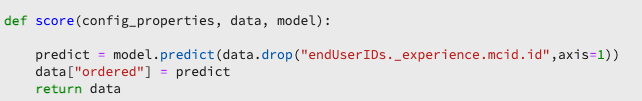

# Criar um modelo usando notebooks JupyterLab

Este tutorial o orienta pelas etapas necessárias para criar um modelo usando o modelo do construtor de receitas de notebooks JupyterLab.

## Conceitos introduzidos:

- **Receitas:** Uma fórmula é termo treinado para uma especificação de modelo e um contêiner de nível superior que representa um aprendizado de máquina específico, um algoritmo de IA ou um conjunto de algoritmos, lógica de processamento e configuração necessários para criar e executar um modelo.
- **Modelo:** Um modelo é uma instância de uma fórmula de aprendizado de máquina treinada com dados históricos e configurações para resolver um caso de uso comercial.
- **Formação:** O treinamento é o processo de padrões de aprendizado e insights de dados rotulados.
- **Pontuação:** A pontuação é o processo de geração de insights de dados usando um modelo treinado.

## Baixe os ativos necessários {#assets}

Antes de prosseguir com este tutorial, você deve criar os esquemas e conjuntos de dados necessários. Visite o tutorial para [criação de schemas e conjuntos de dados do modelo de propensão do Luma](../models-recipes/create-luma-data.md) para baixar os ativos necessários e configurar os pré-requisitos.

## Introdução ao [!DNL JupyterLab] ambiente do notebook

Criar uma receita do zero pode ser feito em [!DNL Data Science Workspace]. Para iniciar, navegue até [Adobe Experience Platform](https://platform.adobe.com) e selecione o **[!UICONTROL Notebooks]** à esquerda. Para criar um novo bloco de anotações, selecione o modelo do Criador de receitas no [!DNL JupyterLab Launcher].

O [!UICONTROL Criador de receita] o notebook permite executar execuções de treinamento e pontuação dentro do notebook. Isso proporciona flexibilidade para fazer alterações em seus `train()` e `score()` métodos entre a execução de experimentos nos dados de treinamento e pontuação. Quando estiver satisfeito com os resultados do treinamento e da pontuação, você poderá criar uma receita e, além disso, publicá-la como um modelo usando a receita para a funcionalidade do modelo.

>[!NOTE]
>
>O [!UICONTROL Criador de receita] o notebook suporta o trabalho com todos os formatos de arquivo, mas atualmente a funcionalidade criar receita só suporta [!DNL Python].


Ao selecionar a variável [!UICONTROL Criador de receita] do lançador, o notebook é aberto em uma nova guia.

Na nova guia do notebook na parte superior, uma barra de ferramentas é carregada com três ações adicionais - **[!UICONTROL Comboio]**, **[!UICONTROL Pontuação]** e **[!UICONTROL Criar receita]**. Esses ícones só aparecem no [!UICONTROL Criador de receita] notebook. Mais informações sobre essas ações são fornecidas [na seção treinamento e pontuação](#training-and-scoring) depois de criar a Receita no notebook.


## Introdução ao [!UICONTROL Criador de receita] notebook

Na pasta de ativos fornecida, há um modelo de propensão Luma `propensity_model.ipynb`. Usando a opção de fazer upload do bloco de anotações no JupyterLab, faça upload do modelo fornecido e abra o bloco de anotações.


O restante deste tutorial aborda os seguintes arquivos predefinidos no notebook modelo de propensão:

- [Arquivo de requisitos](#requirements-file)
- [Arquivos de configuração](#configuration-files)
- [Carregador de dados de treinamento](#training-data-loader)
- [Carregador de dados de pontuação](#scoring-data-loader)
- [Arquivo de pipeline](#pipeline-file)
- [Arquivo do avaliador](#evaluator-file)
- [Arquivo do Data Saver](#data-saver-file)

O tutorial em vídeo a seguir explica o notebook modelo de propensão do Luma:

>[!VIDEO](https://video.tv.adobe.com/v/333570)

### Arquivo de requisitos {#requirements-file}

O arquivo requirements é usado para declarar bibliotecas adicionais que você deseja usar no modelo. Você pode especificar o número da versão se houver uma dependência. Para procurar bibliotecas adicionais, visite [anaconda.org](https://anaconda.org). Para saber como formatar o arquivo de requisitos, visite [Conda](https://docs.conda.io/projects/conda/en/latest/user-guide/tasks/manage-environments.html#creating-an-environment-file-manually). A lista de bibliotecas principais já em uso inclui:

```JSON
python=3.6.7
scikit-learn
pandas
numpy
data_access_sdk_python
```

>[!NOTE]
>
>As bibliotecas ou versões específicas adicionadas podem ser incompatíveis com as bibliotecas acima. Além disso, se você optar por criar um arquivo de ambiente manualmente, a variável `name` não é permitido substituir o campo.

Para o notebook modelo de propensão Luma, os requisitos não precisam ser atualizados.

### Arquivos de configuração {#configuration-files}

Os arquivos de configuração, `training.conf` e `scoring.conf`, são usados para especificar os conjuntos de dados que você deseja usar para treinamento e pontuação, bem como adicionar hiperparâmetros. Há configurações separadas para treinamento e pontuação.

Para que um modelo execute treinamento, você deve fornecer a variável `trainingDataSetId`, `ACP_DSW_TRAINING_XDM_SCHEMA`e `tenantId`. Além disso, para pontuação, você deve fornecer a variável `scoringDataSetId`, `tenantId`e `scoringResultsDataSetId `.

Para localizar o conjunto de dados e as IDs do schema, vá para a guia data  em blocos de anotações na barra de navegação esquerda (sob o ícone de pasta). É necessário fornecer três IDs de conjunto de dados diferentes. O `scoringResultsDataSetId` O é usado para armazenar os resultados de pontuação do modelo e deve ser um conjunto de dados vazio. Esses conjuntos de dados foram feitos anteriormente na variável [Ativos obrigatórios](#assets) etapa.


As mesmas informações podem ser encontradas em [Adobe Experience Platform](https://platform.adobe.com/) nos termos do **[Esquema](https://platform.adobe.com/schema)** e **[Conjuntos de dados](https://platform.adobe.com/dataset/overview)** guias.

Depois de concluir, sua configuração de treinamento e pontuação deve ser semelhante à seguinte captura de tela:


Por padrão, os seguintes parâmetros de configuração são definidos para você ao treinar e pontuar dados:

- `ML_FRAMEWORK_IMS_USER_CLIENT_ID`
- `ML_FRAMEWORK_IMS_TOKEN`
- `ML_FRAMEWORK_IMS_ML_TOKEN`
- `ML_FRAMEWORK_IMS_TENANT_ID`

## Como entender o carregador de dados de treinamento {#training-data-loader}

O objetivo do Carregador de dados de treinamento é instanciar os dados usados para criar o modelo de aprendizado de máquina. Normalmente, há duas tarefas que o carregador de dados de treinamento realiza:

- Carregamento de dados de [!DNL Platform]
- Preparação de dados e engenharia de recursos

As duas seções a seguir abordarão o carregamento de dados e a preparação de dados.

### Carregamento de dados {#loading-data}

Essa etapa utiliza o [pandas dataframe](https://pandas.pydata.org/pandas-docs/stable/generated/pandas.DataFrame.html). Os dados podem ser carregados de arquivos em [!DNL Adobe Experience Platform] usando a [!DNL Platform] SDK (`platform_sdk`) ou de fontes externas que utilizem pandas&quot; `read_csv()` ou `read_json()` funções.

- [[!DNL Platform SDK]](#platform-sdk)
- [Fontes externas](#external-sources)

>[!NOTE]
>
>No notebook Recipe Builder, os dados são carregados por meio do `platform_sdk` carregador de dados.

### [!DNL Platform] SDK {#platform-sdk}

Para obter um tutorial detalhado sobre o uso da variável `platform_sdk` carregador de dados, visite o [Guia do SDK da plataforma](../authoring/platform-sdk.md). Este tutorial fornece informações sobre autenticação de criação, leitura básica de dados e escrita básica de dados.

### Fontes externas {#external-sources}

Esta seção mostra como importar um arquivo JSON ou CSV para um objeto de painel. A documentação oficial da biblioteca dos pandas pode ser encontrada aqui:
- [read_csv](https://pandas.pydata.org/pandas-docs/stable/generated/pandas.read_csv.html)
- [read_json](https://pandas.pydata.org/pandas-docs/stable/generated/pandas.read_json.html)

Primeiro, veja um exemplo de importação de um arquivo CSV. O `data` é o caminho para o arquivo CSV. Essa variável foi importada do `configProperties` no [seção anterior](#configuration-files).

```PYTHON
df = pd.read_csv(data)
```

Também é possível importar de um arquivo JSON. O `data` é o caminho para o arquivo CSV. Essa variável foi importada do `configProperties` no [seção anterior](#configuration-files).

```PYTHON
df = pd.read_json(data)
```

Agora seus dados estão no objeto dataframe e podem ser analisados e manipulados na função [próxima seção](#data-preparation-and-feature-engineering).

## Arquivo de Carregador de Dados de Treinamento

Neste exemplo, os dados são carregados usando o SDK da plataforma. A biblioteca pode ser importada na parte superior da página, incluindo a linha :

`from platform_sdk.dataset_reader import DatasetReader`

Em seguida, você pode usar o `load()` método para capturar o conjunto de dados de treinamento do `trainingDataSetId` como definido na configuração (`recipe.conf`).

```PYTHON
def load(config_properties):
    print("Training Data Load Start")

    #########################################
    # Load Data
    #########################################    
    client_context = get_client_context(config_properties)
    dataset_reader = DatasetReader(client_context, dataset_id=config_properties['trainingDataSetId'])
```

>[!NOTE]
>
>Como mencionado no [Seção Arquivo de configuração](#configuration-files), os seguintes parâmetros de configuração são definidos para você ao acessar dados do Experience Platform usando `client_context = get_client_context(config_properties)`:
> - `ML_FRAMEWORK_IMS_USER_CLIENT_ID`
> - `ML_FRAMEWORK_IMS_TOKEN`
> - `ML_FRAMEWORK_IMS_ML_TOKEN`
> - `ML_FRAMEWORK_IMS_TENANT_ID`


Agora que você tem seus dados, você pode começar com preparação de dados e engenharia de recursos.

### Preparação de dados e engenharia de recursos {#data-preparation-and-feature-engineering}

Após os dados serem carregados, eles precisam ser limpos e passar pela preparação dos dados. Neste exemplo, o objetivo do modelo é prever se um cliente irá ou não solicitar um produto. Como o modelo não está procurando produtos específicos, você não precisa `productListItems` e, portanto, a coluna é solta. Em seguida, são soltas colunas adicionais que contêm apenas um ou dois valores em uma única coluna. Ao treinar um modelo, é importante manter apenas dados úteis que ajudarão a prever sua meta.


Depois de descartar os dados desnecessários, você pode começar a engenharia de recursos. Os dados de demonstração usados para esse exemplo não contêm informações de sessão. Normalmente, você gostaria de ter dados sobre as sessões atuais e anteriores para um cliente específico. Devido à falta de informações sobre a sessão, esse exemplo imita as sessões atuais e anteriores por meio da demarcação da jornada.


Após a conclusão da demarcação, os dados são rotulados e uma jornada é criada.


Em seguida, os recursos são criados e divididos em passado e presente. Em seguida, as colunas desnecessárias são descartadas, deixando você com as jornadas anteriores e atuais para clientes do Luma. Essas jornadas contêm informações como se um cliente comprou um item e a jornada que levou até a compra.


## Carregador de dados de pontuação {#scoring-data-loader}

O procedimento para carregar dados para pontuação é semelhante ao carregamento de dados de treinamento. Olhando de perto para o código, você pode ver que tudo é o mesmo, exceto o `scoringDataSetId` no `dataset_reader`. Isso ocorre porque a mesma fonte de dados Luma é usada para treinamento e pontuação.

Caso você queira usar arquivos de dados diferentes para treinamento e pontuação, o carregador de dados de treinamento e pontuação é separado. Isso permite executar um pré-processamento adicional, como mapear os dados de treinamento para os dados de pontuação, se necessário.

## Arquivo de pipeline {#pipeline-file}

O `pipeline.py` O arquivo inclui lógica para treinamento e pontuação.

O objetivo do treinamento é criar um modelo usando recursos e rótulos em seu conjunto de dados de treinamento. Depois de escolher o modelo de treinamento, você deve ajustar o conjunto de dados de treinamento x e y ao modelo e a função retorna o modelo treinado.

>[!NOTE]
> 
>Os recursos se referem à variável de entrada usada pelo modelo de aprendizado de máquina para prever os rótulos.


O `score()` deve conter o algoritmo de pontuação e retornar uma medição para indicar o sucesso do modelo. O `score()` usa os rótulos de conjunto de dados de pontuação e o modelo treinado para gerar um conjunto de recursos previstos. Esses valores previstos são comparados com os recursos reais no conjunto de dados de pontuação. Neste exemplo, a variável `score()` usa o modelo treinado para prever recursos usando os rótulos do conjunto de dados de pontuação. Os recursos previstos são retornados.



## Arquivo do avaliador {#evaluator-file}

O `evaluator.py` O arquivo contém lógica sobre como você deseja avaliar a receita treinada, bem como dividir os dados de treinamento.

### Dividir o conjunto de dados {#split-the-dataset}

A fase de preparação de dados para treinamento requer a divisão do conjunto de dados a ser usado para treinamento e testes. Essa `val` os dados são usados implicitamente para avaliar o modelo depois de serem treinados. Esse processo é separado da pontuação.

Esta seção mostra o `split()` que carrega dados no bloco de notas e, em seguida, limpa os dados removendo colunas não relacionadas no conjunto de dados. A partir daí, é possível executar a engenharia de recursos, que é o processo para criar recursos relevantes adicionais a partir de recursos brutos existentes nos dados.


### Avaliar o modelo treinado {#evaluate-the-trained-model}

O `evaluate()` é executada depois que o modelo é treinado e retorna uma métrica para indicar o sucesso do modelo. O `evaluate()` usa os rótulos do conjunto de dados de teste e o modelo treinado para prever um conjunto de recursos. Esses valores previstos são comparados com os recursos reais no conjunto de dados de teste. Neste exemplo, as métricas usadas são `precision`, `recall`, `f1`e `accuracy`. Observe que a função retorna um `metric` objeto que contém uma matriz de métricas de avaliação. Essas métricas são usadas para avaliar o desempenho do modelo treinado.


Adição de `print(metric)` permite visualizar os resultados da métrica.


## Arquivo do Data Saver {#data-saver-file}

O `datasaver.py` O arquivo contém o `save()` e é usada para salvar sua previsão ao testar a pontuação. O `save()` utiliza sua previsão e o uso de [!DNL Experience Platform Catalog] APIs, grava os dados no `scoringResultsDataSetId` você especificou em seu `scoring.conf` arquivo. Você pode


## Treinamento e pontuação {#training-and-scoring}

Quando terminar de fazer alterações no notebook e quiser treinar a receita, você pode selecionar os botões associados na parte superior da barra para criar uma execução de treinamento na célula. Ao selecionar o botão, um registro de comandos e saídas do script de treinamento aparece no bloco de notas (sob a `evaluator.py` célula). O Conda instala primeiro todas as dependências e, em seguida, o treinamento é iniciado.

Observe que você deve executar o treinamento pelo menos uma vez antes de poder executar a pontuação. Selecionar o **[!UICONTROL Executar Pontuação]** O botão marcará no modelo treinado gerado durante o treinamento. O script de pontuação aparece em `datasaver.py`.

Para fins de depuração, se quiser ver a saída oculta, adicione `debug` ao final da célula de saída e execute-a novamente.


## Criar uma receita {#create-recipe}

Quando terminar de editar a receita e ficar satisfeito com o resultado do treinamento/pontuação, você pode criar uma receita do bloco de notas selecionando **[!UICONTROL Criar receita]** no canto superior direito.


Depois de selecionar **[!UICONTROL Criar receita]**, você será solicitado a inserir um nome de receita. Esse nome representa a receita real criada em [!DNL Platform].


Depois de selecionar **[!UICONTROL Ok]**, o processo de criação da receita é iniciado. Isso pode levar algum tempo e uma barra de progresso é exibida no lugar do botão criar receita. Depois de concluir, você pode selecionar a variável **[!UICONTROL Exibir Receitas]** botão para levá-lo ao **[!UICONTROL Receitas]** guia em **[!UICONTROL Modelos ML]**


>[!CAUTION]
>
> - Não exclua nenhuma das células de arquivo
> - Não edite o `%%writefile` na parte superior das células do arquivo
> - Não crie receitas em blocos de anotações diferentes ao mesmo tempo


## Próximas etapas {#next-steps}

Ao concluir este tutorial, você aprendeu a criar um modelo de aprendizado de máquina no [!UICONTROL Criador de receita] notebook. Você também aprendeu a exercitar o notebook para receber fluxo de trabalho.

Para continuar aprendendo como trabalhar com recursos no [!DNL Data Science Workspace], visite o [!DNL Data Science Workspace] receitas e modelos suspensos.