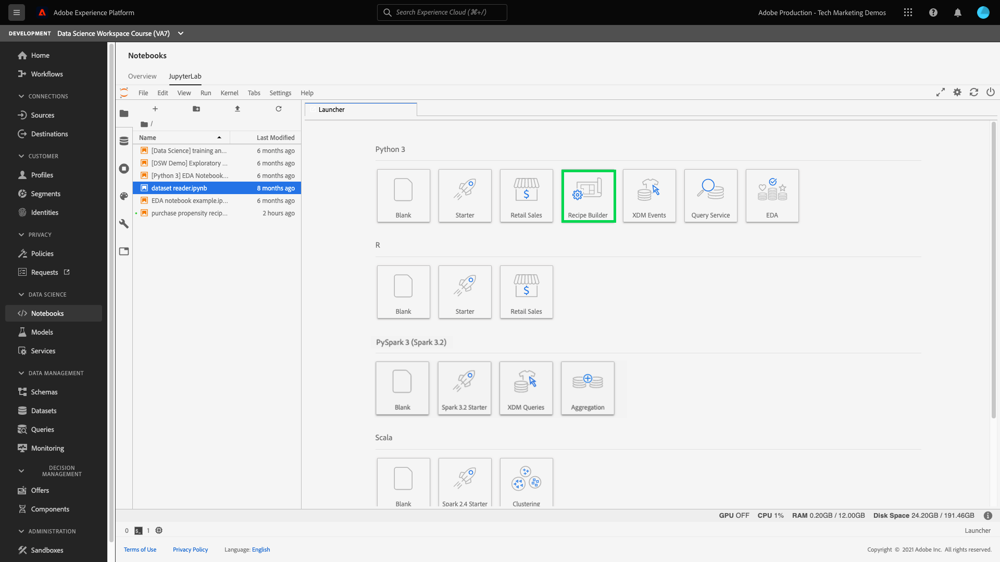
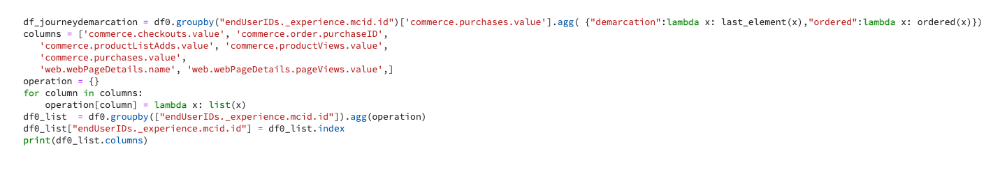

# Criar um modelo usando o JupyterLab Notebooks

>[!NOTE]
>
>O Data Science Workspace não está mais disponível para compra.
>
>Esta documentação destina-se aos clientes existentes com direitos anteriores ao Data Science Workspace.

Este tutorial percorre as etapas necessárias para criar um modelo usando o modelo do construtor de fórmula de notebooks JupyterLab.

## Conceitos introduzidos:

- **Receitas:** Um fórmula é o termo do Adobe Systems para uma especificação de modelo e é um container de nível superior que representa uma aprendizagem de máquina específica, algoritmo de IA ou conjunto de algoritmos, lógica de processamento e configuração necessária para build e executar um modelo treinado.
- **Modelo:** Um modelo é um instância de um fórmula de aprendizado de máquina que é treinado usando dados históricos e configurações para resolver para um caso de uso de negócios.
- **Treinamento:** O treinamento é o processo dos padrões de aprendizagem e insights de dados rotulados.
- **Pontuação:** Pontuação é o processo de gerar insights dos dados usando um modelo treinado.

## Baixe o ativos necessário {#assets}

Antes de continuar com esse tutorial, você deve criar os schemas e conjuntos de dados necessários. Visite a tutorial de [criação de esquemas e conjuntos](../models-recipes/create-luma-data.md) de dados do modelo de propensão Luma para baixar as ativos necessárias e configurar os pré-requisitos.

## Comece com o [!DNL JupyterLab] notebook ambiente

A criação de uma fórmula do zero pode ser feita dentro disso [!DNL Data Science Workspace]. Para start, navegue até [Adobe Experience Platform](https://platform.adobe.com) e selecione os **[!UICONTROL Notebooks]** guia à esquerda. Para criar um novo notebook, selecione o modelo do Criador de receitas [!DNL JupyterLab Launcher].

O bloco de anotações [!UICONTROL Construtor de Fórmulas] permite executar treinamentos e execuções de pontuação dentro do bloco de anotações. Isso dá a você a flexibilidade de fazer alterações nos métodos `train()` e `score()` entre a execução de experimentos nos dados de treinamento e pontuação. Quando estiver satisfeito com os resultados do treinamento e a pontuação, você poderá criar uma fórmula e, além disso, publicá-la como um modelo usando a funcionalidade receita para modelo.

>[!NOTE]
>
>O bloco de anotações [!UICONTROL Construtor de fórmula] oferece suporte ao trabalho com todos os formatos de arquivo, mas atualmente a funcionalidade de criação de fórmula oferece suporte apenas a [!DNL Python].



Quando você seleciona o bloco de anotações [!UICONTROL Construtor de Fórmulas] no iniciador, o bloco de anotações é aberto em uma nova guia.

Na nova guia do bloco de anotações na parte superior, é carregada uma barra de ferramentas contendo três ações adicionais: **[!UICONTROL Treinar]**, **[!UICONTROL Pontuação]** e **[!UICONTROL Criar fórmula]**. Estes ícones só aparecem no bloco de anotações [!UICONTROL Construtor de Fórmulas]. Mais informações sobre essas ações são fornecidas [na seção de treinamento e pontuação](#training-and-scoring) após criar sua fórmula no bloco de anotações.


## Introdução ao notebook do [!UICONTROL Construtor] de receitas

Na pasta ativos fornecida está um modelo `propensity_model.ipynb`de propensão Luma. Utilizando a opção upload notebook no JupyterLab, upload o modelo fornecido e abra o notebook.


O restante deste tutorial abrange os seguintes arquivos predefinidos no notebook modelo de propensão:

- [Arquivo de requisitos](#requirements-file)
- [Arquivos de configuração](#configuration-files)
- [Carregador de dados de treinamento](#training-data-loader)
- [Pontuação do carregador de dados](#scoring-data-loader)
- [Arquivo pipeline](#pipeline-file)
- [Arquivo avaliador](#evaluator-file)
- [Arquivo do Data Saver](#data-saver-file)

O vídeo a seguir tutorial explica o notebook modelo de propensão Luma:

>[!VIDEO](https://video.tv.adobe.com/v/333570)

### Arquivo de requisitos {#requirements-file}

O arquivo de requisitos é usado para declarar bibliotecas adicionais que você deseja usar no modelo. Você pode especificar o número da versão se houver uma dependência. Para procurar bibliotecas adicionais, visita [anaconda.org](https://anaconda.org). Para saber como formatar o arquivo de requisitos, visita [Conda](https://docs.conda.io/projects/conda/en/latest/user-guide/tasks/manage-environments.html#creating-an-environment-file-manually). As lista dos bibliotecas principais já em uso incluem:

```JSON
python=3.6.7
scikit-learn
pandas
numpy
data_access_sdk_python
```

>[!NOTE]
>
>As bibliotecas ou versões específicas adicionadas podem ser incompatíveis com a bibliotecas acima. Além disso, se você optar por criar um arquivo de ambiente manualmente, o `name` campo não pode ser substituído.

Para o notebook de modelo de propensão Luma, os requisitos não precisam ser atualizados.

### Arquivos de configuração {#configuration-files}

Os arquivos `training.conf` de configuração e `scoring.conf`, são usados para especificar os conjuntos de dados que deseja usar para treinamento e pontuação, além de adicionar hiperparameters. Há configurações separadas para treinamento e pontuação.

Em solicitar para que um modelo execute treinamento, é necessário fornecer o `trainingDataSetId``ACP_DSW_TRAINING_XDM_SCHEMA`modelo e `tenantId`o caractere Além disso, para pontuação, você deve fornecer o `scoringDataSetId`caractere , `tenantId`e `scoringResultsDataSetId `.

Para encontrar as IDs de conjunto de dados e schema, vá para os dados guia  em notebooks na barra de navegação esquerda (sob o ícone de pasta). É necessário fornecer três conjunto de dados IDs diferentes. É `scoringResultsDataSetId` usada para armazenamento os resultados de pontuação do modelo e deve ser uma conjunto de dados vazia. Esses conjuntos de dados foram feitos anteriormente na [etapa de ativos](#assets) exigida.


As mesmas informações podem ser encontradas em Adobe Experience Platform nas [guias Esquema **](https://platform.adobe.com/schema) e**[ Conjuntos **](https://platform.adobe.com/dataset/overview) de dados.**[](https://platform.adobe.com/)

Depois de competir, suas configurações de treinamento e pontuação devem ser semelhantes às seguintes captura de tela:


Por padrão, os seguintes parâmetros de configuração são definidos para você quando você treina e pontua dados:

- `ML_FRAMEWORK_IMS_USER_CLIENT_ID`
- `ML_FRAMEWORK_IMS_TOKEN`
- `ML_FRAMEWORK_IMS_ML_TOKEN`
- `ML_FRAMEWORK_IMS_TENANT_ID`

## Noções básicas sobre o carregador de dados de treinamento {#training-data-loader}

O objetivo do Carregador de dados de treinamento é instanciar os dados usados para criar o modelo de aprendizado de máquina. Normalmente, existem duas tarefas que o dados de treinamento loader realiza:

- Carregamento de dados de [!DNL Platform]
- Preparação de dados e engenharia de recursos

As duas seções a seguir passarão pelo carregamento de dados e preparação de dados.

### Carregamento de dados {#loading-data}

Esta etapa usa o dataframe dos [pandas](https://pandas.pydata.org/pandas-docs/stable/generated/pandas.DataFrame.html). Os dados podem ser carregados a partir de arquivos usando [!DNL Adobe Experience Platform] o [!DNL Platform] SDK (`platform_sdk`), ou de fontes externas usando funções ou `read_json()` pandas`read_csv()`.

- [[!DNL Platform SDK]](#platform-sdk)
- [Fontes externas](#external-sources)

>[!NOTE]
>
>No bloco de anotações do Construtor de fórmula, os dados são carregados por meio do carregador de dados `platform_sdk`.

### SDK do [!DNL Platform] {#platform-sdk}

Para obter um tutorial detalhado sobre como usar o carregador de dados do `platform_sdk`, visite o [Guia do SDK da Platform](../authoring/platform-sdk.md). Este tutorial fornece informações sobre autenticação de build, leitura básica de dados e gravação básica de dados.

### Fontes externas {#external-sources}

Esta seção mostra como importar um arquivo JSON ou CSV para um objeto pandas. Documentação oficial dos pandas biblioteca podem ser encontradas aqui:
- [read_csv](https://pandas.pydata.org/pandas-docs/stable/generated/pandas.read_csv.html)
- [read_json](https://pandas.pydata.org/pandas-docs/stable/generated/pandas.read_json.html)

Primeiro, este é um exemplo de importação de um arquivo de CSV. O `data` argumento é o caminho para o arquivo de CSV. Essa variável foi importada da `configProperties` [seção](#configuration-files) anterior.

```PYTHON
df = pd.read_csv(data)
```

Você também pode importar de um arquivo JSON. O `data` argumento é o caminho para o arquivo de CSV. Esta variável foi importada de `configProperties` na [seção anterior](#configuration-files).

```PYTHON
df = pd.read_json(data)
```

Agora seus dados estão no objeto do período de dados e podem ser analisados e manipulados na [próxima seção](#data-preparation-and-feature-engineering).

## Arquivo do carregador de dados de treinamento

Neste exemplo, os dados são carregados usando o SDK Platform. As biblioteca podem ser importadas na parte superior do página incluindo a linha:

`from platform_sdk.dataset_reader import DatasetReader`

Em seguida, você pode usar o `load()` método para pegar as treinamento conjunto de dados no `trainingDataSetId` arquivo de configuração (`recipe.conf`conforme definido).

```PYTHON
def load(config_properties):
    print("Training Data Load Start")

    #########################################
    # Load Data
    #########################################    
    client_context = get_client_context(config_properties)
    dataset_reader = DatasetReader(client_context, dataset_id=config_properties['trainingDataSetId'])
```

>[!NOTE]
>
>Conforme mencionado na [seção Arquivo de Configuração](#configuration-files), os seguintes parâmetros de configuração são definidos para você ao acessar dados do Experience Platform usando `client_context = get_client_context(config_properties)`:
> - `ML_FRAMEWORK_IMS_USER_CLIENT_ID`
> - `ML_FRAMEWORK_IMS_TOKEN`
> - `ML_FRAMEWORK_IMS_ML_TOKEN`
> - `ML_FRAMEWORK_IMS_TENANT_ID`

Agora que você tem seus dados, pode começar com a preparação de dados e a engenharia de recursos.

### Preparação de dados e engenharia de recursos {#data-preparation-and-feature-engineering}

Após os dados serem carregados, eles precisam ser limpos e submetidos à preparação. Neste exemplo, o objetivo do modelo é prever se um cliente solicitará um produto ou não. Como o modelo não está observando produtos específicos, você não precisa de `productListItems` e, portanto, a coluna é descartada. Em seguida, são soltas colunas adicionais que contêm apenas um único valor ou dois valores em uma única coluna. Quando treinamento um modelo, é importante manter apenas dados úteis que ajudarão na previsão de sua meta.


Após retirar dados desnecessários, é possível iniciar a engenharia de recursos. Os dados de demonstração usados para este exemplo não contêm informações de sessão. Normalmente, você gostaria de ter dados sobre as sessões atuais e passadas para um cliente específico. Devido à falta de informações da sessão, esse exemplo imita sessões atuais e passadas por meio da demarcação de jornadas.



Quando a demarcação é concluída, os dados são rotulados e uma jornada é criada.


Próximo, os recursos são criados e divididos entre passado e presente. Em seguida, quaisquer colunas desnecessárias são descartadas, deixando você com as jornadas passadas e atuais para os clientes Luma. Essas jornadas contêm informações como se um cliente comprou um item e a jornada que fez até a compra.


## Pontuação do carregador de dados {#scoring-data-loader}

O procedimento para carregar dados para pontuação é semelhante ao carregamento de dados de treinamento. Observando de perto o código, você pode ver que tudo é o mesmo, exceto o `scoringDataSetId` no `dataset_reader`. Isso ocorre porque a mesma fonte de dados do Luma é usada para treinamento e pontuação.

Caso deseje usar arquivos de dados diferentes para treinamento e pontuação, o carregador de dados de treinamento e pontuação será separado. Isso permite executar pré-processamento adicional, como mapear os dados de treinamento para os dados de pontuação, se necessário.

## Arquivo de pipeline {#pipeline-file}

O arquivo `pipeline.py` inclui lógica para treinamento e pontuação.

O objetivo do treinamento é criar um modelo usando recursos e rótulos em sua treinamento conjunto de dados. Depois de escolher seu modelo de treinamento, você deve ajustar seus treinamento conjunto de dados x e y ao modelo e a função retorna o modelo treinado.

>[!NOTE]
> 
>Os recursos referem-se aos variável de entrada usados pelo modelo de aprendizado de máquina para prever os rótulos.


A `score()` função deve conter o algoritmo de pontuação e retornar uma medida para indicar o desempenho do modelo. A `score()` função usa a pontuação conjunto de dados rótulos e o modelo treinado para gerar um conjunto de recursos previstos. Esses valores previstos são então comparados aos recursos reais na pontuação conjunto de dados. Neste exemplo, a `score()` função usa o modelo treinado para prever os recursos usando os rótulos dos conjunto de dados de pontuação. Os recursos previstos são retornados.


## Arquivo avaliador {#evaluator-file}

O `evaluator.py` arquivo contém lógica de como você deseja avaliar seus fórmula treinados, bem como como suas dados de treinamento devem ser divididas.

### Dividir o conjunto de dados {#split-the-dataset}

A fase de preparação de dados para treinamento requer a divisão da conjunto de dados a ser usada para treinamento e testes. Esses `val` dados são usados implicitamente para avaliar o modelo depois que ele é treinado. Esse processo é separado da pontuação.

Esta seção mostra a `split()` função que carrega dados no notebook e, em seguida, limpa os dados removendo colunas não relacionadas no conjunto de dados. A partir daí, é possível executar uma engenharia de recursos que é o processo para criar recursos adicionais relevantes a partir dos recursos brutos existentes nos dados.


### Avaliar o modelo treinado {#evaluate-the-trained-model}

A `evaluate()` função é executada depois que o modelo é treinado e retorna uma métrica para indicar o desempenho do modelo. A `evaluate()` função usa os rótulos de conjunto de dados de teste e o modelo treinado para prever um conjunto de recursos. Esses valores previstos são comparados aos recursos reais na conjunto de dados de teste. Neste exemplo, as métricas usadas são `precision`, `recall`, `f1`e `accuracy`. Observe que a função retorna um `metric` objeto que contém uma matriz de métricas de avaliação. Essas métricas são usadas para avaliar o desempenho do modelo treinado.


Adicionar `print(metric)` permite visualização os resultados do métrica.


## Arquivo do salvador de dados {#data-saver-file}

O arquivo `datasaver.py` contém a função `save()` e é usado para salvar sua previsão ao testar a pontuação. A função `save()` faz sua previsão e, usando APIs [!DNL Experience Platform Catalog], grava os dados no `scoringResultsDataSetId` que você especificou em seu arquivo `scoring.conf`. Você pode


## Treinamento e pontuação {#training-and-scoring}

Quando terminar de fazer alterações no notebook e desejar treinar sua fórmula, você pode selecionar os botões associados na parte superior do bar para criar um treinamento correr na célula. Ao selecionar a botão, um log de comandos e saídas a partir do script treinamento aparece no notebook (sob a `evaluator.py` célula). O Conda primeiro instala todas as dependências e, em seguida, a treinamento é iniciada.

Observe que você deve executar treinamento pelo menos uma vez antes de poder executar a pontuação. Selecionar a **[!UICONTROL botão de pontuação de execução]** pontuará no modelo treinado que foi gerado durante treinamento. O script de pontuação aparece em `datasaver.py`.

Para fins de depuração, se desejar ver a saída oculta, adicione `debug` ao final da célula de saída e execute-a novamente.


## Criar uma fórmula {#create-recipe}

Ao terminar de editar o fórmula e satisfeito com a saída treinamento/pontuação, você pode criar uma fórmula do notebook selecionando **[!UICONTROL Criar Receita]** no canto superior direito.


Após selecionar **[!UICONTROL Criar Receita]**, você é solicitado a inserir um nome fórmula. Este nome representa o fórmula real criado em [!DNL Platform].


Depois de selecionar **[!UICONTROL Ok]**, o processo de criação do fórmula é iniciado. Isso pode levar algum tempo e uma barra de progresso é exibida no lugar da fórmula botão de criação. Depois de concluído, você pode selecionar o botão **[!UICONTROL Exibir receitas]** para ir até a guia **[!UICONTROL Receitas]** em **[!UICONTROL Modelos ML]**


>[!CAUTION]
>
> - Não excluir nenhuma das células do arquivo
> - Não editar a linha `%%writefile` na parte superior das células do arquivo
> - Não criar receitas em blocos de anotações diferentes ao mesmo tempo

## Próximas etapas {#next-steps}

Ao concluir este tutorial, você aprendeu a criar um modelo de aprendizado de máquina no bloco de anotações [!UICONTROL Construtor de fórmula]. Você também aprendeu a exercitar o fluxo de trabalho de notebook para receita.

Para continuar a aprender a trabalhar com recursos dentro, [!DNL Data Science Workspace]visita na [!DNL Data Science Workspace] lista suspensa de fórmulas e modelos.