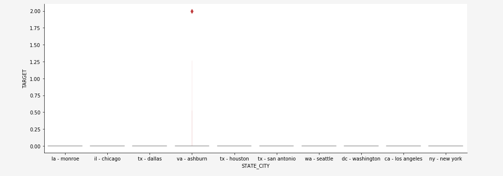

# Explorar dados baseados na Web para modelos preditivos usando o notebook de análise de dados exploratória (EDA)

O notebook de análise de dados exploratórios (EDA) foi projetado para ajudá-lo a descobrir padrões nos dados, verificar a integridade dos dados e resumir os dados relevantes para modelos preditivos.

O exemplo do notebook EDA foi otimizado com dados baseados na Web em mente e consiste em duas partes. Parte um start com o uso do serviço de Query para visualização de tendências e instantâneos de dados. Em seguida, com uma meta em mente para a análise de dados exploratórios, os dados são agregados no nível do perfil e do visitante.

Parte dois start executando análise descritiva de dados agregados usando bibliotecas Python. Este notebook exibe visualizações como histogramas, gráficos de dispersão, gráficos de caixa e uma matriz de correlação para obter insights acionáveis usados para determinar quais recursos são mais propensos a ajudar na previsão de uma meta.

## Introdução

Antes de ler este guia, reveja o [[!DNL JupyterLab] guia do usuário](./overview.md) para obter uma introdução de alto nível a [!DNL JupyterLab] e sua função na Data Science Workspace. Além disso, se você estiver usando seus próprios dados, consulte a documentação para obter [acesso aos dados em [!DNL Jupyterlab] notebooks](./access-notebook-data.md). Este guia contém informações importantes sobre os limites de dados do notebook.

Este notebook usa um conjunto de dados de valores médios na forma de dados de Eventos do Adobe Analytics Experience encontrado no Analytics Analysis Workspace. Para usar o bloco de anotações EDA, é necessário definir sua tabela de dados com os seguintes valores `target_table` e `target_table_id`. Qualquer conjunto de dados de valores médios pode ser usado.

Para localizar esses valores, siga as etapas descritas na seção [gravar em um conjunto de dados na seção python](./access-notebook-data.md#write-python) do guia de acesso aos dados do JupyterLab. O nome do conjunto de dados (`target_table`) está localizado no diretório do conjunto de dados. Depois de clicar com o botão direito do mouse no conjunto de dados para explorar ou gravar dados em um notebook, uma ID de conjunto de dados (`target_table_id`) é fornecida na entrada de código executável.

## Detecção de dados

Esta seção contém etapas de configuração e query de exemplo usados para visualização de tendências, como &quot;as dez principais cidades por atividade do usuário&quot; ou &quot;os dez principais produtos visualizados&quot;.

### Configuração das bibliotecas

O JupyterLab suporta várias bibliotecas. O código a seguir pode ser colado e executado em uma célula de código para coletar e instalar todos os pacotes necessários usados neste exemplo. Você pode usar pacotes adicionais ou alternativos fora deste exemplo para sua própria análise de dados. Para obter uma lista dos pacotes suportados, copie e cole `!pip list --format=columns` em uma nova célula.

```python
!pip install colorama
import chart_studio.plotly as py
import plotly.graph_objs as go
from plotly.offline import iplot
from scipy import stats
import numpy as np
import warnings
warnings.filterwarnings('ignore')
from scipy.stats import pearsonr
import matplotlib.pyplot as plt
from scipy.stats import pearsonr
import pandas as pd
import math
import re
import seaborn as sns
from datetime import datetime
import colorama
from colorama import Fore, Style
pd.set_option('display.max_columns', None)
pd.set_option('display.max_rows', None)
pd.set_option('display.width', 1000)
pd.set_option('display.expand_frame_repr', False)
pd.set_option('display.max_colwidth', -1)
```

### Conectar-se ao Adobe Experience Platform [!DNL Query Service]

[!DNL JupyterLab] na plataforma permite que você use o SQL em um  [!DNL Python] notebook para acessar dados pelo Serviço [ de ](https://www.adobe.com/go/query-service-home-en)Query. O acesso aos dados por meio de [!DNL Query Service] pode ser útil para lidar com grandes conjuntos de dados devido aos seus tempos de execução superiores. Observe que a consulta de dados usando [!DNL Query Service] tem um limite de tempo de processamento de dez minutos.

Antes de usar [!DNL Query Service] em [!DNL JupyterLab], certifique-se de ter uma compreensão funcional da [[!DNL Query Service] sintaxe SQL](https://www.adobe.com/go/query-service-sql-syntax-en).

Para utilizar o serviço de Query no JupyterLab, é necessário primeiro criar uma conexão entre o notebook Python e o serviço de Query em funcionamento. Isso pode ser feito executando a seguinte célula.

```python
qs_connect()
```

### Definir o conjunto de dados de valores médios para exploração

Para começar a consultar e explorar dados, uma tabela de conjunto de dados de valores médios deve ser fornecida. Copie e substitua os valores `table_name` e `table_id` por seus próprios valores de tabela de dados.

```python
target_table = "table_name"
target_table_id = "table_id"
```

Após a conclusão, essa célula deve ser semelhante ao seguinte exemplo:

```python
target_table = "cross_industry_demo_midvalues"
target_table_id = "5f7c40ef488de5194ba0157a"
```

### Explore o conjunto de dados para as datas disponíveis

Usando a célula fornecida abaixo, você pode visualização o intervalo de datas coberto na tabela. A finalidade de explorar o número de dias, a primeira data e a última data, é ajudar a selecionar um intervalo de datas para mais análises.

```python
%%read_sql -c QS_CONNECTION
SELECT distinct Year(timestamp) as Year, Month(timestamp) as Month, count(distinct DAY(timestamp)) as Count_days, min(DAY(timestamp)) as First_date, max(DAY(timestamp)) as Last_date, count(timestamp) as Count_hits
from {target_table}
group by Month(timestamp), Year(timestamp)
order by Year, Month;
```

A execução da célula produz a seguinte saída:


### Configurar datas para a descoberta de conjuntos de dados

Após determinar as datas disponíveis para a descoberta do conjunto de dados, os parâmetros abaixo precisam ser atualizados. As datas configuradas nesta célula são usadas apenas para a descoberta de dados na forma de query. As datas são atualizadas novamente para intervalos adequados para a análise de dados exploratórios mais adiante neste guia.

```python
target_year = "2020" ## The target year
target_month = "02" ## The target month
target_day = "(01,02,03)" ## The target days
```

### Detecção de conjuntos de dados

Depois de configurar todos os seus parâmetros, iniciados [!DNL Query Service] e com um intervalo de datas, você estará pronto para começar a ler linhas de dados. Você deve limitar o número de linhas lidas.

```python
from platform_sdk.dataset_reader import DatasetReader
from datetime import date
dataset_reader = DatasetReader(PLATFORM_SDK_CLIENT_CONTEXT, dataset_id=target_table_id)
# If you do not see any data or would like to expand the default date range, change the following query
Table = dataset_reader.limit(5).read()
```

Para visualização do número de colunas disponíveis no conjunto de dados, use a seguinte célula:

```python
print("\nNumber of columns:",len(Table.columns))
```

Para visualização das linhas do conjunto de dados, use a seguinte célula. Neste exemplo, o número de linhas é limitado a cinco.

```python
Table.head(5)
```


Depois que você tiver uma ideia de quais dados estão contidos no conjunto de dados, poderá ser importante detalhar ainda mais o conjunto de dados. Neste exemplo, os nomes das colunas e os tipos de dados para cada uma das colunas são listados, enquanto a saída é usada para verificar se o tipo de dados está correto ou não.

```python
ColumnNames_Types = pd.DataFrame(Table.dtypes)
ColumnNames_Types = ColumnNames_Types.reset_index()
ColumnNames_Types.columns = ["Column_Name", "Data_Type"]
ColumnNames_Types
```


### Exploração de tendências do conjunto de dados

A seção a seguir contém quatro query de exemplo usados para explorar tendências e padrões em dados. Os exemplos a seguir não são exaustivos, mas abrangem alguns dos recursos mais vistos.

**Contagem de atividades por hora para um determinado dia**

Este query analisa o número de ações e cliques durante o dia. A saída é representada na forma de uma tabela que contém métricas na contagem de atividades para cada hora do dia.

```sql
%%read_sql query_2_df -c QS_CONNECTION

SELECT Substring(timestamp, 12, 2)                        AS Hour, 
       Count(enduserids._experience.aaid.id) AS Count 
FROM   {target_table}
WHERE  Year(timestamp) = {target_year} 
       AND Month(timestamp) = {target_month}  
       AND Day(timestamp) in {target_day}
GROUP  BY Hour
ORDER  BY Hour;
```


Após confirmar o funcionamento do query, os dados podem ser apresentados em um histograma de gráfico individual para maior clareza visual.

```python
trace = go.Bar(
    x = query_2_df['Hour'],
    y = query_2_df['Count'],
    name = "Activity Count"
)

layout = go.Layout(
    title = 'Activity Count by Hour of Day',
    width = 1200,
    height = 600,
    xaxis = dict(title = 'Hour of Day'),
    yaxis = dict(title = 'Count')
)

fig = go.Figure(data = [trace], layout = layout)
iplot(fig)
```


**As 10 principais páginas visualizadas de um determinado dia**

Este query analisa quais páginas são as mais visualizadas em um determinado dia. A saída é representada na forma de uma tabela que contém métricas no nome da página e na contagem de visualizações da página.

```sql
%%read_sql query_4_df -c QS_CONNECTION

SELECT web.webpagedetails.name                 AS Page_Name, 
       Sum(web.webpagedetails.pageviews.value) AS Page_Views 
FROM   {target_table}
WHERE  Year(timestamp) = {target_year}
       AND Month(timestamp) = {target_month}
       AND Day(timestamp) in {target_day}
GROUP  BY web.webpagedetails.name 
ORDER  BY page_views DESC 
LIMIT  10;
```

Após confirmar o funcionamento do query, os dados podem ser apresentados em um histograma de gráfico individual para maior clareza visual.

```python
trace = go.Bar(
    x = query_4_df['Page_Name'],
    y = query_4_df['Page_Views'],
    name = "Page Views"
)

layout = go.Layout(
    title = 'Top Ten Viewed Pages For a Given Day',
    width = 1000,
    height = 600,
    xaxis = dict(title = 'Page_Name'),
    yaxis = dict(title = 'Page_Views')
)

fig = go.Figure(data = [trace], layout = layout)
iplot(fig)
```


**Dez cidades principais agrupadas por atividade do usuário**

Este query analisa de quais cidades os dados são originados.

```sql
%%read_sql query_6_df -c QS_CONNECTION

SELECT concat(placeContext.geo.stateProvince, ' - ', placeContext.geo.city) AS state_city, 
       Count(timestamp)                                                     AS Count
FROM   {target_table}
WHERE  Year(timestamp) = {target_year}
       AND Month(timestamp) = {target_month}
       AND Day(timestamp) in {target_day}
GROUP  BY state_city
ORDER  BY Count DESC
LIMIT  10;
```

Após confirmar o funcionamento do query, os dados podem ser apresentados em um histograma de gráfico individual para maior clareza visual.

```python
trace = go.Bar(
    x = query_6_df['state_city'],
    y = query_6_df['Count'],
    name = "Activity by City"
)

layout = go.Layout(
    title = 'Top Ten Cities by User Activity',
    width = 1200,
    height = 600,
    xaxis = dict(title = 'City'),
    yaxis = dict(title = 'Count')
)

fig = go.Figure(data = [trace], layout = layout)
iplot(fig)
```


**Os dez principais produtos visualizados**

Este query fornece uma lista dos dez principais produtos visualizados. No exemplo abaixo, a função `Explode()` é usada para retornar cada produto no objeto `productlistitems` para sua própria linha. Isso permite que você faça um query aninhado para agregação de visualizações de produtos para diferentes SKUs.

```sql
%%read_sql query_7_df -c QS_CONNECTION

SELECT Product_List_Items.sku AS Product_SKU,
       Sum(Product_Views) AS Total_Product_Views
FROM  (SELECT Explode(productlistitems) AS Product_List_Items, 
              commerce.productviews.value   AS Product_Views 
       FROM   {target_table}
       WHERE  Year(timestamp) = {target_year}
              AND Month(timestamp) = {target_month}
              AND Day(timestamp) in {target_day}
              AND commerce.productviews.value IS NOT NULL) 
GROUP BY Product_SKU 
ORDER BY Total_Product_Views DESC
LIMIT  10;
```

Após confirmar o funcionamento do query, os dados podem ser apresentados em um histograma de gráfico individual para maior clareza visual.

```python
trace = go.Bar(
    x = "SKU-" + query_7_df['Product_SKU'],
    y = query_7_df['Total_Product_Views'],
    name = "Product View"
)

layout = go.Layout(
    title = 'Top Ten Viewed Products',
    width = 1200,
    height = 600,
    xaxis = dict(title = 'SKU'),
    yaxis = dict(title = 'Product View Count')
)

fig = go.Figure(data = [trace], layout = layout)
iplot(fig)
```


Depois de explorar as tendências e padrões dos dados, você deve ter uma boa ideia sobre quais recursos deseja criar para uma previsão de meta. Passar pelas tabelas pode destacar rapidamente a forma de cada atributo de dados, representações incorretas óbvias e grandes discrepâncias nos valores e start para sugerir relacionamentos de candidatos a explorar entre atributos.

## Análise de dados exploratórios

A análise de dados exploratória é usada para refinar sua compreensão dos dados e criar uma intuição para perguntas interessantes que podem ser usadas como a base para sua modelagem.

Após concluir a etapa de descoberta de dados, você terá explorado os dados no nível do evento com algumas agregações no nível do evento, cidade ou ID do usuário para ver as tendências de um dia. Embora estes dados sejam importantes, não fornecem uma imagem completa. Você ainda não entende o que aciona uma compra em seu site.

Para entender isso, é necessário agregação de dados em nível de perfil/visitante, definir uma meta de compra e aplicar conceitos estatísticos como correlação, gráficos de caixa e gráficos de dispersão. Esses métodos são usados para comparar padrões de atividades para compradores e não compradores na janela de previsão definida.

Os seguintes recursos são criados e explorados nesta seção:

- `COUNT_UNIQUE_PRODUCTS_PURCHASED`: O número de produtos exclusivos comprados.
- `COUNT_CHECK_OUTS`: O número de check-outs.
- `COUNT_PURCHASES`: O número de compras.
- `COUNT_INSTANCE_PRODUCTADDS`: O número de instâncias de adição de produto.
- `NUMBER_VISITS` : O número de visitas.
- `COUNT_PAID_SEARCHES`: O número de pesquisas pagas.
- `DAYS_SINCE_VISIT`: O número de dias desde a última visita.
- `TOTAL_ORDER_REVENUE`: A receita total do pedido.
- `DAYS_SINCE_PURCHASE`: O número de dias desde a compra anterior.
- `AVG_GAP_BETWEEN_ORDERS_DAYS`: A diferença média entre as compras em dias.
- `STATE_CITY`: Contém o estado e a cidade.

Antes de continuar com a agregação de dados, é necessário definir os parâmetros para a variável de previsão usada na análise de dados exploratórios. Em outras palavras, o que você quer de seu modelo de ciência de dados? Parâmetros comuns incluem meta, período de previsão e período de análise.

Se estiver usando o notebook EDA, é necessário substituir os valores abaixo antes de continuar.

```python
goal = "commerce.`order`.purchaseID" #### prediction variable
goal_column_type = "numerical" #### choose either "categorical" or "numerical"
prediction_window_day_start = "2020-01-01" #### YYYY-MM-DD
prediction_window_day_end = "2020-01-31" #### YYYY-MM-DD
analysis_period_day_start = "2020-02-01" #### YYYY-MM-DD
analysis_period_day_end = "2020-02-28" #### YYYY-MM-DD

### If the goal is a categorical goal then select threshold for the defining category and creating bins. 0 is no order placed, and 1 is at least one order placed:
threshold = 1
```

### Agregação de dados para criação de recursos e objetivos

Para começar a análise exploratória, é necessário criar uma meta no nível do perfil, seguida pela agregação do conjunto de dados. Neste exemplo, dois query são fornecidos. O primeiro query contém a criação de uma meta. O segundo query precisa ser atualizado para incluir quaisquer variáveis diferentes daquelas do primeiro query. Talvez você queira atualizar o `limit` para seu query. Depois de executar os seguintes query, os dados agregados agora estão disponíveis para exploração.

```sql
%%read_sql target_df -d -c QS_CONNECTION

SELECT DISTINCT endUserIDs._experience.aaid.id                  AS ID,
       Count({goal})                                            AS TARGET
FROM   {target_table}
WHERE DATE(TIMESTAMP) BETWEEN '{prediction_window_day_start}' AND '{prediction_window_day_end}'
GROUP BY endUserIDs._experience.aaid.id;
```

```sql
%%read_sql agg_data -d -c QS_CONNECTION

SELECT z.*, z1.state_city as STATE_CITY
from
((SELECT y.*,a2.AVG_GAP_BETWEEN_ORDERS_DAYS as AVG_GAP_BETWEEN_ORDERS_DAYS
from
(select a1.*, f.DAYS_SINCE_PURCHASE as DAYS_SINCE_PURCHASE
from
(SELECT DISTINCT a.ID  AS ID,
COUNT(DISTINCT Product_Items.SKU) as COUNT_UNIQUE_PRODUCTS_PURCHASED,
COUNT(a.check_out) as COUNT_CHECK_OUTS,
COUNT(a.purchases) as COUNT_PURCHASES, 
COUNT(a.product_list_adds) as COUNT_INSTANCE_PRODUCTADDS,
sum(CASE WHEN a.search_paid = 'TRUE' THEN 1 ELSE 0 END) as COUNT_PAID_SEARCHES,
DATEDIFF('{analysis_period_day_end}', MAX(a.date_a)) as DAYS_SINCE_VISIT,
ROUND(SUM(Product_Items.priceTotal * Product_Items.quantity), 2) AS TOTAL_ORDER_REVENUE
from 
(SELECT endUserIDs._experience.aaid.id as ID,
commerce.`checkouts`.value as check_out,
commerce.`order`.purchaseID as purchases, 
commerce.`productListAdds`.value as product_list_adds,
search.isPaid as search_paid,
DATE(TIMESTAMP) as date_a,
Explode(productlistitems) AS Product_Items
from {target_table}
Where DATE(TIMESTAMP) BETWEEN '{analysis_period_day_start}' AND '{analysis_period_day_end}') as a
group by a.ID) as a1
left join 
(SELECT DISTINCT endUserIDs._experience.aaid.id as ID,
DATEDIFF('{analysis_period_day_end}', max(DATE(TIMESTAMP))) as DAYS_SINCE_PURCHASE
from {target_table}
where DATE(TIMESTAMP) BETWEEN '{analysis_period_day_start}' AND '{analysis_period_day_end}'
and commerce.`order`.purchaseid is not null
GROUP BY endUserIDs._experience.aaid.id) as f
on f.ID = a1.ID
where a1.COUNT_PURCHASES>0) as y
left join
(select ab.ID, avg(DATEDIFF(ab.ORDER_DATES, ab.PriorDate)) as AVG_GAP_BETWEEN_ORDERS_DAYS
from
(SELECT distinct endUserIDs._experience.aaid.id as ID, TO_DATE(DATE(TIMESTAMP)) as ORDER_DATES, 
TO_DATE(LAG(DATE(TIMESTAMP),1) OVER (PARTITION BY endUserIDs._experience.aaid.id ORDER BY DATE(TIMESTAMP))) as PriorDate
FROM {target_table}
where DATE(TIMESTAMP) BETWEEN '{analysis_period_day_start}' AND '{analysis_period_day_end}'
AND commerce.`order`.purchaseid is not null) AS ab
where ab.PriorDate is not null
GROUP BY ab.ID) as a2
on a2.ID = y.ID) z    
left join
(select t.ID, t.state_city from
(
SELECT DISTINCT endUserIDs._experience.aaid.id as ID,
concat(placeContext.geo.stateProvince, ' - ', placeContext.geo.city) as state_city, 
ROW_NUMBER() OVER(PARTITION BY endUserIDs._experience.aaid.id ORDER BY DATE(TIMESTAMP) DESC) AS ROWNUMBER
FROM   {target_table}
WHERE  DATE(TIMESTAMP) BETWEEN '{analysis_period_day_start}' AND '{analysis_period_day_end}') as t
where t.ROWNUMBER = 1) z1
on z.ID = z1.ID)
limit 500000;
```

### Mesclar os recursos no conjunto de dados agregado com uma meta

A célula a seguir é usada para unir os recursos no conjunto de dados agregados apresentado no exemplo anterior ao objetivo da previsão.

```python
Data = pd.merge(agg_data,target_df, on='ID',how='left')
Data['TARGET'].fillna(0, inplace=True)
```

As próximas três células de exemplo são usadas para garantir que a mesclagem tenha sido bem-sucedida.

`Data.shape` retorna o número de colunas seguido pelo número de linhas, por exemplo: (1913, 12).

```python
Data.shape
```

`Data.head(5)` retorna uma tabela com 5 linhas de dados. A tabela retornada contém todas as 12 colunas de dados agregados mapeados para uma ID de perfil.

```python
Data.head(5)
```


Esta célula imprime o número de perfis únicos.

```python
print("Count of unique profiles :", (len(Data)))
```

### Detectar valores ausentes e discrepantes

Após concluir a agregação de dados e mesclá-la com sua meta, é necessário revisar os dados às vezes chamados de verificação de integridade de dados.

Esse processo envolve a identificação de valores ausentes e discrepantes. Quando forem identificadas questões, a próxima tarefa é apresentar estratégias específicas para lidar com elas.

>[!NOTE]
>
>Durante essa etapa, você pode detectar corrupção nos valores que podem sinalizar uma falha no processo de registro de dados.

```python
Missing = pd.DataFrame(round(Data.isnull().sum()*100/len(Data),2))
Missing.columns =['Percentage_missing_values'] 
Missing['Features'] = Missing.index
```

A célula a seguir é usada para visualizar os valores ausentes.

```python
trace = go.Bar(
    x = Missing['Features'],
    y = Missing['Percentage_missing_values'],
    name = "Percentage_missing_values")

layout = go.Layout(
    title = 'Missing values',
    width = 1200,
    height = 600,
    xaxis = dict(title = 'Features'),
    yaxis = dict(title = 'Percentage of missing values')
)

fig = go.Figure(data = [trace], layout = layout)
iplot(fig)
```


Depois de detectar valores ausentes, é importante identificar valores atípicos. Estatísticas paramétricas como média, desvio padrão e correlação são altamente sensíveis a discrepantes. Além disso, os pressupostos de procedimentos estatísticos comuns, tais como regressões lineares, baseiam - se também nestas estatísticas. Isso significa que exceções podem realmente bagunçar uma análise.

Para identificar exceções, este exemplo usa um intervalo interquartil. Intervalo interquartil (IQR) é o intervalo entre o primeiro e o terceiro quartis (percentis 25 e 75). Este exemplo reúne todos os pontos de dados que estão abaixo de 1,5 vezes o IQR abaixo do percentil 25 ou 1,5 vez o IQR acima do percentil 75. Os valores que se enquadram em qualquer um desses valores são definidos como um valor anterior na seguinte célula.

>[!TIP]
>
>A correção de discrepâncias requer que você tenha uma compreensão dos negócios e do setor em que está trabalhando. Às vezes, não se pode deixar cair uma observação só porque é uma observação estranha. Os outliers podem ser observações legítimas e são muitas vezes as mais interessantes. Para saber mais sobre soltar exceções, visite a [etapa opcional de limpeza de dados](#optional-data-clean).

```python
TARGET = Data.TARGET

Data_numerical = Data.select_dtypes(include=['float64', 'int64'])
Data_numerical.drop(['TARGET'],axis = 1,inplace = True)
Data_numerical1 = Data_numerical

for i in range(0,len(Data_numerical1.columns)):
    Q1 = Data_numerical1.iloc[:,i].quantile(0.25)
    Q3 = Data_numerical1.iloc[:,i].quantile(0.75)
    IQR = Q3 - Q1
    Data_numerical1.iloc[:,i] = np.where(Data_numerical1.iloc[:,i]<(Q1 - 1.5 * IQR),np.nan, np.where(Data_numerical1.iloc[:,i]>(Q3 + 1.5 * IQR),
                                                                                                    np.nan,Data_numerical1.iloc[:,i]))
    
Outlier = pd.DataFrame(round(Data_numerical1.isnull().sum()*100/len(Data),2))
Outlier.columns =['Percentage_outliers'] 
Outlier['Features'] = Outlier.index   
```

Como sempre, é importante visualizar os resultados.

```python
trace = go.Bar(
    x = Outlier['Features'],
    y = Outlier['Percentage_outliers'],
    name = "Percentage_outlier")

layout = go.Layout(
    title = 'Outliers',
    width = 1200,
    height = 600,
    xaxis = dict(title = 'Features'),
    yaxis = dict(title = 'Percentage of outliers')
)

fig = go.Figure(data = [trace], layout = layout)
iplot(fig)
```


### Análise Univariate

Assim que seus dados forem corrigidos em busca de valores ausentes e discrepantes, você poderá start sua análise. Há três tipos de análises: análise univariada, bivariada e multivariada. A análise única pega dados, resume e encontra padrões nos dados usando relações de variável única. A análise binária observa mais de uma variável de cada vez, enquanto a análise multivariada observa três ou mais variáveis de cada vez.

O exemplo a seguir produz uma tabela para visualizar a distribuição dos recursos.

```python
Data_numerical = Data.select_dtypes(include=['float64', 'int64'])
distribution = pd.DataFrame([Data_numerical.count(),Data_numerical.mean(),Data_numerical.quantile(0), Data_numerical.quantile(0.01),
                             Data_numerical.quantile(0.05),Data_numerical.quantile(0.25), Data_numerical.quantile(0.5),
                        Data_numerical.quantile(0.75),  Data_numerical.quantile(0.95),Data_numerical.quantile(0.99), Data_numerical.max()])
distribution = distribution.T
distribution.columns = ['Count', 'Mean', 'Min', '1st_perc','5th_perc','25th_perc', '50th_perc','75th_perc','95th_perc','99th_perc','Max']
distribution
```


Depois de ter uma distribuição dos recursos, você pode criar gráficos de dados visualizados usando um storage. As células a seguir são usadas para visualizar a tabela acima com dados numéricos.

```python
A = sns.palplot(sns.color_palette("Blues"))
```

```python
for column in Data_numerical.columns[0:]:
    plt.figure(figsize=(5, 4))
    plt.ticklabel_format(style='plain', axis='y')
    sns.distplot(Data_numerical[column], color = A, kde=False, bins=6, hist_kws={'alpha': 0.4});
```


### Dados categóricos

O agrupamento de dados categóricos é utilizado para compreender os valores contidos em cada uma das colunas dos dados agregados e das suas distribuições. Este exemplo usa as 10 categorias principais para auxiliar no planejamento das distribuições. É importante observar que pode haver milhares de valores únicos contidos em uma coluna. Você não quer renderizar uma trama desordenada tornando-a ilegível. Com sua meta de negócios em mente, agrupar dados gera resultados mais significativos.

```python
Data_categorical = Data.select_dtypes(include='object')
Data_categorical.drop(['ID'], axis = 1, inplace = True, errors = 'ignore')
```

```python
for column in Data_categorical.columns[0:]:
    if (len(Data_categorical[column].value_counts())>10):
        plt.figure(figsize=(12, 8))
        sns.countplot(x=column, data = Data_categorical, order = Data_categorical[column].value_counts().iloc[:10].index, palette="Set2");
    else:
        plt.figure(figsize=(12, 8))
        sns.countplot(x=column, data = Data_categorical, palette="Set2");
```


### Remover colunas com apenas um único valor distinto

As colunas que têm apenas o valor um não adicionam nenhuma informação à análise e podem ser removidas.

```python
for col in Data.columns:
    if len(Data[col].unique()) == 1:
        if col == 'TARGET':
            print(Fore.RED + '\033[1m' + 'WARNING : TARGET HAS A SINGLE UNIQUE VALUE, ANY BIVARIATE ANALYSIS (NEXT STEP IN THIS NOTEBOOK) OR PREDICTION WILL BE MEANINGLESS' + Fore.RESET + '\x1b[21m')
        elif col == 'ID':
            print(Fore.RED + '\033[1m' + 'WARNING : THERE IS ONLY ONE PROFILE IN THE DATA, ANY BIVARIATE ANALYSIS (NEXT STEP IN THIS NOTEBOOK) OR PREDICTION WILL BE MEANINGLESS' + Fore.RESET + '\x1b[21m')
        else:
            print('Dropped column :',col)
            Data.drop(col,inplace=True,axis=1)
```

Depois de remover colunas de valor único, verifique se há erros nas colunas restantes usando o comando `Data.columns` em uma nova célula.

### Correto para valores ausentes

A seção a seguir contém algumas abordagens de amostra sobre a correção de valores ausentes. Evento embora nos dados acima apenas uma coluna tenha um valor ausente, as células de exemplo abaixo de valores corretos para todos os tipos de dados. Eles incluem:

- Tipos de dados numéricos: input 0 ou max, se aplicável
- Tipos de dados categóricos: valor modal de entrada

```python
#### Select only numerical data
Data_numerical = Data.select_dtypes(include=['float64', 'int64'])

#### For columns that contain days we impute max days of history for null values, for rest all we impute 0

# Imputing days with max days of history
Days_cols = [col for col in Data_numerical.columns if 'DAYS_' in col]
d1 = datetime.strptime(analysis_period_day_start, "%Y-%m-%d")
d2 = datetime.strptime(analysis_period_day_end, "%Y-%m-%d")
A = abs((d2 - d1).days)

for column in Days_cols:
    Data[column].fillna(A, inplace=True)

# Imputing 0
Data_numerical = Data.select_dtypes(include=['float64', 'int64'])
Missing_numerical = Data_numerical.columns[Data_numerical.isnull().any()].tolist()

for column in Missing_numerical:
    Data[column].fillna(0, inplace=True)
```

```python
#### Correct for missing values in categorical columns (Replace with mode)
Data_categorical = Data.select_dtypes(include='object')
Missing_cat = Data_categorical.columns[Data_categorical.isnull().any()].tolist() 
for column in Missing_cat:
    Data[column].fillna(Data[column].mode()[0], inplace=True)
```

Uma vez concluídos, os dados limpos estarão prontos para a análise bivariada.

### Análise bivariana

A análise binária é usada para ajudar a entender a relação entre dois conjuntos de valores, como seus recursos e uma variável de público alvo. Uma vez que diferentes parcelas abrangem tipos de dados categóricos e numéricos, esta análise deve ser feita separadamente para cada tipo de dados. Os gráficos a seguir são recomendados para a análise bivariada:

- **Correlação**: Um coeficiente de correlação é a medida da intensidade de uma relação entre duas características. A correlação tem valores entre -1 e 1, onde: 1 indica uma relação positiva forte, -1 indica uma relação negativa forte e um resultado de zero indica nenhuma relação.
- **Gráfico**: Os pares são uma maneira simples de visualizar relações entre cada variável. Ele produz uma matriz de relações entre cada variável nos dados.
- **Mapa de calor**: Os mapas de calor são o coeficiente de correlação para todas as variáveis no conjunto de dados.
- **Imagens** de caixa: Os gráficos de caixa são uma forma padronizada de exibir a distribuição de dados com base em um resumo de cinco números (mínimo, primeiro quartil (Q1), mediana, terceiro quartil (Q3) e máximo).
- **Contagem do gráfico**: Um gráfico de contagem é como um histograma ou um gráfico de barras para algumas características categóricas. Mostra o número de ocorrências de um item com base em um determinado tipo de categoria.

Para entender a relação entre a variável &quot;gol&quot; e os prediletos/recursos, os gráficos são usados com base em tipos de dados. Para recursos numéricos, você deve usar um gráfico de caixa se a variável &#39;gol&#39; for categórica, bem como um gráfico de pares e um mapa de calor se a variável &#39;gol&#39; for numérica.

Para recursos categóricos, você deve usar uma contagem se a variável &#39;gol&#39; for categórica, bem como um gráfico de caixa se a variável &#39;gol&#39; for numérica. O uso desses métodos ajuda a entender as relações. Esses relacionamentos podem estar na forma de recursos, ou prediletos e uma meta.

**Predicores numéricos**

```python
if len(Data) == 1:
    print(Fore.RED + '\033[1m' + 'THERE IS ONLY ONE PROFILE IN THE DATA, BIVARIATE ANALYSIS IS NOT APPLICABLE, PLEASE INCLUDE AT LEAST ONE MORE PROFILE TO DO BIVARIATE ANALYSIS')
elif len(Data['TARGET'].unique()) == 1:
    print(Fore.RED + '\033[1m' + 'TARGET HAS A SINGLE UNIQUE VALUE, BIVARIATE ANALYSIS IS NOT APPLICABLE, PLEASE INCLUDE PROFILES WITH ATLEAST ONE DIFFERENT VALUE OF TARGET TO DO BIVARIATE ANALYSIS')
else:
    if (goal_column_type == "categorical"):
        TARGET_categorical = pd.DataFrame(np.where(TARGET>=threshold,"1","0"))
        TARGET_categorical.rename(columns={TARGET_categorical.columns[0]: "TARGET_categorical" }, inplace = True)
        Data_numerical = Data.select_dtypes(include=['float64', 'int64'])
        Data_numerical.drop(['TARGET'],inplace=True,axis=1)
        Data_numerical = pd.concat([Data_numerical, TARGET_categorical.astype(int)], axis = 1)
        ncols_for_charts = len(Data_numerical.columns)-1
        nrows_for_charts = math.ceil(ncols_for_charts/4)
        fig, axes = plt.subplots(nrows=nrows_for_charts, ncols=4, figsize=(18, 15))
        for idx, feat in enumerate(Data_numerical.columns[:-1]):
            ax = axes[int(idx // 4), idx % 4]
            sns.boxplot(x='TARGET_categorical', y=feat, data=Data_numerical, ax=ax)
            ax.set_xlabel('')
            ax.set_ylabel(feat)
            fig.tight_layout();
    else:
        Data_numerical = Data.select_dtypes(include=['float64', 'int64'])
        TARGET = pd.DataFrame(Data_numerical.TARGET)
        Data_numerical = Data.select_dtypes(include=['float64', 'int64'])
        Data_numerical.drop(['TARGET'],inplace=True,axis=1)
        Data_numerical = pd.concat([Data_numerical, TARGET.astype(int)], axis = 1)
        for i in Data_numerical.columns[:-1]:
            sns.pairplot(x_vars=i, y_vars=['TARGET'], data=Data_numerical, height = 4)
        f, ax = plt.subplots(figsize = (10,8))
        corr = Data_numerical.corr()
```

A execução da célula produz as seguintes saídas:


**Predicores categóricos**

O exemplo a seguir é usado para plotar e visualização os gráficos de frequência das 10 categorias principais de cada variável categórica.

```python
if len(Data) == 1:
    print(Fore.RED + '\033[1m' + 'THERE IS ONLY ONE PROFILE IN THE DATA, BIVARIATE ANALYSIS IS NOT APPLICABLE, PLEASE INCLUDE AT LEAST ONE MORE PROFILE TO DO BIVARIATE ANALYSIS')
elif len(Data['TARGET'].unique()) == 1:
    print(Fore.RED + '\033[1m' + 'TARGET HAS A SINGLE UNIQUE VALUE, BIVARIATE ANALYSIS IS NOT APPLICABLE, PLEASE INCLUDE PROFILES WITH ATLEAST ONE DIFFERENT VALUE OF TARGET TO DO BIVARIATE ANALYSIS')
else:
    if (goal_column_type == "categorical"):
        TARGET_categorical = pd.DataFrame(np.where(TARGET>=threshold,"1","0"))
        TARGET_categorical.rename(columns={TARGET_categorical.columns[0]: "TARGET_categorical" }, inplace = True)
        Data_categorical = Data.select_dtypes(include='object')
        Data_categorical.drop(["ID"], axis =1, inplace = True)
        Cat_columns = Data_categorical
        Data_categorical = pd.concat([TARGET_categorical,Data_categorical], axis =1)
        for column in Cat_columns.columns:
            A = Data_categorical[column].value_counts().iloc[:10].index
            Data_categorical1 = Data_categorical[Data_categorical[column].isin(A)]
            plt.figure(figsize=(12, 8))
            sns.countplot(x="TARGET_categorical",hue=column, data = Data_categorical1, palette = 'Blues')
            plt.xlabel("GOAL")
            plt.ylabel("COUNT")
            plt.show();
    else:
        Data_categorical = Data.select_dtypes(include='object')
        Data_categorical.drop(["ID"], axis =1, inplace = True)
        Target = Data.TARGET
        Data_categorical = pd.concat([Data_categorical,Target], axis =1)
        for column in Data_categorical.columns[:-1]:
            A = Data_categorical[column].value_counts().iloc[:10].index
            Data_categorical1 = Data_categorical[Data_categorical[column].isin(A)]
            sns.catplot(x=column, y="TARGET", kind = "boxen", data =Data_categorical1, height=5, aspect=13/5);
```

A execução da célula produz a seguinte saída:



### Recursos numéricos importantes

Usando a análise de correlação, você pode criar uma lista dos dez principais recursos numéricos importantes. Esses recursos podem ser usados para prever o recurso &quot;gol&quot;. Essa lista pode ser usada como a lista de recursos para quando você start a construção do modelo.

```python
if len(Data) == 1:
    print(Fore.RED + '\033[1m' + 'THERE IS ONLY ONE PROFILE IN THE DATA, BIVARIATE ANALYSIS IS NOT APPLICABLE, PLEASE INCLUDE AT LEAST ONE MORE PROFILE TO FIND IMPORTANT VARIABLES')
elif len(Data['TARGET'].unique()) == 1:
    print(Fore.RED + '\033[1m' + 'TARGET HAS A SINGLE UNIQUE VALUE, BIVARIATE ANALYSIS IS NOT APPLICABLE, PLEASE INCLUDE PROFILES WITH ATLEAST ONE DIFFERENT VALUE OF TARGET TO FIND IMPORTANT VARIABLES')
else:
    Data_numerical = Data.select_dtypes(include=['float64', 'int64'])
    Correlation = pd.DataFrame(Data_numerical.drop("TARGET", axis=1).apply(lambda x: x.corr(Data_numerical.TARGET)))
    Correlation['Corr_abs'] = abs(Correlation)
    Correlation = Correlation.sort_values(by = 'Corr_abs', ascending = False)
    Imp_features = pd.DataFrame(Correlation.index[0:10])
    Imp_features.rename(columns={0:'Important Feature'}, inplace=True)
    print(Imp_features)
```


### Exemplo de insight

Enquanto você estiver analisando seus dados, não é raro descobrir insights. O exemplo a seguir é um insight que mapeia a recenticidade e o valor monetário de um evento público alvo.

```python
# Proxy for monetary value is TOTAL_ORDER_REVENUE and proxy for frequency is NUMBER_VISITS
if len(Data) == 1:
    print(Fore.RED + '\033[1m' + 'THERE IS ONLY ONE PROFILE IN THE DATA, INSIGHTS ANALYSIS IS NOT APPLICABLE, PLEASE INCLUDE AT LEAST ONE MORE PROFILE TO FIND IMPORTANT VARIABLES')
elif len(Data['TARGET'].unique()) == 1:
    print(Fore.RED + '\033[1m' + 'TARGET HAS A SINGLE UNIQUE VALUE, INSIGHTS ANALYSIS IS NOT APPLICABLE, PLEASE INCLUDE PROFILES WITH ATLEAST ONE DIFFERENT VALUE OF TARGET TO FIND IMPORTANT VARIABLES')
else:
    sns.lmplot("DAYS_SINCE_VISIT", "TOTAL_ORDER_REVENUE", Data, hue="TARGET", fit_reg=False);
```


## Etapa opcional de limpeza de dados {#optional-data-clean}

A correção de discrepâncias requer que você tenha uma compreensão dos negócios e do setor em que está trabalhando. Às vezes, não se pode deixar cair uma observação só porque é uma observação estranha. Os outliers podem ser observações legítimas e são muitas vezes as mais interessantes.

Para obter mais informações sobre discrepâncias e se deseja soltá-las ou não, leia esta entrada do [fator de análise](https://www.theanalysisfactor.com/outliers-to-drop-or-not-to-drop/).

O exemplo a seguir de pontos de dados de limite de célula e de piso que são discrepantes usando [intervalo interquartil](https://www.thoughtco.com/what-is-the-interquartile-range-rule-3126244).

```python
TARGET = Data.TARGET

Data_numerical = Data.select_dtypes(include=['float64', 'int64'])
Data_numerical.drop(['TARGET'],axis = 1,inplace = True)

for i in range(0,len(Data_numerical.columns)):
    Q1 = Data_numerical.iloc[:,i].quantile(0.25)
    Q3 = Data_numerical.iloc[:,i].quantile(0.75)
    IQR = Q3 - Q1
    Data_numerical.iloc[:,i] = np.where(Data_numerical.iloc[:,i]<(Q1 - 1.5 * IQR), (Q1 - 1.5 * IQR), np.where(Data_numerical.iloc[:,i]>(Q3 + 1.5 * IQR),
                                                                                                     (Q3 + 1.5 * IQR),Data_numerical.iloc[:,i]))
Data_categorical = Data.select_dtypes(include='object')
Data = pd.concat([Data_categorical, Data_numerical, TARGET], axis = 1)
```

## Próximas etapas

Depois de concluir a análise de dados exploratórios, você estará pronto para começar a criar um modelo. Como alternativa, você pode usar os dados e insights derivados para criar um painel com ferramentas como o Power BI.

A Adobe Experience Platform separa o processo de criação do modelo em duas etapas distintas, Receita (uma instância do modelo) e Modelos. Para iniciar o processo de criação da receita, visite a documentação para [criar uma receita em notebooks do JúpiterLab](./create-a-recipe.md). Este documento contém informações e exemplos para criação, treinamento e pontuação, uma receita dentro de [!DNL JupyterLab] notebooks.
