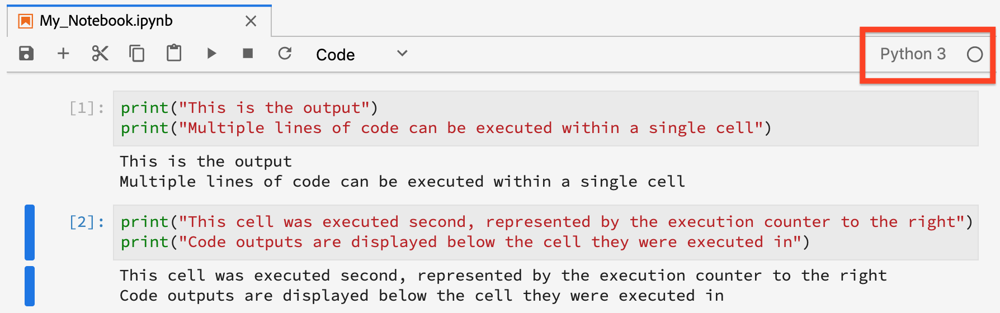
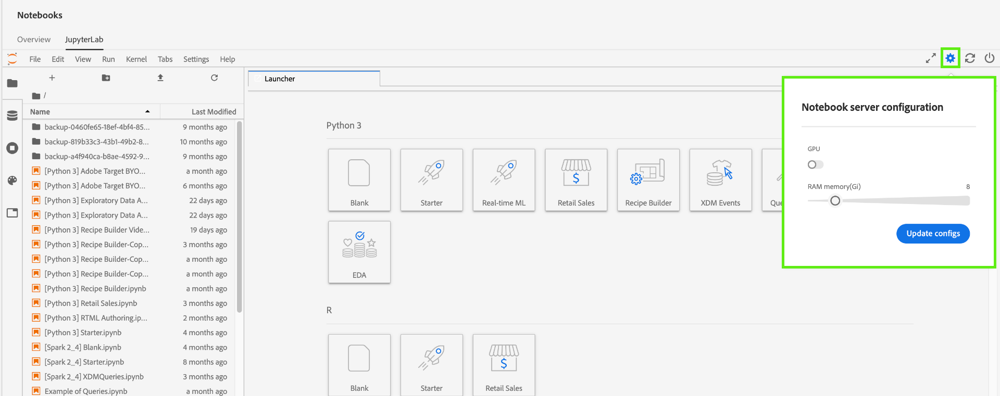

# [!DNL JupyterLab] guia do usuário

[!DNL JupyterLab] é uma interface de usuário baseada na Web para o [Project Júpiter](https://jupyter.org/) e está totalmente integrada ao Adobe Experience Platform. Ele fornece um ambiente de desenvolvimento interativo para que os cientistas de dados trabalhem com notebooks, códigos e dados de Júpiter.

Este documento fornece uma visão geral de [!DNL JupyterLab] e seus recursos, bem como instruções para executar ações comuns.

## [!DNL JupyterLab] em [!DNL Experience Platform]

A integração com o JByterLab é acompanhada de mudanças arquitetônicas, considerações de design, extensões de notebook personalizadas, bibliotecas pré-instaladas e um tema de Adobe.

A lista a seguir descreve alguns dos recursos exclusivos do JupyterLab na plataforma:

| Recurso | Descrição |
| --- | --- |
| **Kernels** | Os kernels fornecem o notebook e outros [!DNL JupyterLab] front-ends com a capacidade de executar e inserir código em diferentes linguagens de programação. [!DNL Experience Platform] fornece kernels adicionais para suportar o desenvolvimento em [!DNL Python]R, PySpark e [!DNL Spark]. Consulte a seção [kernels](#kernels) para obter mais detalhes. |
| **Acesso aos dados** | Acesse conjuntos de dados existentes diretamente de dentro [!DNL JupyterLab] com suporte total para recursos de leitura e gravação. |
| **[!DNL Platform]integração de serviços** | As integrações incorporadas permitem que você utilize outros [!DNL Platform] serviços diretamente de dentro [!DNL JupyterLab]. Uma lista completa de integrações compatíveis é fornecida na seção [Integração com outros serviços](#service-integration)da plataforma. |
| **Autenticação** | Além do modelo <a href="https://jupyter-notebook.readthedocs.io/en/latest/security.html" target="_blank">de segurança integrado do</a>JupyterLab, todas as interações entre seu aplicativo e o Experience Platform, incluindo a comunicação serviço a serviço da plataforma, são criptografadas e autenticadas pelo <a href="https://www.adobe.io/authentication/auth-methods.html" target="_blank">[!DNL Adobe Identity Management System] (IMS)</a>. |
| **Bibliotecas de desenvolvimento** | No [!DNL Experience Platform], [!DNL JupyterLab] fornece bibliotecas pré-instaladas para [!DNL Python], R e PySpark. Consulte o [apêndice](#supported-libraries) para obter uma lista completa das bibliotecas suportadas. |
| **Controladora de biblioteca** | Quando as bibliotecas pré-instaladas não atendem às suas necessidades, bibliotecas adicionais podem ser instaladas para Python e R, e são temporariamente armazenadas em container isolados para manter a integridade dos dados [!DNL Platform] e mantê-los seguros. Consulte a seção [kernels](#kernels) para obter mais detalhes. |

>[!NOTE]
>
>As bibliotecas adicionais só estão disponíveis para a sessão em que foram instaladas. É necessário reinstalar as bibliotecas adicionais necessárias ao iniciar novas sessões.

## Integração com outros [!DNL Platform] serviços {#service-integration}

A normalização e a interoperabilidade são conceitos fundamentais subjacentes [!DNL Experience Platform]. A integração do [!DNL JupyterLab] on como um IDE incorporado permite que ele interaja com outros [!DNL Platform] serviços, permitindo que você utilize todo o seu potencial [!DNL Platform] [!DNL Platform] . Os seguintes [!DNL Platform] serviços estão disponíveis em [!DNL JupyterLab]:

* **[!DNL Catalog Service]:** Acesse e explore conjuntos de dados com funcionalidades de leitura e gravação.
* **[!DNL Query Service]:** Acesse e explore conjuntos de dados usando SQL, fornecendo custos indiretos de acesso a dados mais baixos ao lidar com grandes quantidades de dados.
* **[!DNL Sensei ML Framework]:** Desenvolvimento de modelo com a capacidade de treinar e pontuar dados, bem como criação de receita com um único clique.
* **[!DNL Experience Data Model (XDM)]:** A normalização e a interoperabilidade são conceitos-chave por trás da Adobe Experience Platform. [O Experience Data Model (XDM)](https://www.adobe.com/go/xdm-home-en), orientado pelo Adobe, é um esforço para padronizar os dados de experiência do cliente e definir schemas para o gerenciamento da experiência do cliente.

>[!NOTE]
>
>Algumas integrações [!DNL Platform] de serviço em [!DNL JupyterLab] estão limitadas a kernels específicos. Consulte a seção sobre [kernels](#kernels) para obter mais detalhes.

## Principais recursos e operações comuns

As informações sobre os principais recursos [!DNL JupyterLab] e instruções para a realização de operações comuns são fornecidas nas seções abaixo:

* [Access JupyterLab](#access-jupyterlab)
* [Interface JupyterLab](#jupyterlab-interface)
* [Células de código](#code-cells)
* [Kernels](#kernels)
* [Sessões do kernel](#kernel-sessions)
* [Iniciador](#launcher)

### Access [!DNL JupyterLab] {#access-jupyterlab}

No [Adobe Experience Platform](https://platform.adobe.com), selecione **Notebooks** na coluna de navegação esquerda. Aguarde algum tempo para [!DNL JupyterLab] a inicialização completa.

### [!DNL JupyterLab] interface {#jupyterlab-interface}

A [!DNL JupyterLab] interface consiste em uma barra de menus, uma barra lateral esquerda flexível e a área de trabalho principal contendo guias de documentos e atividades.

**Barra de menus**

A barra de menus na parte superior da interface tem menus de nível superior que exibem ações disponíveis em [!DNL JupyterLab] seus atalhos de teclado:

* **Arquivo:** Ações relacionadas a arquivos e diretórios
* **Editar:** Ações relacionadas à edição de documentos e outras atividades
* **Visualização:** Ações que alteram a aparência de [!DNL JupyterLab]
* **Executar:** Ações para executar código em diferentes atividades, como notebooks e consoles de código
* **Kernel:** Ações para gerenciar kernels
* **Guias:** Uma lista de documentos e atividades abertos
* **Configurações:** Configurações comuns e um editor de configurações avançado
* **Ajuda:** Uma lista dos links de ajuda do kernel [!DNL JupyterLab] e do kernel

**Barra lateral esquerda**

A barra lateral esquerda contém guias clicáveis que fornecem acesso aos seguintes recursos:

* **Navegador de arquivos:** Uma lista de documentos e diretórios de notebook salvos
* **Explorador de dados:** Procurar, acessar e explorar schemas e conjuntos de dados
* **Corredores e terminais:** Uma lista de sessões ativas de kernel e terminal com a capacidade de encerrar
* **Comandos:** Uma lista de comandos úteis
* **Inspetor de células:** Um editor de células que fornece acesso a ferramentas e metadados úteis para configurar um bloco de anotações para fins de apresentação
* **guias:** Uma lista de guias abertas

Clique em uma guia para expor seus recursos, ou clique em uma guia expandida para recolher a barra lateral esquerda, como demonstrado abaixo:

**Principal área de trabalho**

A área de trabalho principal em [!DNL JupyterLab] permite organizar documentos e outras atividades em painéis de guias que podem ser redimensionados ou subdivididos. Arraste uma guia até o centro de um painel de guias para migrar a guia. Divida um painel arrastando uma guia para a esquerda, direita, superior ou inferior do painel:

### Células de código {#code-cells}

As células de código são o conteúdo principal dos notebooks. Eles contêm o código fonte no idioma do kernel associado do notebook e a saída como resultado da execução da célula de código. Uma contagem de execução é exibida à direita de cada célula de código que representa sua ordem de execução.

As ações celulares comuns estão descritas abaixo:

* **Adicionar uma célula:** Clique no sinal de mais (**+**) no menu do bloco de anotações para adicionar uma célula vazia. Novas células são colocadas sob a célula que está sendo interagida atualmente com, ou no final do notebook se nenhuma célula específica estiver em foco.

* **Mover uma célula:** Posicione o cursor à direita da célula que deseja mover e clique e arraste a célula para um novo local. Além disso, mover uma célula de um notebook para outro replica a célula junto com seu conteúdo.

* **Executar uma célula:** Clique no corpo da célula que deseja executar e clique no ícone **reproduzir** (**▶**) no menu do notebook. Um asterisco (**\***) é exibido no contador de execução da célula quando o kernel processa a execução e é substituído por um número inteiro após a conclusão.

* **Excluir uma célula:** Clique no corpo da célula que deseja excluir e clique no ícone da **tesoura** .

### Kernels {#kernels}

Os kernels notebook são os mecanismos de computação específicos da linguagem para processar células de notebook. Além de [!DNL Python], [!DNL JupyterLab] oferece suporte adicional a idiomas em R, PySpark e [!DNL Spark] (Scala). Quando você abre um documento notebook, o kernel associado é iniciado. Quando uma célula do notebook é executada, o kernel executa o cálculo e produz resultados que podem consumir recursos significativos da CPU e da memória. Observe que a memória alocada não é liberada até que o kernel seja desligado.

Determinados recursos e funcionalidades estão limitados a kernels específicos, conforme descrito no quadro abaixo:

| Kernel | Suporte à instalação da biblioteca | [!DNL Platform] integrações |
| :----: | :--------------------------: | :-------------------- |
| **[!DNL Python]** | Sim | <ul><li>[!DNL Sensei ML Framework]</li><li>[!DNL Catalog Service]</li><li>[!DNL Query Service]</li></ul> |
| **R** | Sim | <ul><li>[!DNL Sensei ML Framework]</li><li>[!DNL Catalog Service]</li></ul> |
| **Scala** | Não | <ul><li>[!DNL Sensei ML Framework]</li><li>[!DNL Catalog Service]</li></ul> |

### Sessões do kernel {#kernel-sessions}

Cada notebook ativo ou atividade ativa em [!DNL JupyterLab] utiliza uma sessão de kernel. Todas as sessões ativas podem ser encontradas ao expandir a guia Terminais **em execução e kernels** na barra lateral esquerda. O tipo e o estado do kernel de um notebook podem ser identificados observando a parte superior direita da interface do notebook. No diagrama abaixo, o kernel associado ao notebook é **[!DNL Python]3** e seu estado atual é representado por um círculo cinza à direita. Um círculo oco implica um kernel ocioso e um círculo sólido implica um kernel ocupado.

Se o kernel estiver desligado ou inativo por um período prolongado, então **Nenhum kernel!** com um círculo sólido é mostrado. Ative um kernel clicando no status do kernel e selecionando o tipo de kernel apropriado, conforme demonstrado abaixo:

### Iniciador {#launcher}

[//]: # (Talk about the different Notebooks, introduce that certain starter notebooks are limited to particular kernels)

O *Launcher* personalizado fornece modelos de notebook úteis para seus kernels suportados para ajudá-lo a iniciar sua tarefa, incluindo:

| Modelo | Descrição |
| --- | --- |
| Em branco | Um arquivo de bloco de anotações vazio. |
| Início | Um notebook pré-preenchido demonstrando a exploração de dados usando dados de amostra. |
| Vendas a varejo | Um notebook pré-preenchido com a receita [de vendas de](https://adobe.ly/2wOgO3L) varejo usando dados de amostra. |
| Construtor de receita | Um modelo de bloco de anotações para criar uma receita em [!DNL JupyterLab]. Ele é pré-preenchido com código e comentário que demonstra e descreve o processo de criação da receita. Consulte o tutorial [do](https://www.adobe.com/go/data-science-create-recipe-notebook-tutorial-en) notebook para obter uma apresentação detalhada. |
| [!DNL Query Service] | Um notebook pré-preenchido demonstrando o uso de [!DNL Query Service] diretamente em [!DNL JupyterLab] workflows de amostra fornecidos que analisam dados em escala. |
| Eventos XDM | Um notebook pré-preenchido demonstrando a exploração de dados nos dados do Evento da experiência de pós-valor, com foco nos recursos comuns em toda a estrutura de dados. |
| Query XDM | Um notebook pré-preenchido demonstrando query comerciais de amostra sobre os dados do Evento Experience. |
| Agregação | Um notebook pré-preenchido demonstrando workflows de amostra para agregação de grandes quantidades de dados em blocos menores e gerenciáveis. |
| Geração de cluster | Um notebook pré-preenchido demonstrando o processo completo de modelagem de aprendizado de máquina usando algoritmos de cluster. |

Alguns modelos de notebook estão limitados a determinados kernels. A disponibilidade do modelo para cada kernel está mapeada na seguinte tabela:

<table>
    <tr>
        <td></td>
        <th><strong>Em branco</strong></th>
        <th><strong>Início</strong></th>
        <th><strong>Vendas a varejo</strong></th>
        <th><strong>Construtor de receita</strong></th>
        <th><strong>[!DNL Query Service]</strong></th>
        <th><strong>Eventos XDM</strong></th>
        <th><strong>Query XDM</strong></th>
        <th><strong>Agregação</strong></th>
        <th><strong>Geração de cluster</strong></th>
    </tr>
    <tr>
        <th><strong>[!DNL Python]</strong></th>
        <td >sim</td>
        <td >sim</td>
        <td >sim</td>
        <td >sim</td>
        <td >sim</td>
        <td >sim</td>
        <td >não</td>
        <td >não</td>
        <td >não</td>
    </tr>
    <tr>
        <th ><strong>R</strong></th>
        <td >sim</td>
        <td >sim</td>
        <td >sim</td>
        <td >não</td>
        <td >não</td>
        <td >não</td>
        <td >não</td>
        <td >não</td>
        <td >não</td>
    </tr>
      <tr>
        <th  ><strong>PySpark 3 ([!DNL Spark] 2.4)</strong></th>
        <td >não</td>
        <td >sim</td>
        <td >não</td>
        <td >não</td>
        <td >não</td>
        <td >não</td>
        <td >sim</td>
        <td >sim</td>
        <td >não</td>
    </tr>
    <tr>
        <th ><strong>Scala</strong></th>
        <td >sim</td>
        <td >sim</td>
        <td >não</td>
        <td >não</td>
        <td >não</td>
        <td >não</td>
        <td >não</td>
        <td >não</td>
        <td >sim</td>
    </tr>
</table>

Para abrir um novo *Iniciador*, clique em **Arquivo > Novo Iniciador**. Como alternativa, expanda o navegador **** Arquivo na barra lateral esquerda e clique no símbolo de mais (**+**):

### Configuração de GPU e servidor de memória em [!DNL Python]/R

No canto superior direito, [!DNL JupyterLab] selecione o ícone de engrenagem para abrir a configuração *do servidor* Notebook. Você pode ativar a GPU e alocar a quantidade de memória necessária usando o controle deslizante. A quantidade de memória que você pode alocar depende de quanto a sua organização provisionou. Selecione **[!UICONTROL Atualizar configurações]** para salvar.

>[!NOTE]
>
>Somente uma GPU é provisionada por organização para notebooks. Se a GPU estiver em uso, é necessário aguardar o usuário que reservou a GPU para liberá-la. Isso pode ser feito fazendo logout ou deixando a GPU em estado ocioso por quatro ou mais horas.

## Próximas etapas

Para saber mais sobre cada um dos notebooks suportados e como usá-los, visite o guia do desenvolvedor de acesso [aos dados dos notebooks](./access-notebook-data.md) Jupyterlab. Este guia foca em como usar os notebooks JupyterLab para acessar seus dados, incluindo leitura, gravação e consulta de dados. O guia de acesso a dados também contém informações sobre a quantidade máxima de dados que pode ser lida por cada notebook suportado.

## Bibliotecas compatíveis {#supported-libraries}

### [!DNL Python] / R

| Biblioteca | Versão |
| :------ | :------ |
| notebook | 6.0.0 |
| solicitações | 2.22.0 |
| total | 4.0.0 |
| fólio | 0.10.0 |
| ipywidgets | 7.5.1 |
| bokeh | 1.3.1 |
| genismo | 3.7.3 |
| ipyparalelo | 0.5.2 |
| jq | 1.6 |
| keras | 2.2.4 |
| nltk | 3.2.5 |
| pandas | 0.22.0 |
| pandasql | 0.7.3 |
| travesseiro | 6.0.0 |
| scikit-image | 0.15.0 |
| scikit-learn | 0.21.3 |
| cifra | 1.3.0 |
| sutura | 1.3.0 |
| seaborna | 0.9.0 |
| stats models | 0.10.1 |
| elástico | 5.1.0.17 |
| conspiração | 0.11.5 |
| py-xgover | 0.90 |
| opencv | 3.4.1 |
| parque | 2.4.3 |
| pirâmide | 1.0.1 |
| wxpython | 4.0.6 |
| colorida | 0.3.0 |
| geopandas | 0.5.1 |
| piranha | 2.1.0 |
| forma | 1.6.4 |
| rpy2 | 2.9.4 |
| essenciais | 3.6 |
| r-arules | 1.6_3 |
| r-fpc | 2.2_3 |
| r-e1071 | 1.7_2 |
| r-gam | 1.16.1 |
| r-gbm | 2.1.5 |
| r-ggems | 4.2.0 |
| r-ggvis | 0.4.4 |
| r-igraph | 1.2.4.1 |
| saltos de r | 3.0 |
| manipular novamente | 1.0.1 |
| r-rocr | 1.0_7 |
| r-rmysql | 0.10.17 |
| r-rodbc | 1.3_15 |
| r-rsqlite | 2.1.2 |
| r-rstan | 2.19.2 |
| r-sqldf | 0.4_11 |
| sobrevivência | 2.44_1.1 |
| r-zoo | 1.8_6 |
| r-stringdist | 0.9.5.2 |
| r-quadprog | 1.5_7 |
| r-rjson | 0.2.20 |
| re-previsão | 8.7 |
| r-rsolnp | 1.16 |
| r-reticulado | 1.12 |
| r-mlr | 2.14.0 |
| r-viridis | 0.5.1 |
| rondagem | 0.84 |
| r-fnn | 1.1.3 |
| r-lubridate | 1.7.4 |
| r-randomforest | 4.6_14 |
| r-tidyverse | 1.2.1 |
| r-tree | 1.0_39 |
| pímono | 3.8.0 |
| pifleta | 0.14.1 |
| boto3 | 1.9.199 |
| ipyvolume | 0.5.2 |
| fast parquet | 0.3.2 |
| piritão | 0.5.4 |
| ipywebrtc | 0.5.0 |
| jupyter_client | 5.3.1 |
| wordcloud | 1.5.0 |
| grafite | 2.40.1 |
| piton-grafviz | 0.11.1 |
| azure-armazenamento | 0.36.0 |
| [!DNL jupyterlab] | 1.0.4 |
| pandas_ml | 0.6.1 |
| tensorflow-gpu | 1.14.0 |
| nodejs | 12.3.0 |
| zombaria | 3.0.5 |
| pílula | 0.3.3 |
| fonts-anacond | 1.0 |
| psycopg2 | 2.8.3 |
| nariz | 1.3.7 |
| autovizwidget | 0.12.9 |
| altair | 3.1.0 |
| vega_datasets | 0.7.0 |
| papelaria | 1.0.1 |
| sql_mágica | 0.0.4 |
| iso3166 | 1.0 |
| nbimportador | 0.3.1 |

### PySpark

| Biblioteca | Versão |
| :------ | :------ |
| solicitações | 2.18.4 |
| genismo | 2.3.0 |
| keras | 2.0.6 |
| nltk | 3.2.4 |
| pandas | 0.20.1 |
| pandasql | 0.7.3 |
| travesseiro | 5.3.0 |
| scikit-image | 0.13.0 |
| scikit-learn | 0.19.0 |
| cifra | 0.19.1 |
| sutura | 1.3.3 |
| stats models | 0.8.0 |
| elástico | 4.0.30.44 |
| py-xgover | 0.60 |
| opencv | 3.1.0 |
| pifleta | 0.8.0 |
| boto3 | 1.5.18 |
| azure-armazenamento-blob | 1.4.0 |
| [!DNL python] | 3.6.7 |
| mkl-rt | 11.1 |