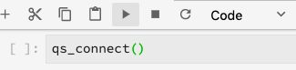

# Serviço de query no notebook Júpiter

[!DNL Adobe Experience Platform] O permite usar a Linguagem de consulta estruturada (SQL) no  [!DNL Data Science Workspace] ao integrar  [!DNL Query Service] no  [!DNL JupyterLab] como um recurso padrão.

Este tutorial demonstra exemplos de consultas SQL para casos de uso comuns para explorar, transformar e analisar dados [!DNL Adobe Analytics].

## Introdução

Antes de iniciar este tutorial, você deve ter os seguintes pré-requisitos:

- Acesso a [!DNL Adobe Experience Platform]. Se você não tiver acesso a uma Organização IMS em [!DNL Experience Platform], fale com o administrador do sistema antes de continuar

- Um conjunto de dados [!DNL Adobe Analytics]

- Um entendimento prático dos seguintes conceitos principais usados neste tutorial:
   - [[!DNL Experience Data Model (XDM) and XDM System]](../../xdm/home.md)
   - [[!DNL Query Service]](../../query-service/home.md)
   - [[!DNL Query Service SQL Syntax]](../../query-service/sql/overview.md)
   - Adobe Analytics

## Acesse [!DNL JupyterLab] e [!DNL Query Service] {#access-jupyterlab-and-query-service}

1. Em [[!DNL Experience Platform]](https://platform.adobe.com), navegue até **[!UICONTROL Notebooks]** a partir da coluna de navegação esquerda. Aguarde um momento para o JupyterLab carregar.

   

   >[!NOTE]
   >
   >Se uma nova guia Iniciador não for exibida automaticamente, abra uma nova guia Iniciador clicando em **[!UICONTROL Arquivo]** e selecione **[!UICONTROL Novo Iniciador]**.

2. Na guia Iniciador, clique no ícone **[!UICONTROL Em branco]** em um ambiente Python 3 para abrir um bloco de anotações vazio.

   

   >[!NOTE]
   >
   >O Python 3 é atualmente o único ambiente suportado para o Serviço de Consulta em notebooks.

3. No painel de seleção à esquerda, clique no ícone **[!UICONTROL Data]** e clique duas vezes no diretório **[!UICONTROL Datasets]** para listar todos os conjuntos de dados.

   

4. Encontre um conjunto de dados [!DNL Adobe Analytics] para explorar e clique com o botão direito do mouse na listagem, clique em **[!UICONTROL Dados de consulta no notebook]** para gerar consultas SQL no notebook vazio.

5. Clique na primeira célula gerada que contém a função `qs_connect()` e execute-a clicando no botão Reproduzir. Essa função cria uma conexão entre a instância do notebook e o [!DNL Query Service].

   

6. Copie o nome do conjunto de dados [!DNL Adobe Analytics] da segunda consulta SQL gerada, ele será o valor após `FROM`.

   

7. Insira uma nova célula do bloco de notas clicando no botão **+**.

   

8. Copie, cole e execute as seguintes instruções de importação em uma nova célula. Essas instruções serão usadas para visualizar seus dados:

   ```python
   import plotly.plotly as py
   import plotly.graph_objs as go
   from plotly.offline import iplot
   ```

9. Em seguida, copie e cole as seguintes variáveis em uma nova célula. Modifique seus valores conforme necessário e execute-os.

   ```python
   target_table = "your Adobe Analytics dataset name"
   target_year = "2019"
   target_month = "04"
   target_day = "01"
   ```

   - `target_table` : Nome do  [!DNL Adobe Analytics] conjunto de dados.
   - `target_year` : Ano específico do qual os dados do target são provenientes.
   - `target_month` : Mês específico do qual o target é.
   - `target_day` : Dia específico do qual os dados do target são originados.

   >[!NOTE]
   >
   >É possível alterar esses valores a qualquer momento. Ao fazer isso, certifique-se de executar a célula de variáveis para as alterações a serem aplicadas.

## Consulte seus dados {#query-your-data}

Insira as seguintes consultas SQL em células de bloco de notas individuais. Execute uma query selecionando na célula seguida selecionando o botão **[!UICONTROL play]**. Resultados de query bem-sucedidos ou registros de erro são exibidos abaixo da célula executada.

Quando um notebook está inativo por um longo período de tempo, a conexão entre o notebook e [!DNL Query Service] pode se romper. Nesses casos, reinicie [!DNL JupyterLab] selecionando o botão **Restart**  localizado no canto superior direito próximo ao botão liga/desliga.

O kernel do notebook é redefinido, mas as células permanecerão, execute novamente todas as células para continuar onde você tinha parado.

### Contagem de visitantes por hora {#hourly-visitor-count}

A consulta a seguir retorna a contagem de visitantes por hora em uma data especificada:

#### Query

```sql
%%read_sql hourly_visitor -c QS_CONNECTION
SELECT Substring(timestamp, 1, 10)                               AS Day,
       Substring(timestamp, 12, 2)                               AS Hour, 
       Count(DISTINCT concat(enduserids._experience.aaid.id, 
                             _experience.analytics.session.num)) AS Visit_Count 
FROM   {target_table}
WHERE TIMESTAMP = to_timestamp('{target_year}-{target_month}-{target_day}')
GROUP  BY Day, Hour
ORDER  BY Hour;
```

Na consulta acima, o carimbo de data e hora na cláusula `WHERE` é definido para ser o valor de `target_year`. Inclua variáveis em queries SQL contendo-as entre chaves (`{}`).

A primeira linha da query contém a variável opcional `hourly_visitor`. Os resultados da consulta serão armazenados nesta variável como um dataframe de Pandas. Armazenar resultados em um dataframe permite visualizar posteriormente os resultados da consulta usando um pacote [!DNL Python] desejado. Execute o seguinte código [!DNL Python] em uma nova célula para gerar um gráfico de barras:

```python
trace = go.Bar(
    x = hourly_visitor['Hour'],
    y = hourly_visitor['Visit_Count'],
    name = "Visitor Count"
)
layout = go.Layout(
    title = 'Visit Count by Hour of Day',
    width = 1200,
    height = 600,
    xaxis = dict(title = 'Hour of Day'),
    yaxis = dict(title = 'Count')
)
fig = go.Figure(data = [trace], layout = layout)
iplot(fig)
```

### Contagem de atividades por hora {#hourly-activity-count}

A consulta a seguir retorna a contagem de ações por hora para uma data especificada:

#### Query <!-- omit in toc -->

```sql
%%read_sql hourly_actions -d -c QS_CONNECTION
SELECT Substring(timestamp, 1, 10)                        AS Day,
       Substring(timestamp, 12, 2)                        AS Hour, 
       Count(concat(enduserids._experience.aaid.id, 
                    _experience.analytics.session.num,
                    _experience.analytics.session.depth)) AS Count 
FROM   {target_table}
WHERE TIMESTAMP = to_timestamp('{target_year}-{target_month}-{target_day}')
GROUP  BY Day, Hour
ORDER  BY Hour;
```

A execução da consulta acima armazenará os resultados em `hourly_actions` como um dataframe. Execute a seguinte função em uma nova célula para visualizar os resultados:

```python
hourly_actions.head()
```

A consulta acima pode ser modificada para retornar a contagem de ações por hora para um intervalo de datas especificado usando operadores lógicos na cláusula **WHERE**:

#### Consulta <!-- omit in toc -->

```sql
%%read_sql hourly_actions_date_range -d -c QS_CONNECTION
SELECT Substring(timestamp, 1, 10)                        AS Day,
       Substring(timestamp, 12, 2)                        AS Hour, 
       Count(concat(enduserids._experience.aaid.id, 
                    _experience.analytics.session.num,
                    _experience.analytics.session.depth)) AS Count 
FROM   {target_table}
WHERE  timestamp >= TO_TIMESTAMP('2019-06-01 00', 'YYYY-MM-DD HH')
       AND timestamp <= TO_TIMESTAMP('2019-06-02 23', 'YYYY-MM-DD HH')
GROUP  BY Day, Hour
ORDER  BY Hour;
```

A execução da consulta modificada armazena os resultados em `hourly_actions_date_range` como um dataframe. Execute a seguinte função em uma nova célula para visualizar os resultados:

```python
hourly_actions_date_rage.head()
```

### Número de eventos por sessão de visitante {#number-of-events-per-visitor-session}

A consulta a seguir retorna o número de eventos por sessão de visitante para uma data especificada:

#### Consulta <!-- omit in toc -->

```sql
%%read_sql events_per_session -c QS_CONNECTION
SELECT concat(enduserids._experience.aaid.id, 
              '-#', 
              _experience.analytics.session.num) AS aaid_sess_key, 
       Count(timestamp)                          AS Count 
FROM   {target_table}
WHERE TIMESTAMP = to_timestamp('{target_year}-{target_month}-{target_day}')
GROUP BY aaid_sess_key
ORDER BY Count DESC;
```

Execute o seguinte código [!DNL Python] para gerar um histograma do número de eventos por sessão de visita:

```python
data = [go.Histogram(x = events_per_session['Count'])]

layout = go.Layout(
    title = 'Histogram of Number of Events per Visit Session',
    xaxis = dict(title = 'Number of Events'),
    yaxis = dict(title = 'Count')
)

fig = go.Figure(data = data, layout = layout)
iplot(fig)
```

### Páginas populares para um determinado dia {#popular-pages-for-a-given-day}

A consulta a seguir retorna as dez páginas mais populares de uma data especificada:

#### Consulta <!-- omit in toc -->

```sql
%%read_sql popular_pages -c QS_CONNECTION
SELECT web.webpagedetails.name                 AS Page_Name, 
       Sum(web.webpagedetails.pageviews.value) AS Page_Views 
FROM   {target_table}
WHERE TIMESTAMP = to_timestamp('{target_year}-{target_month}-{target_day}')
GROUP  BY web.webpagedetails.name 
ORDER  BY page_views DESC 
LIMIT  10;
```

### Usuários ativos em um determinado dia {#active-users-for-a-given-day}

A consulta a seguir retorna os dez usuários mais ativos para uma data especificada:

#### Consulta <!-- omit in toc -->

```sql
%%read_sql active_users -c QS_CONNECTION
SELECT enduserids._experience.aaid.id AS aaid, 
       Count(timestamp)               AS Count
FROM   {target_table}
WHERE TIMESTAMP = to_timestamp('{target_year}-{target_month}-{target_day}')
GROUP  BY aaid
ORDER  BY Count DESC
LIMIT  10;
```

### Cidades ativas por atividade do usuário {#active-cities-by-user-activity}

A consulta a seguir retorna as dez cidades que estão gerando a maioria das atividades do usuário para uma data especificada:

#### Consulta <!-- omit in toc -->

```sql
%%read_sql active_cities -c QS_CONNECTION
SELECT concat(placeContext.geo.stateProvince, ' - ', placeContext.geo.city) AS state_city, 
       Count(timestamp)                                                     AS Count
FROM   {target_table}
WHERE TIMESTAMP = to_timestamp('{target_year}-{target_month}-{target_day}')
GROUP  BY state_city
ORDER  BY Count DESC
LIMIT  10;
```

## Próximas etapas

Este tutorial demonstrou alguns casos de uso de exemplo para utilizar [!DNL Query Service] em blocos de anotações [!DNL Jupyter]. Siga o tutorial [Analise seus dados usando os notebooks Júpiter](./analyze-your-data.md) para ver como operações semelhantes são executadas usando o SDK de acesso a dados.