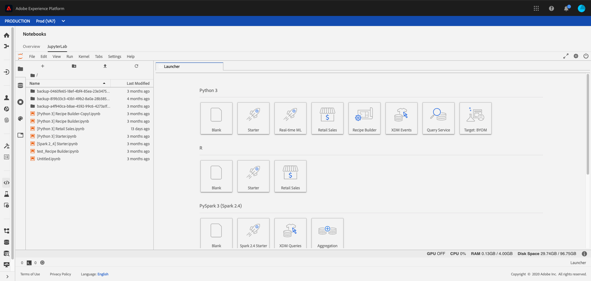

# Serviço de consulta no notebook Jupyter

>[!NOTE]
>
>O Área de trabalho de ciência de dados não está mais disponível para compra.
>
>Esta documentação destina-se a clientes existentes com direitos anteriores à Data Science Área de trabalho.

[!DNL Adobe Experience Platform] permite usar o Structured Query Idioma (SQL) ao [!DNL Data Science Workspace] integrar-se [!DNL Query Service] [!DNL JupyterLab] como um recurso padrão.

Essa tutorial demonstra exemplos de consultas SQL para casos de uso comuns para explorar, transformar e analisar [!DNL Adobe Analytics] dados.

## Introdução

Antes de iniciar essa tutorial, você deve ter os seguintes pré-requisitos:

- Acesso a [!DNL Adobe Experience Platform]. Se você não tiver acesso a uma organização no [!DNL Experience Platform], fale com o administrador do sistema antes de prosseguir

- Um [!DNL Adobe Analytics] conjunto de dados

- Uma compreensão dos seguintes conceitos-chave usados nesta tutorial:
   - [[!DNL Experience Data Model (XDM) and XDM System]](../../xdm/home.md)
   - [[!DNL Query Service]](../../query-service/home.md)
   - [[!DNL Query Service SQL Syntax]](../../query-service/sql/overview.md)
   - Adobe Analytics

## Acesso [!DNL JupyterLab] e [!DNL Query Service] {#access-jupyterlab-and-query-service}

1. Em [[!DNL Experience Platform]](https://platform.adobe.com), navegue até **[!UICONTROL Notebooks]** a partir da esquerda navegação coluna. Permita um momento para o JupyterLab carregar.

   

   >[!NOTE]
   >
   >Se um novo Inicializador guia não aparecer automaticamente, abra um novo Inicializador guia clicando Arquivo selecione **[!UICONTROL Novo Inicializador]**.]****[!UICONTROL 

2. Na guia inicializador, clique no **[!UICONTROL ícone Em branco]** em um Python 3 ambiente para abrir um notebook vazio.

   

   >[!NOTE]
   >
   >No momento, Python 3 é o único ambiente compatível com o Serviço de consulta em notebooks.

3. Na painel de seleção à esquerda, clique no **[!UICONTROL ícone Dados]** e duplo clique no **[!UICONTROL diretório Conjuntos]** de dados para lista todos os conjuntos de dados.

   

4. Encontre uma [!DNL Adobe Analytics] conjunto de dados para explorar e clicar com o botão direito do mouse na listagem, clique **[!UICONTROL em Dados de consulta no notebook]** para gerar queries SQL no notebook vazio.

5. Clique na primeira célula gerada que contém a função `qs_connect()` e execute-a clicando na botão de reprodução. Essa função cria uma conexão entre o notebook instância e o [!DNL Query Service].

   

6. Copie o [!DNL Adobe Analytics] conjunto de dados nome da segunda query SQL gerada, ele será o valor posteriormente `FROM`.

   

7. Insira uma nova célula de notebook clicando no **botão +** .

   

8. Copie, cole e execute as seguintes instruções de importação em uma nova célula. Essas declarações serão usadas para visualizar seus dados:

   ```python
   import plotly.plotly as py
   import plotly.graph_objs as go
   from plotly.offline import iplot
   ```

9. Próximo, copie e cole as seguintes variáveis em uma nova célula. Modifique seus valores conforme necessário e execute-os.

   ```python
   target_table = "your Adobe Analytics dataset name"
   target_year = "2019"
   target_month = "04"
   target_day = "01"
   ```

   - `target_table`: nome do seu [!DNL Adobe Analytics] conjunto de dados.
   - `target_year`: ano específico para o qual os dados do Direcionamento são.
   - `target_month`: mês específico de onde a Direcionamento é.
   - `target_day`: dia específico para o qual os dados de Direcionamento são.

   >[!NOTE]
   >
   >É possível alterar esses valores a qualquer momento. Ao fazer isso, certifique-se de executar a célula de variáveis para que as alterações sejam aplicadas.

## Consultar seus dados {#query-your-data}

Insira as seguintes queries SQL em células de notebooks individuais. Execute uma query selecionando em sua célula seguida de selecionar a **[!UICONTROL botão de reprodução]** . Os resultados ou os logs de erro do query bem-sucedidos são exibidos abaixo da célula executada.

Quando um notebook está inativo por um longo período de tempo, a conexão entre o notebook e [!DNL Query Service] pode quebrar. Nesses casos, reinicie [!DNL JupyterLab] selecionando o **Restart** botão  localizado no canto superior direito ao lado da botão de alimentação.

O kernel do notebook é redefinido, mas as células permanecerão, execute novamente todas as células para continuar de onde você tinha deixado de fora.

### Contagem de visitante por hora {#hourly-visitor-count}

A query a seguir retorna a contagem de visitante por hora para uma data especificada:

#### Consulta

```sql
%%read_sql hourly_visitor -c QS_CONNECTION
SELECT Substring(timestamp, 1, 10)                               AS Day,
       Substring(timestamp, 12, 2)                               AS Hour, 
       Count(DISTINCT concat(enduserids._experience.aaid.id, 
                             _experience.analytics.session.num)) AS Visit_Count 
FROM   {target_table}
WHERE TIMESTAMP = to_timestamp('{target_year}-{target_month}-{target_day}')
GROUP  BY Day, Hour
ORDER  BY Hour;
```

Na query acima, o carimbo de data e hora na `WHERE` cláusula é definido como o valor de `target_year`. Inclua variáveis em queries SQL contendo-as em chaves (`{}`).

A primeira linha do query contém o variável `hourly_visitor`opcional. Os resultados da consulta serão armazenados nesta variável como um período de dados do Pandas. O armazenamento de resultados em um período de dados permite visualizar posteriormente os resultados do query usando um pacote desejado [!DNL Python] . Execute o código a seguir [!DNL Python] em uma nova célula para gerar uma gráfico de barras:

```python
trace = go.Bar(
    x = hourly_visitor['Hour'],
    y = hourly_visitor['Visit_Count'],
    name = "Visitor Count"
)
layout = go.Layout(
    title = 'Visit Count by Hour of Day',
    width = 1200,
    height = 600,
    xaxis = dict(title = 'Hour of Day'),
    yaxis = dict(title = 'Count')
)
fig = go.Figure(data = [trace], layout = layout)
iplot(fig)
```

### Contagem de atividade por hora {#hourly-activity-count}

A query a seguir retorna a contagem de ações por hora para uma data especificada:

#### Consulta <!-- omit in toc -->

```sql
%%read_sql hourly_actions -d -c QS_CONNECTION
SELECT Substring(timestamp, 1, 10)                        AS Day,
       Substring(timestamp, 12, 2)                        AS Hour, 
       Count(concat(enduserids._experience.aaid.id, 
                    _experience.analytics.session.num,
                    _experience.analytics.session.depth)) AS Count 
FROM   {target_table}
WHERE TIMESTAMP = to_timestamp('{target_year}-{target_month}-{target_day}')
GROUP  BY Day, Hour
ORDER  BY Hour;
```

A execução da query acima armazenamento os resultados `hourly_actions` como um período de dados. Execute a seguinte função em uma nova célula para pré-visualização os resultados:

```python
hourly_actions.head()
```

A query acima pode ser modificada para retornar a contagem de ações por hora para um intervalo de datas especificado usando operadores lógicos na **cláusula WHERE** :

#### Consulta <!-- omit in toc -->

```sql
%%read_sql hourly_actions_date_range -d -c QS_CONNECTION
SELECT Substring(timestamp, 1, 10)                        AS Day,
       Substring(timestamp, 12, 2)                        AS Hour, 
       Count(concat(enduserids._experience.aaid.id, 
                    _experience.analytics.session.num,
                    _experience.analytics.session.depth)) AS Count 
FROM   {target_table}
WHERE  timestamp >= TO_TIMESTAMP('2019-06-01 00', 'YYYY-MM-DD HH')
       AND timestamp <= TO_TIMESTAMP('2019-06-02 23', 'YYYY-MM-DD HH')
GROUP  BY Day, Hour
ORDER  BY Hour;
```

A execução da query modificada armazena os resultados como `hourly_actions_date_range` um período de dados. Execute a seguinte função em uma nova célula para pré-visualização os resultados:

```python
hourly_actions_date_rage.head()
```

### Número de eventos por sessão do visitante {#number-of-events-per-visitor-session}

A query a seguir retorna o número de eventos por visitante sessão referentes a uma data especificada:

#### Consulta <!-- omit in toc -->

```sql
%%read_sql events_per_session -c QS_CONNECTION
SELECT concat(enduserids._experience.aaid.id, 
              '-#', 
              _experience.analytics.session.num) AS aaid_sess_key, 
       Count(timestamp)                          AS Count 
FROM   {target_table}
WHERE TIMESTAMP = to_timestamp('{target_year}-{target_month}-{target_day}')
GROUP BY aaid_sess_key
ORDER BY Count DESC;
```

Execute o código a seguir [!DNL Python] para gerar uma histograma para o número de eventos por sessão visita:

```python
data = [go.Histogram(x = events_per_session['Count'])]

layout = go.Layout(
    title = 'Histogram of Number of Events per Visit Session',
    xaxis = dict(title = 'Number of Events'),
    yaxis = dict(title = 'Count')
)

fig = go.Figure(data = data, layout = layout)
iplot(fig)
```

### Páginas populares para um determinado dia {#popular-pages-for-a-given-day}

A query a seguir retorna as dez páginas mais populares de uma data especificada:

#### Consulta <!-- omit in toc -->

```sql
%%read_sql popular_pages -c QS_CONNECTION
SELECT web.webpagedetails.name                 AS Page_Name, 
       Sum(web.webpagedetails.pageviews.value) AS Page_Views 
FROM   {target_table}
WHERE TIMESTAMP = to_timestamp('{target_year}-{target_month}-{target_day}')
GROUP  BY web.webpagedetails.name 
ORDER  BY page_views DESC 
LIMIT  10;
```

### Usuários ativos para um determinado dia {#active-users-for-a-given-day}

A query a seguir retorna os dez usuários mais ativos de uma data especificada:

#### Consulta <!-- omit in toc -->

```sql
%%read_sql active_users -c QS_CONNECTION
SELECT enduserids._experience.aaid.id AS aaid, 
       Count(timestamp)               AS Count
FROM   {target_table}
WHERE TIMESTAMP = to_timestamp('{target_year}-{target_month}-{target_day}')
GROUP  BY aaid
ORDER  BY Count DESC
LIMIT  10;
```

### Cidades ativas até usuário atividade {#active-cities-by-user-activity}

A query a seguir retorna as dez cidades que estão gerando a maioria das atividades do usuário para uma data especificada:

#### Consulta <!-- omit in toc -->

```sql
%%read_sql active_cities -c QS_CONNECTION
SELECT concat(placeContext.geo.stateProvince, ' - ', placeContext.geo.city) AS state_city, 
       Count(timestamp)                                                     AS Count
FROM   {target_table}
WHERE TIMESTAMP = to_timestamp('{target_year}-{target_month}-{target_day}')
GROUP  BY state_city
ORDER  BY Count DESC
LIMIT  10;
```

## Próximas etapas

Esta tutorial demonstrou algumas amostras de casos de uso para utilização [!DNL Query Service] em [!DNL Jupyter] notebooks. Siga a análise de [seus dados usando notebooks](./analyze-your-data.md) Jupyter tutorial para ver como operações semelhantes são executadas usando o SDK do Acesso aos Dados.
