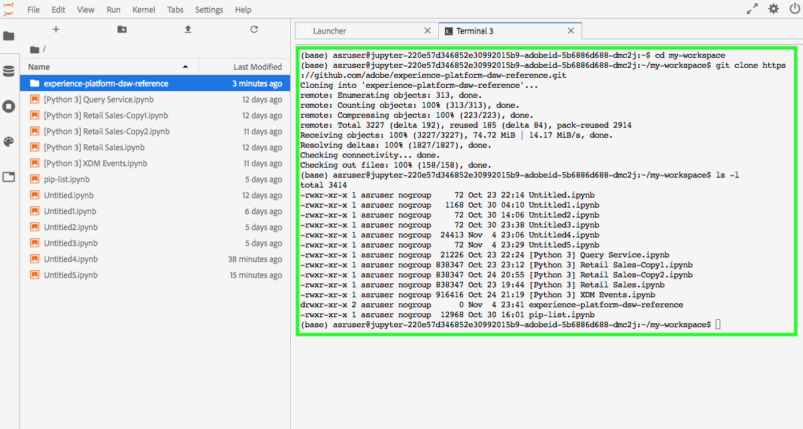

# Colaborar em [!DNL JupyterLab] usando [!DNL Git]

[!DNL Git] é um sistema distribuído de controle de versão para rastrear alterações no código fonte durante o desenvolvimento de software. O Git é pré-instalado dentro do ambiente [!DNL Data Science Workspace JupyterLab].

## Pré-requisitos

>[!NOTE]
>
> O servidor Git que você pretende usar precisa estar acessível pela Internet.

O ambiente [!DNL Data Science Workspace JupyterLab] é um ambiente hospedado e não é implantado dentro do firewall corporativo, portanto, o servidor Git ao qual você se conecta deve estar acessível na Internet pública. Este pode ser um repositório público ou privado em [GitHub](https://github.com/) ou outra instância de um servidor [!DNL Git] que você mesmo tenha decidido hospedar.

## Conecte [!DNL Git] ao ambiente [!DNL Data Science Workspace JupyterLab Notebooks]

Start iniciando [!DNL Adobe Experience Platform] e navegando até o ambiente [[!DNL JupyterLabs Notebooks]](https://platform.adobe.com/notebooks/jupyterLab).

Em [!DNL JupyterLab], selecione **[!UICONTROL Arquivo]** e passe o mouse sobre **[!UICONTROL Novo]**. Na lista suspensa que é exibida, selecione **[!UICONTROL Terminal]**.

Em seguida, em *Terminal* navegue até o seu espaço de trabalho usando o seguinte comando: `cd my-workspace`.

>[!TIP]
>
> Para ver uma lista de comandos git disponíveis, execute o comando: `git -help` no terminal.

Em seguida, clone o repositório que deseja usar usando o comando `git clone`. Clonar seu projeto usando um URL `https://` em vez de `ssh://`.

**Exemplo**:

`git clone https://github.com/adobe/experience-platform-dsw-reference.git`

>[!NOTE]
>
> Para executar qualquer operação de gravação (`git push`, por exemplo), os seguintes comandos de configuração precisam ser executados para cada nova sessão. Observe também que qualquer comando push solicita um nome de usuário e senha.
>
>`git config --global user.email "you@example.com"`
>
>`git config --global user.name "Your Name"`

## Próximas etapas

Depois de terminar de clonar seu repositório, você pode usar o Git como normalmente usaria em sua máquina local para colaborar com outras pessoas em notebooks. Para obter mais informações sobre o que você pode fazer em [!DNL JupyterLab], consulte [[!DNL JupyterLab user guide]](./overview.md).
