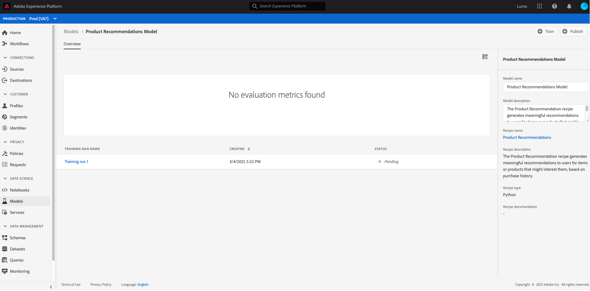
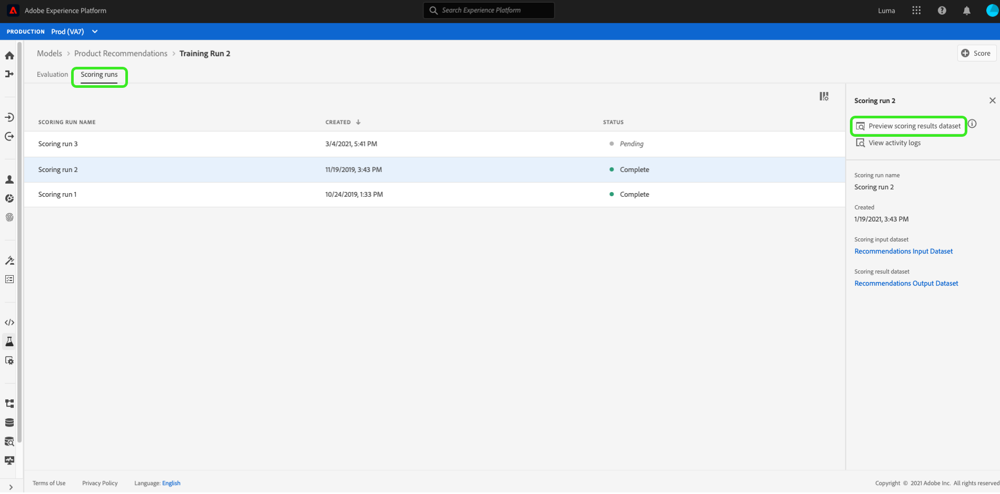

# Criar e publicar um modelo de aprendizado de máquina

Faça com que você tenha um site de varejo online. Quando seus clientes fazem compras no seu site de varejo, você deseja apresentar a eles recomendações personalizadas de produtos para expor uma variedade de outros produtos que sua empresa oferece. Ao longo da existência de seu site, você tem coletado continuamente os dados do cliente e deseja de alguma forma usar esses dados para gerar recomendações personalizadas de produtos.

[!DNL Adobe Experience Platform] [!DNL Data Science Workspace] O fornece os meios para atingir sua meta usando a Receita  [do Recommendations do produto pré-criada](../pre-built-recipes/product-recommendations.md). Siga este tutorial para ver como você pode acessar e entender seus dados de varejo, criar e otimizar um Modelo de aprendizado de máquina e gerar insights em [!DNL Data Science Workspace].

Este tutorial reflete o fluxo de trabalho de [!DNL Data Science Workspace] e aborda as seguintes etapas para criar um Modelo de aprendizado de máquina:

1. [Preparar seus dados](#prepare-your-data)
2. [Crie seu modelo](#author-your-model)
3. [Treine e avalie seu modelo](#train-and-evaluate-your-model)
4. [Operacionalizar seu modelo](#operationalize-your-model)

## Introdução

Antes de iniciar este tutorial, você deve ter os seguintes pré-requisitos:

- Acesso a [!DNL Adobe Experience Platform]. Se você não tiver acesso a uma Organização IMS em [!DNL Experience Platform], fale com o administrador do sistema antes de continuar.

- Ativar ativos. Entre em contato com seu representante de conta para provisionar os seguintes itens para você.
   - Receita do Recommendations
   - Conjunto de dados de entrada do Recommendations
   - Esquema de entrada do Recommendations
   - Conjunto de dados de saída do Recommendations
   - Esquema de saída do Recommendations
   - Valores posteriores do conjunto de dados dourados
   - Esquema do conjunto de dados Golden

- Baixe os três arquivos [!DNL Jupyter Notebook] necessários do [Adobe public [!DNL Git] repository](https://github.com/adobe/experience-platform-dsw-reference/tree/master/Summit/2019/resources/Notebooks-Thurs), eles serão usados para demonstrar o workflow [!DNL JupyterLab] em [!DNL Data Science Workspace].

Um entendimento prático dos seguintes conceitos principais usados neste tutorial:
- [[!DNL Experience Data Model]](../../xdm/home.md): O esforço de padronização liderado pelo Adobe para definir esquemas padrão como  [!DNL Profile] e ExperienceEvent, para o Gerenciamento de experiência do cliente.
- Conjuntos de dados: Uma construção de armazenamento e gerenciamento para dados reais. Uma instância física instanciada de um [Esquema XDM](../../xdm/schema/field-dictionary.md).
- Lotes: Os conjuntos de dados são compostos de lotes. Um lote é um conjunto de dados coletados durante um período de tempo e processados juntos como uma única unidade.
- [!DNL JupyterLab]:  [[!DNL JupyterLab]](https://blog.jupyter.org/jupyterlab-is-ready-for-users-5a6f039b8906) O é uma interface baseada na Web de código aberto para o Project  [!DNL Jupyter] e está totalmente integrada no  [!DNL Experience Platform].

## Prepare seus dados {#prepare-your-data}

Para criar um Modelo de aprendizado de máquina que faça recomendações personalizadas de produtos para seus clientes, as compras anteriores de clientes no seu site devem ser analisadas. Esta seção explora como esses dados são assimilados em [!DNL Platform] por [!DNL Adobe Analytics] e como esses dados são transformados em um conjunto de dados de recurso a ser usado pelo Modelo de aprendizado de máquina.

### Explorar os dados e entender os esquemas

Faça logon em [Adobe Experience Platform](https://platform.adobe.com/) e selecione **[!UICONTROL Datasets]** para listar todos os conjuntos de dados existentes e selecione o conjunto de dados que deseja explorar. Nesse caso, o conjunto de dados [!DNL Analytics] **Golden Data Set postValues**.

A página de atividade do conjunto de dados é aberta, listando as informações relacionadas ao conjunto de dados. Você pode selecionar **[!UICONTROL Preview Dataset]** próximo ao canto superior direito para examinar os registros de amostra. Você também pode exibir o esquema do conjunto de dados selecionado. Selecione o link do schema no painel direito. Uma amostra é exibida; selecionar o link em **[!UICONTROL schema name]** abre o schema em uma nova guia.

Os outros conjuntos de dados foram pré-preenchidos com lotes para fins de visualização. É possível exibir esses conjuntos de dados repetindo as etapas acima.

| Nome do conjunto de dados | Esquema | Descrição |
| ----- | ----- | ----- |
| Valores posteriores do conjunto de dados dourados | Schema do conjunto de dados Golden | [!DNL Analytics] dados de origem do seu site |
| Conjunto de dados de entrada do Recommendations | Esquema de entrada do Recommendations | Os dados [!DNL Analytics] são transformados em um conjunto de dados de treinamento usando um pipeline de recursos. Esses dados são usados para treinar o Modelo de aprendizado da máquina do Recommendations do produto. `itemid` e  `userid` correspondem a um produto comprado por esse cliente. |
| Conjunto de dados de saída do Recommendations | Esquema de saída do Recommendations | O conjunto de dados para o qual os resultados da pontuação são armazenados, ele conterá a lista de produtos recomendados para cada cliente. |

## Crie seu modelo {#author-your-model}

O segundo componente do ciclo de vida [!DNL Data Science Workspace] envolve a criação de Fórmulas e Fórmulas. A Receita Recommendations do produto foi criada para gerar recomendações de produto em escala utilizando dados de compras anteriores e aprendizado de máquina.

As receitas são a base de um Modelo, pois contêm algoritmos e lógica de aprendizado de máquina projetados para resolver problemas específicos. Mais importante, as Receitas capacitam você a democratizar o aprendizado de máquina em sua organização, permitindo que outros usuários acessem um Modelo para casos de uso diferentes sem gravar nenhum código.

### Explore a receita do Recommendations do produto

No Experience Platform, navegue até **[!UICONTROL Models]** na coluna de navegação esquerda e selecione **[!UICONTROL Recipes]** na navegação superior para exibir uma lista de fórmulas disponíveis para sua organização.

Em seguida, localize e abra o **[!UICONTROL Recommendations Recipe]** fornecido selecionando seu nome. A página Visão geral da receita é exibida.

Em seguida, no painel direito, selecione **[!UICONTROL Recommendations Input Schema]** para visualizar o esquema que alimenta a receita. Os campos de esquema &quot;[!UICONTROL itemId]&quot; e &quot;[!UICONTROL userId]&quot; correspondem a um produto comprado ([!UICONTROL interactionType]) por esse cliente em um horário específico ([!UICONTROL timestamp]). Siga as mesmas etapas para revisar os campos para **[!UICONTROL Recommendations Output Schema]**.

Agora você revisou os esquemas de entrada e saída exigidos pela Receita do Recommendations do Produto. Prossiga para a próxima seção para saber como criar, treinar e avaliar um Modelo de Recommendations de Produto.

## Treine e avalie o seu modelo {#train-and-evaluate-your-model}

Agora que seus dados estão preparados e a Receita está pronta, você pode criar, treinar e avaliar seu modelo de aprendizado de máquina.

### Criar um modelo

Um Modelo é uma instância de uma Receita, permitindo que você treine e marque com dados em escala.

No Experience Platform, navegue até **[!UICONTROL Models]** na coluna de navegação esquerda e selecione **[!UICONTROL Recipes]** na navegação superior. Isso exibe uma lista de fórmulas disponíveis para sua organização.Selecione a fórmula de recomendação do produto.

Na página da fórmula, selecione **[!UICONTROL Create Model]**.

O fluxo de trabalho de criação de modelo começa selecionando uma fórmula. Selecione **[!UICONTROL Recommendations Recipe]** e selecione **[!UICONTROL Next]** no canto superior direito.

Em seguida, forneça um nome de modelo. As configurações disponíveis para o modelo são listadas com as configurações para o treinamento padrão do modelo e os comportamentos de pontuação. Revise as configurações e selecione **[!UICONTROL Finish]**.

Você é redirecionado para a página de visão geral de modelos com uma execução de treinamento recém-gerada. Uma execução de treinamento é gerada por padrão quando um Modelo é criado.

Você pode optar por aguardar a conclusão da execução do treinamento ou continuar a criar uma nova execução de treinamento na seção a seguir.

### Treine o modelo usando hiperparâmetros personalizados

Na página **Visão geral do modelo**, selecione **[!UICONTROL Train]** próximo ao canto superior direito para criar uma nova execução de treinamento. Selecione o mesmo conjunto de dados de entrada usado ao criar o modelo e selecione **[!UICONTROL Next]**.

A página **[!UICONTROL Configuration]** é exibida. Aqui você pode configurar o valor de execução de treinamento `num_recommendations`, também conhecido como um hiperparâmetro. Um modelo treinado e otimizado utilizará os hiperparâmetros de melhor desempenho com base nos resultados da execução do treinamento.

Os hiperparâmetros não podem ser aprendidos, portanto, devem ser atribuídos antes que as execuções de treinamento ocorram. Ajustar hiperparâmetros pode alterar a precisão do modelo treinado. Uma vez que a otimização de um modelo é um processo iterativo, poderão ser necessárias várias ações de formação antes de se obter uma avaliação satisfatória.

>[!TIP]
>
>Defina `num_recommendations` como 10.

Pontos de dados adicionais aparecem no gráfico de avaliação do modelo. Pode levar vários minutos para que isso seja exibido após a conclusão da execução.

### Avaliar o modelo

Sempre que uma execução de treinamento for concluída, você poderá visualizar as métricas de avaliação resultantes para determinar o desempenho do Modelo.

Para analisar as métricas de avaliação (Precisão e Recall) de cada execução de treinamento concluída, selecione a execução de treinamento.

Você pode explorar as informações fornecidas para cada métrica de avaliação. Quanto maior for essa métrica, melhor será o desempenho do modelo.

Você pode ver o conjunto de dados, o esquema e os parâmetros de configuração usados para cada execução de treinamento no painel direito. Navegue de volta à página Modelo e identifique a execução de treinamento com melhor desempenho observando suas métricas de avaliação.

## Operacionalizar seu modelo {#operationalize-your-model}

A etapa final do fluxo de trabalho da Ciência de dados é operacionalizar o modelo para pontuar e consumir insights do armazenamento de dados.

### Pontuar e gerar insights

Na página de visão geral do modelo de recomendações de produto, selecione o nome da execução de treinamento com melhor desempenho, com os mais altos valores de recuperação e precisão.

Em seguida, no canto superior direito da página de detalhes da execução de treinamento, selecione **[!UICONTROL Score]**.

Em seguida, selecione o **[!UICONTROL Recommendations Input Dataset]** como o conjunto de dados de entrada de pontuação, que é o mesmo conjunto de dados usado ao criar o Modelo e executar a execução do treinamento. Em seguida, selecione **[!UICONTROL Next]**.

Depois de ter seu conjunto de dados de entrada, selecione o **[!UICONTROL Recommendations Output Dataset]** como o conjunto de dados de saída da pontuação. Os resultados da pontuação são armazenados neste conjunto de dados como um lote.

Finalmente, revise as configurações de pontuação. Esses parâmetros contêm os conjuntos de dados de entrada e saída selecionados anteriormente, juntamente com os esquemas apropriados. Selecione **[!UICONTROL Finish]** para iniciar a execução da pontuação. A execução pode levar vários minutos para ser concluída.

### Exibir insights pontuados

Depois que a execução da pontuação for concluída com êxito, você poderá visualizar os resultados e os insights gerados.

Na página de execução da pontuação, selecione a execução de pontuação concluída e selecione **[!UICONTROL Preview Scoring Results Dataset]** no painel direito.

Na tabela de visualização, cada linha contém recomendações de produto para um cliente específico, rotuladas como [!UICONTROL recommendations] e [!UICONTROL userId] respectivamente. Como o hiperparâmetro [!UICONTROL num_recommendations] foi definido como 10 nas capturas de tela de amostra, cada linha de recomendações pode conter até 10 identidades de produto delimitadas por um sinal de número (#).

## Próximas etapas {#next-steps}

Este tutorial apresentou você ao workflow de [!DNL Data Science Workspace], demonstrando como os dados brutos não processados podem ser transformados em informações úteis por meio do aprendizado de máquina. Para saber mais sobre como usar o [!DNL Data Science Workspace], continue para o próximo guia sobre [como criar o schema de vendas de varejo e o conjunto de dados](./create-retails-sales-dataset.md).
