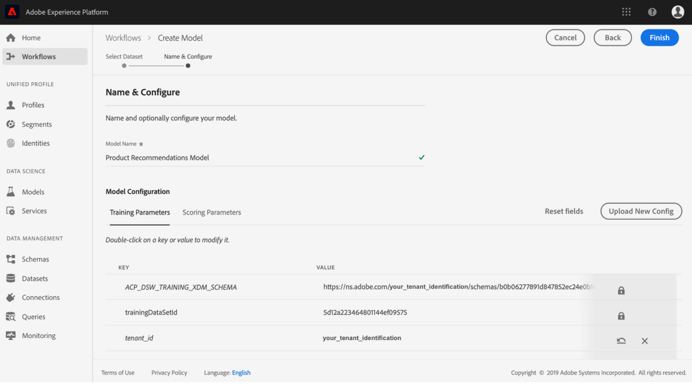
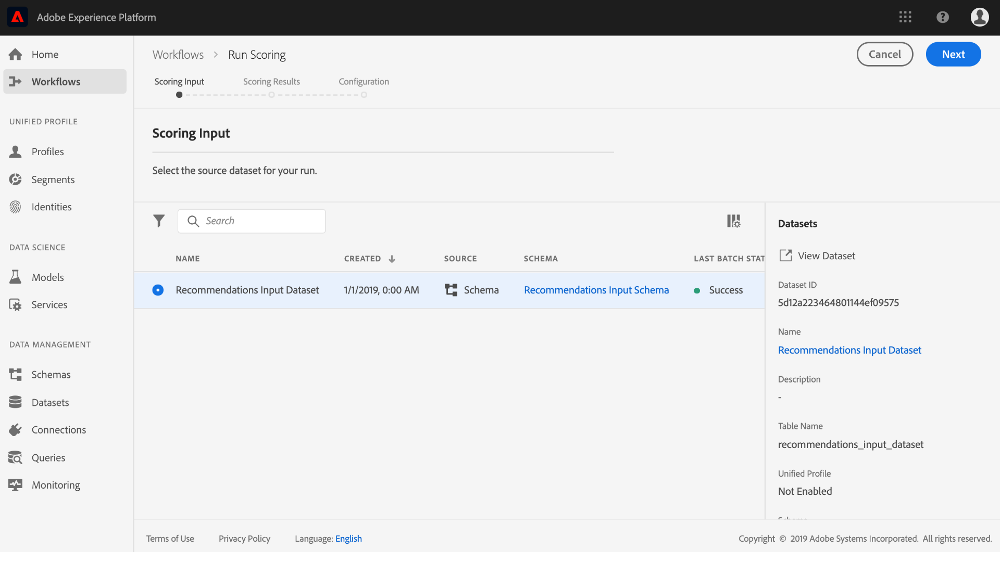

# Criar e publicar uma apresentação de modelo de aprendizado de máquina

Fingir que você possui um site de varejo online. Quando seus clientes fazem compras em seu site de varejo, você deseja apresentar a eles recomendações personalizadas de produtos para expor uma variedade de outros produtos suas ofertas comerciais. Durante a existência de seu site, você coletou continuamente os dados do cliente e deseja, de alguma forma, usar esses dados para gerar recomendações personalizadas de produtos.

[!DNL Adobe Experience Platform] [!DNL Data Science Workspace] fornece os meios para atingir sua meta usando a Receita [Recommendations de](../pre-built-recipes/product-recommendations.md)produto pré-criada. Siga este tutorial para ver como você pode acessar e entender seus dados de varejo, criar e otimizar um Modelo de aprendizado da máquina e gerar insights no [!DNL Data Science Workspace].

Este tutorial reflete o fluxo de trabalho de [!DNL Data Science Workspace]e aborda as seguintes etapas para criar um Modelo de aprendizado da máquina:

1. [Preparar seus dados](#prepare-your-data)
2. [Criar seu modelo](#author-your-model)
3. [Treinar e avaliar seu modelo](#train-and-evaluate-your-model)
4. [Operacionalizar seu modelo](#operationalize-your-model)

## Introdução

Antes de iniciar este tutorial, você deve ter os seguintes pré-requisitos:

* Acesso a [!DNL Adobe Experience Platform]. Se você não tiver acesso a uma Organização IMS em [!DNL Experience Platform], fale com o administrador do sistema antes de prosseguir.

* Ativar ativos. Entre em contato com seu representante de conta para obter os seguintes itens fornecidos para você.
   * Receita do Recommendations
   * Conjunto de dados de entrada da Recommendations
   * Schema Recommendations Input
   * Conjunto de dados de saída Recommendations
   * Schema de saída Recommendations
   * PostValues do conjunto de dados dourados
   * Schema do conjunto de dados Golden

* Baixe os três [!DNL Jupyter Notebook] arquivos necessários do <a href="https://github.com/adobe/experience-platform-dsw-reference/tree/master/Summit/2019/resources/Notebooks-Thurs" target="_blank">Adobe public [!DNL Git] repository</a>, eles serão usados para demonstrar o [!DNL JupyterLab] fluxo de trabalho no [!DNL Data Science Workspace].

* Um entendimento prático dos seguintes conceitos-chave usados neste tutorial:
   * [!DNL Experience Data Model](../../xdm/home.md): O esforço de padronização realizado pelo Adobe para definir schemas padrão, como [!DNL Profile] e ExperienceEvent, para o Gerenciamento de experiência do cliente.
   * Conjuntos de dados: Uma construção de armazenamento e gerenciamento para dados reais. Uma instância física instanciada de um Schema XDM.
   * Lotes: Os conjuntos de dados são compostos de lotes. Um lote é um conjunto de dados coletados durante um período de tempo e processados juntos como uma única unidade.
   * [!DNL JupyterLab]: [!DNL JupyterLab](https://blog.jupyter.org/jupyterlab-is-ready-for-users-5a6f039b8906) é uma interface baseada na Web de código aberto para o Project [!DNL Jupyter] e está totalmente integrada no [!DNL Experience Platform].

## Preparar seus dados {#prepare-your-data}

Para criar um Modelo de aprendizado de máquina que faça recomendações personalizadas de produto para seus clientes, as compras anteriores de clientes em seu site devem ser analisadas. Esta seção explora como esses dados são ingeridos [!DNL Platform] pelo [!DNL Adobe Analytics]e como eles são transformados em um conjunto de dados de recurso a ser usado pelo Modelo de aprendizado da máquina.

### Explore os dados e entenda os schemas

1. Faça logon no [Adobe Experience Platform](https://platform.adobe.com/) e clique em **[!UICONTROL Conjuntos]** de dados para lista de todos os conjuntos de dados existentes e selecione o conjunto de dados que deseja explorar. Nesse caso, o [!DNL Analytics] conjunto de dados **Golden Data Set postValues**.
   
2. Selecione Conjunto de dados de **[!UICONTROL Pré-visualização]** próximo à parte superior direita para examinar os registros de amostra e clique em **[!UICONTROL Fechar]**.
   
3. Selecione o link em Schema no painel direito para visualização do schema do conjunto de dados e, em seguida, retorne à página de detalhes do conjunto de dados.&quot;
   

Os outros conjuntos de dados foram pré-preenchidos com lotes para fins de visualização. É possível visualização desses conjuntos de dados repetindo as etapas acima.

| Nome do conjunto de dados | Esquema | Descrição |
| ----- | ----- | ----- |
| PostValues do conjunto de dados dourados | schema do conjunto de dados Golden | [!DNL Analytics] dados de origem de seu site |
| Conjunto de dados de entrada da Recommendations | Schema Recommendations Input | Os [!DNL Analytics] dados são transformados em um conjunto de dados de treinamento usando um pipeline de recursos. Esses dados são usados para treinar o Modelo de aprendizado da máquina Recommendations do Produto. `itemid` e `userid` correspondem a um produto comprado por esse cliente. |
| Conjunto de dados de saída Recommendations | Schema de saída Recommendations | O conjunto de dados para o qual os resultados da pontuação são armazenados, conterá a lista de produtos recomendados para cada cliente. |

## Criar seu modelo {#author-your-model}

O segundo componente do ciclo de vida [!DNL Data Science Workspace] envolve a criação de Fórmulas e Modelos. A Receita Recommendations do produto foi projetada para gerar recomendações de produto em escala utilizando dados de compra anteriores e aprendizado de máquina.

As receitas são a base para um Modelo, pois contêm algoritmos de aprendizado de máquina e lógica projetada para resolver problemas específicos. O mais importante é que as Fórmulas permitem que você democratize o aprendizado de máquina em toda a sua organização, permitindo que outros usuários acessem um Modelo para casos de uso diferentes sem gravar nenhum código.

### Explore a receita da Recommendations do produto

1. Em [!DNL Adobe Experience Platform], navegue até **[!UICONTROL Modelos]** na coluna de navegação esquerda e, em seguida, clique em **[!UICONTROL Receitas]** na parte superior para visualização de uma lista de Receitas disponíveis para sua organização.
   
2. Localize e abra a Receita **[!UICONTROL Recommendations]** fornecida clicando em seu nome.
   
3. No painel direito, clique em **[!UICONTROL Recommendations Input Schema]** para visualização do schema que alimenta a receita. Os campos de schema **[!UICONTROL itemId]** e **[!UICONTROL userId]** correspondem a um produto comprado (**[!UICONTROL integrationType]**) por esse cliente em um horário específico (**[!UICONTROL carimbo de data e hora]**). Siga as mesmas etapas para revisar os campos do Schema **[!UICONTROL de saída do]**Recommendations.
   

Agora você revisou os schemas de entrada e saída exigidos pela Receita Recommendations do Produto. Agora você pode continuar com a próxima seção para descobrir como criar, treinar e avaliar um Modelo Recommendations de produto.

## Treinar e avaliar seu modelo {#train-and-evaluate-your-model}

Agora que seus dados estão preparados e a Receita está pronta para ser usada, você pode criar, treinar e avaliar seu Modelo de aprendizado da máquina.

### Criar um modelo

Um Modelo é uma instância de uma Receita, permitindo que você treine e classifique com dados em escala.

1. Em [!DNL Adobe Experience Platform], navegue até **[!UICONTROL Modelos]** na coluna de navegação esquerda e clique em **[!UICONTROL Fórmulas]** na parte superior da página para exibir uma lista de todas as Fórmulas disponíveis para sua organização.
   
2. Localize e abra a Receita **[!UICONTROL do]** Recommendations fornecida clicando em seu nome, inserindo a página de visão geral da Receita. Clique em **[!UICONTROL Criar um modelo]** no centro (se não houver Modelos existentes) ou no canto superior direito da página Visão geral da receita.
   
3. Uma lista de conjuntos de dados de entrada disponíveis para treinamento é mostrada, selecione **[!UICONTROL Recommendations Input Dataset]** e clique em **[!UICONTROL Next (Avançar)]**.
   
4. Forneça um nome para o Modelo, por exemplo &quot;Modelo Recommendations do produto&quot;. As configurações disponíveis para o modelo são listadas, contendo as configurações para o treinamento padrão do Modelo e os comportamentos de pontuação. Nenhuma alteração é necessária, pois essas configurações são específicas da sua organização. Revise as configurações e clique em **[!UICONTROL Concluir]**.
   
5. O Modelo foi criado e a página *Visão geral* do Modelo é exibida em uma execução de treinamento recém-gerada. Uma execução de treinamento é gerada por padrão quando um Modelo é criado.
   

Você pode optar por aguardar a conclusão da execução do treinamento ou continuar a criar uma nova execução de treinamento na seção a seguir.

### Treinar o modelo usando hiperparâmetros personalizados

1. Na página Visão geral *do* modelo, clique em **[!UICONTROL Treinar]** perto da parte superior direita para criar uma nova execução de treinamento. Selecione o mesmo conjunto de dados de entrada que você usou ao criar o Modelo e clique em **[!UICONTROL Avançar]**.
   
2. A página *Configuração* é exibida. Aqui você pode configurar o valor **[!UICONTROL num_Recomendações]** da execução de treinamento, também conhecido como um Hiperparâmetro. Um Modelo treinado e otimizado utilizará os hiperparâmetros de melhor desempenho com base nos resultados da execução do treinamento.

   Hiperparâmetros não podem ser aprendidos, portanto, eles devem ser atribuídos antes que as execuções de treinamento ocorram. Ajustar hiperparâmetros pode alterar a precisão do modelo treinado. Como a otimização de um modelo é um processo iterativo, podem ser necessárias várias execuções de treinamento antes de se obter uma avaliação satisfatória.

   >[!TIP] Defina **[!UICONTROL num_Recomendações]** como 10.

   
3. Um ponto de dados adicional aparecerá no gráfico de avaliação de Modelo quando a nova execução de treinamento for concluída, isso pode levar vários minutos.
   

### Avaliar o modelo

Sempre que uma execução de treinamento for concluída, você poderá visualização as métricas de avaliação resultantes para determinar o desempenho do Modelo.

1. Analise as métricas de avaliação (Precisão e Chamada) para cada execução de treinamento concluída clicando em na execução de treinamento.
2. Explore as informações fornecidas para cada métrica de avaliação. Quanto maior for a métrica, melhor será o desempenho do Modelo.
   
3. Você pode ver o conjunto de dados, o schema e os parâmetros de configuração usados para cada execução de treinamento no painel direito.
4. Navegue até a página Modelo e identifique a execução de treinamento de melhor desempenho observando suas métricas de avaliação.

## Operacionalizar seu modelo {#operationalize-your-model}

A etapa final do fluxo de trabalho da Data Science é operacionalizar seu modelo para pontuar e consumir insights de seu armazenamento de dados.

### Pontuação e geração de insights

1. Na página *Visão geral* do modelo de recomendações de produto, clique no nome da execução de treinamento com melhor desempenho, com os valores mais altos de recuperação e precisão.
2. Na parte superior direita da página de detalhes da execução do treinamento, clique em **[!UICONTROL Pontuação]**.
3. Selecione o **[!UICONTROL Recommendations Input Dataset]** como o conjunto de dados de entrada de pontuação, que é o mesmo conjunto de dados usado ao criar o Modelo e executar suas execuções de treinamento. Then, click **[!UICONTROL Next]**.
   
4. Selecione o Conjunto de Dados **[!UICONTROL de Saída do]** Recommendations como o conjunto de dados de saída de pontuação. Os resultados da pontuação serão armazenados neste conjunto de dados como um lote.
   
5. Revise as configurações de pontuação. Esses parâmetros contêm os conjuntos de dados de entrada e saída selecionados anteriormente, juntamente com os schemas apropriados. Clique em **[!UICONTROL Concluir]** para iniciar a execução da pontuação. A execução pode levar vários minutos para ser concluída.
   

### insights pontuados pela Visualização

Depois que a execução da pontuação for concluída com êxito, você poderá pré-visualização os resultados e visualização os insights gerados.

1. Na página de execuções de pontuação, clique na execução de pontuação concluída e, em seguida, clique em Conjunto de Dados **[!UICONTROL de Resultados de Pontuação de]** Pré-visualização no painel direito.
   
2. Na tabela pré-visualização, cada linha contém recomendações de produto para um cliente específico, rotuladas como **[!UICONTROL recomendações]** e **[!UICONTROL userId]** , respectivamente. Como o **[!UICONTROL hiperparâmetro num_Recomendações]** foi definido como 10 nas capturas de tela de amostra, cada linha de recomendações pode conter até 10 identidades de produto delimitadas por um sinal de número (#).
   

## Próximas etapas {#next-steps}

Muito bem, vocês geraram com sucesso recomendações de produtos!

Este tutorial apresentou você ao fluxo de trabalho do, demonstrando como os dados brutos não processados podem ser transformados em informações úteis por meio do aprendizado de máquina. [!DNL Data Science Workspace] Para saber mais sobre como usar o [!DNL Data Science Workspace], vá para o próximo guia sobre como [criar o schema de vendas e o conjunto de dados](./create-retails-sales-dataset.md)de varejo.