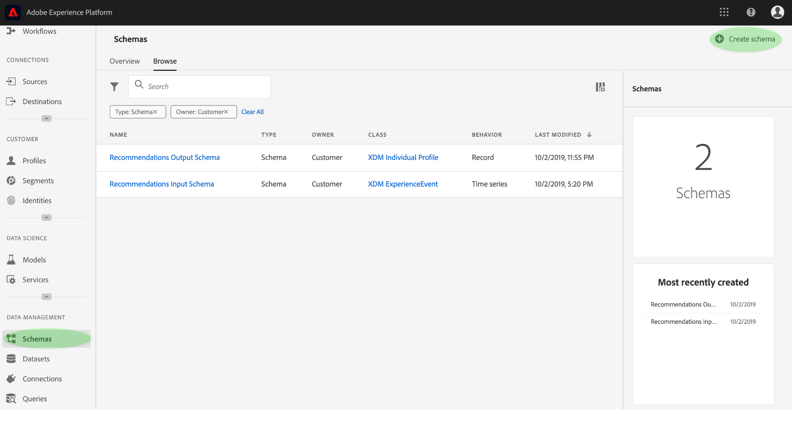

# Enriqueça o Perfil do cliente em tempo real com insights de aprendizado de máquina

[!DNL Adobe Experience Platform] A Data Science Workspace fornece as ferramentas e os recursos para criar, avaliar e utilizar modelos de aprendizado de máquina para gerar previsões e insights de dados. Quando os insights de aprendizado da máquina são ingeridos em um conjunto de dados habilitado para o Perfil, esses mesmos dados também são ingeridos como registros de Perfil, que podem ser segmentados em subconjuntos de elementos relacionados usando o Serviço de segmentação da plataforma de experiência.

Este documento fornece um tutorial passo a passo para aprimorar o Perfil do cliente em tempo real com informações sobre aprendizado da máquina, e as etapas são divididas nas seguintes seções:

1. [Criar um schema de saída e um conjunto de dados](#create-an-output-schema-and-dataset)
2. [Configurar um schema de saída e um conjunto de dados](#configure-an-output-schema-and-dataset)
3. [Criar segmentos usando o Construtor de segmentos](#create-segments-using-the-segment-builder)

## Introdução

Este tutorial requer uma compreensão funcional dos vários aspectos de [!DNL Adobe Experience Platform] envolvimento na assimilação de dados de Perfis e na criação de segmentos. Antes de iniciar este tutorial, reveja a documentação dos seguintes serviços:

* [Perfil](../../rtcdp/overview.md)do cliente em tempo real: Fornece um perfil unificado e em tempo real para o consumidor, com base em dados agregados de várias fontes.
* [Serviço](../../identity-service/home.md)de identidade: Habilita o Perfil do cliente em tempo real, fazendo a ponte entre identidades de diferentes fontes de dados que estão sendo assimiladas na Plataforma.
* [Modelo de dados de experiência (XDM)](../../xdm/home.md): A estrutura padronizada pela qual a Plataforma organiza os dados de experiência do cliente.

Além dos documentos mencionados acima, é altamente recomendável que você também reveja os seguintes guias sobre schemas e o Editor de Schemas:

* [Noções básicas da composição](../../xdm/schema/composition.md)do schema: Descreve schemas XDM, blocos componentes, princípios e práticas recomendadas para a composição de schemas a serem usados na plataforma da experiência.
* [Tutorial](../../xdm/tutorials/create-schema-ui.md)do Editor de Schemas: Fornece instruções detalhadas para a criação de schemas usando o Editor de Schemas na Plataforma de experiência.

## Criar um schema de saída e um conjunto de dados {#create-an-output-schema-and-dataset}

O primeiro passo para enriquecer o Perfil do cliente em tempo real com insights de pontuação é saber qual objeto real (como uma pessoa) seus dados definem. Compreender seus dados permite descrever e projetar uma estrutura que esteja significando para seus dados, como projetar um banco de dados relacional.

A composição de um schema começa com a atribuição de uma classe. As classes definem os aspectos comportamentais dos dados que o schema conterá (registro ou série cronológica). Esta seção fornece instruções básicas para criar um schema usando o construtor de schemas. Para obter um tutorial mais detalhado, consulte o tutorial sobre como [criar um schema usando o Editor](../../xdm/tutorials/create-schema-ui.md)de Schemas.

1. No Adobe Experience Platform, clique na guia **[!UICONTROL Schema]** para acessar o navegador do schema. Clique em **[!UICONTROL Criar Schema]** para acessar o Editor *de*Schemas, onde você pode criar e criar schemas interativamente.
   

2. Na janela *Composição* , clique em **[!UICONTROL Atribuir]** para procurar as classes disponíveis.
   * Para atribuir uma classe existente, clique e realce a classe desejada e clique em **[!UICONTROL Atribuir classe]**.
      

   * Para criar uma classe personalizada, clique em **[!UICONTROL Criar nova classe]** encontrada perto do centro-superior da janela do navegador. Forneça um nome de classe, uma descrição e escolha o comportamento da classe. Clique em **[!UICONTROL Atribuir classe]** quando terminar.
      

   Nesse ponto, a estrutura do schema deve conter alguns campos de classe e você está pronto para atribuir combinações. Uma combinação é um grupo de um ou mais campos que descrevem um conceito específico.

3. Na janela *Composição* , clique em **[!UICONTROL Adicionar]** na subseção *Misturas* .
   * Para atribuir uma mistura existente, clique e realce a mistura desejada e clique em **[!UICONTROL Adicionar mistura]**. Diferentemente das classes, várias combinações podem ser atribuídas a um único schema, desde que seja apropriado.
      

   * Para criar uma nova combinação, clique em **[!UICONTROL Criar nova combinação]** encontrada perto do centro-superior da janela do navegador. Forneça um nome e uma descrição para a mistura e clique em **[!UICONTROL Atribuir mistura]** após terminar.
      

   * Para adicionar campos de mixagem, clique no nome da mistura dentro da janela *Composição* . Você receberá a opção de adicionar campos de combinação clicando em **[!UICONTROL Adicionar campo]** na janela *Estrutura* . Certifique-se de fornecer as propriedades de mistura de acordo.
      

4. Quando terminar de criar o schema, clique no campo de nível superior do schema na janela *Estrutura* para exibir as propriedades do schema na janela de propriedades direita. Forneça um nome e uma descrição e clique em **[!UICONTROL Salvar]** para criar o schema.
   

5. Crie um conjunto de dados de saída usando seu schema recém-criado clicando em **[!UICONTROL Conjuntos]** de dados na coluna de navegação esquerda e clique em **[!UICONTROL Criar conjunto de dados]**. Na tela seguinte, escolha **[!UICONTROL Criar conjunto de dados a partir do schema]**.
   

6. Usando o navegador de schemas, localize e selecione o schema recém-criado e clique em **[!UICONTROL Avançar]**.
   

7. Forneça um nome e uma descrição opcional e clique em **[!UICONTROL Concluir]** para criar o conjunto de dados.
   

Agora que você criou um conjunto de dados de schema de saída, você está pronto para continuar com a próxima seção para configurá-los e ativá-los para o enriquecimento do Perfil.

## Configurar um schema de saída e um conjunto de dados {#configure-an-output-schema-and-dataset}

Antes de habilitar um conjunto de dados para o Perfil, é necessário configurar o schema do conjunto de dados para que ele tenha um campo de identidade primário e, em seguida, habilitar o schema para o Perfil. Se quiser criar e ativar um novo schema, consulte o tutorial sobre como [criar um schema usando o Editor](../../xdm/tutorials/create-schema-ui.md)de Schemas. Caso contrário, siga as instruções abaixo para ativar um schema e um conjunto de dados existentes.

1. No Adobe Experience Platform, use o navegador do schema para localizar o schema de saída no qual você deseja habilitar o Perfil e clique em seu nome para visualização em sua composição.
   

2. Expanda a estrutura do schema e localize um campo apropriado para definir como o identificador principal. Clique no campo desejado para exibir suas propriedades.
   

3. Defina o campo como a identidade primária, ativando a propriedade **[!UICONTROL Identity]** do campo, a propriedade **[!UICONTROL Primary Identity]** e selecionando uma Namespace **** Identity apropriada. Clique em **[!UICONTROL Aplicar]** depois de fazer as alterações.
   

4. Clique no objeto de nível superior da estrutura do schema para exibir as propriedades do schema e ativar o schema para Perfil, alternando a chave do **[!UICONTROL Perfil]** . Clique em **[!UICONTROL Salvar]** para finalizar as alterações, o conjunto de dados que foram criados usando esse schema agora pode ser ativado para o Perfil.
   

5. Use o navegador de conjunto de dados para encontrar o conjunto de dados no qual você deseja habilitar o Perfil e clique no nome dele para acessar seus detalhes.
   

6. Ative o conjunto de dados para o Perfil alternando o switch do **[!UICONTROL Perfil]** encontrado na coluna de informações correta.
   

Quando os dados são ingeridos em um conjunto de dados habilitado para Perfis, esses mesmos dados também são ingeridos como registros de Perfis. Agora que seu schema e conjunto de dados estão preparados, gere alguns dados no conjunto de dados, executando execuções de pontuação usando um modelo apropriado, e continue com este tutorial para criar segmentos de insight usando o Construtor de segmentos.

## Criar segmentos usando o Construtor de segmentos {#create-segments-using-the-segment-builder}

Agora que você gerou e assimilou insights em seu conjunto de dados habilitado para Perfis, é possível gerenciar esses dados identificando subconjuntos de elementos relacionados usando o Construtor de segmentos. Siga as etapas abaixo para criar seus próprios segmentos.

1. No Adobe Experience Platform, clique na guia **[!UICONTROL Segmentos]** , seguida por **[!UICONTROL Criar segmento]** para acessar o Construtor de segmentos.
   

2. No Construtor de segmentos, o painel esquerdo fornece acesso aos blocos componentes principais dos segmentos: atributos, eventos e segmentos existentes. Cada bloco de construção aparece em sua própria guia. Selecione a classe à qual seu schema habilitado para Perfis se estende e procure e localize os blocos componentes do seu segmento.
   

3. Arraste e solte os blocos de construção na tela do construtor de regras, conclua-os fornecendo declarações comparativas.
   

4. Ao criar seu segmento, você pode pré-visualização os resultados estimados do segmento observando o painel Propriedades *do* segmento.
   

5. Selecione uma Política **[!UICONTROL de]** mesclagem apropriada, forneça um nome e uma descrição opcional e clique em **[!UICONTROL Salvar]** para concluir o novo segmento.
   

## Próximas etapas {#next-steps}

Este documento o orientou pelas etapas necessárias para ativar um schema e um conjunto de dados para o Perfil e demonstrou brevemente o fluxo de trabalho para a criação de segmentos do insight usando o Construtor de segmentos. Para saber mais sobre segmentos e o Construtor de segmentos, consulte a visão geral [do serviço de](../../segmentation/home.md)Segmentação.