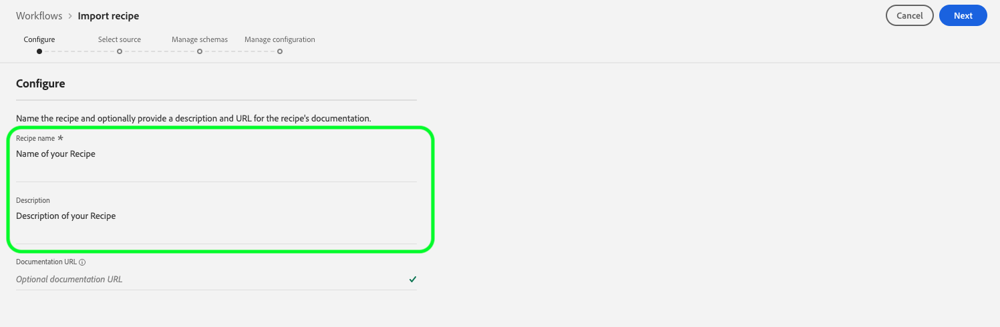
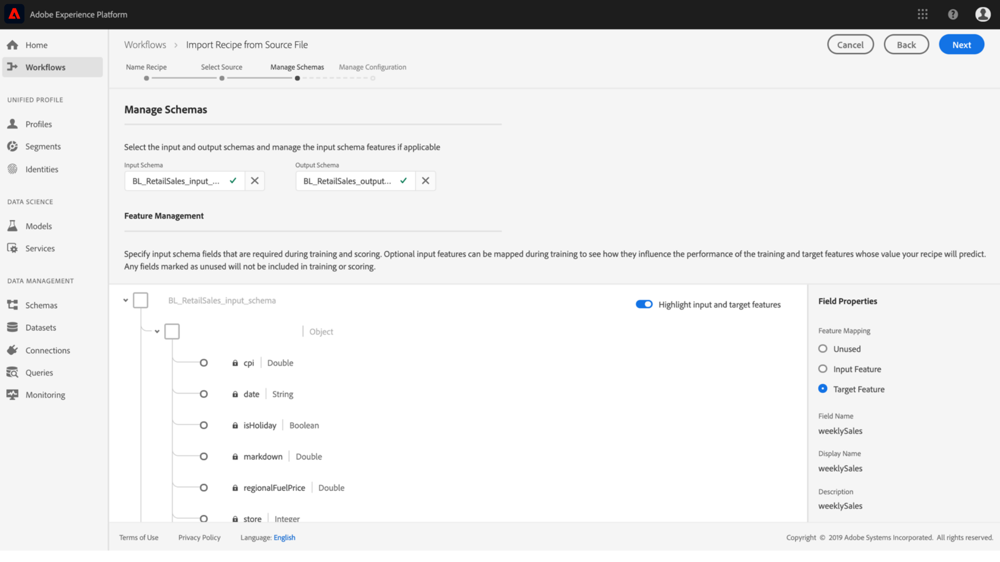

# Importar uma receita empacotada na interface do usuário do Data Science Workspace

Este tutorial fornece informações sobre como configurar e importar uma receita empacotada usando o exemplo de Vendas de varejo fornecido. Ao final deste tutorial, você estará pronto para criar, treinar e avaliar um Modelo no Adobe Experience Platform [!DNL Data Science Workspace].

## Pré-requisitos

Este tutorial requer uma fórmula empacotada na forma de um URL de imagem Docker. Consulte o tutorial sobre como [Compactar arquivos de origem em uma Receita](./package-source-files-recipe.md) para obter mais informações.

## Fluxo de trabalho da interface do usuário

Importar uma receita empacotada para [!DNL Data Science Workspace] requer configurações de receita específicas, compiladas em um único arquivo JSON (JavaScript Object Notation), essa compilação de configurações de receita é chamada de arquivo de configuração. Uma fórmula empacotada com um conjunto específico de configurações é chamada de instância de receita. Uma receita pode ser usada para criar muitas instâncias de receita em [!DNL Data Science Workspace].

O fluxo de trabalho para importar uma receita de pacote consiste nas seguintes etapas:
- [Configurar uma receita](#configure)
- [Importar receita baseada no Docker - Python](#python)
- [Importar receita baseada no Docker - R](#r)
- [Importar receita baseada no Docker - PySpark](#pyspark)
- [Importar receita baseada no Docker - Scala](#scala)

### Configurar uma receita {#configure}

Cada instância da receita em [!DNL Data Science Workspace] é acompanhada por um conjunto de configurações que adequam a instância da receita para se adequar a um caso de uso específico. Os arquivos de configuração definem os comportamentos padrão de treinamento e pontuação de um Modelo criado usando essa instância de receita.

>[!NOTE]
>
>Os arquivos de configuração são específicos de receita e maiúsculas e minúsculas.

Abaixo está um exemplo de arquivo de configuração que mostra os comportamentos padrão de treinamento e pontuação para a receita de Vendas de varejo.

```json
[
    {
        "name": "train",
        "parameters": [
            {
                "key": "learning_rate",
                "value": "0.1"  
            },
            {
                "key": "n_estimators",
                "value": "100"
            },
            {
                "key": "max_depth",
                "value": "3"
            },
            {
                "key": "ACP_DSW_INPUT_FEATURES",
                "value": "date,store,storeType,storeSize,temperature,regionalFuelPrice,markdown,cpi,unemployment,isHoliday"
            },
            {
                "key": "ACP_DSW_TARGET_FEATURES",
                "value": "weeklySales"
            },
            {
                "key": "ACP_DSW_FEATURE_UPDATE_SUPPORT",
                "value": false
            },
            {
                "key": "tenantId",
                "value": "_{TENANT_ID}"
            },
            {
                "key": "ACP_DSW_TRAINING_XDM_SCHEMA",
                "value": "{SEE BELOW FOR DETAILS}"
            },
            {
                "key": "evaluation.labelColumn",
                "value": "weeklySalesAhead"
            },
            {
                "key": "evaluation.metrics",
                "value": "MAPE,MAE,RMSE,MASE"
            }
        ]
    },
    {
        "name": "score",
        "parameters": [
            {
                "key": "tenantId",
                "value": "_{TENANT_ID}"
            },
            {
                "key":"ACP_DSW_SCORING_RESULTS_XDM_SCHEMA",
                "value":"{SEE BELOW FOR DETAILS}"
            }
        ]
    }
]
```

| Chave de parâmetro | Tipo | Descrição |
| ----- | ----- | ----- |
| `learning_rate` | Número | Escalar para multiplicação de gradiente. |
| `n_estimators` | Número | Número de árvores na floresta para o Classificador Random Forest. |
| `max_depth` | Número | Profundidade máxima de uma árvore no Classificador Random Forest. |
| `ACP_DSW_INPUT_FEATURES` | String | Lista de atributos de esquema de entrada separados por vírgula. |
| `ACP_DSW_TARGET_FEATURES` | String | Lista de atributos de esquema de saída separados por vírgula. |
| `ACP_DSW_FEATURE_UPDATE_SUPPORT` | Booleano | Determina se os recursos de entrada e saída são modificáveis |
| `tenantId` | String | Essa ID garante que os recursos criados sejam namespacados corretamente e contidos na organização IMS. [Siga as etapas ](../../xdm/api/getting-started.md#know-your-tenant_id) aqui para localizar sua ID de locatário. |
| `ACP_DSW_TRAINING_XDM_SCHEMA` | String | O schema de entrada usado para treinar um Modelo. Deixe em branco ao importar na interface do usuário, substitua por SchemaID de treinamento ao importar usando a API. |
| `evaluation.labelColumn` | String | Rótulo de coluna para visualizações de avaliação. |
| `evaluation.metrics` | String | Lista separada por vírgulas de métricas de avaliação a serem usadas para avaliar um Modelo. |
| `ACP_DSW_SCORING_RESULTS_XDM_SCHEMA` | String | O schema de saída usado para pontuar um Modelo. Deixe em branco ao importar na interface do usuário, substitua por SchemaID de pontuação ao importar usando a API. |

Para a finalidade deste tutorial, você pode deixar os arquivos de configuração padrão para a receita de Vendas de varejo na [!DNL Data Science Workspace] Referência da maneira como estão.

### Importar receita baseada no Docker - [!DNL Python] {#python}

Comece navegando e selecionando **[!UICONTROL Workflows]** localizado na parte superior esquerda da interface do usuário [!DNL Platform]. Em seguida, selecione **Importar fórmula** e selecione **[!UICONTROL Launch]**.


A página **Configurar** para o workflow **Importar fórmula** é exibida. Insira um nome e uma descrição para a receita e selecione **[!UICONTROL Next]** no canto superior direito.



>[!NOTE]
>
> No tutorial [Package source files into a Recipe](./package-source-files-recipe.md), um URL de Docker foi fornecido no final da criação da receita de Vendas de varejo usando arquivos de origem Python.

Quando estiver na página **Selecionar origem**, cole o URL do Docker correspondente à receita empacotada criada usando [!DNL Python] arquivos de origem no campo **[!UICONTROL Source URL]**. Em seguida, importe o arquivo de configuração fornecido arrastando e soltando ou use o sistema de arquivos **Browser**. O arquivo de configuração fornecido pode ser encontrado em `experience-platform-dsw-reference/recipes/python/retail/retail.config.json`. Selecione **[!UICONTROL Python]** no menu suspenso **Tempo de execução** e **[!UICONTROL Classification]** no menu suspenso **Tipo**. Depois que tudo tiver sido preenchido, selecione **[!UICONTROL Next]** no canto superior direito para prosseguir para **Gerenciar schemas**.

>[!NOTE]
>
> O tipo suporta **[!UICONTROL Classification]** e **[!UICONTROL Regression]**. Se o modelo não se enquadrar em um desses tipos, selecione **[!UICONTROL Custom]**.


Em seguida, selecione os esquemas de entrada e saída de Vendas de Varejo na seção **Gerenciar esquemas**, eles foram criados usando o script de bootstrap fornecido no tutorial [criar o esquema de vendas de varejo e o conjunto de dados](../models-recipes/create-retails-sales-dataset.md).



Na seção **Feature Management**, selecione na identificação do locatário no visualizador de esquema para expandir o schema de entrada Vendas de varejo. Selecione os recursos de entrada e saída destacando o recurso desejado e selecionando **[!UICONTROL Input Feature]** ou **[!UICONTROL Target Feature]** na janela direita **[!UICONTROL Field Properties]**. Para a finalidade deste tutorial, defina **[!UICONTROL weeklySales]** como **[!UICONTROL Target Feature]** e tudo o mais como **[!UICONTROL Input Feature]**. Selecione **[!UICONTROL Next]** para revisar a nova receita configurada.

Revise a receita, adicione, modifique ou remova configurações conforme necessário. Selecione **[!UICONTROL Finish]** para criar a receita.


Prossiga para [as próximas etapas](#next-steps) para descobrir como criar um Modelo em [!DNL Data Science Workspace] usando a fórmula de Vendas de Varejo recém-criada.

### Importar receita baseada no Docker - R {#r}

Comece navegando e selecionando **[!UICONTROL Workflows]** localizado na parte superior esquerda da interface do usuário [!DNL Platform]. Em seguida, selecione **Importar fórmula** e selecione **[!UICONTROL Launch]**.


A página **Configurar** para o workflow **Importar fórmula** é exibida. Insira um nome e uma descrição para a receita e selecione **[!UICONTROL Next]** no canto superior direito.


>[!NOTE]
>
> No tutorial [Package source files into a Recipe](./package-source-files-recipe.md), um URL de Docker foi fornecido no final da criação da receita de Vendas de varejo usando arquivos de origem R.

Quando estiver na página **Selecionar origem**, cole o URL do Docker correspondente à receita empacotada criada usando arquivos de origem R no campo **[!UICONTROL Source URL]**. Em seguida, importe o arquivo de configuração fornecido arrastando e soltando ou use o sistema de arquivos **Browser**. O arquivo de configuração fornecido pode ser encontrado em `experience-platform-dsw-reference/recipes/R/Retail\ -\ GradientBoosting/retail.config.json`. Selecione **[!UICONTROL R]** no menu suspenso **Tempo de execução** e **[!UICONTROL Classification]** no menu suspenso **Tipo**. Depois que tudo tiver sido preenchido, selecione **[!UICONTROL Next]** no canto superior direito para prosseguir para **Gerenciar schemas**.

>[!NOTE]
>
> ** O Typessuporta  **[!UICONTROL Classification]** e  **[!UICONTROL Regression]**. Se o modelo não se enquadrar em um desses tipos, selecione **[!UICONTROL Custom]**.


Em seguida, selecione os esquemas de entrada e saída de Vendas de Varejo na seção **Gerenciar esquemas**, eles foram criados usando o script de bootstrap fornecido no tutorial [criar o esquema de vendas de varejo e o conjunto de dados](../models-recipes/create-retails-sales-dataset.md).


Na seção *Feature Management*, selecione na identificação do locatário no visualizador de esquema para expandir o schema de entrada Vendas de varejo. Selecione os recursos de entrada e saída destacando o recurso desejado e selecionando **[!UICONTROL Input Feature]** ou **[!UICONTROL Target Feature]** na janela direita **[!UICONTROL Field Properties]**. Para a finalidade deste tutorial, defina **[!UICONTROL weeklySales]** como **[!UICONTROL Target Feature]** e tudo o mais como **[!UICONTROL Input Feature]**. Selecione **[!UICONTROL Next]** para revisar a nova receita configurada.

Revise a receita, adicione, modifique ou remova configurações conforme necessário. Selecione **Finish** para criar a receita.


Prossiga para [as próximas etapas](#next-steps) para descobrir como criar um Modelo em [!DNL Data Science Workspace] usando a fórmula de Vendas de Varejo recém-criada.

### Importar receita baseada no Docker - PySpark {#pyspark}

Comece navegando e selecionando **[!UICONTROL Workflows]** localizado na parte superior esquerda da interface do usuário [!DNL Platform]. Em seguida, selecione **Importar fórmula** e selecione **[!UICONTROL Launch]**.


A página **Configurar** para o workflow **Importar fórmula** é exibida. Insira um nome e uma descrição para a receita, em seguida, selecione **[!UICONTROL Next]** no canto superior direito para prosseguir.


>[!NOTE]
>
> No tutorial [Package source files into a Recipe](./package-source-files-recipe.md), um URL de Docker foi fornecido no final da criação da receita de Vendas de varejo usando arquivos de origem PySpark.

Quando estiver na página **Selecionar origem**, cole o URL do Docker correspondente à receita empacotada criada usando arquivos de origem PySpark no campo **[!UICONTROL Source URL]**. Em seguida, importe o arquivo de configuração fornecido arrastando e soltando ou use o sistema de arquivos **Browser**. O arquivo de configuração fornecido pode ser encontrado em `experience-platform-dsw-reference/recipes/pyspark/retail/pipeline.json`. Selecione **[!UICONTROL PySpark]** no menu suspenso **Tempo de execução**. Depois que o tempo de execução de PySpark é selecionado, o artefato padrão é preenchido automaticamente para **[!UICONTROL Docker]**. Em seguida, selecione **[!UICONTROL Classification]** no menu suspenso **Type**. Depois que tudo tiver sido preenchido, selecione **[!UICONTROL Next]** no canto superior direito para prosseguir para **Gerenciar schemas**.

>[!NOTE]
>
> ** O Typessuporta  **[!UICONTROL Classification]** e  **[!UICONTROL Regression]**. Se o modelo não se enquadrar em um desses tipos, selecione **[!UICONTROL Custom]**.


Em seguida, selecione os esquemas de entrada e saída de Vendas de Varejo usando o seletor **Gerenciar esquemas**, os esquemas foram criados usando o script de bootstrap fornecido no tutorial [criar o esquema de vendas de varejo e o conjunto de dados](../models-recipes/create-retails-sales-dataset.md).


Na seção **Feature Management**, selecione na identificação do locatário no visualizador de esquema para expandir o schema de entrada Vendas de varejo. Selecione os recursos de entrada e saída destacando o recurso desejado e selecionando **[!UICONTROL Input Feature]** ou **[!UICONTROL Target Feature]** na janela direita **[!UICONTROL Field Properties]**. Para a finalidade deste tutorial, defina **[!UICONTROL weeklySales]** como **[!UICONTROL Target Feature]** e tudo o mais como **[!UICONTROL Input Feature]**. Selecione **[!UICONTROL Next]** para revisar a nova receita configurada.


Revise a receita, adicione, modifique ou remova configurações conforme necessário. Selecione **[!UICONTROL Finish]** para criar a receita.


Prossiga para [as próximas etapas](#next-steps) para descobrir como criar um Modelo em [!DNL Data Science Workspace] usando a fórmula de Vendas de Varejo recém-criada.

### Importar receita baseada no Docker - Scala {#scala}

Comece navegando e selecionando **[!UICONTROL Workflows]** localizado na parte superior esquerda da interface do usuário [!DNL Platform]. Em seguida, selecione **Importar fórmula** e selecione **[!UICONTROL Launch]**.


A página **Configurar** para o workflow **Importar fórmula** é exibida. Insira um nome e uma descrição para a receita, em seguida, selecione **[!UICONTROL Next]** no canto superior direito para prosseguir.


>[!NOTE]
>
> No tutorial [Package source files into a Recipe](./package-source-files-recipe.md), um URL de Docker foi fornecido no final da criação da receita de Vendas de Varejo usando arquivos de origem Scala ([!DNL Spark]).

Quando estiver na página **Selecionar origem**, cole o URL do Docker correspondente à receita empacotada criada usando arquivos de origem Scala no campo URL de origem. Em seguida, importe o arquivo de configuração fornecido arrastando e soltando ou use o navegador do sistema de arquivos. O arquivo de configuração fornecido pode ser encontrado em `experience-platform-dsw-reference/recipes/scala/retail/pipelineservice.json`. Selecione **[!UICONTROL Spark]** no menu suspenso **Tempo de execução**. Depois que o tempo de execução [!DNL Spark] é selecionado, o artefato padrão é preenchido automaticamente para **[!UICONTROL Docker]**. Em seguida, selecione **[!UICONTROL Regression]** no menu suspenso **Type**. Depois que tudo tiver sido preenchido, selecione **[!UICONTROL Next]** no canto superior direito para prosseguir para **Gerenciar schemas**.

>[!NOTE]
>
> O tipo suporta **[!UICONTROL Classification]** e **[!UICONTROL Regression]**. Se o modelo não se enquadrar em um desses tipos, selecione **[!UICONTROL Custom]**.


Em seguida, selecione os esquemas de entrada e saída de Vendas de Varejo usando o seletor **Gerenciar esquemas**, os esquemas foram criados usando o script de bootstrap fornecido no tutorial [criar o esquema de vendas de varejo e o conjunto de dados](../models-recipes/create-retails-sales-dataset.md).


Na seção **Feature Management**, selecione na identificação do locatário no visualizador de esquema para expandir o schema de entrada Vendas de varejo. Selecione os recursos de entrada e saída destacando o recurso desejado e selecionando **[!UICONTROL Input Feature]** ou **[!UICONTROL Target Feature]** na janela direita **[!UICONTROL Field Properties]**. Para a finalidade deste tutorial, defina &quot;[!UICONTROL weeklySales]&quot; como o **[!UICONTROL Target Feature]** e tudo o mais como **[!UICONTROL Input Feature]**. Selecione **[!UICONTROL Next]** para revisar a nova receita configurada.


Revise a receita, adicione, modifique ou remova configurações conforme necessário. Selecione **[!UICONTROL Finish]** para criar a receita.


Prossiga para [as próximas etapas](#next-steps) para descobrir como criar um Modelo em [!DNL Data Science Workspace] usando a fórmula de Vendas de Varejo recém-criada.

## Próximas etapas {#next-steps}

Este tutorial forneceu informações sobre como configurar e importar uma receita para [!DNL Data Science Workspace]. Agora você pode criar, treinar e avaliar um Modelo usando a fórmula recém-criada.

- [Treine e avalie um modelo na interface do usuário](./train-evaluate-model-ui.md)
- [Treine e avalie um modelo usando a API](./train-evaluate-model-api.md)
