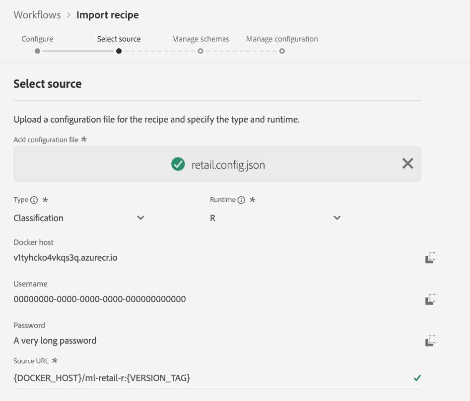

# Importar uma receita empacotada (IU)

Este tutorial fornece informações sobre como configurar e importar uma receita empacotada usando o exemplo de Vendas de Varejo fornecido. Até o final deste tutorial, você estará pronto para criar, treinar e avaliar um Modelo na Adobe Experience Platform Data Science Workspace.

## Pré-requisitos

Este tutorial requer uma fórmula empacotada na forma de um URL de imagem do Docker ou um arquivo binário. Consulte o tutorial sobre como [agrupar arquivos de origem em uma Receita](./package-source-files-recipe.md) para obter mais informações.

## Fluxo de trabalho da interface

A importação de uma fórmula empacotada para a Data Science Workspace requer configurações específicas de fórmula, compiladas em um único arquivo JSON (JavaScript Object Notation), essa compilação de configurações de fórmula é chamada de arquivo **de** configuração. Uma fórmula embalada com um conjunto específico de configurações é chamada de instância **da** fórmula. Uma fórmula pode ser usada para criar várias instâncias de fórmula na Data Science Workspace.

O fluxo de trabalho para importar uma receita de pacote consiste nas seguintes etapas:
- [Configurar uma fórmula](#configure)
- [Importar fórmula com base em binários - PySpark](#pyspark)
- [Importar fórmula baseada em binários - Scala Spark](#scala)
- [Importar fórmula baseada no Docker - Python](#python)
- [Importar fórmula baseada no Docker - R](#r)

### Configurar uma fórmula {#configure}

Cada instância da fórmula na Data Science Workspace é acompanhada de um conjunto de configurações que adaptam a instância da fórmula para atender a um caso de uso específico. Os arquivos de configuração definem os comportamentos padrão de treinamento e pontuação de um Modelo criado usando essa instância da fórmula.

>[!NOTE] Os arquivos de configuração são específicos para cada fórmula e maiúsculas e minúsculas.

Abaixo está um exemplo de arquivo de configuração mostrando os comportamentos padrão de treinamento e pontuação para a receita de vendas de varejo.

```json
[
    {
        "name": "train",
        "parameters": [
            {
                "key": "learning_rate",
                "value": "0.1"  
            },
            {
                "key": "n_estimators",
                "value": "100"
            },
            {
                "key": "max_depth",
                "value": "3"
            },
            {
                "key": "ACP_DSW_INPUT_FEATURES",
                "value": "date,store,storeType,storeSize,temperature,regionalFuelPrice,markdown,cpi,unemployment,isHoliday"
            },
            {
                "key": "ACP_DSW_TARGET_FEATURES",
                "value": "weeklySales"
            },
            {
                "key": "ACP_DSW_FEATURE_UPDATE_SUPPORT",
                "value": false
            },
            {
                "key": "tenantId",
                "value": "_{TENANT_ID}"
            },
            {
                "key": "ACP_DSW_TRAINING_XDM_SCHEMA",
                "value": "{SEE BELOW FOR DETAILS}"
            },
            {
                "key": "evaluation.labelColumn",
                "value": "weeklySalesAhead"
            },
            {
                "key": "evaluation.metrics",
                "value": "MAPE,MAE,RMSE,MASE"
            }
        ]
    },
    {
        "name": "score",
        "parameters": [
            {
                "key": "tenantId",
                "value": "_{TENANT_ID}"
            },
            {
                "key":"ACP_DSW_SCORING_RESULTS_XDM_SCHEMA",
                "value":"{SEE BELOW FOR DETAILS}"
            }
        ]
    }
]
```

| Tecla Parameter | Tipo | Descrição |
| ----- | ----- | ----- |
| `learning_rate` | Número | Escalar para multiplicação de gradiente. |
| `n_estimators` | Número | Número de árvores na floresta para Classificador Random Forest. |
| `max_depth` | Número | Profundidade máxima de uma árvore no Classificador Random Forest. |
| `ACP_DSW_INPUT_FEATURES` | String | Lista de atributos de schema de entrada separados por vírgulas. |
| `ACP_DSW_TARGET_FEATURES` | String | Lista de atributos de schema de saída separados por vírgulas. |
| `ACP_DSW_FEATURE_UPDATE_SUPPORT` | Booleano | Determina se os recursos de entrada e saída são modificáveis |
| `tenantId` | String | Essa ID garante que os recursos criados sejam devidamente nomeados e estejam contidos em sua Organização IMS. [Siga as etapas aqui](../../xdm/api/getting-started.md#know-your-tenant_id) para localizar sua ID de locatário. |
| `ACP_DSW_TRAINING_XDM_SCHEMA` | String | O schema de entrada usado para treinar um Modelo. Deixe isso vazio ao importar na interface do usuário, substitua por SchemaID de treinamento ao importar usando a API. |
| `evaluation.labelColumn` | String | Rótulo de coluna para visualizações de avaliação. |
| `evaluation.metrics` | String | lista separada por vírgulas de métricas de avaliação a serem usadas para avaliar um Modelo. |
| `ACP_DSW_SCORING_RESULTS_XDM_SCHEMA` | String | O schema de saída usado para marcar um Modelo. Deixe isso vazio ao importar na interface do usuário, substitua por SchemaID de pontuação ao importar usando a API. |

Para a finalidade deste tutorial, você pode deixar os arquivos de configuração padrão para a receita de Vendas de varejo na Referência da área de trabalho da Data Science da forma como eles são.

### Importar fórmula com base em binários - PySpark {#pyspark}

Nos arquivos de origem do [pacote em um tutorial de Receita](./package-source-files-recipe.md) , um arquivo binário **EGG** foi criado usando os arquivos de origem do Retail Sales PySpark.

1. No [Adobe Experience Platform](https://platform.adobe.com/), localize o painel de navegação esquerdo e clique em **Workflows**. Na interface de Workflows, **inicie** um novo processo **Importar receita do arquivo** de origem.
   
2. Insira um nome adequado para a receita de Vendas de varejo. Por exemplo, &quot;Fórmula de vendas de varejo PySpark&quot;. Opcionalmente, inclua uma descrição da fórmula e um URL da documentação. Clique em **Avançar** quando terminar.
   
3. Importe a receita PySpark Retail Sales que foi criada nos arquivos de origem do [pacote para um tutorial de Receita](./package-source-files-recipe.md) arrastando e soltando ou use o **navegador** do sistema de arquivos. A receita embalada deve estar localizada em `experience-platform-dsw-reference/recipes/pyspark/dist`.
Da mesma forma, importe o arquivo de configuração fornecido arrastando e soltando ou use o **Navegador** do sistema de arquivos. O arquivo de configuração fornecido pode ser encontrado em `experience-platform-dsw-reference/recipes/pyspark/pipeline.json`. Clique em **Avançar** quando ambos os arquivos tiverem sido fornecidos.
   
4. Você pode encontrar erros neste ponto. É um comportamento normal e é de esperar. Selecione os schemas de entrada e saída do Retail Sales na seção **Gerenciar Schemas**, eles foram criados usando o script de inicialização fornecido no tutorial de [criação do schema de vendas de varejo e do conjunto de dados](../models-recipes/create-retails-sales-dataset.md) .
   
Na seção Gerenciamento **de** recursos, clique na identificação do locatário no visualizador de schemas para expandir o schema de entrada Vendas de varejo. Selecione os recursos de entrada e saída destacando o recurso desejado e selecionando Recurso **de** entrada ou Recurso **de** Público alvo na janela Propriedades **do** campo direita. Para a finalidade deste tutorial, defina **semanalmenteSales** como o Recurso **do** Público alvo e tudo o mais como Recurso **de** entrada. Clique em **Avançar** para revisar sua nova fórmula configurada.
5. Revise a receita, adicione, modifique ou remova configurações conforme necessário. Clique em **Concluir** para criar a fórmula.
   

Parabéns, você criou a receita de vendas de varejo! Vá para as [próximas etapas](#next-steps) para descobrir como criar um Modelo na Data Science Workspace usando a fórmula recém-criada Vendas de varejo.


### Importar fórmula baseada em binários - Scala Spark {#scala}

Nos arquivos de origem do [pacote em um tutorial de Receita](./package-source-files-recipe.md) , um arquivo binário **JAR** foi criado usando os arquivos de origem do Scala Spark de vendas de varejo.

1. No [Adobe Experience Platform](https://platform.adobe.com/), localize o painel de navegação esquerdo e clique em **Workflows**. Na interface de Workflows, **inicie** um novo processo **Importar receita do arquivo** de origem.
   
2. Insira um nome adequado para a receita de Vendas de varejo. Por exemplo, &quot;Scala Spark da receita de Vendas de Varejo&quot;. Opcionalmente, inclua uma descrição da fórmula e um URL da documentação. Clique em **Avançar** quando terminar.
   
3. Importe a receita de vendas de varejo do Scala Spark criada nos arquivos de origem do [pacote para um tutorial de Receita](./package-source-files-recipe.md) arrastando e soltando ou use o **navegador** do sistema de arquivos. A fórmula empacotada **com dependências** está localizada em `experience-platform-dsw-reference/recipes/scala/target`. Da mesma forma, importe o arquivo de configuração fornecido arrastando e soltando ou use o **Navegador** do sistema de arquivos. O arquivo de configuração fornecido pode ser encontrado em `experience-platform-dsw-reference/recipes/scala/src/main/resources/pipelineservice.json`. Clique em **Avançar** quando ambos os arquivos tiverem sido fornecidos.
   
4. Você pode encontrar erros neste ponto. É um comportamento normal e é de esperar. Selecione os schemas de entrada e saída do Retail Sales na seção **Gerenciar Schemas**, eles foram criados usando o script de inicialização fornecido no tutorial de [criação do schema de vendas de varejo e do conjunto de dados](../models-recipes/create-retails-sales-dataset.md) .
   
Na seção Gerenciamento **de** recursos, clique na identificação do locatário no visualizador de schemas para expandir o schema de entrada Vendas de varejo. Selecione os recursos de entrada e saída destacando o recurso desejado e selecionando Recurso **de** entrada ou Recurso **de** Público alvo na janela Propriedades **do** campo direita. Para a finalidade deste tutorial, defina **semanalmenteSales** como o Recurso **do** Público alvo e tudo o mais como Recurso **de** entrada. Clique em **Avançar** para revisar sua nova fórmula configurada.
5. Revise a receita, adicione, modifique ou remova configurações conforme necessário. Clique em **Concluir** para criar a fórmula.
   

Parabéns, você criou a receita de vendas de varejo! Vá para as [próximas etapas](#next-steps) para descobrir como criar um Modelo na Data Science Workspace usando a fórmula recém-criada Vendas de varejo.

### Importar fórmula baseada no Docker - Python {#python}

No [Package source files to a Recipe](./package-source-files-recipe.md) tutorial (Encapsulamento de arquivos de origem em um tutorial de Recipe), um URL de Docker foi fornecido no final da criação da receita de vendas de varejo usando arquivos de origem Python.

1. Cole o URL do Docker correspondente à fórmula empacotada criada usando os arquivos de origem Python no campo URL **de** origem. Em seguida, importe o arquivo de configuração fornecido arrastando e soltando ou use o **navegador** do sistema de arquivos. O arquivo de configuração fornecido pode ser encontrado em `experience-platform-dsw-reference/recipes/python/retail/retail.config.json`. Clique em **Avançar** quando ambos os itens tiverem sido fornecidos.
   
2. Selecione os schemas de entrada e saída do Retail Sales na seção **Gerenciar Schemas**, eles foram criados usando o script de inicialização fornecido no tutorial de [criação do schema de vendas de varejo e do conjunto de dados](../models-recipes/create-retails-sales-dataset.md) .
   
Na seção Gerenciamento **de** recursos, clique na identificação do locatário no visualizador de schemas para expandir o schema de entrada Vendas de varejo. Selecione os recursos de entrada e saída destacando o recurso desejado e selecionando Recurso **de** entrada ou Recurso **de** Público alvo na janela Propriedades **do** campo direita. Para a finalidade deste tutorial, defina **semanalmenteSales** como o Recurso **do** Público alvo e tudo o mais como Recurso **de** entrada. Clique em **Avançar** para revisar sua nova fórmula configurada.
3. Revise a receita, adicione, modifique ou remova configurações conforme necessário. Clique em **Concluir** para criar a fórmula.
   

Parabéns, você criou a receita de vendas de varejo! Vá para as [próximas etapas](#next-steps) para descobrir como criar um Modelo na Data Science Workspace usando a fórmula recém-criada Vendas de varejo.

### Importar fórmula baseada no Docker - R {#r}

No [Package source files to a Recipe](./package-source-files-recipe.md) tutorial (Arquivos de origem do pacote), um URL do Docker foi fornecido no final da criação da receita de vendas de varejo usando arquivos de origem R.

1. Cole o URL do Docker correspondente à fórmula empacotada criada usando arquivos de origem R no campo URL **de** origem. Em seguida, importe o arquivo de configuração fornecido arrastando e soltando ou use o **navegador** do sistema de arquivos. O arquivo de configuração fornecido pode ser encontrado em `experience-platform-dsw-reference/recipes/R/Retail\ -\ GradientBoosting/retail.config.json`. Clique em **Avançar** quando ambos os itens tiverem sido fornecidos.
   
2. Selecione os schemas de entrada e saída do Retail Sales na seção **Gerenciar Schemas**, eles foram criados usando o script de inicialização fornecido no tutorial de [criação do schema de vendas de varejo e do conjunto de dados](../models-recipes/create-retails-sales-dataset.md) .
   
Na seção Gerenciamento **de** recursos, clique na identificação do locatário no visualizador de schemas para expandir o schema de entrada Vendas de varejo. Selecione os recursos de entrada e saída destacando o recurso desejado e selecionando Recurso **de** entrada ou Recurso **de** Público alvo na janela Propriedades **do** campo direita. Para a finalidade deste tutorial, defina **semanalmenteSales** como o Recurso **do** Público alvo e tudo o mais como Recurso **de** entrada. Clique em **Avançar** para revisar sua nova fórmula configurada.
3. Revise a receita, adicione, modifique ou remova configurações conforme necessário. Clique em **Concluir** para criar a fórmula.
   

Parabéns, você criou a receita de vendas de varejo! Vá para as [próximas etapas](#next-steps) para descobrir como criar um Modelo na Data Science Workspace usando a fórmula recém-criada Vendas de varejo.

## Próximas etapas

Este tutorial forneceu insight sobre como configurar e importar uma receita para a Data Science Workspace. Agora você pode criar, treinar e avaliar um Modelo usando a fórmula recém-criada.

- [Treinar e avaliar um modelo na interface do usuário](./train-evaluate-model-ui.md)
- [Treinar e avaliar um modelo usando a API](./train-evaluate-model-api.md)