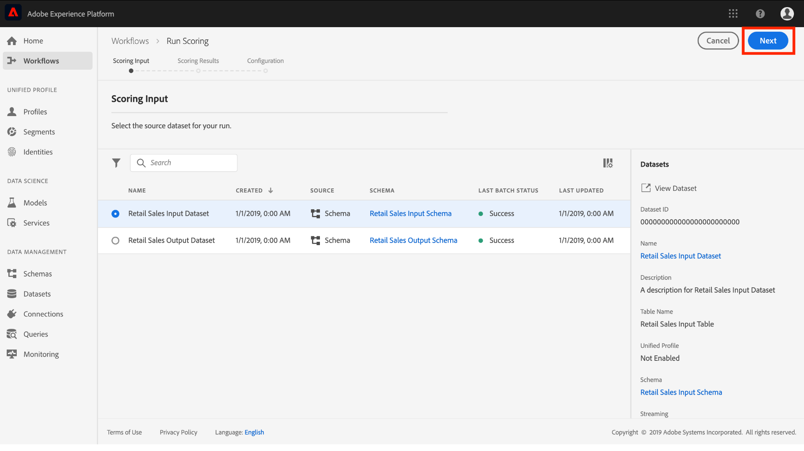

# Publicar um modelo como um serviço na interface do usuário da Data Science Workspace

A Adobe Experience Platform Data Science Workspace permite que você publique seu Modelo treinado e avaliado como um Serviço, permitindo que os usuários na organização IMS pontuem dados sem a necessidade de criar seus próprios Modelos.

## Introdução

Para concluir este tutorial, é necessário ter acesso a [!DNL Experience Platform]. Se você não tiver acesso a uma Organização IMS em [!DNL Experience Platform], fale com o administrador do sistema antes de continuar.

Este tutorial requer um Modelo existente com uma execução de treinamento bem-sucedida. Se você não tiver um Modelo publicável, siga o tutorial [Treinar e avalie um Modelo na interface do usuário](./train-evaluate-model-ui.md) antes de continuar.

Se você preferir publicar um Modelo usando APIs de aprendizado de máquina sensei, consulte o [tutorial da API](./publish-model-service-api.md).

## Publicar um Modelo {#publish-a-model}

1. No Adobe Experience Platform, clique no link **[!UICONTROL Modelos]** localizado na coluna de navegação esquerda para lista de todos os Modelos existentes. Localize e clique no nome do Modelo a ser publicado como um Serviço.
   
2. Clique em **[!UICONTROL Publicar]** próximo à parte superior direita da página Visão geral do Modelo para start de um processo de criação do Serviço.
   
3. Insira um nome desejado para o Serviço e, opcionalmente, forneça uma descrição do Serviço, clique em **[!UICONTROL Próximo]** quando terminar.
   
4. Todos os treinamentos bem-sucedidos executados para o Modelo são listados. O novo Serviço herdará configurações de treinamento e pontuação da execução de treinamento selecionada.
   
5. Clique em **[!UICONTROL Concluir]** para criar o Serviço e redirecionar para **[!UICONTROL Service Gallery]** para mostrar todos os Serviços disponíveis, incluindo o Serviço recém-criado.
   

## Pontuação usando um Serviço {#access-a-service}

1. No Adobe Experience Platform, clique na guia **[!UICONTROL Serviços]** localizada na coluna de navegação esquerda para acessar a **[!UICONTROL Service Gallery]**. Localize o Serviço que deseja usar e clique em **[!UICONTROL Pontuação]**.
   
2. Selecione um conjunto de dados de entrada apropriado para a execução de pontuação e clique em **[!UICONTROL Próximo]**.
   
3. Selecione um conjunto de dados de saída apropriado para os resultados da pontuação e clique em **[!UICONTROL Próximo]**.
   
4. Quando um Serviço é criado, ele herda configurações de pontuação padrão. Você pode revisar essas configurações e ajustá-las conforme necessário clicando com o duplo nos valores. Quando estiver satisfeito com as configurações, clique em **[!UICONTROL Concluir]** para iniciar a execução da pontuação.
   
5. Na página **Visão Geral** do Serviço, são mostrados detalhes do novo trabalho de pontuação e seu progresso. Quando a tarefa for concluída, o cabeçalho **[!UICONTROL Mais recente]** dentro do container **[!UICONTROL Scoring]** será atualizado.
   

## Próximas etapas {#next-steps}

Ao seguir este tutorial, você publicou com êxito um Modelo como um Serviço acessível e marcou dados usando o novo Serviço por meio da [!UICONTROL Service Gallery]. Vá para o próximo tutorial para saber como você pode [programar treinamentos e classificações automatizados executados em um Serviço](./schedule-models-ui.md).
